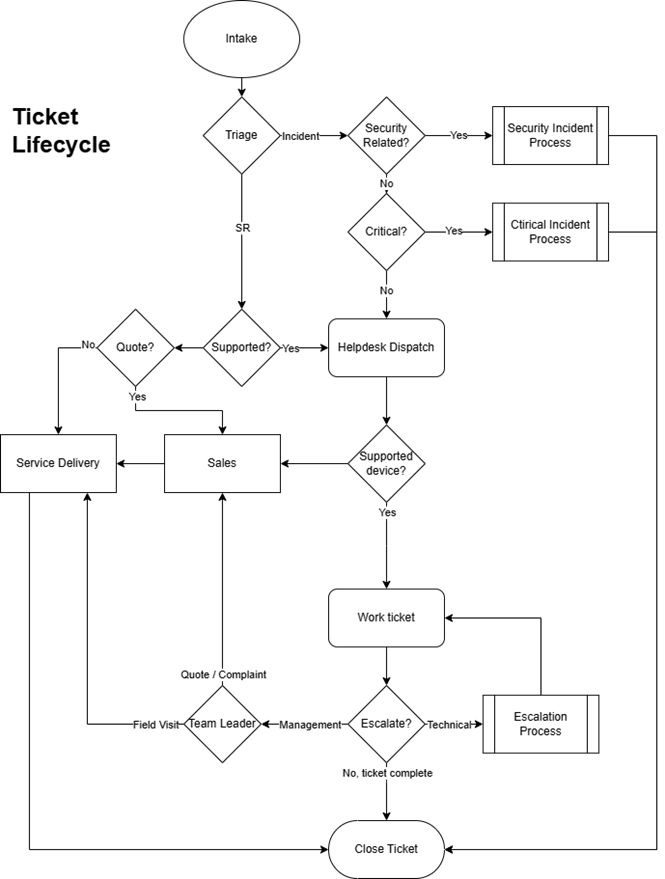
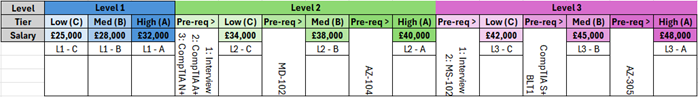

Helpdesk Operations Manual

VE.10

2026

# Overview

## Introduction

This Helpdesk Operations Manual is a collection of self-contained policies, procedures, and working standards that define how Digital Origin’s Helpdesk operates day-to-day. It is designed to create consistent service delivery, protect SLA performance, and ensure customers receive a predictable, high-quality experience regardless of which agent handles a ticket.

The manual is intentionally structured so that individual sections can be read and applied independently. Where dependencies exist (for example, where one policy references escalation handling, ticket statuses, or communications), the relevant policy will be referenced directly.

### Purpose

The purpose of this document is to:

- Set clear expectations for ticket ownership, quality, and customer communication
- Provide repeatable processes for triage, dispatch, escalation, and incident handling
- Reduce ambiguity by defining what “good” looks like, including minimum standards and prohibited practices
- Support onboarding and development by giving agents a single, authoritative reference for how the Helpdesk should run

### Scope

This manual applies to all Helpdesk activity performed under Digital Origin, including:

- Incidents and service requests handled through the helpdesk ticketing system
- Critical incident response processes and associated roles
- Operational standards that affect the customer experience (communications, hygiene, QA practices, and related governance)

Where a section is marked as [Placeholder] or (NF / Not in Force), it is either incomplete, pending approval, or not currently enforced as policy.

### Audience and responsibilities

**This document is for internal use only.**

This manual is written for:

- Helpdesk Agents – expected to follow relevant policies as part of normal ticket handling
- Team Leaders / CLS – responsible for enforcing, coaching, and ensuring consistent application
- Escalations Engineers and supporting teams – expected to align with relevant processes where they interact with Helpdesk tickets

Unless a policy explicitly states otherwise, the default position is:

- The assigned agent owns the ticket outcome
- Quality standards apply equally across all queues and ticket types
- Deviations must be justified and, where required, escalated via the appropriate route

### How to use this document

- Treat this manual as the source of truth for Helpdesk operational standards.
- Use it as a reference during ticket handling (especially around triage, priority, escalation, and customer communications).
- If multiple policies could apply, follow the most safety-critical or customer-impacting requirement first (e.g., security and critical incident controls take precedence).

### Continuous improvement and document governance

This manual will evolve. Where a policy is unclear, unworkable, or conflicts with real operational constraints, that is a signal that the policy should be improved -not informally ignored. Issues should be raised through leadership so the document can be updated, and expectations remain defensible, consistent, and achievable.

Following written process, even if it fails, will never result in disciplinary action.

### Use of AI in this document

AI has been used throughout this document to assist with wording, conciseness, and formatting; however, the content itself is human-generated and remains owned and approved internally.

## Changes

| Version | Date | Changed By | Summary of Changes |
| ------- | ---- | ---------- | ------------------ |
| VE.9 | 11/03/2026 | Jason Mcdill | Initial consolidated release of the Helpdesk Operations Manual including QMS framework aligned to ISO 9001:2015 |
| VE.10 | 13/03/2026 | Jason Mcdill | Typo and grammar corrections throughout; removed duplicate placeholder policies (Password & Credential Handling, Tooling & Asset Management); extracted Post Incident Review (PIR) into standalone top-level policy with expanded scope, triggers, and principles - all other policies now cross-reference it; archived Abandoned Dispatch Responsibility Policy; populated Changes log; fixed cut-off Contact via email section |

# Quality Management System

## About This Section

| Field        | Value        |
| ------------ | ------------ |
| Last Updated | 11/03/2026   |
| Updated By   | Jason Mcdill |
| Owner        | Jason Mcdill |

### What is a Quality Management System?

A Quality Management System (QMS) is a documented framework that defines how an organisation consistently delivers quality outputs, measures whether it is achieving them, and improves when it isn't. It is not a separate layer of bureaucracy sitting above the real work  - it is the structure that makes the real work defensible, consistent, and improvable over time.

ISO 9001:2015 is the internationally recognised standard for QMS. It does not prescribe *what* quality looks like for any specific organisation  - it prescribes *how* an organisation should govern, measure, and improve whatever quality means in its context. For Digital Origin Helpdesk, that means SLA performance, ticket handling standards, communication quality, and the processes that support them.

Achieving ISO 9001 certification means an independent body has assessed the QMS against the standard and found it to be genuinely implemented and effective  - not just documented. The documentation in this section supports that goal, but the documentation alone is not the system. The system is the documented framework *plus* the evidence that it is being followed.

### What this section contains

This section contains the management system layer of the manual  - the governance policies that sit above and around the operational content in the rest of the document. Where the rest of this manual tells agents and Team Leaders what to do and how, this section tells the organisation how the whole system is governed, measured, and kept current.

The pages in this section map to specific clauses of ISO 9001:2015. Each page notes which clause it satisfies. Taken together, they are intended to provide an auditable, complete QMS documented information set.

### Current status of this section

> **This section describes the QMS as it is intended to operate. Not all elements are fully operational at the time of writing. The notes below describe where the framework is in place and working, where it is defined but not yet fully implemented, and where input is still required before the section can be considered complete.**

| Element                                          | Current Status    | Notes                                                        |
| ------------------------------------------------ | ---------- | ------------------------------------------------------------ |
| Quality Policy                                   | 𐄂 Draft   | Requires sign-off from a named senior authority before formal adoption |
| QMS Scope                                        | ✓ Complete | Review annually or when operational scope changes            |
| Context of the Organisation                      | ✓ Complete | Review annually at Management Review                         |
| Interested Parties                               | ✓ Complete | Review annually at Management Review                         |
| Risk Register                                    | 𐄂 Draft   | Risk scores require owner review; 13 risks currently logged  |
| Quality Objectives                               | 𐄂 Partial | Objectives 1–3 and 6 complete; Objectives 4 and 5 require baseline data (and re-implementation of the QA process) |
| Roles and Responsibilities                       | 𐄂 Draft    | Requires confirmation of role responsibilities from issued Job Descriptions (waiting) |
| Communication Plan                               | ✓ Complete | Scoped for the helpdesk as the organisation                  |
| Leadership and Commitment                        | 𐄂 Incomplete | Requires a named senior authority to complete and sign the statement of commitment |
| Planning of Changes                              | ✓ Complete | -                                                            |
| Resources and Infrastructure                     | 𐄂 Partial | Storage locations and platform names require confirmation    |
| Competence and Awareness                         | 𐄂 Partial | Onboarding section is a placeholder pending the New Starter policy |
| Document Control                                 | 𐄂 Partial | Record storage locations require confirmation                |
| Operational Planning and Control                 | ✓ Complete | -                                                            |
| Customer Requirements                            | 𐄂 Partial | Requires confirmation of contract scope and data access process |
| Design and Development                           | ✓ Complete | Exclusion documented and rationale stated                    |
| Service Delivery Standards                       | ✓ Complete | -                                                            |
| Ticket Release and Closure Control               | ✓ Complete | -                                                            |
| Nonconforming Outputs                            | ✓ Complete | -                                                            |
| Monitoring, Measurement, Analysis and Evaluation | ✓ Complete | -                                                            |
| Customer Satisfaction                            | 𐄂 Partial | Requires confirmation of CSAT mechanism in Halo and AM feedback loop |
| External Provider Management                     | 𐄂 Partial | Requires vendor details and company vendor list              |
| Internal Audit Programme                         | ✓ Complete | Not yet conducted  - framework is defined and ready          |
| Management Review                                | 𐄂 Partial | Framework complete; see note below                           |
| Nonconformity and Corrective Action              | ✓ Complete | -                                                            |
| Continual Improvement                            | ✓ Complete | Improvement log template defined; not yet in active use      |

### A note on Management Reviews

The Management Review policy in this section describes the process as it should operate under a functioning QMS  - a formal quarterly meeting attended by the Helpdesk Manager and a named senior authority, reviewing the full performance picture and making documented decisions about the QMS.

**Digital Origin Helpdesk does not currently conduct Management Reviews in this form.**

This is noted transparently rather than obscured, because a QMS that claims to conduct reviews it doesn't is worse than one that honestly documents an implementation gap. The framework is complete and ready. What is required before Management Reviews can formally begin is:

- A named senior attendee agreed and confirmed above Helpdesk Manager level
- A scheduled quarterly cadence established
- The first review convened and minuted

Until that happens, the management review function is performed informally through Helpdesk Manager oversight, weekly statistics review, and the continual improvement log. These provide a partial substitute but do not satisfy the ISO 9001:2015 requirement in full.

### A note on internal audits

Similarly, the Internal Audit Programme policy defines a complete audit schedule and process, but no audits have yet been conducted. The first annual audit is due to be scheduled.

### Relationship to the rest of this manual

The policies in this section reference and depend on the operational policies throughout the rest of this manual. The QMS does not replace those policies  - it governs them. Where a QMS policy refers to a specific operational control (such as QA sampling, SLA breach classification, or the disciplinary process), the detail of that control is in the relevant operational policy, not here.

Readers who want to understand how a specific process works should use the operational sections of this manual. Readers who want to understand how the whole system is governed, measured, and kept accountable should read this section.

## Quality Policy 

| Field        | Value        |
| ------------ | ------------ |
| Last Updated | 11/03/2026   |
| Updated By   | Jason Mcdill |
| Owner        | Jason Mcdill |

> **This policy requires sign-off from a named senior authority above Helpdesk Manager level before it is considered formally adopted. See [REQUIRES SIGN-OFF] markers below.

### Purpose 

To state Digital Origin Helpdesk's commitment to quality, provide the framework within which quality objectives are set, and communicate that commitment to all personnel operating within the QMS.

### Policy Statement 

Digital Origin's Helpdesk is committed to:

- Delivering technical support services that consistently meet the requirements and reasonable expectations of our customers
- Protecting SLA performance as the primary measurable expression of service quality
- Ensuring every ticket, regardless of priority or agent, receives the same standard of handling, communication, and ownership
- Continuously improving our processes, standards, and outcomes through structured review, measurement, and corrective action
- Providing the resource, training, and documentation necessary for all personnel to meet the expected standard

Quality is not the responsibility of any single role. Every agent, team leader, and support function that interacts with a helpdesk ticket contributes to the outcome experienced by the customer.

### Commitment to Continual Improvement 

This policy is supported by a documented quality management system that defines operational standards, measures performance, identifies shortfall, and drives improvement. The system is reviewed regularly to ensure it remains appropriate, achievable, and aligned with the expectations of our customers and organisation.

This policy is reviewed as part of the Management Review cycle and updated where the context or direction of the organisation changes.

**Approved by:** [REQUIRES SIGN-OFF]

**Date approved:** [REQUIRES SIGN-OFF]

#### How we measure compliance 

Compliance with the intent of this policy is measured through the full monitoring and measurement framework defined in this manual - SLA performance, QA sampling, ticket hygiene checks, internal audit outcomes, and customer satisfaction data - reviewed at Management Review.

#### Record keeping and documentation 

This policy is version-controlled within this manual. Previous versions are retained for reference.

#### How we address shortfall

Where the commitments in this policy are not being met across the team, this is raised as an agenda item at Management Review and addressed through the continual improvement process.

## QMS Scope 

| Field        | Value        |
| ------------ | ------------ |
| Last Updated | 11/03/2026   |
| Updated By   | Jason Mcdill |
| Owner        | Jason Mcdill |

### Purpose 

To formally define the boundaries of Digital Origin Helpdesk's Quality Management System, establishing what is included, what is excluded, and why.

### Scope Statement 

The Quality Management System covers the end-to-end delivery of technical helpdesk support services by Digital Origin's Helpdesk team, including:

- Receipt, triage, classification, and dispatch of helpdesk tickets
- Incident and service request handling from first contact through to confirmed resolution
- Escalation and critical incident management
- Customer communication throughout the ticket lifecycle
- Quality assurance, performance monitoring, and corrective action processes
- Resource management, agent development, and disciplinary governance relevant to service quality

**Scope boundary:**

- **Starts:** When a ticket is raised in the helpdesk system or a call is received by CLS
- **Ends:** When a ticket is confirmed resolved and closed, and any applicable post-closure obligations (e.g. PIR) are completed
- **Applies to:** All agents, CLS staff, Team Leaders, and escalations engineers operating under Helpdesk management

**Exclusions:**

- Professional services and project delivery (handled under separate governance; the interface between Projects and Helpdesk is covered by the Projects to Helpdesk Handover policy)
- Sales and account management activity not directly linked to helpdesk ticket handling
- Infrastructure and tooling procurement decisions above helpdesk management level

#### How we measure compliance

The scope is reviewed at each Management Review to confirm it remains accurate. Activity falling outside the defined scope but being performed under helpdesk governance is flagged for scope review.

#### Record keeping and documentation 

The scope statement is version-controlled within this manual.

#### How we address shortfall 

Where the actual scope of helpdesk activity has drifted from the documented scope, this is raised at Management Review and the scope updated accordingly.

## Context of the Organisation 

| Field        | Value        |
| ------------ | ------------ |
| Last Updated | 11/03/2026   |
| Updated By   | Jason Mcdill |
| Owner        | Jason Mcdill |

### Purpose 

To identify and document the internal and external factors that affect Digital Origin Helpdesk's ability to consistently deliver quality technical support services and achieve the intended outcomes of its QMS. This analysis informs risk management, quality objectives, and strategic decisions about the management system.

### External Context 

| Factor                           | Description                                                  | Potential Impact on QMS                                      |
| -------------------------------- | ------------------------------------------------------------ | ------------------------------------------------------------ |
| Customer SLA commitments         | Contracted response and resolution targets vary by customer and priority level | Directly drives the SLA framework and performance expectations in this manual |
| Technology vendor support        | Reliance on third-party platforms (Halo PSA, Microsoft stack) for ticket management and tooling | Platform limitations or outages affect service delivery and reporting capability |
| Vendor responsiveness            | Third-party vendors are part of the resolution chain for many tickets | Slow or unresponsive vendors can affect resolution SLAs outside helpdesk control |
| Regulatory and legal environment | Employment law, UK GDPR, Cyber Essentials obligations        | Affects disciplinary process, data handling, administrator account policy, and AI tool usage |
| Cyber threat landscape           | External security threats affect incident volume, complexity, and urgency | Drives requirements for the security incident handling process and escalation thresholds |
| Customer expectations            | Growing expectation for responsive, proactive communication  | Informs the telephony-first approach and communication standards |

### Internal Context 

| Factor                                 | Description                                                  | Potential Impact on QMS                                      |
| -------------------------------------- | ------------------------------------------------------------ | ------------------------------------------------------------ |
| Staffing levels and skill distribution | Helpdesk capability is directly tied to the number and skill level of available agents | Resourcing constraints affect dispatch, SLA performance, and escalation burden |
| Agent development and progression      | Structured progression framework with defined certification and interview requirements | Skill gaps at any tier affect first-contact resolution rates and escalation frequency |
| Tooling maturity                       | Halo PSA is the primary system of record; automation and reporting depends on its configuration | Known limitations (e.g. SLA hold timer constraints) affect policy design and measurement accuracy |
| Management continuity                  | Team Leader and Helpdesk Manager availability is critical to dispatch, QA, and quality controls | Unplanned absence without cover degrades quality controls    |
| Document and process maturity          | This manual is under active development; not all policies are fully in force | Partially enforced policies create risk of inconsistent application across the team |
| Internal culture and engagement        | Agent willingness to engage with policies, coaching, and feedback drives QMS effectiveness | Low engagement undermines corrective action and quality improvement cycles |

### Review Cycle 

The context analysis is reviewed annually as part of the Management Review process, or sooner where a significant internal or external change occurs.

#### How we measure compliance 

Reviewed at each Management Review. Changes in context not reflected in the QMS are identified and tracked as improvement actions.

#### Record keeping and documentation 

Retained as part of QMS documentation and updated at each review. Previous versions are retained for reference.

#### How we address shortfall

Where the context analysis is found to be materially out of date, it is updated before the Management Review concludes and any affected policies or risk assessments are flagged for review.

## Interested Parties 

| Field        | Value        |
| ------------ | ------------ |
| Last Updated | 11/03/2026   |
| Updated By   | Jason Mcdill |
| Owner        | Jason Mcdill |

### Purpose 

To identify the relevant interested parties to Digital Origin Helpdesk's QMS and define what each party requires, ensuring those requirements are understood and addressed within the manual and associated processes.

### Interested Parties Register 

| Interested Party                 | Relevant Requirements                                        | How We Address Them                                          |
| -------------------------------- | ------------------------------------------------------------ | ------------------------------------------------------------ |
| Customers                        | Timely, high-quality resolution; proactive communication; consistent experience regardless of agent | SLA policy, communication policy, ticket handling standards, QA programme |
| Helpdesk Agents                  | Clear expectations, fair and consistent management, development opportunities, safe working environment | This manual, professional advancement framework, disciplinary and grievance policies |
| Team Leaders                     | Authority and tools to enforce standards, manage workload, and support their team effectively | Defined escalation authority, oversight responsibilities, QA tooling, daily hygiene checks |
| Helpdesk Manager                 | Visibility of quality performance, control over formal proceedings, ability to drive improvement | Management Review, QA reporting, weekly statistics, internal audit |
| Digital Origin Senior Management | Assurance that the helpdesk operates to a defined standard and meets customer obligations | Quality policy, management review outputs, QMS documentation |
| Account Management               | Awareness of major incidents, customer risk, and escalations affecting relationships | Critical incident communication process, child ticket process, escalation policy |
| Service Delivery / Projects      | Clear handover requirements and ticket screening for project-related work | Projects to Helpdesk Handover policy, Ticket Screening appendix |
| Vendors and Third Parties        | Clear communication and reasonable chase cycles              | Ticket Status Usage Policy (With Vendor), escalation policy, external provider management |
| Regulatory Bodies                | Compliance with employment law, UK GDPR, and applicable sector standards | Disciplinary and grievance policies, AI usage policy, local administrator policy |

### Review Cycle

Reviewed annually at Management Review, or where a significant change in stakeholder relationships occurs.

#### How we measure compliance

Reviewed at each Management Review to confirm all relevant parties are identified and their requirements remain accurately described.

#### Record keeping and documentation 

Retained as part of QMS documentation. Updated at each review.

#### How we address shortfall 

Where a relevant interested party has been omitted or their requirements have changed, the register is updated and any affected policies flagged for review.

## Risk Register 

| Field        | Value        |
| ------------ | ------------ |
| Last Updated | 11/03/2026   |
| Updated By   | Jason Mcdill |
| Owner        | Jason Mcdill |

### Purpose 

To identify and document the risks that could affect Digital Origin Helpdesk's ability to consistently deliver quality technical support services. This register supports proactive risk management and informs decisions about controls, resources, and continual improvement.

### Risk Scoring 

Risks are scored on a simple matrix:

- **Likelihood:** 1 (Low) - 2 (Medium) - 3 (High)
- **Impact:** 1 (Low) - 2 (Medium) - 3 (High)
- **Score:** Likelihood × Impact (1–9). Scores of 6 or above are considered elevated and reviewed at every Management Review.

### Risk Log 

| ID   | Risk                                                         | L    | I    | Score | Existing Controls                                            | Further Action Required                                      |
| ---- | ------------------------------------------------------------ | ---- | ---- | ----- | ------------------------------------------------------------ | ------------------------------------------------------------ |
| R01  | Insufficient staffing to meet SLA across all priority levels | 2    | 3    | 6     | Dispatch limitations policy, dispatch priority order, queue management | Review resourcing at each Management Review; track against SLA breach data |
| R02  | Agent skill gap causing incorrect triage, prioritisation, or escalation decisions | 2    | 2    | 4     | Triage policy, priority classification policy, QA sampling, corrective training | Monitor via breach classification (Miss Triage) and QA outcomes |
| R03  | Critical incident not identified or escalated correctly, causing delayed response | 2    | 3    | 6     | Critical incident policy, priority classification policy, CLS priority matrix | PIR after every critical incident; review trigger compliance in QA sampling |
| R04  | Security incident not escalated to Major Security Incident when required | 1    | 3    | 3     | Major Security Incident Policy, mandatory escalation triggers | Review escalation compliance at each Management Review       |
| R05  | SLA hold misuse masking real SLA performance                 | 2    | 2    | 4     | Ticket Status Usage Policy, daily ticket hygiene checks, twice-daily formal status checks | Monitor through breach classification (False Positive, Ticket Conduct) |
| R06  | Vendor delays causing resolution SLA breaches outside helpdesk control | 3    | 2    | 6     | With Vendor status, daily chase requirement, breach classification (External) | Track external breach volume; review vendor dependency at Management Review |
| R07  | Tooling failure (Halo PSA outage or misconfiguration) disrupting ticket management | 1    | 3    | 3     | No documented contingency currently in place                 | Define and document a tooling contingency process [TBD]      |
| R08  | Key personnel absence (Team Leader or Helpdesk Manager) degrading quality controls | 2    | 2    | 4     | Dispatch resource availability policy, cover expectations in incident policies | Ensure documented cover arrangements exist for both TL roles |
| R09  | Agent non-compliance with policy due to lack of awareness or unclear expectation | 2    | 2    | 4     | This manual, onboarding, corrective training, QA programme   | Track via QA sampling; address gaps through policy updates and corrective training |
| R10  | Customer dissatisfaction not identified until escalation or formal complaint | 2    | 2    | 4     | Communication policy, telephony-first approach, escalation policy | Formalise customer satisfaction monitoring - see Customer Satisfaction policy |
| R11  | Sensitive customer or company data exposed through AI tool misuse | 1    | 3    | 3     | AI Usage Policy (Appendix)                                   | Periodic awareness check; review compliance at Management Review |
| R12  | Disciplinary process applied inconsistently across agents or Team Leaders | 1    | 2    | 2     | Helpdesk Manager authorisation requirement, documented process | Review consistency at Management Review; track warning issuance |
| R13  | Process maturity gap - placeholder policies not enforced create inconsistency | 2    | 2    | 4     | Placeholder policies identified and marked in manual         | Track placeholder policy completion at Management Review as an improvement action |

### Review Cycle 

Reviewed at each Management Review. Elevated risks (score 6+) are reviewed at every session. All risks reviewed annually as a minimum.

#### How we measure compliance 

Risk register currency and completeness are assessed as part of the internal audit programme. Risks that have materialised are tracked as nonconformities through the corrective action process.

#### Record keeping and documentation 

The risk register is retained as part of QMS documentation. Previous versions are retained to support trend analysis and evidence of ongoing risk management activity.

#### How we address shortfall 

Where a risk has materialised and existing controls were insufficient, the risk is re-assessed, controls updated, and the change tracked as a corrective action. New risks identified between scheduled reviews are added immediately and the register reissued.

## Quality Objectives 

| Field        | Value        |
| ------------ | ------------ |
| Last Updated | 11/03/2026   |
| Updated By   | Jason Mcdill |
| Owner        | Jason Mcdill |

### Purpose 

To define Digital Origin Helpdesk's measurable quality objectives, the targets associated with them, how they are measured, who owns them, and what happens when they are not met. Quality objectives translate the Quality Policy into specific, reviewable outcomes.

### Objectives 

#### Objective 1 - SLA Response Compliance

| Field            | Detail                                                       |
| ---------------- | ------------------------------------------------------------ |
| Objective        | All tickets meet their priority-appropriate response SLA target |
| Target           | 95% response SLA compliance across all priorities, measured monthly |
| Owner            | Helpdesk Manager                                             |
| Measured by      | Weekly and monthly SLA statistics, per agent and whole-desk  |
| Review frequency | Weekly (operational); monthly (formal); quarterly (Management Review) |
| Related policy   | SLA Milestones Policy                                        |

#### Objective 2 - SLA Resolution Compliance

| Field            | Detail                                                       |
| ---------------- | ------------------------------------------------------------ |
| Objective        | All tickets meet their priority-appropriate resolution SLA target |
| Target           | 90% resolution SLA compliance across all priorities, measured monthly |
| Owner            | Helpdesk Manager                                             |
| Measured by      | Weekly and monthly SLA statistics, per agent and whole-desk  |
| Review frequency | Weekly (operational); monthly (formal); quarterly (Management Review) |
| Related policy   | SLA Milestones Policy                                        |

#### Objective 3 - Ticket Update Compliance

| Field            | Detail                                                       |
| ---------------- | ------------------------------------------------------------ |
| Objective        | All tickets receive at least one meaningful update within each 24-hour period unless legitimately scheduled or on hold |
| Target           | Zero end-of-shift Breadboard score per agent, measured daily |
| Owner            | Team Leaders                                                 |
| Measured by      | Breadboard score, daily ticket checks, stale ticket reminders |
| Review frequency | Daily (operational); weekly (statistics); quarterly (Management Review) |
| Related policy   | Ticket Communication Policy, Ticket Hygiene Tooling          |

#### Objective 4 - Ticket Quality (QA Sampling)

| Field            | Detail                                                       |
| ---------------- | ------------------------------------------------------------ |
| Objective        | Tickets sampled through the QA programme meet the defined quality standard |
| Target           | [TBD - quality scoring threshold to be defined once baseline data is established across one full quarter] |
| Owner            | Team Leaders / Helpdesk Manager                              |
| Measured by      | QA sampling outcomes (Tuesdays and Thursdays, 3 tickets per agent per session) |
| Review frequency | Monthly (one-to-ones); quarterly (Management Review)         |
| Related policy   | Ticket Quality Sampling                                      |

#### Objective 5 - Customer Satisfaction

| Field            | Detail                                                       |
| ---------------- | ------------------------------------------------------------ |
| Objective        | Customer perception of helpdesk service quality meets or exceeds an acceptable threshold |
| Target           | [TBD - to be set following first full quarter of formal measurement] |
| Owner            | Helpdesk Manager                                             |
| Measured by      | Customer satisfaction process - see Customer Satisfaction policy |
| Review frequency | Quarterly (Management Review)                                |
| Related policy   | Customer Satisfaction                                        |

#### Objective 6 - Critical Incident Response

| Field            | Detail                                                       |
| ---------------- | ------------------------------------------------------------ |
| Objective        | All critical priority tickets are acknowledged and actioned within the P1 response SLA |
| Target           | 100% - no exceptions                                         |
| Owner            | Team Leaders / Helpdesk Manager                              |
| Measured by      | SLA statistics filtered to P1; PIR outcomes where applicable |
| Review frequency | Per incident; monthly (statistics); quarterly (Management Review) |
| Related policy   | Critical Incident Policy, SLA Milestones Policy              |

### Review Cycle 

Quality objectives are reviewed at each Management Review. Targets are adjusted where baseline data suggests they are not meaningful, or where operational changes affect what is achievable.

#### How we measure compliance 

Performance against each objective is reported at each Management Review. Persistent failure to meet an objective triggers a formal improvement action.

#### Record keeping and documentation 

Objective performance data is captured in weekly and monthly statistics reports and retained indefinitely. Management Review minutes record the formal assessment of objective performance.

#### How we address shortfall 

Where an objective is not being met, the Helpdesk Manager initiates a review of contributing factors and agrees corrective actions, tracked through the continual improvement log.

## Roles and Responsibilities 

| Field        | Value        |
| ------------ | ------------ |
| Last Updated | 11/03/2026   |
| Updated By   | Jason Mcdill |
| Owner        | Jason Mcdill |

### Purpose 

To provide a consolidated view of the roles operating within the Helpdesk QMS, their quality-related responsibilities, and the limits of their authority. Detailed operational responsibilities are defined in individual policies throughout this manual; this section provides the management-system-level view.

### Role Definitions 

#### Helpdesk Manager

Overall accountability for the QMS and its outcomes.

- Owns and maintains this manual and the quality policy
- Authorises all formal disciplinary proceedings
- Chairs Management Reviews and owns the management review process
- Reviews and approves all Development Plans
- Holds final decision-making authority on formal quality, conduct, and performance matters
- Ensures the internal audit programme is conducted and findings are acted upon
- Reports QMS performance upward to Digital Origin senior management

#### Team Leader

Day-to-day responsibility for quality across their assigned agents.

- Enforces the policies in this manual through observation, coaching, and feedback
- Conducts daily and formal ticket hygiene checks (twice daily)
- Delivers QA ticket sampling and feeds results back to agents and the Helpdesk Manager
- Initiates and manages informal disciplinary action - verbal feedback, documented coaching, corrective training
- Prepares Development Plans in conjunction with the Helpdesk Manager
- Manages dispatch and queue oversight in line with the Dispatch Policy
- Does not initiate formal disciplinary proceedings unilaterally

#### CLS (Customer Liaison / Service)

First point of contact for inbound tickets and calls.

- Responsible for procedural triage of all incoming tickets
- Responsible for dispatch under Team Leader direction and within defined limitations
- Communicates absence and resource changes to Team Leaders in real time
- Does not conduct conventional triage or manage ticket lifecycle beyond initial contact

#### Helpdesk Agent (Levels 1, 2, 3)

Responsible for the quality of their own ticket handling.

- Owns each assigned ticket from dispatch through to confirmed resolution
- Responsible for accurate classification, timely updates, and customer communication in line with this manual
- Expected to engage constructively with QA feedback, corrective training, and Development Plans
- Escalates where required - does not use escalation to avoid ownership

#### Escalations Engineer / Senior Agent

Responsible for the quality of escalated ticket handling.

- Expected to align with all relevant helpdesk policies when engaged on a helpdesk ticket
- Provides specialist technical input; the original agent retains ticket ownership unless formally agreed otherwise
- Contributes to PIR processes where involved in a critical or major incident

### Authority Limits 

| Action                                | Agent | Team Leader           | Helpdesk Manager |
| ------------------------------------- | ----- | --------------------- | ---------------- |
| Verbal feedback and informal coaching | -     | ✓                     | ✓                |
| Documented coaching                   | -     | ✓                     | ✓                |
| Corrective training                   | -     | ✓                     | ✓                |
| Initiate Development Plan             | -     | Prepares; HM approves | ✓                |
| Issue informal warning                | -     | -                     | ✓                |
| Issue formal or final written warning | -     | -                     | ✓                |
| Initiate dismissal proceedings        | -     | -                     | ✓                |
| Approve formal disciplinary hearing   | -     | -                     | ✓                |
| Approve scope or policy changes       | -     | -                     | ✓                |
| Conduct internal audit (operational)  | -     | ✓                     | ✓                |
| Conduct internal audit (QMS level)    | -     | -                     | ✓                |
| Chair Management Review               | -     | -                     | ✓                |

#### How we measure compliance 

Role clarity is assessed through the internal audit programme and Management Review. Where authority boundaries have been exceeded or misunderstood, this is addressed through policy update and communication.

#### Record keeping and documentation 

This roles and responsibilities summary is retained as part of QMS documentation and reviewed at each Management Review.

#### How we address shortfall 

Where a role has acted outside its defined authority, this is addressed through the appropriate route - coaching for unintentional boundary breaches, and the disciplinary process where the breach was deliberate or caused harm.

## Communication Plan 

| Field        | Value        |
| ------------ | ------------ |
| Last Updated | 11/03/2026   |
| Updated By   | Jason Mcdill |
| Owner        | Jason Mcdill |

### Purpose 

To define how quality-relevant information is communicated within the Helpdesk and between the Helpdesk and relevant external parties. This ensures the right people receive the right information at the right time to support quality delivery and QMS effectiveness.

### Internal Communication 

| What                            | From                             | To               | How                                 | When                                  |
| ------------------------------- | -------------------------------- | ---------------- | ----------------------------------- | ------------------------------------- |
| Quality policy and manual       | Helpdesk Manager                 | All staff        | This manual; onboarding             | On joining; when updated              |
| Policy updates                  | Helpdesk Manager                 | All staff        | Manual update; team briefing        | At point of change                    |
| SLA and performance statistics  | Helpdesk Manager / Team Leader   | All agents       | Written report; one-to-one          | Weekly (stats); monthly (one-to-one)  |
| QA sampling feedback            | Team Leader                      | Individual agent | Direct feedback; ticket annotation  | At time of review; monthly one-to-one |
| Informal feedback and coaching  | Team Leader                      | Individual agent | Verbal or documented                | As required                           |
| Development Plan initiation     | Team Leader and Helpdesk Manager | Individual agent | One-to-one meeting and written plan | At point of initiation                |
| Formal disciplinary proceedings | Helpdesk Manager                 | Individual agent | Written notification                | Per disciplinary process              |
| Critical incident in progress   | Team Leader                      | Relevant agents  | Teams or direct call                | At point of identification            |
| Management Review outcomes      | Helpdesk Manager                 | Team Leaders     | Written minutes                     | Following each review                 |
| Improvement actions             | Helpdesk Manager                 | Relevant owners  | Continual improvement log           | Following each review                 |

### External Communication 

| What                             | From                 | To                | How                                | When                                       |
| -------------------------------- | -------------------- | ----------------- | ---------------------------------- | ------------------------------------------ |
| Ticket updates and progress      | Assigned agent       | Customer          | Ticket update or phone call        | Per communication policy (minimum daily)   |
| Critical incident communications | Communicating Agent  | Customer          | Phone or email                     | Per major incident policy (minimum hourly) |
| Escalation to account management | Team Leader or agent | Account Manager   | Teams or email; child ticket       | When ticket requires AM involvement        |
| Vendor chase and updates         | Assigned agent       | Vendor            | Phone or email, recorded in ticket | Daily while With Vendor                    |
| Project handover                 | Team Leader          | Projects Manager  | Handover interview                 | Per Projects to Helpdesk Handover policy   |
| QMS performance reporting        | Helpdesk Manager     | Senior management | Management Review output           | Quarterly                                  |

### Communication Principles 

- All communication that affects a ticket's status or progression must be recorded in the ticket
- Customer-facing communication defaults to phone as the primary channel
- Internal quality communications are conducted privately - performance feedback is never shared on the helpdesk floor
- Where a communication gap is identified (a team or agent was not informed of something they needed to know), this is treated as a process failure and reviewed

#### How we measure compliance 

Communication compliance is assessed through ticket sampling, daily ticket checks, and customer satisfaction feedback. Internal communication effectiveness is reviewed at Management Review.

#### Record keeping and documentation 

Ticket-level communication is recorded in the ticket system. Management Review communications and Development Plan records are retained in HR documentation and QMS files.

#### How we address shortfall 

Communication failures identified through QA are addressed with the relevant agent or Team Leader. Systemic communication gaps are addressed as improvement actions in the continual improvement log.

## Customer Satisfaction 

| Field        | Value        |
| ------------ | ------------ |
| Last Updated | 11/03/2026   |
| Updated By   | Jason Mcdill |
| Owner        | Jason Mcdill |

### Purpose 

To define how Digital Origin Helpdesk monitors and evaluates customer perception of its services, ensuring that satisfaction data is collected, reviewed, and used to drive improvement. This satisfies the requirements of ISO 9001:2015 Clause 9.1.2.

### Scope 

This policy applies to all customers whose tickets are handled by the Helpdesk. It covers all methods used to capture, analyse, and act on customer satisfaction information.

### Measurement Methods 

Customer satisfaction is monitored through a combination of the following:

#### Post-ticket feedback

A customer satisfaction prompt is issued to the ticket requester upon ticket closure.

As a minimum, the feedback captures:

- Overall satisfaction with the resolution
- Satisfaction with the communication received during the ticket lifecycle
- An optional free-text comment field

#### Complaint and escalation tracking

All formal customer complaints and customer-requested escalations are recorded and tracked through to resolution. These are reviewed at Management Review as a leading indicator of dissatisfaction. See the Customer Escalation section of the Escalation Policy for handling expectations.

#### Account Manager feedback

Where account managers hold regular review meetings with customers, feedback relevant to helpdesk quality is captured and reported to the Helpdesk Manager. This provides qualitative input supplementing quantitative survey data, particularly for high-touch account relationships.

### Targets 

Customer satisfaction targets are defined as part of the Quality Objectives. Where no baseline data yet exists, targets will be set following the first full quarter of measurement.

### Analysis and Review 

Customer satisfaction data is reviewed at each Management Review. The review covers:

- Overall satisfaction scores and trends
- Volume and nature of complaints and escalations
- Themes from free-text feedback
- Any correlation between satisfaction data and SLA or QA performance

Where satisfaction data indicates a systemic issue, a corrective action is raised through the continual improvement process.

#### How we measure compliance 

The customer satisfaction process is reviewed as part of the internal audit programme to confirm feedback is being collected, reviewed, and acted upon.

#### Record keeping and documentation 

Customer satisfaction data is retained and reviewed at Management Review. Summary data is included in Management Review minutes. Individual feedback records are retained for a minimum of 12 months.

#### How we address shortfall 

Where satisfaction scores fall below target or trend negatively, the Helpdesk Manager initiates a review of contributing factors and agrees corrective actions tracked through the continual improvement log.

## External Provider Management 

| Field        | Value        |
| ------------ | ------------ |
| Last Updated | 11/03/2026   |
| Updated By   | Jason Mcdill |
| Owner        | Jason Mcdill |

> **This policy is written at framework level. [REQUIRES INPUT] markers indicate where vendor-specific details should be added once known.**

### Purpose 

To define how Digital Origin Helpdesk manages its relationships with external providers whose performance affects the quality of helpdesk service delivery. This satisfies the requirements of ISO 9001:2015 Clause 8.4.

### Scope 

This policy applies to all third-party vendors, suppliers, and external service providers whose delays, failures, or outputs can affect the resolution of helpdesk tickets or the quality of service delivered to customers.

### Types of External Provider 

| Type               | Description                                                  | Examples                                                     |
| ------------------ | ------------------------------------------------------------ | ------------------------------------------------------------ |
| Technology vendors | Suppliers of software or platforms used in ticket resolution | Microsoft, hardware OEMs, ISPs, cloud providers              |
| Tooling providers  | Suppliers of platforms used to run the helpdesk              | Halo PSA, communication platforms                            |
| Field services     | Third-party engineers engaged to conduct on-site work        | [TBD - list any contracted field service providers]          |
| Specialist support | External escalation routes for issues beyond internal capability | [TBD - list any contracted third-line support relationships] |

### Operational Expectations for External Providers 

Where a ticket is waiting on an external provider:

- The ticket must be set to "With Vendor" status
- The vendor must be chased at least once every 24 hours, with the chase recorded in the ticket
- The customer must be updated on the vendor dependency within 24 hours of it being identified, and kept informed of progress daily
- Where a vendor is unresponsive for more than 48 hours, this is escalated to the Team Leader for review

These expectations are defined operationally in the Ticket Status Usage Policy and Ticket Communication Policy.

### Provider Evaluation 

[REQUIRES INPUT - confirm whether Digital Origin has a formal vendor approval or preferred supplier list process at company level. If yes, reference it here. If the helpdesk is responsible for its own vendor assessment, the following framework applies:]

Where the Helpdesk relies on a specific external provider as part of its standard resolution process, that provider's performance is reviewed at Management Review, covering:

- Volume of tickets where the provider was involved
- Impact on resolution SLA (tracked through the External breach classification)
- Responsiveness and communication quality
- Any recurring failures or concerns

Where a provider's performance is consistently poor, the Helpdesk Manager escalates the concern to the appropriate level within Digital Origin for commercial or contractual action.

#### How we measure compliance 

Vendor performance is tracked through the External breach classification in the SLA breach review process. Trends are reviewed at Management Review.

#### Record keeping and documentation 

Vendor-related SLA breaches are recorded as part of the weekly breach classification statistics. Provider performance discussions and outcomes are recorded in Management Review minutes.

#### How we address shortfall 

Where a specific provider is consistently affecting SLA performance, this is raised at Management Review and escalated to Digital Origin management for commercial review. Operational workarounds (such as proactive customer communication or escalation to alternative providers) are implemented in the interim.

## Internal Audit Programme 

| Field        | Value        |
| ------------ | ------------ |
| Last Updated | 11/03/2026   |
| Updated By   | Jason Mcdill |
| Owner        | Jason Mcdill |

### Purpose 

To define the internal audit programme for Digital Origin Helpdesk's QMS, ensuring the management system is periodically reviewed for effectiveness, conformance, and continued suitability. Internal audit is distinct from operational QA checks - it assesses the system itself, not individual ticket quality.

### Scope 

The internal audit programme covers all elements of the QMS defined in this manual, including policies, processes, records, and all management system components.

### Audit Schedule 

| Audit Type                              | Frequency                                                    | Conducted By                           |
| --------------------------------------- | ------------------------------------------------------------ | -------------------------------------- |
| Full QMS audit                          | Annually                                                     | Helpdesk Manager, or nominated auditor |
| Focused audit - specific policy or area | As required (triggered by findings, complaints, or significant change) | Team Leader or Helpdesk Manager        |
| Pre-external audit review               | Prior to any external assessment                             | Helpdesk Manager                       |

Audit dates are planned in advance and recorded in the Management Review schedule. Where an audit is deferred, the reason is recorded and a revised date agreed.

### Audit Process 

#### Planning

Before each audit, the auditor confirms:

- The scope of the audit (which policies, processes, or records will be reviewed)
- The audit method - document review, observation, interview, or sampling
- Any prior audit findings that require follow-up

#### Conducting the audit

The auditor reviews:

- Whether the documented policies and processes are being followed in practice
- Whether required records are being kept correctly and are accessible
- Whether quality objectives are being reviewed and acted upon
- Whether nonconformities and corrective actions are being managed appropriately
- Whether risks have been reviewed and controls remain effective
- Whether the management review is taking place and producing actions

#### Audit output

The auditor produces a written summary covering:

- Conformances - where the system is working as intended
- Observations - areas that are functional but could be improved
- Nonconformities - where a documented requirement is not being met

Nonconformities identified in audit are raised as corrective actions through the continual improvement process.

#### Independence

Where possible, the auditor should not audit processes they are directly responsible for. Where this is not practical due to team size, the Helpdesk Manager reviews and countersigns the audit findings.

### Audit Record 

Each audit is recorded with:

- Date conducted
- Scope covered
- Auditor name
- Summary of findings
- Nonconformities raised and corrective actions assigned
- Date findings were reported to the Helpdesk Manager

Audit records are retained indefinitely as part of QMS documentation.

#### How we measure compliance 

Completion of the audit schedule is reviewed at Management Review. Overdue audits are treated as a nonconformity.

#### Record keeping and documentation 

All audit records are retained as part of QMS documentation and reviewed at Management Review.

#### How we address shortfall 

Where an audit identifies nonconformities, corrective actions are raised through the continual improvement log and tracked to completion. Where the audit programme itself is not being conducted, this is escalated to the Helpdesk Manager immediately.

## Management Review 

| Field        | Value        |
| ------------ | ------------ |
| Last Updated | 11/03/2026   |
| Updated By   | Jason Mcdill |
| Owner        | Jason Mcdill |

### Purpose 

To define the Management Review process for Digital Origin Helpdesk's QMS, ensuring that senior management periodically reviews the suitability, adequacy, and effectiveness of the management system and makes decisions about improvement, resources, and objectives. This satisfies the requirements of ISO 9001:2015 Clause 9.3.

### Frequency and Format 

Management Reviews are conducted quarterly. The Helpdesk Manager chairs each review.

Attendees:

- Helpdesk Manager (chair)
- Team Leaders
- Senior management representative [REQUIRES INPUT - confirm who attends from above HM level]

Where an attendee cannot attend, they provide written input in advance and the review proceeds. Minutes are shared with all attendees and any absent parties.

### Standard Agenda 

Every Management Review covers the following as a minimum:

1. **Status of actions from previous review** - confirm completion or carry forward with updated status
2. **Changes in external and internal context** - review the context analysis for anything that has changed and affects the QMS
3. **Quality objective performance** - review performance against each objective defined in the Quality Objectives policy
4. **Customer satisfaction data** - review satisfaction scores, complaints, escalations, and trends
5. **Internal audit findings** - review findings from any audits conducted since the last review; confirm corrective actions are progressing
6. **SLA performance and breach trends** - review whole-desk and per-agent SLA data; identify systemic patterns
7. **Nonconformity and corrective action status** - review open items on the continual improvement log
8. **Risk register review** - review elevated risks (score 6+) and any new risks identified
9. **Vendor and external provider performance** - review external breach volume and any provider concerns
10. **Resource adequacy** - confirm staffing levels, tooling, and training resource remain adequate
11. **Improvement opportunities** - identify and agree any new improvement actions
12. **Any other business**

### Outputs 

Every Management Review produces:

- Written minutes covering each agenda item
- A record of decisions made
- A list of agreed improvement actions with named owners and target dates
- An updated risk register where relevant
- An updated continual improvement log

Minutes are retained indefinitely as part of QMS documentation.

#### How we measure compliance 

Completion of the Management Review schedule is itself reviewed within the audit programme. Overdue reviews are treated as a nonconformity.

#### Record keeping and documentation 

Minutes and all supporting data inputs (statistics reports, audit findings, satisfaction data) are retained indefinitely as QMS records.

#### How we address shortfall 

Where a Management Review is missed or significantly delayed, this is escalated to senior management. The review is rescheduled at the earliest opportunity and the delay documented.

## Continual Improvement 

| Field        | Value        |
| ------------ | ------------ |
| Last Updated | 11/03/2026   |
| Updated By   | Jason Mcdill |
| Owner        | Jason Mcdill |

### Purpose 

To define how Digital Origin Helpdesk captures, tracks, and acts on improvement opportunities identified through QA activity, audit findings, Management Review, PIR outcomes, customer satisfaction data, and day-to-day operational experience.

### Scope 

This process applies to all improvement actions arising from any source within the QMS. It is the single log for tracking all corrective actions, improvement initiatives, and process changes.

### Sources of Improvement Input 

Improvement actions may be identified through:

- Management Review - agenda item on improvement opportunities
- Internal audit findings - nonconformities and observations
- QA sampling outcomes - quality trends and recurring shortfalls
- PIR findings - process gaps identified after major incidents
- SLA breach analysis - systemic patterns in breach classification
- Customer satisfaction data - complaint themes, satisfaction trends
- Risk register - risks with inadequate controls
- Agent or Team Leader suggestions - operational improvement ideas

### Improvement Log 

All improvement actions are recorded in a central log maintained by the Helpdesk Manager. Each entry includes:

| Field       | Description                                                  |
| ----------- | ------------------------------------------------------------ |
| ID          | Unique reference for tracking                                |
| Source      | What triggered the action (audit, PIR, Management Review, etc.) |
| Description | What the improvement is and why it is needed                 |
| Owner       | Named person responsible for delivery                        |
| Target date | Agreed completion date                                       |
| Status      | Open / In Progress / Complete / Closed (not actioned, with reason) |
| Outcome     | What was changed and the result, once complete               |

### Review Cycle 

The improvement log is reviewed at every Management Review. Items overdue without a valid reason are escalated by the Helpdesk Manager.

### Relationship to Corrective Action 

Where an improvement action arises from a nonconformity - a failure to meet a documented requirement - it is treated as a corrective action. The root cause must be identified and the action must address the cause, not just the symptom.

Where an improvement action is proactive - an opportunity to improve performance that has not yet caused a failure - it is managed in the same log but does not require root cause analysis unless the Helpdesk Manager determines it is beneficial.

#### How we measure compliance 

The improvement log is reviewed at every Management Review. Completion rates and time-to-close for improvement actions are tracked. The log itself is reviewed as part of the internal audit programme.

#### Record keeping and documentation 

The improvement log is retained indefinitely as part of QMS documentation. Closed actions are retained to provide evidence of continual improvement activity.

#### How we address shortfall 

Where improvement actions are consistently not being completed, this is escalated to senior management. The root cause of non-delivery is investigated and addressed as a priority corrective action.

## Leadership and Commitment [TBD] 

| Field        | Value                                           |
| ------------ | ----------------------------------------------- |
| Last Updated | 11/03/2026                                      |
| Updated By   | Jason Mcdill                                    |
| Owner        | [TBD - senior authority above Helpdesk Manager] |

> **This page cannot be completed without input from senior management above Helpdesk Manager level. It must be authored or formally countersigned by that authority to satisfy ISO 9001:2015 Clause 5.1.**

### Purpose 

To demonstrate that Digital Origin's senior leadership takes accountability for the effectiveness of the Helpdesk QMS, and that quality is embedded in strategic direction rather than delegated entirely to operational management.

### Clause 5.1 Requirements 

ISO 9001:2015 Clause 5.1 requires top management to demonstrate leadership and commitment to the QMS by:

- Taking accountability for the effectiveness of the QMS
- Ensuring the quality policy and objectives are established and compatible with the strategic direction of the organisation
- Ensuring the QMS requirements are integrated into business processes
- Promoting a process approach and risk-based thinking
- Ensuring resources are available for the QMS
- Communicating the importance of quality management and conforming to QMS requirements
- Ensuring the QMS achieves its intended results
- Engaging, directing, and supporting people to contribute to QMS effectiveness
- Promoting continual improvement
- Supporting other relevant management roles in demonstrating leadership in their areas

### Statement of Commitment [TBD]

[TBD - to be completed by the senior authority signing off this QMS. This section should contain a written statement confirming commitment to the requirements listed above, the strategic importance of service quality to Digital Origin, and the expectation that all personnel operating under this QMS will uphold its requirements.]

**Signed:** [TBD]

**Title:** [TBD]

**Date:** [TBD]

#### How we measure compliance 

Leadership commitment is evidenced through attendance at or formal input to Management Reviews, approval and sign-off of the Quality Policy, and the provision of adequate resources for QMS operation. These are reviewed as part of the internal audit programme.

#### Record keeping and documentation 

The signed statement and any associated authorisation records are retained as part of QMS documentation.

#### How we address shortfall 

Where evidence of leadership commitment cannot be demonstrated - for example, where Management Reviews are not attended or resources are withheld - this is raised as a nonconformity and escalated within Digital Origin senior management.

## Planning of Changes 

| Field        | Value        |
| ------------ | ------------ |
| Last Updated | 11/03/2026   |
| Updated By   | Jason Mcdill |
| Owner        | Jason Mcdill |

### Purpose 

To define how planned changes to the QMS - including changes to policies, processes, roles, tooling, or scope - are assessed, approved, communicated, and implemented in a controlled manner. This satisfies the requirements of ISO 9001:2015 Clause 6.3.

### Scope 

This policy applies to all changes to the documented QMS, including additions, amendments, and removals of policies or processes. It does not apply to minor editorial corrections to this manual (correcting typos, formatting), which may be made without a formal change assessment.

### What Constitutes a Planned Change 

A planned change requiring assessment includes:

- Adding, removing, or substantially rewriting a policy
- Changing the scope of the QMS
- Changing role responsibilities or authority limits
- Changing the tooling or systems used to deliver or measure quality
- Changing SLA targets or quality objectives
- Changes to the organisational structure affecting the helpdesk

### Change Assessment 

Before a planned change is implemented, the Helpdesk Manager considers:

- **Purpose** - what the change is intended to achieve and why it is needed
- **Consequences** - what the intended and potential unintended effects are
- **Integrity** - whether the change maintains the integrity of the QMS as a whole
- **Resources** - whether adequate resource exists to implement the change effectively
- **Responsibilities** - whether roles and responsibilities need to be reassigned or updated

Minor operational adjustments (e.g. adjusting a check frequency or clarifying a policy statement) may be assessed informally by the Helpdesk Manager and implemented without a full review meeting.

Significant changes (e.g. changes to scope, objectives, or role structure) must be reviewed at a Management Review before implementation or, where urgency requires it, assessed by the Helpdesk Manager and ratified at the next scheduled Management Review.

### Implementation 

Once approved:

- The relevant section of this manual is updated and the version incremented
- The change is recorded in the Changes log within this manual
- Affected personnel are informed through the communication process defined in the Communication Plan
- Where training is required as a result of the change, this is arranged before the change takes effect where possible

#### How we measure compliance 

Changes to the QMS are reviewed at Management Review to confirm they were implemented correctly and are producing the intended result. Unintended consequences identified after implementation are raised as nonconformities or improvement actions.

#### Record keeping and documentation 

All planned changes are recorded in the Changes log within this manual. Significant changes are documented in Management Review minutes. The manual is version-controlled with each update.

#### How we address shortfall 

Where a change has been implemented without appropriate assessment - for example, where a policy was changed without Helpdesk Manager approval - this is treated as a nonconformity and the change reviewed retrospectively.

## Resources and Infrastructure 

| Field        | Value        |
| ------------ | ------------ |
| Last Updated | 11/03/2026   |
| Updated By   | Jason Mcdill |
| Owner        | Jason Mcdill |

### Purpose 

To define the resources required for Digital Origin Helpdesk to operate its QMS effectively, deliver quality services, and maintain the monitoring and measurement capability needed to evaluate performance. This satisfies the requirements of ISO 9001:2015 Clause 7.1.

### People 

The Helpdesk requires sufficient personnel at each role level to deliver services within SLA. Resourcing adequacy is reviewed at each Management Review using SLA performance data and breach trend analysis.

Where resourcing is insufficient to meet quality objectives, this is escalated through the risk register (R01) and raised as a management action.

### Infrastructure 

The Helpdesk relies on the following infrastructure to deliver its services and operate its QMS:

| Infrastructure        | Purpose                                                      | Owner                                     |
| --------------------- | ------------------------------------------------------------ | ----------------------------------------- |
| Halo PSA              | Primary system of record for all helpdesk tickets; SLA tracking, status management, reporting | [TBD - confirm system owner / IT]         |
| Microsoft 365 / Teams | Internal communication, escalation notifications, critical incident coordination | [TBD]                                     |
| Telephony platform    | Customer contact; inbound call handling by CLS; outbound contact by agents | [TBD - confirm platform]                  |
| Skills matrix         | Agent progression tracking and competence assessment         | Helpdesk Manager                          |
| QA scoring matrix     | Ticket quality sampling and scoring                          | Team Leaders                              |
| Statistics reporting  | Weekly and monthly SLA and performance data                  | [TBD - confirm reporting tool or process] |

Infrastructure failures that affect the ability to deliver or measure quality are treated as elevated risks and escalated immediately to the Helpdesk Manager.

### Work Environment 

The work environment is managed to ensure agents can deliver quality service. This includes:

- Adequate staffing at all times to maintain SLA coverage (see Helpdesk Rota and Breaks policy)
- Break and lunch structures that do not compromise service levels
- A respectful, professional working environment (see Helpdesk Behaviour and Language Policy)

### Monitoring and Measurement Resources 

The tools and processes used to monitor and measure QMS performance are:

- Halo PSA - SLA performance data, breach classification, ticket status checks
- Breadboard - daily update compliance monitoring
- QA sampling process - ticket quality measurement
- Weekly statistics reports - whole-desk and per-agent performance
- Management Review - formal periodic assessment of all measurement outputs

Where a measurement tool is unavailable or unreliable, the Helpdesk Manager is notified immediately and a manual alternative is used where possible until the tool is restored.

### Organisational Knowledge 

The Helpdesk maintains and develops the knowledge required to deliver quality services through:

- This manual - the primary repository of operational knowledge and standards
- The progression framework - structured acquisition of technical knowledge and certification
- Corrective training - targeted knowledge transfer for identified gaps
- PIR outputs - operational lessons captured and fed back into process updates
- Knowledge Base [Placeholder] - intended repository for technical resolution knowledge

[TBD - Knowledge Management and Knowledge Base Management policies are currently placeholder. Until these are completed, organisational knowledge is managed informally through this manual and Team Leader oversight.]

#### How we measure compliance 

Infrastructure and resource adequacy are reviewed at each Management Review. Failures in measurement tools are reported immediately and tracked as nonconformities until resolved.

#### Record keeping and documentation 

Infrastructure changes that affect QMS capability are recorded in the Changes log and reviewed at Management Review.

#### How we address shortfall 

Resource inadequacies identified through Management Review or operational monitoring are escalated to senior management. Where infrastructure failures affect QMS measurement capability, the Helpdesk Manager determines interim controls and tracks resolution.

## Competence and Awareness 

| Field        | Value        |
| ------------ | ------------ |
| Last Updated | 11/03/2026   |
| Updated By   | Jason Mcdill |
| Owner        | Jason Mcdill |

### Purpose 

To define how Digital Origin Helpdesk ensures that all personnel performing work affecting quality are competent, and that all personnel are aware of the quality policy, their contribution to QMS effectiveness, and the consequences of not conforming to QMS requirements. This satisfies the requirements of ISO 9001:2015 Clauses 7.2 and 7.3.

### Competence 

Competence requirements for each role are defined through:

- The Professional Advancement framework - which sets the minimum qualifications, certifications, technical interview requirements, and performance standards for each tier
- The role definitions in the Roles and Responsibilities policy - which define the quality-related responsibilities for each role
- Individual policies throughout this manual - which define the expected standard of work for specific activities

Competence is assessed and evidenced through:

- Matrix score and matrix deviation against tier expectations
- QA sampling outcomes and ticket quality scores
- SLA performance data
- Certification records (CompTIA, Microsoft)
- Technical interview outcomes
- Corrective training records where shortfalls have been identified and addressed

Where a competence gap is identified, it is addressed through corrective training, coaching, or the Development Plan process as appropriate.

### Onboarding [TBD] 

[TBD - the New Starter and Onboarding policy is currently a placeholder. Until it is completed, the following minimum requirements apply:]

All new personnel must, before handling tickets independently:

- Be provided with access to this manual and given sufficient time to read the relevant sections for their role
- Receive a briefing from their Team Leader covering the key policies applicable to their role
- Confirm they have read and understood the Quality Policy
- Be supervised during their initial ticket handling period, with the duration determined by the Team Leader based on experience level

### Awareness 

All personnel operating under this QMS must be aware of:

- The Quality Policy and what it means for their day-to-day work
- Their specific contribution to QMS effectiveness and how their role affects the customer experience
- The performance standards expected of them as defined in this manual
- The consequences of not conforming to QMS requirements, as defined in the Disciplinary Process policy
- Their right to raise concerns about process or quality through the Grievance Process

Awareness is maintained through:

- Access to this manual at all times
- Regular one-to-one meetings with the Team Leader covering performance and standards
- QA feedback at the point of ticket sampling
- Team briefings when policies are updated
- Onboarding briefings for new starters (see above)

#### How we measure compliance 

Competence is assessed continuously through the performance and QA monitoring framework. Awareness is assessed informally through Team Leader observation and explicitly through onboarding confirmation. Gaps are addressed through corrective training.

#### Record keeping and documentation 

Competence records - certifications, interview outcomes, matrix scores, training records - are retained in each agent's HR file indefinitely. Onboarding confirmations are retained per agent.

#### How we address shortfall 

Competence shortfalls are addressed through the corrective training and Development Plan process. Where a person is found to be performing work they are not yet competent to perform, this is addressed immediately by the Team Leader and escalated to the Helpdesk Manager.

## Document Control 

| Field        | Value        |
| ------------ | ------------ |
| Last Updated | 11/03/2026   |
| Updated By   | Jason Mcdill |
| Owner        | Jason Mcdill |

### Purpose 

To define how documented information within the QMS is created, updated, controlled, and retained, ensuring that personnel always have access to the correct and current version of all relevant documents. This satisfies the requirements of ISO 9001:2015 Clause 7.5.

### Scope 

This policy applies to all documents that form part of the QMS, including this manual, QMS records (statistics reports, audit findings, Management Review minutes, Development Plans, disciplinary records), and any supporting documents referenced within this manual.

### This Manual 

This manual is the primary documented information of the QMS. It is controlled as follows:

- **Version numbering** - the manual carries a version number (currently VE.10) which is incremented with each substantive update
- **Ownership** - the Helpdesk Manager owns the manual and is responsible for its accuracy and currency
- **Editing** - the manual is edited in accordance with the Markdown Guide within this document. Only the Helpdesk Manager or their nominated delegate may publish changes
- **Distribution** - the manual is accessible to all personnel through the internal document platform. All personnel access the same version; there are no separately distributed copies
- **Changes log** - all substantive changes are recorded in the Changes section of the Overview
- **Review cycle** - the manual as a whole is reviewed annually as part of the Management Review process. Individual policies are reviewed when: they are found to be inaccurate, a PIR or QA finding identifies a gap, or a planned change requires an update

### QMS Records 

QMS records - the documented outputs of QMS processes - are controlled separately from this manual:

| Record Type                         | Created By        | Stored                            | Retention                                                    |
| ----------------------------------- | ----------------- | --------------------------------- | ------------------------------------------------------------ |
| Weekly statistics reports           | Team Leaders / HM | [TBD - confirm storage location]  | Indefinitely                                                 |
| QA sampling matrices                | Team Leaders      | Agent HR file; attached to ticket | Indefinitely                                                 |
| Management Review minutes           | Helpdesk Manager  | [TBD - confirm storage location]  | Indefinitely                                                 |
| Internal audit reports              | Auditor           | [TBD - confirm storage location]  | Indefinitely                                                 |
| Development Plan documents          | Team Leader       | Agent HR file                     | Indefinitely                                                 |
| Disciplinary records                | Helpdesk Manager  | Agent HR file                     | 6 months (informal warning); 12 months (final written warning); indefinitely (dismissal) |
| Corrective action / improvement log | Helpdesk Manager  | [TBD - confirm storage location]  | Indefinitely                                                 |
| Customer satisfaction data          | [TBD]             | [TBD]                             | 12 months minimum                                            |

### Document Availability 

All current QMS documents must be available to relevant personnel at the time they are needed. Documents must not be altered informally or held in personal copies that may become out of date.

Where a document is superseded, the previous version is retained for reference but clearly marked as superseded.

#### How we measure compliance 

Document control is assessed as part of the internal audit programme. Auditors confirm that the manual is current, records are being created and retained correctly, and personnel are accessing the correct version of all documents.

#### Record keeping and documentation 

This policy is itself version-controlled within the manual. Record retention requirements are defined in the table above.

#### How we address shortfall 

Where documents are found to be out of date, inaccessible, or improperly stored, this is raised as a nonconformity and corrected immediately. Systematic document control failures are treated as an audit finding and addressed through the continual improvement process.

## Operational Planning and Control 

| Field        | Value        |
| ------------ | ------------ |
| Last Updated | 11/03/2026   |
| Updated By   | Jason Mcdill |
| Owner        | Jason Mcdill |

### Purpose 

To confirm that Digital Origin Helpdesk plans, implements, controls, and maintains the processes needed to deliver quality services and meet QMS requirements. This satisfies the requirements of ISO 9001:2015 Clause 8.1 and acts as a reference page linking the management system to the operational content of this manual.

### How Operational Processes Are Controlled 

The Helpdesk's operational processes are defined, implemented, and controlled through the individual policies contained within this manual. The processes covered are:

| Process Area                             | Governing Policies                                           |
| ---------------------------------------- | ------------------------------------------------------------ |
| Ticket receipt and triage                | Triage Policy                                                |
| Ticket classification and prioritisation | Priority Classification Policy, Ticket Type Usage Policy     |
| Dispatch                                 | Dispatch Policy, Dispatch Limitations (Appendix)             |
| Ticket lifecycle management              | Ticket Status Usage Policy, Ticket Communication Policy, Ticket Closure Policy |
| Escalation                               | Escalation Policy                                            |
| Critical and major incident handling     | Critical Incident Policy, Major Operational Incident Policy, Major Security Incident Policy |
| Post-incident review                     | Post Incident Review (PIR)                                   |
| Quality monitoring                       | Ticket Hygiene Tooling, Ticket Quality Sampling, Daily Ticket Checks (Appendix) |
| External provider management             | External Provider Management, Ticket Status Usage Policy (With Vendor) |
| IT operations                            | Use of Local Administrator, Password and Credential Handling, Tooling and Asset Management |
| Customer service                         | Phone Etiquette Guide, Handling Complaints                   |
| Projects interface                       | Projects to Helpdesk Handover, Ticket Screening (Appendix)   |

### Criteria for Processes 

Each policy in this manual defines, where applicable:

- The expected standard (Expectation section)
- How compliance is measured (How we measure compliance)
- How records are kept (Record keeping and documentation)
- How shortfall is addressed (How we address shortfall)

These four elements constitute the control criteria and measurement approach for each operational process.

### Control of Planned Changes 

Changes to operational processes are managed in accordance with the Planning of Changes policy within this section.

### Outsourced Processes 

Where operational processes are performed by external providers (vendors, field engineers, third-line support), those providers are managed in accordance with the External Provider Management policy within this section.

#### How we measure compliance 

Operational process compliance is assessed through the monitoring and measurement framework defined in each individual policy and reviewed at Management Review.

#### Record keeping and documentation 

Records of operational process performance are generated and retained as defined within each individual policy.

#### How we address shortfall 

Shortfall in operational processes is addressed through the mechanisms defined in each individual policy, escalating through corrective training, Development Plans, and the disciplinary process as appropriate.

## Customer Requirements [TBD] 

| Field        | Value        |
| ------------ | ------------ |
| Last Updated | 11/03/2026   |
| Updated By   | Jason Mcdill |
| Owner        | Jason Mcdill |

> **This page requires input on contracted customer requirements before it can be completed. See [TBD] markers below.**

### Purpose 

To define how Digital Origin Helpdesk determines, reviews, and maintains the requirements for its services, ensuring that customer and applicable statutory or regulatory requirements are understood before service is committed. This satisfies the requirements of ISO 9001:2015 Clause 8.2.

### Determining Requirements 

Requirements for helpdesk services are determined through:

- Contracted SLA terms agreed between Digital Origin and individual customers - these define the response and resolution time obligations the Helpdesk must meet for each customer and priority level
- The SLA Milestones policy - which translates contracted obligations into operational targets
- Customer-specific service expectations communicated through account management

[TBD - confirm whether customer contracts define requirements beyond SLA targets (e.g. specific communication preferences, reporting obligations, named contacts, security requirements). Where they do, these should be documented here or referenced to a separate customer-specific schedule.]

### Review of Requirements 

Before the Helpdesk takes on support for a new customer environment - particularly where that environment is delivered through a project - requirements are reviewed through the Projects to Helpdesk Handover process. The handover interview confirms whether the Helpdesk has the knowledge, access, and tooling to meet the expected service standard.

[TBD - confirm whether there is a formal process for reviewing requirements when an existing customer's contract is renewed or amended. If yes, describe it here.]

### Changes to Requirements 

Where a customer's requirements change after service has commenced, the change is communicated to the Helpdesk Manager by the account management team. The Helpdesk Manager assesses the impact on current service delivery and updates relevant operational processes or records as required.

Relevant personnel are informed of requirement changes through the communication process defined in the Communication Plan.

#### How we measure compliance 

Compliance with customer requirements is measured primarily through SLA performance data and customer satisfaction monitoring. The Projects to Helpdesk Handover process provides a formal control point for new service commencements.

#### Record keeping and documentation 

Customer contractual requirements are held by Digital Origin's commercial or account management function. [TBD - confirm where the Helpdesk accesses customer-specific SLA and requirement data, and how this is kept current.]

#### How we address shortfall 

Where the Helpdesk identifies that a customer's contractual requirements are not being met, this is escalated immediately to the Helpdesk Manager and account management. The incident is managed through the corrective action process and the customer is kept informed.

## Design and Development 

| Field        | Value        |
| ------------ | ------------ |
| Last Updated | 11/03/2026   |
| Updated By   | Jason Mcdill |
| Owner        | Jason Mcdill |

### Purpose 

To document the Helpdesk's position on ISO 9001:2015 Clause 8.3 (Design and Development of Products and Services) and confirm the extent to which it applies.

### Applicability Statement 

ISO 9001:2015 Clause 8.3 requires organisations to establish, implement, and maintain a design and development process where this is necessary to ensure the subsequent provision of products and services.

Digital Origin Helpdesk provides reactive technical support services. The services delivered are defined by customer requirements and resolved using existing technical knowledge, tooling, and documented processes. The Helpdesk does not design new products or develop new service lines as part of its operational scope.

**Clause 8.3 is therefore excluded from the scope of this QMS** on the basis that the nature of the Helpdesk's services does not require a design and development process. Service delivery is governed by the operational policies in this manual rather than a product or service design cycle.

Where changes to the Helpdesk's service offer are planned - for example, the introduction of a new service type or a significant change to how services are structured - this is managed through the Planning of Changes process and may require this exclusion to be reviewed.

#### Record keeping and documentation 

This exclusion and its rationale are retained as part of QMS documentation and reviewed at each Management Review to confirm it remains valid.

## Service Delivery Standards 

| Field        | Value        |
| ------------ | ------------ |
| Last Updated | 11/03/2026   |
| Updated By   | Jason Mcdill |
| Owner        | Jason Mcdill |

### Purpose 

To confirm that Digital Origin Helpdesk controls the provision of its services under defined conditions and to reference the operational framework through which this is achieved. This satisfies the requirements of ISO 9001:2015 Clause 8.5.

### Controlled Conditions 

The Helpdesk provides services under controlled conditions through the following mechanisms:

- **Documented information** - this manual defines the required outputs, processes, and standards for all stages of service delivery
- **Monitoring and measurement** - SLA tracking, daily ticket hygiene checks, QA sampling, and Breadboard monitoring provide real-time and retrospective oversight of service quality
- **Infrastructure** - tooling infrastructure (Halo PSA, telephony, communication platforms) is maintained to support service delivery
- **Competent personnel** - the Professional Advancement framework and corrective training process ensure personnel are competent for their assigned work
- **Human error prevention** - defined policies, standardised processes, and dual-level oversight (agent and Team Leader) reduce the risk of errors affecting customers

### Identification and Traceability 

All helpdesk activity is recorded in individual tickets within Halo PSA. Each ticket carries a unique identifier and a complete record of all actions, updates, status changes, and communications throughout its lifecycle. This provides full traceability of service delivery from ticket creation to closure.

### Customer Property 

Where the Helpdesk handles customer property - including customer devices, credentials, or access to customer systems - this is managed under the Local Administrator Policy, Password and Credential Handling Policy, and Tooling and Asset Management Standards. Damage to or loss of customer property is reported immediately to the customer and the Helpdesk Manager and managed as a nonconformity.

### Post-Delivery Activities 

Post-delivery activities include:

- Confirmation of resolution with the customer before ticket closure (as defined in the Ticket Closure Policy)
- Post-Incident Reviews following major incidents (as defined in the PIR policy)
- Customer satisfaction feedback collection following ticket closure (as defined in the Customer Satisfaction policy)

#### How we measure compliance 

Service delivery compliance is measured through the full operational monitoring framework defined across the individual policies referenced in this page, and reviewed at Management Review.

#### Record keeping and documentation 

Service delivery records are retained within Halo PSA at ticket level. Record retention requirements are defined within individual policies.

#### How we address shortfall 

Service delivery failures are identified and addressed through the mechanisms defined in each operational policy, escalating through the nonconformity and corrective action process as appropriate.

## Ticket Release and Closure Control 

| Field        | Value        |
| ------------ | ------------ |
| Last Updated | 11/03/2026   |
| Updated By   | Jason Mcdill |
| Owner        | Jason Mcdill |

### Purpose 

To confirm the controls in place ensuring that tickets are only closed when all requirements have been met. This satisfies the requirements of ISO 9001:2015 Clause 8.6 (Release of Products and Services).

### Release Criteria 

A ticket may only be closed - released to the customer as resolved - when the conditions defined in the Ticket Closure, Reopen and Recurrence policy have been met. In summary, a ticket must not be closed unless:

- The issue has been confirmed resolved
- The customer has been notified and, where possible, confirmation of satisfaction has been received
- All required ticket documentation standards have been met

Where these conditions have not been met, closure is premature and constitutes a nonconforming output (see Nonconforming Outputs policy).

### Authority to Close 

The assigned agent is responsible for determining that closure conditions have been met. Team Leaders may identify and reopen tickets closed prematurely through daily ticket hygiene checks and QA sampling.

#### How we measure compliance 

Premature closures are identified through QA sampling and ticket sampling, and through reopened ticket tracking. Rates are reported in weekly statistics and reviewed at Management Review.

#### Record keeping and documentation 

Closure compliance failures are recorded per agent in the weekly statistics report and retained as part of ongoing performance records.

#### How we address shortfall 

Premature closures are addressed with the agent at the time of identification. Patterns of premature closure are addressed through corrective training and, where persistent, the disciplinary process.

## Nonconforming Outputs 

| Field        | Value        |
| ------------ | ------------ |
| Last Updated | 11/03/2026   |
| Updated By   | Jason Mcdill |
| Owner        | Jason Mcdill |

### Purpose 

To define how Digital Origin Helpdesk identifies, controls, and addresses outputs that do not meet requirements, preventing unintended delivery to customers and ensuring appropriate corrective action is taken. This satisfies the requirements of ISO 9001:2015 Clause 8.7.

### What Constitutes a Nonconforming Output 

In the context of helpdesk service delivery, a nonconforming output is any ticket-related output that does not meet defined requirements. Examples include:

- A ticket closed without customer confirmation of resolution (premature closure)
- An SLA breach - a ticket that did not receive a response or resolution within the contracted target
- A ticket update that does not meet the defined quality standard (identified through QA sampling)
- A ticket status incorrectly set, masking the true state of service delivery
- A critical incident not escalated in line with policy
- A ticket dispatched incorrectly, affecting the customer's experience or SLA

### Control of Nonconforming Outputs 

When a nonconforming output is identified, the Team Leader or agent takes one or more of the following actions based on the nature and severity:

- **Correction** - the nonconformity is corrected immediately where possible (e.g. ticket status corrected, customer contacted, ticket reopened)
- **Containment** - where a nonconformity may affect multiple tickets or customers, the Team Leader assesses scope and applies containment across affected tickets
- **Segregation and hold** - where a ticket cannot be immediately corrected, it is flagged and prioritised for remediation

All significant nonconforming outputs are recorded. The recording mechanism varies by type:

| Nonconformity Type                 | Recorded Via                               |
| ---------------------------------- | ------------------------------------------ |
| SLA breach                         | Breach classification in weekly statistics |
| Premature closure                  | QA sampling; reopened ticket tracking      |
| Status misuse                      | Daily ticket hygiene check record          |
| Update quality failure             | QA sampling matrix                         |
| Escalation failure                 | PIR findings                               |
| Critical incident handling failure | PIR findings; incident record              |

### Corrective Action 

Where a nonconforming output indicates a systematic failure - the same type of nonconformity recurring across multiple tickets or agents - it is raised as a corrective action through the continual improvement process. See the Nonconformity and Corrective Action policy for the full corrective action process.

#### How we measure compliance 

Nonconforming output rates are reviewed at Management Review using breach classification data, QA sampling outcomes, and status check records. Trends are analysed to identify systemic issues.

#### Record keeping and documentation 

Nonconforming outputs are recorded as defined above. Records are retained as part of the weekly statistics and QA documentation indefinitely.

#### How we address shortfall 

Persistent nonconforming output rates trigger a formal corrective action review. Where individual agents are responsible for repeated nonconforming outputs, this is addressed through the disciplinary process.

## Monitoring, Measurement, Analysis and Evaluation 

| Field        | Value        |
| ------------ | ------------ |
| Last Updated | 11/03/2026   |
| Updated By   | Jason Mcdill |
| Owner        | Jason Mcdill |

### Purpose 

To define what Digital Origin Helpdesk monitors and measures, how it analyses and evaluates performance, and how the results are used to assess QMS effectiveness and drive improvement. This satisfies the requirements of ISO 9001:2015 Clauses 9.1.1 and 9.1.3.

### What Is Monitored and Measured 

| What                                                 | Method                                                | Frequency                | Owner                 |
| ---------------------------------------------------- | ----------------------------------------------------- | ------------------------ | --------------------- |
| SLA response compliance (per agent and whole-desk)   | Halo PSA statistics                                   | Weekly and monthly       | Helpdesk Manager / TL |
| SLA resolution compliance (per agent and whole-desk) | Halo PSA statistics                                   | Weekly and monthly       | Helpdesk Manager / TL |
| SLA breach classification (type and agent)           | Manual classification by TL                           | Daily and weekly         | Team Leaders          |
| Ticket update compliance (Breadboard score)          | Breadboard tool                                       | Daily                    | Team Leaders          |
| Ticket status compliance                             | Twice-daily formal checks                             | Daily                    | Team Leaders          |
| Ticket quality (QA sampling score)                   | QA sampling matrix                                    | Twice weekly             | Team Leaders          |
| Telephony usage (call-out rate)                      | Telephony platform statistics                         | Weekly                   | Helpdesk Manager / TL |
| Customer satisfaction                                | Post-ticket feedback; complaint tracking; AM feedback | Per ticket and quarterly | Helpdesk Manager      |
| Critical care ticket compliance                      | Independent re-check by TL                            | Daily                    | Team Leaders          |
| Internal audit completion                            | Audit schedule tracking                               | Annually / as scheduled  | Helpdesk Manager      |
| Management Review completion                         | Schedule tracking                                     | Quarterly                | Helpdesk Manager      |
| Quality objective performance                        | Aggregated from above                                 | Quarterly                | Helpdesk Manager      |

### Analysis and Evaluation 

Data collected through the monitoring framework is analysed to determine:

- Whether quality objectives are being met and whether targets remain appropriate
- Whether SLA performance trends indicate systemic issues requiring intervention
- Whether individual agents are performing within expected standards or require support
- Whether the monitoring and measurement framework itself is effective
- Whether nonconforming output rates are increasing, stable, or improving
- Whether customer satisfaction is meeting targets and whether themes exist in feedback

Analysis is conducted at three levels:

- **Operational** - daily and weekly by Team Leaders for immediate corrective action
- **Performance** - monthly in one-to-one meetings and written statistics reports
- **Strategic** - quarterly at Management Review, where all data is reviewed against quality objectives and trends are assessed for systemic patterns

#### How we measure compliance 

The monitoring and measurement framework is assessed as part of the internal audit programme to confirm all required data is being collected, analysed, and acted upon.

#### Record keeping and documentation 

Monitoring and measurement data is retained as defined in each individual policy and in the Document Control policy. Weekly statistics reports and Management Review inputs are retained indefinitely.

#### How we address shortfall 

Where monitoring data is not being collected or analysed correctly - for example, where statistics reports are not being produced or daily checks are being missed - this is escalated to the Helpdesk Manager immediately and treated as a nonconformity.

## Nonconformity and Corrective Action 

| Field        | Value        |
| ------------ | ------------ |
| Last Updated | 11/03/2026   |
| Updated By   | Jason Mcdill |
| Owner        | Jason Mcdill |

### Purpose 

To define how Digital Origin Helpdesk responds to nonconformities - failures to meet a documented requirement - by controlling the immediate impact, investigating root causes, and implementing corrective actions that prevent recurrence. This satisfies the requirements of ISO 9001:2015 Clause 10.2.

### Scope 

This policy applies to all nonconformities arising within the QMS, including failures in service delivery (covered in the Nonconforming Outputs policy), failures in QMS processes (such as missed audits or incomplete Management Reviews), and failures identified through customer complaints or external assessment.

### Responding to a Nonconformity 

When a nonconformity is identified, the following steps are taken:

1. **React** - take immediate action to control and correct the nonconformity where possible. This may include correcting a ticket, reopening a prematurely closed ticket, communicating with an affected customer, or escalating an unresolved issue
2. **Record** - document the nonconformity with sufficient detail to support investigation (what happened, when, where, who was involved, what the impact was)
3. **Assess** - evaluate whether the nonconformity is isolated or systemic. Consider: has this happened before? Is it happening across multiple agents or ticket types? Does it indicate a gap in a policy, process, or training?
4. **Root cause** - where the nonconformity is systemic or significant, identify the root cause. The root cause is the underlying reason the failure occurred, not the symptom
5. **Corrective action** - define and implement actions that address the root cause and prevent recurrence. Corrective actions are logged in the continual improvement log
6. **Verify** - confirm that the corrective action has been implemented and is effective. If the nonconformity recurs after the corrective action, the root cause analysis is repeated
7. **Close** - once effectiveness is confirmed, close the corrective action in the improvement log and record the outcome

### Nonconformity Sources 

Nonconformities may be identified through:

- Daily ticket hygiene checks
- QA sampling and ticket quality reviews
- SLA breach classification and analysis
- Internal audit findings
- Customer complaints or escalations
- Management Review data review
- PIR findings
- Agent or Team Leader self-reporting

### Responsibility 

- **Team Leaders** identify and record nonconformities identified through operational monitoring and report them to the Helpdesk Manager
- **Helpdesk Manager** owns the corrective action process, maintains the improvement log, and ensures corrective actions are implemented and verified
- **All personnel** are expected to self-report nonconformities when identified

> Raising a nonconformity in good faith - including self-reporting - will never result in disciplinary action.

#### How we measure compliance 

The corrective action process is reviewed as part of the internal audit programme. Auditors confirm that nonconformities are being recorded, root causes identified, and corrective actions completed and verified.

#### Record keeping and documentation 

All nonconformities and corrective actions are recorded in the continual improvement log and retained indefinitely. Records include the nature of the nonconformity, the root cause, the corrective action taken, and the verification outcome.

#### How we address shortfall 

Where the corrective action process itself is not being followed - for example, where nonconformities are being identified but not recorded or acted upon - this is treated as a QMS failure and escalated to senior management.

# Ticket Lifecycle & Classification

## Lifecycle Flowchart

## Triage Policy

| Field        | Value        |
| ------------ | ------------ |
| Last Updated | 11/03/2026   |
| Updated By   | Jason Mcdill |
| Owner        | Jason Mcdill |

### Purpose

To ensure all tickets received by the Helpdesk contain sufficient, accurate information to support correct classification, prioritisation, and dispatch. Triage is the first quality gate in the ticket lifecycle and a mandatory step for all tickets.

### Scope

This policy applies to all tickets processed by the CLS team and Helpdesk agents. It covers both procedural triage conducted by CLS and conventional triage conducted by Helpdesk engineers at dispatch and first contact.

### Types of Triage

#### Procedural Triage

Procedural triage is carried out by the CLS team using a Triage workflow initiated with a “Triage” button in the ticket. While this is primarily to aid the CLS in adding required initial information to a ticket, it is a mandatory step in a ticket’s lifecycle.

Procedural triage is the only method carried out by the CLS team; however, it must be carried out on all tickets that have not been triaged as it triggers automations that are required to complete processing of the ticket. Helpdesk engineers have additional expectations when conducting initial triage.

#### Conventional Triage

In addition to procedural triage, a ticket will undergo further triage at dispatch and/or once assigned, where required, allowing a technician to confirm or update ticket details as required.

### Expectation

**All tickets processed by the CLS team or Helpdesk must, at a minimum**

have been procedurally triaged to ensure:

- Correct contact details are present
- Sufficient information exists to classify the ticket type and the request

**Helpdesk engineers correct any mistakes and add additional technical information**

- Correct any mistakes in the ticket's details and information
- Provide further context, or clarification of the information already provided

#### How we measure compliance

Compliance and quality are assessed through:

- Daily checks (reviewing completeness and quality of ticket information
- Spot checks / ticket sampling (targeting reviews of randomly selected or high-risk tickets)

#### How we address shortfall

Shortfall is addressed through re/corrective training, and handled entirely by the disciplinary process.

#### Record keeping and documentation

Triage quality is assessed as part of daily ticket checks and ticket sampling. Triage failures are recorded per agent and reported in weekly performance statistics.

## Dispatch Policy

| Field        | Value        |
| ------------ | ------------ |
| Last Updated | 11/03/2026   |
| Updated By   | Jason Mcdill |
| Owner        | Jason Mcdill |

**This policy does not reflect changes to queue management and dispatch limitations (15 tickets per queue) for a brief overview of this practice see Appendix - Dispatch Limitations (Temporary)**

### Purpose

This policy defines the process for selecting and dispatching helpdesk tickets in a consistent and effective manner.

### Scope

This policy applies to any party involved in the dispatch of helpdesk tickets

### Responsibility Statement

Responsibility for dispatch falls on both the CLS and TL teams.

### Dispatch order of priority

The order that tickets are dispatched in is determined by the ticket’s priority, then by the tickets remaining response SLA:

Critical Incidents (notification required, agent acknowledgement required)

- High Priority Incidents (notification required)
- High Priority Service Requests (notification required)
- Moderate Incidents (by SLA remaining)
- High & Medium Service Requests (by SLA remaining)
- Low priority incidents and Service Requests (by SLA remaining)

Critical and High priority tickets always take precedence over all other dispatches to ensure resources are directed where they are most needed.

This priority ensures that we are using available resource effectively, addressing the right issues at the right time.

Dispatch of Critical and High priority incidents must be accompanied by a notification, only critical priority incidents require the agent to respond in acknowledgement.

### After-Dispatch CLS Interaction

CLS continue to take calls and pass them through to the appropriate agents, on occasion the agent may be able to accept a call from CLS but unable to progress the requisite ticket. If that is the case:

Provide CLS with reasonably accurate time estimate for when you will respond to the ticket

Plan to meet this time expectation

CLS will not take and pass on any message, especially ticket updates or technical information, on your behalf. If you have missed a time expectation you have made on a previous call with CLS, you must take the clients call and explain.

### Dispatch resource availability

The TL and CLS teams should communicate absence from the helpdesk continuously to ensure that adequate cover for dispatch is maintained.

### Use of the skills matrix

The skills matrix incorporates a simplified view that shows the base competence which the CLS team can use to quickly determine appropriate dispatch on a “best chance of success” basis.

#### How we measure compliance

Dispatch quality is reviewed through SLA breach classification, daily queue oversight, and Team Leader monitoring of dispatch activity.

#### Record keeping and documentation

Dispatch activity is captured through ticket assignment records and SLA breach classification. Miss-dispatch classifications are recorded weekly and reported at both individual and whole-desk level.

#### How we address shortfall

Dispatch failures are addressed through informal feedback and coaching in the first instance. Where dispatch shortfall is persistent or results in repeated SLA breaches, it is handled through the disciplinary process.

## SLA Milestones

| Field        | Value        |
| ------------ | ------------ |
| Last Updated | 11/03/2026   |
| Updated By   | Jason Mcdill |
| Owner        | Jason Mcdill |

### Purpose

To define the target response and resolution times for tickets based on their assigned priority and type. These targets ensure consistent service delivery and provide clear expectations for both helpdesk staff and customers.

### Scope

This policy applies to all Helpdesk agents, CLS staff, and Team Leaders involved in the handling of helpdesk tickets. It defines the maximum response and resolution times for all incidents and service requests processed under Digital Origin, regardless of ticket type.

### Service Level Agreements

Each ticket is subject to a service level agreement (SLA) that outlines the maximum allowable time to respond to and resolve the issue. These SLA milestones vary depending on whether the ticket is an incident or a service request (SR) and are determined by the priority level assigned during triage.

| Priority | Description | Response Target (Incident) | Response Target (SR) | Resolution Target (Incident) | Resolution Target (SR) |
| -------- | ----------- | -------------------------- | -------------------- | ---------------------------- | ---------------------- |
| 1        | Critical    | 00:30                      | N/A                  | 02:00                        | N/A                    |
| 2        | High        | 01:00                      | 04:00                | 04:00                        | 08:00                  |
| 3        | Moderate    | 04:00                      | 04:00                | 08:00                        | 3 days                 |
| 4        | Low         | 08:00                      | 08:00                | 3 days                       | 5 days                 |

- Time expectations given are the maximum allowed, not the target. Tickets should be addressed as quickly as possible.
- Critical priority tickets are expected to be addressed immediately, regardless of their SLA.
- Security incidents are always given Critical priority until they are confirmed to be safe.

### Response Target

Response target is window in which a ticket must receive a response, to meet the requirements of the response target the response must both include the ticket user and progress the ticket in a meaningful way, unless impossible.

### Resolution Target

The resolution target is the window in which the issue must be resolved, to meet this requirement the client must confirm the issue is resolved and the ticket must be “Resolved” or “Completed”

#### How we measure compliance

We measure compliance directly through stats recorded weekly and monthly, per agent and whole desk.

#### Record keeping and documentation

Records of SLA performance are taken weekly and monthly at both whole team and per agent levels, and kept indefinitely.

#### How we address shortfall

Shortfall is handled directly through the disciplinary process.

## Priority Classification Policy

| Field        | Value        |
| ------------ | ------------ |
| Last Updated | 11/03/2026   |
| Updated By   | Jason Mcdill |
| Owner        | Jason Mcdill |

### Purpose

To ensure tickets are given accurate priority at the earliest stage and updated appropriately throughout their lifecycle. This maintains SLA integrity and ensures that high-impact issues receive the appropriate urgency and response.

### Scope

This policy applies to all Helpdesk agents, CLS staff, and Team Leaders involved in the creation, triage, dispatch, or handling of helpdesk tickets. It covers all ticket types and priorities processed through the helpdesk system.

### Initial Classification

- Priority should be set:
  - At ticket creation if raised by the helpdesk
  - During triage if raised by the end user
- After dispatch, the receiving agent must confirm or adjust the priority before conducting any work
- It is the receiving agent’s responsibility to ensure accurate classification based on the tickets impact and urgency
- Initial classification uses a more aggressive matrix; re-classification – especially de-escalation – is often necessary as the situation becomes clearer
- Tickets marked as critical will trigger workflows based on the nature of the incident

#### How we measure compliance

- Spot-checks of newly created and triaged tickets for priority set correctly at first touch
- Dispatch audits: confirmation/adjustment completed before first technical action
- Sampling of “Critical” tickets to confirm workflow triggers were followed
- SLA review: mismatch patterns between priority and breach outcomes, escalations, or complaint volume

### Priority Re-Classification

- A ticket must retain the highest priority it was confirmed to be at any point
- If a lower-priority or otherwise related issue is discovered during the resolution of higher-priority ticket it should be raised as a child of the higher priority ticket

#### How we measure compliance

- Review of reclassification events and justification notes
- Checks that previously confirmed highest priority remains recorded/retained
- Sampling of high-priority tickets to confirm related lower-priority work is separated into child tickets where appropriate

#### Record keeping and documentation

Priority classification is checked daily, through our daily ticket checks, through our weekly stats and through spot checks on high priority or high-risk tickets.

#### How we address shortfall

Shortfall is handled informally through corrective training and guidance, repeat failures are handled through the disciplinary process.

### Priority Classification Expectations

#### Priority 1 (Critical)

Priority 1 (P1) incidents represent critical issues that have a severe and immediate impact on business operations, such as company-wide outages, security breaches, or failures affecting multiple systems or users. When a P1 is raised, it takes absolute precedence over all other workloads. Agents must immediately stop work on any other tickets and prioritise resolution of the P1.

#### Priority 2 (High)

Priority 2 (P2) incidents indicate a significant issue that causes serious disruption, but on a more limited scale than a P1. For example, a complete service outage affecting a single user or a critical function within one department would be considered P2. These incidents require prompt attention and timely resolution, but do not override P1 workloads.

The primary distinction between P1 and P2 is the scope and scale of impact

#### Priority 3 (Moderate)

Priority 3 (P3) is the default level for most standard incidents. These include issues that are disruptive but not urgent, such as software bugs, intermittent performance problems, or single-user issues that have viable workarounds. P3 incidents are handled in the order they are received, unless escalated due to change in impact or urgency.

#### Priority 4 (low)

Priority 4 (P4) incidents are low-impact or long-term issues that do not significantly affect user productivity or business operations. Examples include feature requests, cosmetic UI issues, or planned work that is not time-sensitive. These incidents are typically scheduled for resolution after higher priority work has been completed.

#### How we measure compliance

Priority accuracy within the classification expectations is assessed through daily ticket checks, spot checks on high-priority tickets, and SLA breach classification reviews. Misclassification patterns are identified and reported through weekly performance statistics.

#### Record keeping and documentation

Priority classification is checked daily, through our daily ticket checks, through our weekly stats and through spot checks on high priority or high-risk tickets.

#### How we address shortfall

Shortfall is handled informally through corrective training and guidance, repeat failures are handled through the disciplinary process.

### CLS Priority Matrix

### Helpdesk Priority Matrix

## Documentation Standards [Placeholder]

[Placeholder]

| Field        | Value        |
| ------------ | ------------ |
| Last Updated | 11/03/2026   |
| Updated By   | Jason Mcdill |
| Owner        | Jason Mcdill |

### Purpose

[TBD]

### Scope

[TBD]

### Expectation

[TBD]

#### How we measure compliance

[TBD]

#### Record keeping and documentation

[TBD]

#### How we address shortfall

[TBD]

# Non-Critical Ticket Handling

## Ticket Type Usage Policy

| Field        | Value        |
| ------------ | ------------ |
| Last Updated | 11/03/2026   |
| Updated By   | Jason Mcdill |
| Owner        | Jason Mcdill |

### Purpose

To define and standardize the usage of ticket types across the helpdesk.

### Scope

This policy applies to all Helpdesk agents, CLS staff, and Team Leaders involved in creating or handling tickets. It covers all ticket types available within the helpdesk system and applies across all queues.

### Overview

| Type                        | Usage                        |
| --------------------------- | ---------------------------- |
| Telephony / Incident        | Unplanned service disruption |
| Telephony / Service Request | Standard operational tasks   |

### Incidents & Telephony Incidents

Incidents represent a service disruption or interruption that is unplanned and unintended.

- These are the most common tickets raised by end users.
- All security-related issues must be logged as incidents.
- Examples include:
  - Printer won’t print
  - Server down
  - Phishing email reported

### Service Requests & Telephony Service Requests

Service requests and user requests that do not represent a disruption or interruption that is unplanned or unintended

- These requests involve standard operational tasks or administrative changes.
- Examples include:
  - Name or password changes
  - New user or PCE setup
  - Printer installation

### Telephony Task

Used for project-related or exceptional telephony incidents

- Not included in normal SLAs or standard reporting
- Typically long-term or out-of-scope tasks
- May involve monitoring, scheduling, or bespoke setups

### Problem

Used to link and track multiple related tickets

- Not used for direct actions or updates
- Serves two main purposes:
  - To document a widespread issue across clients or systems
  - To act as a parent to many tickets tied to a single root cause
- Must not contain any actionable work
- Should be raised and maintained by only Third Line engineers or Team Leaders
- Child tickets are created for all actual work related to the problem

### Service Delivery Support

[TBD]

### Projects Support

[TBD]

### Child Tickets

Child tickets are used to either assign tasks or share workload. Each use case has specific requirements and expectations. In all situations, a child ticket must be handled with the same standards and urgency as any other helpdesk ticket, and all policies that would apply to any other ticket, also apply to children except during escalation (see the escalation policy).

#### Expectations

Child tickets must be treated as customer-impacting tickets raised on behalf of a customer. The agent who raises the child ticket retains ownership and accountability for it for its entire lifecycle.

The primary use of child tickets is to assign quotation tasks to Service Delivery, however they may also be used to assign tasks to other teams or individuals. Use of child tickets to share workload requires leadership intervention and/or approval, except where automatic approval is defined within this policy, and the Escalation policy.

##### Assigning a task with a child ticket

Any helpdesk ticket created specifically for task assignment -regardless of the receiving team or individual -must meet the expectations below.

A helpdesk agent may create a child ticket **without** leadership approval only to:

- Assign a workload to an account manager
- Assign shipping instructions to CLS

##### When creating a child ticket for Service Delivery (Quoting)

- The agent is automatically approved to raise child tickets for quoting
- The customer is always the agent that raised it and the company is Digital Origin
- The actual customer name must be present in the summary
- If a quote is required, have sought, and provide, the contact details of the VIP approver
- Clearly define the task needing achieved
- Accompany the assignment of the child with a secondary communication, preferably in teams or email
- The ticket must contain all the necessary context for it to be conducted independently
- The agent that creates the child ticket is responsible for ensuring it is conducted but:
  - Chase Service Delivery for updates daily
  - Apply a 3 strike rule to child tickets, but instead of closing it: escalate with a Team Leader

##### When creating a child ticket for CLS (shipping instructions)

- The agent is automatically approved to raise child tickets for shipping instructions
- The customer is always the agent that raised it and the company is Digital Origin
- The actual customer name must be present in the summary
- Provide the from and to address, in full, and clearly identified, even if one of them is Digital Origin
- Accompany the assignment of the child with a secondary communication, preferably in teams or email
- The ticket must contain all the necessary context for it to be conducted independently
- Confirm with CLS that the ticket is received, and comply with any discovery requests they make. It is the agent creating the ticket who is responsible for providing the information, not CLS.

##### When not to use a child ticket

- To avoid ownership or responsibility If the intent is to “hand off” an issue and stop tracking it, a child ticket is the wrong tool. The creating agent remains accountable.
- When a normal escalation is required If the issue needs specialist technical intervention, leadership oversight, or a formal escalation route, follow the Escalations Policy rather than creating a child ticket as a workaround.
- When the receiving party needs discovery If the recipient would need to ask multiple questions, request additional information, or investigate from scratch, the child ticket is not ready. Add the missing context first (or keep the work on the parent ticket until it is).
- To “split” a ticket purely for convenience Don’t create child tickets just to make the queue look smaller, reduce the appearance of workload, or move work between people without a clear task boundary and outcome.
- To duplicate work already being performed If another team/member is already engaged through an existing ticket, email thread, or agreed process, don’t create a new child ticket unless it adds clear value and avoids confusion.
- When it would create SLA ambiguity If splitting the work makes it unclear who is responsible for which SLA commitments, keep it on the parent ticket or raise with a Team Leader.

### How we measure compliance

- Ticket sampling to confirm correct type selection (especially security-related tickets logged as incidents)
- Trend analysis of mis-typed tickets and reclassification frequency during triage
- QA checks during dredging/spot checks where ticket type impacts SLA/workflow

### Record keeping and documentation

Open child tickets are recorded and reported to Team Leaders daily to be checked individually, failures are reported through stats.

### How we address shortfall

Misclassification of ticket type is addressed through corrective feedback and training at the time it is identified. Where misclassification affects SLA or workflow, it is recorded and tracked. Persistent misclassification is handled through the disciplinary process.

## Ticket Status Usage Policy

| Field        | Value        |
| ------------ | ------------ |
| Last Updated | 11/03/2026   |
| Updated By   | Jason Mcdill |
| Owner        | Jason Mcdill |

### Purpose

To ensure all tickets maintain an accurate and valid status at all times, and that SLA holds are used correctly and only where the conditions of this policy are met. Accurate status usage is essential to SLA integrity, queue visibility, and effective ticket management.

### Scope

This policy applies to all Helpdesk agents, CLS staff, and Team Leaders. It covers all ticket statuses available in the helpdesk system and defines the conditions under which each may be applied or held.

### Expectation

All tickets must always have a valid status, and any SLA holds must be used correctly and only where appropriate.

Use of SLA holds explicitly:

SLA timers may only be paused when progression depends on an external party (e.g., the user or a vendor)

In the case of no contact with a user, a reasonable effort must be made and documented, to contact them before holding the SLA timer.

The ticket must still be updated daily unless it is scheduled.

SLA hold must not be used where progression of the ticket requires an internal team

### Overview

| Status                | Usage                                                        | Expected SLA Status |
| --------------------- | ------------------------------------------------------------ | ------------------- |
| New                   | A new ticket that has not been updated yet.                  | Running             |
| In Progress           | The ticket is actively being worked on.                      | Running             |
| With User (HD)        | Awaiting a response or action from the user; work is paused. | Held (for 5 hours)* |
| With Vendor           | Awaiting a response or action from a vendor; work is paused. | Held                |
| With Testbench        | Hardware has been delivered and is on the testbench          | Running             |
| Escalate              | The issue has been escalated for additional support or visibility. | Running             |
| Updated               | The ticket has received an update from someone other than the agent. | Running             |
| Scheduled             | The ticket has a future appointment or planned action (not missed). | Held                |
| Field Visit Scheduled | A field engineer has been scheduled, and a site visit is booked | Held                |
| With Internal Team    | The ticket requires action from a team or authority with Digital Origin | Running             |

*Limitations in Halo currently prevent us using a real 24 hour clock

**Valid Status Required**: Every ticket must always maintain a valid and appropriate status.

**On-Hold Justification**: If an incident is placed on hold, the reason for this must be clearly documented within the ticket. This will usually be clear by the tickets conduct but the agent is still responsible to make sure.

**SLA Hold Restriction**: Holding SLA status is strictly prohibited in any situation where the ticket requires action or intervention from any team within Digital Origin.

**Scheduled**:

- Have a valid appointment:
- Set in the future
- Set by the owner of the ticket

**On Hold**:

- Should only be used by / for:
- Problems
- TL – on demand

**With User**:

- The correct status has been used (“With User (HD)” as opposed to “With User”)
- The ticket is waiting for a user to interact
- The user is being chased or updated daily
- The ticket does not meet the requirements of the “three strike rule”
- Applies to:
  - Incident & Telephony Incident
  - Service Request & Telephony Service Request

**With Vendor**:

- The ticket is actively waiting on a vendor
- The vendor is being chased daily
- The user (if present) is being updated promptly of changes, or daily, whichever is soonest.

**Awaiting Delivery**:

- Ensure the ticket is assigned to a helpdesk agent
- Ensure we are waiting for a delivery
- Ensure the delivery agent is being chased if late, ie:
- The user taking a long time to ship
- The courier taking a long time en-route
- DO not passing the machine to the agent on arrival

**With Test bench**:

- Ensure the machine is on the test bench
- Ensure the ticket is receiving updates daily and progress is being made

#### How we measure compliance

Ticket statuses are checked twice daily by Team Leaders as part of the formal ticket hygiene process (see Ticket Hygiene Tooling). Non-compliant statuses are flagged and corrected in real time where possible.

#### Record keeping and documentation

[TBD]

#### How we address shortfall

[TBD]

### Scheduling Appointments and use of Scheduled status

#### Expectation

Appointments may be set to manage your workload or to coordinate sessions with busy users. **Any time commitments made to a customer must be honoured, without exception.**

- [NOT ENFORCED] All appointments must include the user**, even if only to notify them of activity taking place on their ticket.
- **Appointments must be completed independently of the ticket.** Ensure calendar entries are managed properly so that past appointments do not show as missed due to ticket closure or status changes.

Missing an appointment with a customer causes significant disruption and leads to an immediate negative customer experience. **Failure to meet agreed appointments may result in disciplinary action.**

#### How we measure compliance

Scheduled tickets are checked every morning for a valid appointment, appointments that include a customer are captured through reporting and tracked on the day the appointment is due.

We also check the quality of scheduled appointments through ticket sampling.

#### Record keeping and documentation

Appointment compliance is captured through daily scheduled ticket checks and spot checks. Missed appointments are flagged, recorded per agent, and reported in weekly statistics.

#### How we address shortfall

Missed or invalid appointments are addressed with the agent at the time of identification. Repeated failures to honour agreed appointments may result in disciplinary action as stated in this policy.

## Ticket Communication Policy

| Field        | Value        |
| ------------ | ------------ |
| Last Updated | 11/03/2026   |
| Updated By   | Jason Mcdill |
| Owner        | Jason Mcdill |

### Purpose

To define the expected standard for customer communication across all ticket types, with a preference for phone contact as the primary channel. This policy ensures customers are kept informed, communication behaviour is measurable, and response quality is maintained throughout the ticket lifecycle.

### Scope

This policy applies to all Helpdesk agents handling customer-facing tickets. It covers all methods of customer contact including phone, email, and ticket updates, whether inbound or outbound.

### Expectation

Customer contact should primarily be by phone.

- Use of the Call User button
  - Used to record a made call, regardless of if the recipient picked up or not
  - On missed calls, where the agent has selected “no” to “User answered”
    - The call is still recorded
    - The customer is sent a missed call notification
    - No further email is required from the agent
  - Email User button
    - Facilities emailing the ticket primary contact from the ticket itself
- Contact via email tick-box
  - Used to remove a ticket from the call user statistics
    - All ticket content is ignored, including call user button activations
  - Should be used:
    - Where the customer's preferred or only practical contact method is email
    - Where the ticket relates to a non-interactive task (e.g. monitoring, scheduled work) where phone contact would not add value

#### How we measure compliance

Compliance with this policy is measured by comparing the use of the call user button directly to the use of the email user button to make a ratio. We then cross-reference actual call out and talk time to confirm the agent’s recorded stats agree.

#### Record keeping and documentation

Callout and email communication statistics are recorded with weekly performance stats and kept indefinitely, communication quality is recorded by spot check and recorded where notable.

#### How we address shortfall

Triggers for intervention are:

- Any consistent ratio below 1:1
- Any weekly recorded ratio falling below 0.5
- Large deviation between recorded call user button activation and actual callout

Intervention process:

- A meeting will be held with the agent to investigate the reason(s) for the reduced callout volume where we will review tickets and discuss ticket actions.
  - If necessary, corrective measures will be applied, which may include a Development Plans
  - For Vetoquinol tickets where primary contact is in person or over teams
- Each use is scrutinized for compliance with this policy

Each agent should be able to reach a ratio of 1:1 for use of the call user and email user actions, first line agents focussing on service requests will have a naturally lower ratio than second line agents focussing on Incidents.

### Updates and Customer Communications

#### Expectation

- **Update Frequency**: Tickets must not go more than 24 hours without an update unless they are scheduled, or a site visit is booked.
- **Update Quality**: Tickets must receive high quality interactions that are clearly attempts to progress the ticket
- **Customer Communication**: Customers must be appropriately informed of their ticket’s progress and kept up to date throughout the lifecycle of the ticket.

#### How we measure compliance

Lifecycle management is an ongoing process with several automated methods of reporting and alerting. We measure compliance with this policy primarily through daily lifecycle checks like “Bread”.

#### Record keeping and documentation

Update frequency and quality are assessed through Breadboard scores, daily ticket checks, and ticket sampling. Failures are recorded per agent and reported in weekly statistics.

#### How we address shortfall

Shortfall in update frequency or quality is addressed through Breadboard feedback and informal coaching in the first instance. Persistent or serious shortfall is handled through the disciplinary process.

## Ticket Closure, Reopen and Recurrence

### Purpose

The purpose of this policy is to ensure tickets are closed consistently and safely, without prematurely ending ownership, and to ensure that re-opened or repeating issues are handled in a controlled way that protects customer confidence, SLA performance, and operational risk.

### Scope

This policy applies to all Helpdesk agents handling incidents and service requests. It covers the conditions required for ticket closure, the handling of tickets that are reopened after closure, and the identification and response to recurring issues.

### When tickets can be closed

#### Confirmation of resolution

In most cases, the user is the only party that can confirm a solution is acceptable and allow the ticket to be closed. Tickets that can not be closed as a result of no confirmation, or where confirmation is impossible, should be raised with a Team Leader.

#### Expectation

Tickets processed by the helpdesk must have confirmation that the resolution has worked before the ticket is closed.

- Preferred method: Directly from the ticket user.
- Alternatively: Through testing the solution and providing results in the ticket.

#### How we measure compliance

Confirmation of resolution is added to ticket sampling, failure to confirm resolution is a common reason for apparent re-occurrence which is already being monitored and can be fed back.

#### Record keeping and documentation

[TBD]

#### How we address shortfall

Tickets closed without appropriate confirmation of resolution are flagged during sampling and fed back to the agent. Repeat failures are addressed through corrective training and the disciplinary process.

### Handling reopened tickets

[TBD]

### Classifying and actioning recurrence

[TBD]

### Confirmation of resolution

## Ticket Ownership and Handover Policy [Placeholder]

### Purpose

[TBD]

### Scope

[TBD]

### Expectation

[TBD]

#### How we measure compliance

[TBD]

#### Record keeping and documentation

[TBD]

#### How we address shortfall

[TBD]

## Queue Management [Placeholder]

[Placeholder]

| Field        | Value        |
| ------------ | ------------ |
| Last Updated | 11/03/2026   |
| Updated By   | Jason Mcdill |
| Owner        | Jason Mcdill |

### Purpose

[TBD]

### Scope

[TBD]

### Expectation

[TBD]

#### How we measure compliance

[TBD]

#### Record keeping and documentation

[TBD]

#### How we address shortfall

[TBD]

## Escalation Policy

| Field        | Value        |
| ------------ | ------------ |
| Last Updated | 11/03/2026   |
| Updated By   | Jason Mcdill |
| Owner        | Jason Mcdill |

### Purpose

This policy provides governance around the handling, coordination, and expectations of non-critical incident and service request escalations. The intent is to ensure consistent, effective, and timely escalation of incidents that exceed the capabilities of the current handler but do not meet the criteria for critical or security incident handling.

### Scope

This policy applies to all helpdesk personnel, including Level 1, Level 2, Level 3, Escalation Engineers, and Team Leaders involved in the resolution of non-critical incidents and service requests.

- “Escalation Team” or “Escalations” used in the context of agents, consists of:
  - Team Leaders
  - Third Line Engineers
  - Senior Second Line Engineers undergoing escalations exposure training

### Escalation Triggers

- Escalations can generally be initiated for any reason but should follow these triggers:
  - Technician skillset exceeded
  - Resolution SLA about to be breached AND escalation may prevent the SLA breach
  - Priority elevation to “high” or “critical”
  - Escalation is requested by a Team Leader or management
  - The ticket requires Account Management intervention such as scoping or sales
    - The ticket itself is not escalated, a child ticket must be raised
  - The agent is unable to progress the incident following best effort for any other reason
    - This is meant as a deliberate catch-all, consider if the escalation was reasonable or breached this policy on a case-by-case basis
    - If this is the trigger used, a PIR is required
  - The customer has requested escalation (see Customer Escalation)

#### How we measure compliance

Escalation triggers are reviewed through ticket sampling and PIR outcomes. Agents are expected to document the trigger reason clearly in the ticket at the point of escalation.

#### Record keeping and documentation

Escalation events and their trigger reasons are recorded in the ticket at the time of escalation and reviewed as part of QA sampling and PIR processes.

#### How we address shortfall

Failure to escalate when appropriate, or escalation without a documented trigger, is addressed through corrective training and feedback. Repeat failures are handled through the disciplinary process.

### Service Request Escalation

While rare, Service Requests may need to be escalated for various reasons like management, lack of access or permissions assigned to the agent, difficulty or specialist knowledge requirements.

Service request escalation is handled in the same way as incidents, but the reason for escalation must be identified clearly.

#### How we measure compliance

Service request escalation compliance is assessed through ticket sampling. The reason for escalation and any subsequent handling are reviewed for appropriateness.

#### Record keeping and documentation

Escalation events for service requests are recorded in the ticket and captured through QA sampling outcomes.

#### How we address shortfall

Shortfall is addressed through informal feedback and corrective training in the first instance. Repeated or serious failures are handled through the disciplinary process.

### Customer Escalation

This is a placeholder policy for customer escalation.

Currently, the Team Leaders handle customer escalation on a case by case basis. Agents should inform the Helpdesk leadership team at the earliest opportunity when a customer is requesting escalation through them.

Where resources allow, and depending on the customers expectations, it may be appropriate for a Team Leader to take over communication with the customer.

#### How we measure compliance

Customer escalation handling is reviewed informally by Team Leaders on a case-by-case basis. Notable outcomes may be reviewed in the monthly one-to-one.

#### Record keeping and documentation

Customer escalation events are recorded in the ticket. Where a Team Leader takes over communication, this is noted in the ticket and tracked to resolution.

#### How we address shortfall

Failure to notify leadership of a customer escalation request at the earliest opportunity is addressed through informal feedback. Repeat failures are handled through the disciplinary process.

### Escalation Procedure

#### General expectations

- The ticket owner retains responsibility for the ticket even after escalation has taken place.
- Escalation should not be used to “hand off” ownership.
- The reason for escalation must be clear and documented within the ticket.
- Escalation must be raised as early as possible once a blocker is identified.

#### Escalation event recording

Escalation events must be recorded in the ticket, including:

- Time of escalation
- Who it was escalated to
- Reason for escalation
- Any actions already taken, and the current status
- Any immediate next steps or expected outcomes

#### Escalation communication

The ticket owner must:

- Notify the escalation recipient in an appropriate channel (ticket + Teams where required)
- Provide sufficient context for the escalated party to act without unnecessary discovery
- Maintain customer communication throughout the escalation lifecycle unless ownership of comms has been explicitly taken over

#### Reassignment and coverage

If the escalated party is unavailable or the escalation cannot be handled promptly:

- The Team Leader must arrange alternative coverage without delay
- Escalation must not stall due to uncertainty about resource availability

#### Closing escalation

Escalation concludes when:

- The escalated requirement has been met, and the ticket owner can proceed
- The escalated party has taken over and confirmed responsibility for further progress (where appropriate)
- The ticket is closed under normal resolution conditions

#### How we measure compliance

Escalation procedure adherence is assessed through ticket sampling and PIR outcomes. Reviewers confirm that escalation events are recorded correctly, communication expectations were met, and ownership was not inappropriately transferred.

#### Record keeping and documentation

Escalation procedure compliance is recorded through ticket sampling outcomes and PIR findings. Records are retained as part of weekly statistics and incident documentation.

#### How we address shortfall

Shortfall is addressed through informal feedback and corrective training in the first instance. Repeated or serious failures are handled through the disciplinary process.

### Post Incident Review

Where a PIR is required following an escalation, it is conducted in accordance with the Post Incident Review (PIR) Policy. That policy is the single authoritative reference for PIR process, expectations, and governance.

# Critical Incident Handling

| Field        | Value        |
| ------------ | ------------ |
| Last Updated | 11/03/2026   |
| Updated By   | Jason Mcdill |
| Owner        | Jason Mcdill |

## Overview

Critical incidents are high-priority issues that have a significant impact on service availability, business operations, or security posture. Effective handling of these incidents requires clear categorization and a consistent response approach. This section outlines how critical incidents are classified and the expectations for response coordination.

## Categorization

Critical incidents are categorized based on their type, whether coordination is required, and whether the incident involves a security concern. This ensures appropriate escalation paths and response procedures are followed.

| Type                       | Coordination Required? | Security Required? | Example                                  |
| -------------------------- | ---------------------- | ------------------ | ---------------------------------------- |
| Critical Incident          | No                     | No                 | Internet outage                          |
| Security Incident          | No                     | Yes                | Malware alert or unopened phishing spam  |
| Major Operational Incident | Yes                    | No                 | DC Failure, mail system failure          |
| Major Security Incident    | Yes                    | Yes                | Ransomware, successful phishing campaign |

Each category follows a distinct escalation and communication path. Major incidents (operational or security) invoke the Major Incident Process, which includes cross-functional coordination, real-time updates, and post-incident review. It is crucial that we identify the appropriate course of action for critical priority cases, and selection of the response.

## Critical Incident Policy

| Field        | Value        |
| ------------ | ------------ |
| Last Updated | 11/03/2026   |
| Updated By   | Jason Mcdill |
| Owner        | Jason Mcdill |

### Purpose

This policy sets the mandatory expectations for how critical incident are to be conducted across the helpdesk.

### Scope

This policy applies to all team members involved in the processing or conduct of a critical priority incident, and all tickets with a priority of “Critical” or “P1” within the helpdesk.

### Definition of a Critical Incident

A Critical incident is any incident that:

- Has a high urgency and a significant impact on the affected customer
- Requires immediate action to restore service or secure the estate

### Types of Critical Incident

There are 4 main types of incidents that would be assigned “Critical” priority within the helpdesk, each have their own expectations and governance covered in this section, but this policy applies across the board.

#### Critical Incident

Any incident assigned critical priority regardless of its procedural escalation to either Major Incident type. Critical Incidents that do not escalate typically include things like internet and server outages at smaller clients where a single agent can handle all aspects of the case.

#### Security Incident

All security incidents are given critical priority, but it is only necessary to procedurally escalate to a Major Security Incident if an intrusion is confirmed. Typically, these will be spoofing emails that have been identified but not actioned.

#### Major Operational Incident

Any Critical Incident that would benefit from a coordinated response incorporating more resource from the helpdesk and cross communication with internal teams like Account Management.

#### Major Security Incident

Any Security Incident with a confirmed intrusion of any kind.

#### How we measure compliance

Compliance is assessed through review of critical priority tickets, confirmation that required workflows were triggered correctly, and PIR outcomes where applicable. Critical ticket conduct is checked as part of daily hygiene and included in quality sampling.

#### Record keeping and documentation

Critical incident handling is recorded in the incident ticket throughout the lifecycle. PIR findings and outcomes are documented and retained by the Helpdesk Manager.

#### How we address shortfall

Shortfall identified through PIR is addressed through process improvement and corrective training. Where individual conduct fell below the expected standard, this is handled separately through the disciplinary process.

## Major Operational Incident Policy

| Field        | Value        |
| ------------ | ------------ |
| Last Updated | 11/03/2026   |
| Updated By   | Jason Mcdill |
| Owner        | Jason Mcdill |

### Purpose

This policy sets the mandatory expectations for how major operational incident are to be coordinated and managed across the helpdesk. It ensures a consistent and effective response, supports timely resolution, and enables appropriate communication.

### Scope

This policy applies to all team members involved in the response to a major operational incident, with primary responsibility typically falling to a Helpdesk Team Leader or other senior technical staff.

### When to use this policy

“Major Operational Incident” refers only to this policy and isn’t reflected directly in any ticket details. It provides managerial tooling to enable a coordinated response to the most serious and disruptive operational incidents the helpdesk may need to handle.

This policy should be used where there is a benefit to a controlled, coordinated response. For instance, if a large client suffers a major production outage. Many critical incidents can be conducted by a single agent effectively, the validity of invoking this policy can be determined during a PIR.

### Supporting Documentation

- **Incident Owner’s Checklist (Major operational Incident)**
  - Provides immediate actions and containment advice
  - Reinforces fundamental expectations
- **Workload Coordinator’s Checklist**
  - Aids a Workload Coordinator in actioning key steps
- **Communicating Agent’s Checklist**
  - Aids a Communicating Agent in maintaining strong communication

### Non-Technical Workload Coordinator

If no appropriate technical staff are available to coordinate the incident the role may be temporarily fulfilled by a non-technical manager or senior staff member.

A Team Leader is expected to be able to fulfil any or all roles, but adoption of multiple or all roles will degrade the quality of support provided.

The supporting documentation is not written in a way to support non-technical staff, thus:

- All team members involved are expected to make a best-effort contribution
- The full conditions of this policy are not considered to have been met, and its standards will not be used to scrutinize individual actions taken during the incident.
- The acting coordinator must follow the procedure’s steps as if they are mandatory to the best of their ability
- The acting coordinator must seek to hand over the role to an appropriate team member as soon as possible, such as:
  - Team Leaders
  - Helpdesk Manager
  - Senior third line / Escalations engineers

A PIR that includes the non-technical coordinator must be completed to determine:

- the reason the policy had to be invoked by a non-technical team member.
- Any follow up actions required to bring the incident conduct in-line with this policy

### Incident Identification & Classification

- All team members must accurately classify potential major operational incidents.
- Technical resources must confirm major operational priority tickets meet the major operational priority criteria defined by the “Priority Classification Policy” before actioning them.

### Roles and Responsibilities

Roles assigned by the procedure are mandatory, however only the Incident Owner is required to hand off un-associated work, other roles should be managed case by case.

Only the Workload Coordinator can determine when to end the procedure and disband the roles.

#### Workload Coordinator (typically a Helpdesk Team Leader)

Provides operational support, including task reassignment and resource allocation.

Primarily responsible for coordinating the response and assigned resource.

Additional responsibilities:

- All documentation tasks are assigned and actively being completed
- All communication tasks are assigned and actively being completed
- Handling any reassignment of un-related work, or escalations
- Arranging the PIR and managing any follow-up tasks
- Ultimately responsible for the response to the incident

#### Incident Owner (typically the agent initially assigned the incident)

Must focus solely on the remediation of the major operational incident, with no unrelated interruptions.

Primarily responsible for the conduct of response actions.

Additional responsibilities:

- Recording incident events in the incident ticket
- Communicating unrelated work that has been paused to the Workload Coordinator for reassignment as required

#### Communicating Agent (typically the Workload Coordinator or a trainee)

If resources allow, this would ideally be a third agent. Otherwise, the Workload Coordinator will adopt it.

Expectation:

- Ensure consistent frequency of communication, either once an hour or at each major event (whichever is shortest)

Primarily responsible for stakeholder communications, such as:

- Updating the customer regularly
- Internal communications with other teams

Also:

- Recording all communication events in the incident ticket

### Event Recording & Ticket Updates

All events, including communications, must be recorded in the incident ticket clearly and consistently.

- Timings, both the amount of time spent and the time an event took place must be accurate
- Documenting events in the ticket is mandatory and must not be overlooked at any point

### Escalation

- The Workload Coordinator must arrange relief for the Incident Owner if they are unable to continue working on the incident for any reason, without delay.
- The Workload Coordinator should take on the responsibility of Incident Owner until a relief is available.
- In this scenario, the agent leaving the Incident Owner role will take on the Communicating Agent role if it is held by the Workload Coordinator.
- Relief for the Incident Owner role must be derived from the Escalation Team or a Team Leader.

### Training

Both the Incident Owner and Communicating Agent roles can be fulfilled by trainees, but preferably the Communicating Agent as this will allow a trainee to gain experience and exposure without being directly responsible the conduct of the ticket.

Where the Incident Owner is a trainee:

- The Workload Coordinator must be a senior technician capable of taking over the incident with little to no handover while also covering the Communicating Agent role and documentation expectations until relieved
- The trainee should take over the Communicating Agent role if possible

Where the Communicating Agent is a trainee:

- The Workload Coordinator should be able to take over the Communicating Agent Role with little to no handover
- The expectations and responsibilities of the Communicating Agent role are still applied to the trainee and should have been met up until the point the role is taken over

### Boundaries of Support

Helpdesk autonomy of actions is typically limited to:

- Restoring the environment to a functional state using the existing infrastructure
- Applying long term fixes that utilize only the available services and resources within the environment

The Helpdesk Manager, Team Leaders and Account Manager must coordinate to ensure the remedial actions are applied appropriately.

- Rebuilding existing services will typically be a Helpdesk responsibility
- Introducing new services or replacing existing services entirely will typically need professional services

### Confirmation of Resolution

Only the Workload Coordinator can end the procedure and disband the roles.

The Incident can only be considered complete in certain circumstances:

- The customer confirms the incident is complete
- No responsibility is retained by the helpdesk, and none is likely to return (such as, when handing over a secured environment for scoping and professional services)
  - The Communicating Agent must communicate this to the customer
- Senior management instruct the Workload Coordinator to end the procedure

### Root Cause Analysis

RCA should be conducted every time a major operational incident is raised with findings added to the incident ticket post closure.

#### How we measure compliance

Compliance is assessed through PIR review following each invocation of this policy. Role adherence, documentation quality, and communication frequency are reviewed.

#### Record keeping and documentation

All events are recorded in the incident ticket throughout its lifecycle. PIR outcomes, findings, and follow-up actions are documented and retained by the Helpdesk Manager.

#### How we address shortfall

Shortfall identified through PIR is addressed through process improvement and corrective training. Where individual conduct fell below the expected standard, this is handled separately through the disciplinary process.

## Major Security Incident Policy

| Field        | Value        |
| ------------ | ------------ |
| Last Updated | 11/03/2026   |
| Updated By   | Jason Mcdill |
| Owner        | Jason Mcdill |

> *This policies’ automatic trigger is not in force – see “When to use this policy (Not in force)”.*

### Purpose

This policy sets the mandatory expectations for how major security incidents are to be coordinated and managed across the organization. It ensures a consistent and effective response, supports timely containment, and enables appropriate communication during major security incidents.

### Scope

This policy applies to all team members involved in the response to a major security incident, with primary responsibility typically falling to a Helpdesk Team Leader or other senior technical staff.

### When to use this policy (Not in force)

“Major Security Incident” refers only to this policy and isn’t reflected directly in any ticket details. It provides managerial tooling to enable a coordinated response to a confirmed intrusion event.

A “Major Security Incident” happens when any part of a customer’s estate has been exposed to an attacker for any reason. Immediate invocation of this policy is mandatory at the point which a breach is confirmed to have taken place.

### Supporting Documentation

- **Incident Owner’s Checklist (Major Security Incident)**
  - Provides immediate actions and containment advice
  - Reinforces fundamental expectations
- **Workload Coordinator’s Checklist (Major Security Incident)**
  - Aids a Workload Coordinator in actioning key steps
- **Communicating Agent’s Checklist (Major Security Incident)**
  - Aids a Communicating Agent in maintaining strong communication

### Non-Technical Workload Coordinator

If no appropriate technical staff are available to coordinate the incident the role may be temporarily fulfilled by a non-technical manager or senior staff member.

A Team Leader is expected to be able to fulfil any or all roles, but adoption of multiple or all roles will degrade the quality of support provided.

The supporting documentation is not written in a way to support non-technical staff, thus:

- All team members involved are expected to make a best-effort contribution
- The full conditions of this policy are not considered to have been met, and its standards will not be used to scrutinize individual actions taken during the incident.
- The acting coordinator must follow all provided documentation as if it is mandatory and / or to the best of their ability
- The acting coordinator must seek to hand over the role to an appropriate team member as soon as possible, such as:
  - Team Leaders
  - Helpdesk Manager
  - Senior third line / Escalations engineers

A PIR that includes the non-technical coordinator must be completed to determine:

- the reason the policy had to be invoked by a non-technical team member.
- Any follow up actions required to bring the incident conduct in-line with this policy

### Incident Identification & Classification

All potential security incidents, regardless of confirmed status, are an emergency and must be given critical priority in line with the “Priority Classification Policy”.

Security incidents must be assessed for potential impact to determine the level of response required immediately.

### Roles and Responsibilities

Roles assigned by this policy are mandatory, however only the Incident Owner is required to hand off un-associated work, other roles should be managed case by case.

All roles retain their responsibility even if the incident ownership has been transferred to an external body such as a cyber security specialist, until closure conditions are met.

Only the Workload Coordinator can determine when to end the procedure and disband the roles.

#### Workload Coordinator (typically a Helpdesk Team Leader)

Provides operational support, including task reassignment and resource allocation.

Primarily responsible for coordinating the response and assigned resource.

Additional responsibilities:

- All documentation tasks are assigned and actively being completed
- All communication tasks are assigned and actively being completed
- Handling any reassignment of un-related work, or escalations
- Arranging the PIR and managing any follow-up tasks
- Ultimately responsible for the response to the incident

### Coordination with third parties

Coordination with third parties must be handled professionally by a technically competent team member, even if that means re-assigning this responsibility to a more senior technician.

### Training

Both the Incident Owner and Communicating Agent roles can be fulfilled by trainees, but preferably the Communicating Agent as this will allow a trainee to gain experience and exposure without being directly responsible the conduct of the ticket.

Where the Incident Owner is a trainee:

- The Workload Coordinator must be a senior technician capable of taking over the incident with little to no handover while also covering the Communicating Agent role and documentation expectations until relieved
- The trainee should take over the Communicating Agent role if possible

Where the Communicating Agent is a trainee:

- The Workload Coordinator should be able to take over the Communicating Agent Role with little to no handover
- The expectations and responsibilities of the Communicating Agent role are still applied to the trainee and should have been met up until the point the role is taken over

### Boundaries of Support & Authority to Restore Services

#### Support boundaries

Helpdesk involvement is limited to containment and securing infrastructure.

No restoration, rebuilding, or long-term remediation is to be performed without explicit approval from the Account Manager and the Helpdesk Manager.

#### Authority

After a major security incident, it is unlikely that Digital Origin or even the customer is authorized to determine at what point affected services can be restored, if at all, or what the configuration of those services should be.

Communication with the authoritative bodies is essential and should be handled through coordination between the Team Leaders, Helpdesk Manager and Account Manager.

The Communicating Agent should only be used for this if they are a Team Leader.

While our main objective is to get the customers environment functional as quickly as possible, that is not necessarily the main concern of external factors such as cyber specialists or legal counsel.

The work being requested by an external authority should be continuously assessed for compatibility with support and the support boundary by the Team Leaders and Helpdesk Manager.

### Confirmation of Resolution

Only the Workload Coordinator can end the procedure and disband the roles.

The Incident can only be considered complete in certain circumstances:

- The customer confirms the incident is complete
- No responsibility is retained by the helpdesk, and none is likely to return (such as, when handing over a secured environment for scoping and professional services)
  - The Communicating Agent must communicate this to the customer
- Senior management instruct the Workload Coordinator to end the procedure

#### How we measure compliance

Compliance is assessed through PIR review following each invocation of this policy. Role adherence, documentation quality, and communication frequency are reviewed.

#### Record keeping and documentation

All events are recorded in the incident ticket throughout its lifecycle. PIR outcomes, findings, and follow-up actions are documented and retained by the Helpdesk Manager.

#### How we address shortfall

Shortfall identified through PIR is addressed through process improvement and corrective training. Where individual conduct fell below the expected standard, this is handled separately through the disciplinary process.

## Known Issues & Mass Communication Policy [Placeholder]

[Placeholder]

### Purpose

[TBD]

### Scope

[TBD]

### Expectation

[TBD]

#### How we measure compliance

[TBD]

#### Record keeping and documentation

[TBD]

#### How we address shortfall

[TBD]

# Post Incident Review (PIR)

| Field        | Value        |
| ------------ | ------------ |
| Last Updated | 13/03/2026   |
| Updated By   | Jason Mcdill |
| Owner        | Jason Mcdill |

## Purpose

To provide a structured, blameless review process following the handling of incidents, with the aim of identifying process improvements and preventing recurrence. PIRs are developmental in nature and are explicitly separate from any disciplinary assessment.

## Scope

This policy applies to all team members involved in the handling of a major operational or major security incident, and to any incident where a PIR is required by another policy in this manual, including the Escalation Policy, Critical Incident Policy, Major Operational Incident Policy, and Major Security Incident Policy. PIRs are facilitated by the Team Leader or Helpdesk Manager.

## Core Principles

Post-incident reviews exist to learn and improve rather than punish. PIR activities must never include disciplinary assessment or recommendations. Any disciplinary action, if required, will be handled separately through the Disciplinary Process.

If a PIR determines that an agent's actions were a root cause or significantly contributing factor, the PIR records that fact and stops there with respect to that agent, proceeding only on system/process improvements.

> Raising concerns or self-reporting failures during a PIR will never result in disciplinary action.

## When a PIR is Required

A PIR must be conducted following:

- Any major operational incident where the Major Operational Incident Policy was invoked
- Any major security incident where the Major Security Incident Policy was invoked
- Any critical incident where the response fell below the expected standard
- Any escalation where a PIR was required by the Escalation Policy (e.g. where the catch-all escalation trigger was used)
- Any incident where a non-technical coordinator fulfilled the Workload Coordinator role
- Any other incident where the Team Leader or Helpdesk Manager determines a PIR would be beneficial

A PIR is not required for every critical incident or escalation. The decision to conduct one should be proportionate to the incident's impact and any identified process concerns.

## Timing

A debrief should occur within 1 to 3 business days of the resolution. The meeting should not exceed 15 minutes.

## Attendees

- Incident Owner
- Communicating Agent (where applicable)
- Workload Coordinator (where applicable)
- Team Leader (if not already involved in one of the above roles)
- Helpdesk Manager

## Discussion Points

- Timeline summary
- What went well and what didn't
- Opportunities to improve:
  - Tooling
  - Detection
  - Communication
  - Escalation
- Identify training or process gaps
- Follow-up actions must be assigned and tracked appropriately

## Document and Procedure Review

Following each PIR, the following must be reviewed and updated where findings indicate a gap:

- Affected documentation or guidelines based on findings
- Any customer-facing documentation where relevant
- The policy or procedure that triggered the PIR should be reviewed each time it is triggered

## Relationship to Continual Improvement

All follow-up actions arising from a PIR are recorded in the continual improvement log and tracked to completion. Where a PIR identifies a systemic process failure, a corrective action is raised in accordance with the Nonconformity and Corrective Action policy.

### How we measure compliance

PIR completion rates and the quality of documented findings and action items are reviewed periodically by the Helpdesk Manager. Outstanding follow-up actions are tracked to completion. PIR compliance is reviewed at Management Review.

### Record keeping and documentation

PIR findings, action items, and outcomes are documented in the incident ticket and retained. Document updates resulting from PIR findings are recorded with the relevant policy or procedure. PIR records are retained indefinitely as part of QMS documentation.

### How we address shortfall

Failure to complete a required PIR is escalated to the Helpdesk Manager. Where follow-up actions are not completed within an agreed timeframe, this is escalated to senior management.

# IT Operations

## Use of the Local Administrator group on customer machines

| Field        | Value        |
| ------------ | ------------ |
| Last Updated | 11/03/2026   |
| Updated By   | Jason Mcdill |
| Owner        | Jason Mcdill |

### Purpose

To define the conditions under which local administrator accounts may be issued on customer machines, and to establish the configuration standards that must be followed to minimise security risk in line with current Cyber Essentials standards.

### Scope

Applies to customer computers running Windows and Mac OSX.

### General Guidelines

- Use of the Local Administrators group is in line with current CE standards and designed around them
- Users can have access to a local administrator account but cannot log in to it
- They must have a valid reason for having one
- Accounts should be retired when no longer required
- Issuance of a local administrator account must be approved by the user's manager in writing

### Configuration of Local Administrator Accounts

- Accounts must not be identifiable from their username, i.e. “localadmin”, “JamesAdmin” etc
- Must have a unique, long and complex password
- Should be protected by MFA where possible
- The account should be prevented from logging in to windows where possible

#### How we measure compliance

Compliance is assessed through periodic review of customer machine configurations and through spot checks during ticket handling. Non-compliant configurations identified during support activity are flagged for remediation.

#### Record keeping and documentation

Issuance of local administrator accounts is recorded in the relevant ticket and in customer documentation. Written manager approval is retained as part of the ticket record.

#### How we address shortfall

Non-compliant configurations are remediated at the earliest opportunity. Accounts issued without written approval or outside the configuration standards are subject to corrective training and, where serious, the disciplinary process.

## Password & Credential Handling Policy [Placeholder]

[Placeholder]

| Field        | Value        |
| ------------ | ------------ |
| Last Updated | 11/03/2026   |
| Updated By   | Jason Mcdill |
| Owner        | Jason Mcdill |

### Purpose

[TBD]

### Scope

[TBD]

### Expectation

[TBD]

#### How we measure compliance

[TBD]

#### Record keeping and documentation

[TBD]

#### How we address shortfall

[TBD]

## Tooling & Asset Management Standards [Placeholder]

[Placeholder]

| Field        | Value        |
| ------------ | ------------ |
| Last Updated | 11/03/2026   |
| Updated By   | Jason Mcdill |
| Owner        | Jason Mcdill |

### Purpose

[TBD]

### Scope

[TBD]

### Expectation

[TBD]

#### How we measure compliance

[TBD]

#### Record keeping and documentation

[TBD]

#### How we address shortfall

[TBD]

# Customer Service

## Phone Etiquette Guide

| Field        | Value        |
| ------------ | ------------ |
| Last Updated | 11/03/2026   |
| Updated By   | Jason Mcdill |
| Owner        | Jason Mcdill |

### Purpose

Establishes a clear standard of quality for phone communications and provides actionable guidance on meeting these expectations.

All personnel are required to prioritize contacting customers by phone as the primary method of communication. Email follow-ups should only be used when necessary.

### Scope

This process applies comprehensively to all telephone interactions, whether inbound or outbound, conducted in the capacity of a help desk team member.

### Expectation

#### Answer promptly and clearly

- Aim to answer within a couple of rings

#### Greet warmly with a standardized opening

“Digital Origin, [Name] Speaking, how can I help?”

#### Smile while speaking

Smiling helps provoke a positive tone of voice.

#### Maintain a moderate speaking pace

- Speak clearly and with a steady pace to ensure you are understandable
- Avoid speaking quickly, which can feel rushed

#### Acknowledge the caller

Actively listen to the caller and acknowledge their concerns.

#### Stay polite and professional

- Use polite language such as “please”, “thank you” and “you’re welcome”
- Avoid technical jargon unless the caller is familiar with technical terms

#### Handle challenges positively

Maintain a positive can-do attitude even if the caller becomes difficult or the issue can’t be immediately resolved.

#### End the call on a positive note

- Confirm the issue has been addressed
- Ask if there are any other items they need help with
- Thank the caller for their call

#### Reflect and improve

After each call take a moment to reflect on your tone and interaction, consider areas for improvement to ensure a consistent quality.

#### How we measure compliance

Compliance is assessed through call monitoring, customer feedback, and communication quality review during ticket sampling. Team Leaders may conduct spot checks on call conduct where quality concerns are identified.

#### Record keeping and documentation

Notable communication quality findings from spot checks and customer feedback are recorded and fed back to the agent. Recurring issues are tracked as part of the monthly one-to-one and performance monitoring.

#### How we address shortfall

Shortfall is addressed through informal coaching and feedback in the first instance. Persistent or serious failures in phone conduct are addressed through corrective training and, where appropriate, the disciplinary process.

## Handling Complaints and Difficult Customers [Placeholder]

[Placeholder]

| Field        | Value        |
| ------------ | ------------ |
| Last Updated | 11/03/2026   |
| Updated By   | Jason Mcdill |
| Owner        | Jason Mcdill |

### Purpose

[TBD]

### Scope

[TBD]

### Expectation

[TBD]

#### How we measure compliance

[TBD]

#### Record keeping and documentation

[TBD]

#### How we address shortfall

[TBD]

# Quality Assurance

## Ticket Hygiene Tooling

| Field        | Value        |
| ------------ | ------------ |
| Last Updated | 11/03/2026   |
| Updated By   | Jason Mcdill |
| Owner        | Jason Mcdill |

### Purpose

To define the methods used by the helpdesk’s leadership to ensure all tickets receive high quality interaction, daily.

This policy is intrinsically linked to the “Ticket Status Usage Policy”; expectations for each status mentioned in this policy are given in that policy, except **Escalate** which is defined by the Escalation Policy.

### Scope

This policy applies to all Team Leaders and members of the Helpdesk management team responsible for conducting daily, formal, and informal ticket hygiene checks. It covers all tooling and methods used to monitor ticket status compliance and update quality across the helpdesk.

### Formal vs Informal Checks

Each check is either formal or informal:

- **Formal checks**
  - Formal checks are recorded and integrated into the disciplinary process.
- **Informal checks**
  - Informal checks are not recorded and fed back to the agent as guidance without use of the disciplinary process.
  - Results of informal checks can still be used to identify and evidence performance shortfall.

### Ticket Status Checks (Formal)

**With User (HD)**

Purpose - Holds the SLA while we wait for a customer to respond

- The correct version (With User (HD)) has been used as it is required for the bread automation
  - "WithUserCorrectVersion"
- The ticket must legitimately be waiting for a reply from the user
  - "WithUserInvalidUse"
- The ticket has not been waiting for a reply for more than 24 hours
  - "WithUserNoUpdate"

**With Vendor**

Purpose - Holds the SLA while we wait for a vendor to respond

- The ticket must legitimately be waiting for a reply from a vendor
  - WithVendorInvalidUse
- The user must have been updated of the tickets state (with vendor) no more than 24 hours ago
  - WithVendorNoUpdate
- The ticket has not been waiting for the vendor more than 24 hours
  - WithVendorNoUpdate

**With Testbench**

Purpose - Indicates that hardware is present on the test bench

- The ticket must legitimately be on the test bench with active work planned or being carried out
  - "WithTestBenchInvalidUse"
- The user must have received an update not more than 24 hours ago
  - "WithTestBenchNoUpdate"
- The ticket is receiving high quality technical updates / private notes frequently
  - "WithTestBenchNoUpdate"

**Scheduled**

Purpose - Holds the SLA until an appointment is reached

- The ticket must have an appointment
  - "ScheduledNoAppointment"
- The appointment must be in the future (not missed)
  - "ScheduleAppointmentInvalid"

**Field Visit Scheduled**

Purpose - Holds the SLA until a field visit is conducted

- The ticket must be assigned to an agent
  - "OtherBreachCatchAll"
- The ticket must have a child ticket assigned to a field engineer with appropriate details to conduct the site visit
  - "OtherBreachCatchAll"
- The planned site visit must be in the future
  - "OtherBreachCatchAll"

**With Internal Team**

Purpose - Indicates the ticket is waiting on an internal team

- The ticket must have a child ticket assigned to an internal team with appropriate details to conduct the task required
  - "OtherBreachCatchAll"
- The parent ticket must be assigned to the agent that raised the child ticket
  - "OtherBreachCatchAll"
- The child ticket must have updates / chases in the last 24 hours
  - "OtherBreachCatchAll"

#### How we measure compliance

Status checks are conducted twice daily:

- Once before 1000 in the morning
- Again after 1600

Every ticket is checked and its status is considered for validity against the Ticket Status Usage Policy.

If the checks are not conducted, or are delayed to the point they miss their window, it must be reported to senior management.

#### Record keeping and documentation

Outcomes are recorded as a whole number of tickets that failed an expectation, then added to the weekly statistics report.

#### How we address shortfall

- Failure to conduct the check is reported to management
- Ticket that fail to meet the required standards are recorded and
  - Reported back to the agent at the time, corrected if required
  - Addressed through the disciplinary process if repeating or serious

### Telephony Usage (Formal)

#### How we measure compliance

Statistics are reviewed weekly in accordance with the customer communication policy, and cross referenced against actual call-out.

#### Record keeping and documentation

Callout statistics are recorded and reported weekly.

#### How we address shortfall

Shortfall in telephony usage is addressed in line with the Ticket Communication Policy. Intervention thresholds and the process for addressing them are defined in that policy.

### Response SLA Breaches (Formal)

SLA response breaches are checked daily and classified, then investigated if required.

#### Breach Classifications

- **Miss Triage**
  - Occurs when ticket details are incorrect and cause a breach (e.g., breached because of incorrect priority)
- **Miss Dispatch**
  - Occurs when dispatch failed to assign a ticket to an agent with sufficient time to respond (typically less than 30 minutes, or within 30 minutes of an agents shift end)
- **Slow to respond**
  - Occurs when triage and dispatch provided sufficiently accurate information and time to respond, but the agent failed to respond within the response SLA window
- **Ticket conduct**
  - Occurs when the agent fails to respond to the ticket with a valid update, or defers work inappropriately, or the customer did not receive a notification in the response window (the ticket will typically show procedurally met response SLA)
- **External breach**
  - Occurs when sales or SD breach a ticket before it reaches the helpdesk
- **Team Leaders**
  - Tickets that are breached by a Team Leader, for any reason
- **False Positive**
  - A ticket that breached procedurally in Halo, but in reality didn’t breach the SLA from the customers perspective

#### How we measure compliance

Team Leaders check all tickets open in the helpdesk, twice daily, for compliance with the Ticket Status Usage Policy.

#### Record keeping and documentation

Failures are recorded and reported back to the agent. Recorded failures form part of the helpdesk’s performance statistics.

#### How we address shortfall

SLA breach classifications are reviewed with the relevant agent. Where the breach is attributable to agent conduct (Slow to Respond or Ticket Conduct), it is addressed through corrective training, and where necessary, the disciplinary process. Systemic breach patterns are escalated to management for process review.

### Critical Care Checks (Formal)

#### How we measure compliance

Team Leaders re-check Critical Care tickets independently for all expectations listed in this toolset but to a higher level of detail and tighter tolerance.

#### Record keeping and documentation

Failures are recorded and reported back to the agent. Recorded failures form part of the helpdesk’s performance statistics.

#### How we address shortfall

Critical Care failures are addressed with the agent immediately and recorded. Given the elevated customer impact of Critical Care tickets, persistent failures are treated with greater urgency through the disciplinary process.

### Breadboard (Informal)

Breadboard is a pseudo-automated queue hygiene tool used to monitor ticket update compliance.

#### How it works

- Each agent has a visible score shown in a shared forum.
- The score represents the number of tickets assigned to that agent that have not been updated within the last 24 hours.

Exceptions apply, for example:

- Tickets with a documented scheduled next action (booked call, change window, agreed follow-up date)
- Tickets awaiting customer response within an agreed timeframe (and this is clearly recorded)
- Tickets blocked by a third party, where this has been communicated and recorded with a recent update

#### Agent expectation

Agents are required to clear their score to zero before the end of every shift.

This is done by reviewing each contributing ticket and applying valid, high-quality updates that:

- Show progress or actions taken
- Record next steps, owner, and timeframe
- Provide appropriate customer communication (where relevant)

See [Update quality] for the update standard.

#### Quality control

The Breadboard supports visibility and consistency, but it does not confirm update quality.

It must be supported by Manual Bread spot checks by Team Leaders to confirm:

- Updates are meaningful (not placeholders)
- Tickets are progressing appropriately
- Handling remains compliant with the Ticket Handling policy

### Stale Ticket Reminders

Reminders are posted in Teams and checked informally against the Bread Board. Failure occurs when an agent completes their shift with a score greater than zero remaining; the ticket is assessed for the breach reason and fed back to the agent.

### Bread (Informal)

Manual Bread is an informal check and has largely been replaced by daily checks and dredging, but it remains available as an on-demand, deeper compliance check where additional assurance is required.

Manual Bread checks are conducted by Team Leaders to confirm that tickets meet the full set of update and handling expectations defined in the Ticket Status Usage Policy . This includes verifying that tickets show consistent evidence of progress, clear ownership, and appropriate customer communication.

Manual Bread may be initiated:

- After recurring issues are identified (e.g., repeat stale tickets, weak updates)
- When SLA risk increases, or a backlog spike occurs
- As part of targeted coaching, quality improvement, or spot checks
- Following complaints, escalations, or service reviews
- To validate compliance for audit or management assurance purposes

During a Manual Bread check, Team Leaders will typically review:

- **Update quality**: meaningful updates, not placeholders; clear internal notes vs customer updates
- **Progression evidence**: actions taken, troubleshooting steps, and outcomes recorded
- **Next steps**: explicit next action, owner, and timeframe; scheduled activity captured where applicable
- **Communication standards**: user expectations managed, timelines explained, and tone appropriate
- **Escalation and routing**: correct prioritisation, correct queue/assignment, and timely escalation where blocked
- **Policy compliance**: any mandatory fields, templates, or categorisation rules required by the Ticket Handling policy

Outcome: Manual Bread provides stronger assurance than a routine daily sweep, identifies training/coaching needs, and helps ensure consistent ticket quality across the team -especially when performance or compliance needs to be demonstrated.

### Dredging (Informal)

Dredging is an informal daily ticket-grooming activity where we review the Helpdesk queue to ensure older tickets remain active, well-communicated, and progressing.

Dredging applies to tickets that:

- Are older than 1 day, and/or
- Have not received an update in the last 24 hours, and do not have a scheduled next action recorded (e.g., awaiting a booked call, change window, third-party appointment, or agreed customer response date).

During dredging, each ticket is checked for:

- A clear, meaningful update (no “nothing” updates)
- Evidence of progress (actions taken, next steps, ownership)
- A defined next action and timeframe (what happens next, and when)
- Appropriate prioritisation/escalation if the ticket is blocked or SLA risk is increasing

Where gaps are identified, the assigned engineer is expected to:

- Add a quality update to the ticket (internal + customer-facing where appropriate)
- Record the next step and expected timeline
- Escalate blockers (third parties, access issues, approvals) where necessary

Team Leaders support dredging by:

- Removing blockers and assisting with escalation/decision-making
- Reassigning tickets if needed to restore momentum
- Ensuring customer communication is appropriate and consistent
- Highlighting systemic issues (repeat blockers, capacity constraints, recurring request types)

Outcome: tickets do not stagnate, customers receive regular high-quality communication, and potential SLA risk is identified early and managed proactively.

## Projects to Helpdesk Handover

| Field        | Value        |
| ------------ | ------------ |
| Last Updated | 11/03/2026   |
| Updated By   | Jason Mcdill |
| Owner        | Jason Mcdill |

### Purpose

To define the conditions under which the Projects team may hand over completed work to the Helpdesk for ongoing support, and to ensure the Helpdesk has the knowledge, access, and documentation required to support the delivered service from day one.

### Scope

This policy applies to all projects delivered by Digital Origin that result in changes to a customer's supported environment meeting the trigger criteria defined in this policy. It applies to both the Projects team as the delivering party and the Helpdesk as the receiving party.

### When a handover interview is required

Triggers for a handover interview are:

- Any change to a client’s core infrastructure:
  - Servers’ hardware (e.g. cloud migration to Azure)
  - File storage and sharing (e.g. cloud migration to SharePoint)
  - Backup and recovery systems (e.g. migration to Cove or introduction of local solutions)
  - Business critical or line of business systems (including printing) (e.g. migration of LOB apps to a new service, change to print management)
  - Networking hardware refresh (e.g. replacing a large amount of a networks hardware infrastructure or reconfiguring / tidying a network cabinet)
- Any change to a security feature that directly affects, or is directly interacted with by users (e.g. introduction of MFA)
- Any change to the core daily functions or nature of work carried out by users (e.g. change of workstation hardware or introduction of cloud work environments)
- Any project that contains changes to more than one core business system (e.g. a project that combine multiple migrations or changes across different, unrelated systems)

### What is covered by the interview

#### Service Readiness

- Why does the service exist and or what purpose did the project serve?
- Is there a defined endpoint that includes supportability?
- What is the hypercare period and who retains responsibility during it?

#### Documentation & Knowledge

- Service overview – high level description of what the project is and does
- Runbooks & SOPs – support orientated documentation to aid in new or complex project support
- Escalation path – who does the helpdesk turn to when they have exhausted provided documentation and available expertise
- Knowledge transfer – should the helpdesk undergo specific training to aid in supporting the project

#### Service Supportability

- Is the service monitored and do alerts go to the right place
- Do helpdesk agents have the right access to diagnose and resolve common issues
- Tooling integration – Has the project been integrated in to existing monitoring systems
- Known issues – are any known issues and workarounds documented

#### Risk & Continuity

- Risk register review – did the project flag any known risks that may affect operations
- Backup & recovery – is there a restore process and has it been tested
- Business continuity – is there a fallback if the service fails or is the service covered under current BCDR

#### Testing & Acceptance

- Client confirmation – has the client signed off the service as functional
- Operational testing – has the service undergone any testing
- Capacity & Performance – is the service adequately resourced to meet its real-world demand

### Handover

The helpdesk accepts a handover when:

- The above conditions are met
- Continuation procedures are in place to support the service beyond normal helpdesk operations
- The service has been proven stable following a short period of hypercare owned by the project team
- The client confirms the service is functional in regard to the initial expectations

#### How we measure compliance

Handover compliance is reviewed by the Team Leader following each applicable project completion. The Team Leader confirms whether a handover interview was conducted and whether all acceptance conditions were met before ongoing support was assumed.

#### Record keeping and documentation

Handover interview outcomes and acceptance decisions are documented and stored in the relevant customer record. Where a handover is declined, the reason is recorded and shared with the Projects Manager.

#### How we address shortfall

Where a handover is accepted without the required conditions being met, this is escalated to the Helpdesk Manager and Projects Manager for resolution.

## Scheduled Ticket Review [Placeholder]

[Placeholder]

| Field        | Value        |
| ------------ | ------------ |
| Last Updated | 11/03/2026   |
| Updated By   | Jason Mcdill |
| Owner        | Jason Mcdill |

### Purpose

[TBD]

### Scope

[TBD]

### Expectation

[TBD]

#### How we measure compliance

[TBD]

#### Record keeping and documentation

[TBD]

#### How we address shortfall

[TBD]

## Ticket Quality Sampling (Not enforced)

| Field        | Value        |
| ------------ | ------------ |
| Last Updated | 11/03/2026   |
| Updated By   | Jason Mcdill |
| Owner        | Jason Mcdill |

### Purpose

To ensure consistent, high-quality support through accurate ticket updates and clear communications. The process also provides constructive feedback to support agent development.

### Scope

This policy applies to all Team Leaders conducting QA sampling and all Helpdesk agents whose closed tickets are subject to review. It covers the selection, scoring, feedback, and recording of sampled tickets.

### Ticket Selection

On Tuesdays and Thursdays, 3 tickets from each present agent will be selected at random for QA review.

Tickets are collected from a filtered report that runs the day following.

Example:

- 50 tickets were created yesterday.
- 29 of these meet the QA criteria (filtered list).
- agents were in, all 8 closed more than 3 tickets, 24 tickets are selected for QA.

### Data Usage

The collected data is used to highlight quality control issues in tickets that affect customer satisfaction. We also feedback the results month to month in the monthly one to one.

QA data is collected and stored indefinitely.

### Recording

The scoring matrix should be attached to the ticket it applies to; a copy of the completed matrix should be saved to the agents HR documentation for future reference.

#### How we measure compliance

Sampling is conducted on Tuesdays and Thursdays. Completion of the sampling schedule is monitored by the Helpdesk Manager. The consistency and quality of scoring is reviewed periodically to ensure fairness across agents.

#### Record keeping and documentation

Sampling outcomes are recorded on the scoring matrix, attached to the relevant ticket, and stored in the agent's HR documentation. Results are reviewed monthly in one-to-ones and reported as part of performance statistics.

#### How we address shortfall

Persistent quality issues identified through sampling are addressed through targeted feedback, corrective training, and development plans where required. Serious or repeated failures are handled through the disciplinary process.

## New Starter & Onboarding [Placeholder]

[Placeholder]

| Field        | Value        |
| ------------ | ------------ |
| Last Updated | 11/03/2026   |
| Updated By   | Jason Mcdill |
| Owner        | Jason Mcdill |

### Purpose

[TBD]

### Scope

[TBD]

### Expectation

[TBD]

#### How we measure compliance

[TBD]

#### Record keeping and documentation

[TBD]

#### How we address shortfall

[TBD]

## Training [Placeholder]

[Placeholder]

| Field        | Value        |
| ------------ | ------------ |
| Last Updated | 11/03/2026   |
| Updated By   | Jason Mcdill |
| Owner        | Jason Mcdill |

### Purpose

[TBD]

### Scope

[TBD]

### Expectation

[TBD]

#### How we measure compliance

[TBD]

#### Record keeping and documentation

[TBD]

#### How we address shortfall

[TBD]

## Tooling and Systems [Placeholder]

[Placeholder]

| Field        | Value        |
| ------------ | ------------ |
| Last Updated | 11/03/2026   |
| Updated By   | Jason Mcdill |
| Owner        | Jason Mcdill |

### Purpose

[TBD]

### Scope

[TBD]

### Expectation

[TBD]

#### How we measure compliance

[TBD]

#### Record keeping and documentation

[TBD]

#### How we address shortfall

[TBD]

## Knowledge Management [Placeholder]

[Placeholder]

| Field        | Value        |
| ------------ | ------------ |
| Last Updated | 11/03/2026   |
| Updated By   | Jason Mcdill |
| Owner        | Jason Mcdill |

### Purpose

[TBD]

### Scope

[TBD]

### Expectation

[TBD]

#### How we measure compliance

[TBD]

#### Record keeping and documentation

[TBD]

#### How we address shortfall

[TBD]

## Knowledge Base Management [Placeholder]

[Placeholder]

| Field        | Value        |
| ------------ | ------------ |
| Last Updated | 11/03/2026   |
| Updated By   | Jason Mcdill |
| Owner        | Jason Mcdill |

### Purpose

[TBD]

### Scope

[TBD]

### Expectation

[TBD]

#### How we measure compliance

[TBD]

#### Record keeping and documentation

[TBD]

#### How we address shortfall

[TBD]

# Resource

## Helpdesk Rota and Breaks

| Field        | Value        |
| ------------ | ------------ |
| Last Updated | 11/03/2026   |
| Updated By   | Jason Mcdill |
| Owner        | Jason Mcdill |

**THIS POLICY DOES NOT REFLECT THE 10-6 ROTA**

### Purpose

To ensure adequate helpdesk coverage at all times through effective management of available staffing.

### Scope

This policy applies to all Helpdesk agents, CLS staff, and Team Leaders working under Digital Origin. It covers break scheduling, lunch window management, and expectations for absence from the helpdesk floor during working hours.

### Lunch Windows

Each shift has an assigned lunch window to maintain acceptable helpdesk coverage throughout the day.

| Shift                     | Lunch       |
| ------------------------- | ----------- |
| 0800 – 1600 / 1630        | 1200 - 1300 |
| 0900 – 1700 / 1730        | 1300 - 1400 |
| 1000 – 1800 & 0930 – 1730 | 1400 - 1500 |

Lunch break windows are mandatory, whether working in the office or remotely. Agents are expected to plan their lunch breaks into their daily schedule.

If an adjustment to the standard lunch window is needed, this must be requested in advance. Approval will always be granted if it does not significantly impact helpdesk coverage.

### Break Locations

Taking breaks at your desk is not permitted, you must leave your desk if you are not working. For instance, you may eat your lunch at your desk, but you will also be expected to answer phones and deal with tickets.

### Comfort Breaks

Comfort breaks and smoking / vaping breaks, can be taken at any time as long as their use is reasonable, time away from your desk is minimal and customer satisfaction is not impacted.

### Vaping and Smoking

Vaping and smoking breaks must be taken in accordance with the company handbook, in addition to this only 2 personnel are permitted to use vaping & smoking facilities at the same time and not during the lunch windows (unless used while on lunch).

#### How we measure compliance

Break and lunch window compliance is monitored informally by Team Leaders. Requested adjustments to standard windows are tracked and approved or declined by the Team Leader.

#### Record keeping and documentation

Approved break adjustments are noted informally by Team Leaders. Patterns of non-compliance are recorded and escalated where necessary.

#### How we address shortfall

Non-compliance with break and lunch policies is addressed through informal feedback in the first instance. Persistent non-compliance or abuse of break time is escalated through the disciplinary process.

## Professional Advancement

| Field        | Value        |
| ------------ | ------------ |
| Last Updated | 11/03/2026   |
| Updated By   | Jason Mcdill |
| Owner        | Jason Mcdill |

### Purpose

To define clear, consistent expectations for progression within the Helpdesk role framework, ensuring advancement is earned through demonstrated performance, policy compliance, and required qualifications.

### Scope

This policy applies to all Helpdesk agents at every level and tier, including direct entry hires. It defines the requirements and criteria for progression through the Helpdesk role framework and the process by which advancement decisions are made.

### Helpdesk Role Framework

The Helpdesk is structured into 3 levels (Level 1, 2, 3), each with 3 sub-tiers: C → B → A.

Core rule: At every stage, advancement is gated by:

- Job performance and policy compliance
- Matrix score
- Matrix deviation
- Prerequisite exams (where required)
- Technical interviews (where required)

Advancement is not automatic; progression is granted when evidence supports readiness for the next tier.

### Advancement requirements by tier

#### Level 1 progression

Advancement from Level 1 – C → Level 1 – B → Level 1 – A is based on job performance, Matrix score & Matrix deviation including but not limited to:

- Ticket closures and throughput
- Time to close
- SLA performance
- Quality of ticket handling and lifecycle management
- Telephony usage as the primary customer contact method
- General compliance with Helpdesk policies and expectations

#### Level 1 → Level 2 entry

Advancement from Level 1 – A → Level 2 – C requires:

- CompTIA A+ (For new hires)
- CompTIA Network+ (N+)

Technical interview

#### Level 2 progression

All previous requirements (for new hires, and direct entry into Level 2 – see Direct Entry)

- Level 2 – C → Level 2 – B requires: Microsoft MD-102
- Level 2 – B → Level 2 – A requires: Microsoft AZ-104
- Level 2 – A → Level 3 – C requires: Microsoft MS-102 + Technical interview

#### Level 3 progression

All previous requirements (for new hires, and direct entry into Level 3 – see Direct Entry)

- Level 3 – C → Level 3 – B requires: CompTIA Security+ (S+) + BLT1 (Blue Team Level 1)
- Level 3 – B → Level 3 – A requires: Microsoft AZ-305

### Direct Entry

#### Definition & Scope

Direct Entry refers to engineers hired into Level 2 or Level 3 without prior advancement through the Helpdesk progression framework. Direct Entry applies to any entry into the helpdesk, external or internal after January 2026. It is in addition to "For new hires” requirements (where used).

#### Expectation

Regardless of job title or wage, all new hires start at Matrix Level 1 – C and must meet the expectations of each level and sub-level through performance and compliance, exactly as if they had progressed internally.

Where an engineer’s wage exceeds Matrix Level 1 – C, meeting the expectations and prerequisites up to their appointed level forms part of their probation requirements.

#### Direct Entry requirements

Direct Entry hires must evidence (or achieve, within the agreed probation plan) all prior requirements up to their appointed tier, including:

- Job performance and policy compliance (including telephony as primary customer contact where applicable)
- Matrix score and Matrix deviation at the expected standard
- All prerequisite exams for prior tiers
- All required technical interviews for prior tiers (unless explicitly satisfied by an equivalent internal technical assessment during hiring)

### Performance and Compliance Gate

#### Expectation

To be eligible for advancement at any stage, the engineer must:

- Meet or exceed the expected Matrix score for their current tier
- Maintain acceptable Matrix deviation (consistent with role expectations)
- Demonstrate consistent compliance with Helpdesk policies (e.g., customer contact, lifecycle updates, SLA holds, scheduling commitments)
- Maintain professional conduct and reliability

#### How we measure compliance and readiness

Readiness for progression is evaluated using:

- Matrix score (overall performance against expectations)
- Matrix deviation (variance from expected behaviours/outputs)
- Operational performance indicators (examples):
  - SLA outcomes and avoidable breaches
  - Ticket volume and quality of closures
  - Time-to-close relative to ticket type
  - Rework/reopen/recurrence indicators
  - Evidence of customer contact via telephony where required
  - Policy compliance checks and ticket sampling outcomes
  - Certification evidence (where required)
  - Technical interview outcome (where required)

### Exams and Technical Interviews

#### Exams

Where exams are listed as prerequisites, the certification must be achieved before advancement can be approved.

Once an exam is achieved, it must be valid and within its own support lifecycle at the time it Is presented as a pre-requisite for advancement, but there-after does not have to be maintained.

#### Technical Interviews & Boards

Where a technical interview is required, the engineer must demonstrate capability aligned to the next tier’s responsibilities. Technical interviews are intended to be challenging and a test of ability, no preparation material or content is shared with the subject prior to the interview as the intention is to confirm readiness.

A technical interview can only be conducted once all other conditions are met.

If the interviewee fails to meet the required standard it can be re-taken after a period of 30 days once, then any subsequent re-takes after a period of 90 days without limitation.

#### Record keeping and documentation

Advancement decisions, matrix scores, exam completions, and technical interview outcomes are recorded and retained in the agent's HR documentation. Advancement history is kept indefinitely.

#### How we address shortfall 

Where an agent fails to meet advancement prerequisites, they remain at their current tier until the requirements are satisfied.

# Discipline

## Disciplinary Process

| Field        | Value        |
| ------------ | ------------ |
| Last Updated | 11/03/2026   |
| Updated By   | Jason Mcdill |
| Owner        | Jason Mcdill |

### Purpose

To define the Helpdesk's approach to managing performance and conduct shortfalls in a fair, consistent, and legally compliant manner. The intent is to support improvement through coaching and training, escalating to formal proceedings only where informal approaches have failed or are inappropriate.

### Scope

This policy applies to all Helpdesk agents, CLS staff, Team Leaders, and escalations engineers. It covers all conduct and performance-related concerns arising from Helpdesk activity. This process follows the advice set out in the gov.uk disciplinary procedures guidance.

### Summary

This process is defined by the advice given in the “Disciplinary procedures and action against you at work” document on gov.uk.

https://www.gov.uk/disciplinary-procedures-and-action-at-work

The Helpdesk’s disciplinary process aims to address and correct shortcomings through training and mentorship, and only escalate to formal proceedings as a last resort or where less formal approaches would be insufficient or inappropriate.

### Practical Overview

Disciplinary action is not the default response to underperformance or isolated mistakes. The normal route is:

Support > coaching > monitoring improvement

Escalating to formal disciplinary steps only when:

- The shortfall is serious, repeated, deliberate, or high-risk, or
- Informal correction has been attempted and has not resulted in sustained improvement, or
- The nature of the issue means informal handling would be inappropriate (e.g. gross misconduct, major negligence, or serious breach of trust)

### Conduct vs Performance 

Concerns raised through this process typically fall into one of two categories. Understanding which applies helps determine the appropriate starting point and response.

**Performance concerns** relate to an agent not meeting the measurable standards of their role - for example, consistent SLA breaches, poor update quality, inadequate telephony usage, or repeated triage failures. These concerns are usually identified through data, QA checks, or ticket sampling. The default approach is support-first: coaching, corrective training, and a reasonable period to improve.

**Conduct concerns** relate to behaviour, attitude, or deliberate non-compliance - for example, failure to follow a clearly understood policy, unprofessional language, dishonesty, or persistent refusal to engage with feedback. These may be identified through direct observation, colleague concerns, or customer complaints. Conduct concerns can move to formal steps more quickly, particularly where the behaviour is serious or deliberate.

In practice, the two often overlap. Persistent performance shortfall can indicate a conduct issue if the agent has been clearly informed of expectations and has chosen not to meet them. The Team Leader and Helpdesk Manager agree on the characterisation of the concern before deciding the appropriate course of action.

> Where there is uncertainty about whether a concern is performance or conduct in nature, the Helpdesk Manager should be consulted before any formal action is taken.

### Typical Flow 

Most performance concerns follow a consistent path. The steps below describe the normal journey from identification to resolution. Not every concern will pass through every stage - the appropriate starting point depends on the severity and nature of the issue.

1. **Concern identified**
   - Triggered by QA checks, SLA failures, repeated ticket-handling shortfalls, customer complaints, colleague concerns or observed behaviours
   - The Team Leader records a short “what happened” note and gathers initial evidence (examples, dates, tickets, messages)
2. **Informal verbal feedback**
   - The Team Leader addresses the concern directly with the agent, usually in a one-to-one setting
   - The conversation focuses on the specific behaviour or shortfall, not the person
   - The expected standard is re-stated clearly
   - This step is not recorded formally but may be noted by the Team Leader for reference
3. **Monitoring**
   - The Team Leader monitors for improvement over a reasonable period
   - If the concern resolves and does not recur, no further action is taken
4. **Documented coaching (if no improvement)**
   - If the same or similar concern recurs after verbal feedback, the Team Leader moves to documented coaching
   - A brief written record is created capturing: the concern, the expectation, the support offered, and the agreed outcome
   - The agent is made aware that this is being documented
   - The record is held by the Team Leader and shared with the Helpdesk Manager
5. **Corrective training (where applicable)**
   - Where the shortfall is skill- or knowledge-based, corrective training is offered alongside or instead of documented coaching
   - This may involve: shadowing, guided ticket review, one-to-one walkthroughs, or re-reading of the relevant policy
   - Training is provided by the Team Leader or, where specialist knowledge is required, a senior agent or Helpdesk Manager
   - The training provided and the agent’s response are documented
6. **Assess improvement**
   - Following documented coaching or corrective training, a defined review period begins
   - At the end of the review period, the Team Leader assesses whether the expected standard has been met and sustained
   - If improvement is clear and sustained: the process concludes, documentation is retained
   - If improvement is partial or unsustained: consider a Development Plan (see Development Plan Policy) before escalating to formal action
   - If there is no improvement, or the nature of the concern warrants it: escalate to formal steps
7. **Development Plan (DP)**
   - Raised when informal action and coaching have not produced sustained improvement, or where a structured support framework would benefit the agent
   - See the Development Plan Policy for full details
8. **Formal steps**
   - Initiated where informal action has failed, or where the severity of the issue makes informal handling inappropriate
   - See Formal Steps below

### Formal Steps 

Formal steps are initiated when informal action has not resolved the concern, or where the severity of the issue makes informal handling inappropriate. Formal steps follow the gov.uk disciplinary procedures guidance.

> Formal proceedings must always be authorised by the Helpdesk Manager before they begin. Team Leaders do not initiate formal proceedings unilaterally.

#### Informal Resolution

Attempt to resolve issues informally through feedback or a quiet word where appropriate. This step exists within the formal framework as a checkpoint - if the concern can still be resolved informally at this stage, it should be.

#### Investigation

- Investigate promptly to establish facts
- Separate personnel should conduct the investigation and hearing where possible
- Investigatory meetings should not result in disciplinary action

#### Notification

If there’s a case to answer, notify the employee in writing with:

- Allegations
- Evidence
- Time and place of hearing
- Right to be accompanied

#### Disciplinary Meeting

- Held without unreasonable delay
- Allow employee to:
  - Present their case
  - Ask questions
  - Call witnesses
  - Be accompanied

#### Decision and Action

Decide based on evidence:

- No action
- Informal warning – low severity recorded warning
- Formal warning – high severity recorded warning
- Final written warning – escalated severity recorded warning
- Dismissal

Notify the employee in writing, include:

- Reasons
- Sanctions
- Duration of warnings
- Consequences of further misconduct

#### Appeal

- Employee has the right to appeal
- Appeal heard impartially and ideally by someone uninvolved
- Decision communicated in writing

### Corrective Training 

Corrective training is a targeted, supportive intervention used when a shortfall is identified as skill- or knowledge-based. It is not punitive and does not sit within the formal disciplinary process, though the fact that it was offered and completed is documented.

#### When corrective training is used

Corrective training is appropriate when:

- An agent is not meeting the expected standard in a specific area (e.g. ticket lifecycle management, communication, triage quality, SLA hold usage)
- The shortfall appears to be one of understanding or practice rather than deliberate non-compliance
- The Team Leader believes the agent would benefit from direct, structured support rather than a verbal correction alone

Corrective training may be used alongside documented coaching or as part of a Development Plan.

#### What corrective training looks like

The format is determined by the Team Leader based on the nature of the shortfall. Common approaches include:

- Reviewing the relevant policy section together with the agent
- Guided walkthrough of a recent ticket where the shortfall occurred
- Shadowing a senior agent or Team Leader handling similar work
- Targeted one-to-one coaching sessions focused on the specific area of concern
- Reviewing and discussing examples of good practice (anonymised where appropriate)

#### Expectations

- The agent is expected to engage constructively with corrective training
- The Team Leader sets a clear expectation and timeframe for improvement
- Both the training provided and the agent’s engagement with it are documented

#### Outcome

Following corrective training, the Team Leader monitors for improvement. If the shortfall is resolved and sustained, no further action is taken. If the shortfall recurs or was not resolved, the Team Leader considers whether a Development Plan is appropriate, or whether to escalate to formal steps.

### Oversight and Authorisation 

The Helpdesk Manager holds overall responsibility for the consistent and fair application of this process across the team.

**Team Leader responsibilities:**

- Identifying and recording concerns as they arise
- Delivering verbal feedback, documented coaching, and corrective training
- Keeping the Helpdesk Manager informed of any active informal process or Development Plan
- Escalating to the Helpdesk Manager before initiating any formal step

**Helpdesk Manager responsibilities:**

- Reviewing and approving all formal proceedings before they are initiated
- Reviewing active Development Plans weekly to ensure they are being conducted correctly
- Ensuring consistency of approach and proportionality of response across all agents and Team Leaders
- Acting as a point of escalation where an agent has concerns about how a process is being conducted against them

**Authorisation requirement:**

Formal disciplinary proceedings - Investigation, Notification, and Disciplinary Meeting - must be authorised by the Helpdesk Manager before they begin. A Team Leader may not initiate formal proceedings unilaterally.

Where the Team Leader is the subject of a concern, the Helpdesk Manager takes on the Team Leader's role in the process for its duration.

### Warning Types and Durations 

All disciplinary action, including all warnings, is recorded and retained. Warnings are issued based on the severity of the concern and the history of prior action. Each warning type has an active period - during which it is live for the purposes of future proceedings - and a minimum retention period, after which it remains on file but is considered spent.

#### Informal Warning

An informal warning is the lowest level of formal recorded sanction. Despite its name, it is a formal document issued following a disciplinary hearing and retained on file. It is appropriate where:

- The concern has progressed through informal action without resolution, or
- The nature of the concern warrants a formal record but is not severe enough for a formal written warning

An informal warning remains **active for 6 months** from the date of issue. If no further concerns arise during this period, it is considered spent but remains on file.

#### Formal Warning

A formal (written) warning is issued where:

- An informal warning is already active and the same or a similar concern has recurred, or
- The initial concern is serious enough to warrant a formal warning without a prior informal warning

A formal warning remains **active for 6 months** from the date of issue, or as specified in writing at the time of issue. If no further concerns arise during this period, it is considered spent but remains on file.

#### Final Written Warning

A final written warning is issued where:

- A formal warning is active and the same or a similar concern has recurred, or
- The concern is serious enough to warrant a final written warning as the first formal step

A final written warning remains **active for 12 months**. It communicates clearly that dismissal will follow if the required improvement is not demonstrated and sustained within the active period.

#### Dismissal

Dismissal is the outcome where formal warnings have not produced the required improvement, or where the nature of the offence (gross misconduct) makes immediate dismissal appropriate without prior warning. Dismissal is always subject to the employee's right of appeal.

#### Warning stacking

Warnings are issued in ascending severity order under normal progression. Where a new concern arises during the active period of a prior warning, the Helpdesk Manager determines the appropriate level of response based on the nature of the new concern and the history of prior action. A new warning at the same or higher level restarts the active period at that level.

#### Spent warnings

A warning that has passed its active period is considered spent for the purposes of future proceedings, but is not removed from the record. It may be referenced as background context in future proceedings where relevant.

#### How we measure compliance

The disciplinary process is managed and monitored by the Helpdesk Manager. All formal proceedings are documented and outcomes retained. Consistency of application across the team is reviewed periodically.

#### Record keeping and documentation

All disciplinary actions, including informal warnings, are recorded and retained for a minimum of 6 months. Final written warnings are retained for 12 months. Records are handled in line with data protection obligations.

#### How we address shortfall

Where the disciplinary process is not followed correctly - for example, where a formal hearing is held without proper notification - this is escalated to the Helpdesk Manager or HR for guidance and correction.

## Grievance Process

| Field        | Value        |
| ------------ | ------------ |
| Last Updated | 11/03/2026   |
| Updated By   | Jason Mcdill |
| Owner        | Jason Mcdill |

### Purpose

To provide all Helpdesk team members with a clear, accessible, and fair process for raising workplace concerns. The Helpdesk is committed to resolving grievances promptly, informally where possible and formally where necessary, in line with the gov.uk guidance on grievance procedures.

### Scope

This policy applies to all Helpdesk agents, CLS staff, Team Leaders, and escalations engineers. It covers all workplace grievances arising from Helpdesk activity or working conditions within the department.

### Submitting a grievance

Grievances may be submitted to any member of the leadership team; however, non-helpdesk managers may not be aware of specific helpdesk procedures regarding grievance. This policy relates to how the helpdesk department, specifically, handles grievance.

You should submit a grievance, preferably in writing, to a manager who is not directly involved in your grievance.

### Steps

1. **Informal Resolution**
   - Try to resolve the issue informally
2. **Raise a formal grievance**
   - Employee submits grievance in writing to a manager not involved
3. **Grievance meeting**
   - Hold without unreasonable delay
   - Employee can explain the grievance and suggest resolution
   - May adjourn for further investigation
4. **Right to be Accompanied**
   - Same rules as disciplinary: must allow a suitable companion
5. **Decision and Action**
   - Decide on any action to resolve the grievance
   - Communicate decision in writing
   - Inform employee of right to appeal
6. **Appeal**
   - Employee may appeal in writing
   - Appeal heard impartially and promptly
   - Result communicated in writing

#### How we measure compliance

Grievance handling is monitored by the Helpdesk Manager. All formal grievances are documented and tracked through to resolution and any appeal.

#### Record keeping and documentation

All formal grievances, hearings, decisions, and appeals are documented and retained. Records are handled in accordance with data protection obligations and the minimum retention periods set out in the company handbook.

#### How we address shortfall

Where the grievance process is not followed correctly, this is escalated to the Helpdesk Manager or HR. All parties have the right to raise a concern about how their grievance was handled.

## Development Plan Policy 

| Field        | Value        |
| ------------ | ------------ |
| Last Updated | 11/03/2026   |
| Updated By   | Jason Mcdill |
| Owner        | Jason Mcdill |

### Purpose 

To provide a structured, time-bound framework for supporting agents who are not meeting the expected standard in one or more areas of their role. A Development Plan (DP) is a formal support mechanism, not a disciplinary sanction, and is designed to give the agent the best possible opportunity to improve with clear expectations, defined support, and agreed review points.

A DP is the Helpdesk’s equivalent of a performance improvement plan and sits between informal action and formal disciplinary proceedings. It is used when informal coaching and corrective training have not produced sustained improvement, or when the scale of the shortfall makes a structured plan the most appropriate and fair response.

### Scope 

This policy applies to all Helpdesk agents at any level or tier. It covers all performance and conduct concerns that may be addressed through a Development Plan. Development Plans are initiated and managed by Team Leaders in conjunction with the Helpdesk Manager.

### When a Development Plan is raised 

A Development Plan should be considered when:

- Informal verbal feedback and documented coaching have been attempted but the shortfall has not resolved or has recurred
- The nature or scale of the underperformance is significant enough that a more structured, evidence-based approach is warranted
- It is agreed, with the Helpdesk Manager, that a DP is the most appropriate next step before or instead of formal action
- An agent has returned from extended absence and requires a structured reintegration to expected performance standards

A DP is not appropriate as a first response to an isolated mistake or a minor, one-off shortfall.

> A Development Plan is not a disciplinary action. It must not be framed or communicated as a punishment. If formal disciplinary action is required, follow the Disciplinary Process.

### What a Development Plan contains 

Every Development Plan must include the following:

- **Areas for improvement** - specific, clearly described areas where the agent is not meeting the expected standard, with reference to the relevant policy or expectation where applicable
- **Current performance** - a brief, factual description of the shortfall with reference to evidence (e.g. QA scores, SLA data, ticket sampling outcomes, documented coaching records)
- **Expected standard** - what “good” looks like in each area, stated clearly and measurably where possible
- **Support provided** - what the Helpdesk will do to help the agent meet the standard (e.g. corrective training, increased coaching frequency, shadowing opportunities, adjusted workload during the plan period)
- **Agent commitments** - what the agent agrees to do during the plan period
- **Review points** - defined check-in dates during the plan (typically weekly or fortnightly) and a formal end-of-plan review date
- **Plan duration** - typically 4 to 8 weeks, agreed between the Team Leader and Helpdesk Manager based on the nature and scale of the shortfall
- **Outcomes** - what happens at the end of the plan (see Outcomes below)

### Conducting a Development Plan 

#### Initiating the plan

- The Team Leader prepares the DP document in advance and reviews it with the Helpdesk Manager before presenting it to the agent
- The DP is presented to the agent in a one-to-one meeting. The agent is given the opportunity to ask questions and discuss the content
- The agent does not need to agree with the assessment to proceed, but their response and any comments are noted
- Both the Team Leader and the agent sign the document to confirm it has been discussed and received

#### During the plan

- The Team Leader conducts regular check-ins at the agreed review points to assess progress and provide feedback
- Support commitments made in the plan must be delivered. If circumstances prevent this, the plan must be reviewed and updated
- Progress and notable events are documented at each review point
- The Helpdesk Manager is kept informed throughout the plan

#### Agent responsibilities

- Engage actively and constructively with the plan and all support offered
- Raise any concerns about the plan, the targets, or the support with the Team Leader or Helpdesk Manager promptly
- Attend all scheduled review meetings

### Outcomes 

At the end of the plan period, the Team Leader and Helpdesk Manager review the evidence and agree one of the following outcomes:

- **Plan met** - the agent has demonstrated consistent improvement across all or most areas and is meeting the expected standard. The plan concludes. Documentation is retained. The agent returns to normal performance monitoring. A brief positive note is added to the record acknowledging the improvement.
- **Plan partially met** - improvement is evident but inconsistent or incomplete. The Team Leader and Helpdesk Manager may agree to extend the plan, adjust the support offered, or proceed to formal steps depending on the circumstances.
- **Plan not met** - the agent has not demonstrated the required improvement despite the support provided. The Helpdesk Manager initiates formal disciplinary proceedings in line with the Disciplinary Process policy.

### How we measure compliance 

Development Plans are tracked by the Helpdesk Manager. Compliance with the plan (both the agent’s obligations and the support commitments) is reviewed at each check-in point. The Helpdesk Manager reviews active DPs weekly to ensure they are being conducted appropriately.

### Record keeping and documentation 

The DP document, all review notes, and the final outcome are retained in the agent’s HR file. Records are kept indefinitely. Where a DP leads to formal action, all DP documentation is provided as part of the evidence for that process.

### How we address shortfall 

If a Development Plan is not being conducted in line with this policy - for example, if support commitments are not being delivered, or review meetings are not taking place - this is escalated to the Helpdesk Manager immediately. A DP that is not being run correctly may not be used as the basis for formal disciplinary action until the shortfall in its conduct has been remedied.

## Helpdesk Behaviour & Language Policy (Draft)

| Field        | Value        |
| ------------ | ------------ |
| Last Updated | 11/03/2026   |
| Updated By   | Jason Mcdill |
| Owner        | Jason Mcdill |

### Purpose

To keep language and behaviour respectful, professional and customer-safe at all times in the office.

### Scope

This policy applies to all Helpdesk agents, CLS staff, Team Leaders, and escalations engineers while on the helpdesk floor or representing Digital Origin in any professional capacity, whether in the office or remotely.

### Expectation

#### Core rules

- Treat all colleagues with respect, at all times
- Critique work, not people
- No bullying, intimidation, humiliation or “pile-ons”
- Take sensitive subjects (performance, conflict, personal) off the floor

#### Language standards

- Swearing is not allowed in the helpdesk, at any time
- No insults, name calling or comments about intelligence / competence
- No discriminatory, sexual or demeaning language
- Threatening or aggressive language
- Gossip about colleagues or customers

#### Volume

- Keep voices at a shared-office level
- If disagreements escalate, take it off the floor.

#### Reporting and enforcement

- Raise concerns through TL, do not retaliate.
- Breaches will generally be managed as coaching > documented coaching > formal action
- Serious breaches may provoke formal action in the first instance

#### How we measure compliance

Compliance is monitored informally by Team Leaders through observation of the helpdesk floor. Concerns raised by team members are reviewed promptly by the Team Leader or Helpdesk Manager.

#### Record keeping and documentation

Notable incidents are recorded informally by Team Leaders. Where formal action is taken under this policy, the event, investigation, outcome, and any warnings issued are documented and retained.

#### How we address shortfall

Breaches are managed as coaching > documented coaching > formal action, in line with the Disciplinary Process policy. Serious breaches may move directly to formal action at the Team Leader or Helpdesk Manager's discretion.

# Appendices

## Appendix – DUO Use of Bypass [Placeholder]

[Placeholder]

| Field        | Value        |
| ------------ | ------------ |
| Last Updated | 11/03/2026   |
| Updated By   | Jason Mcdill |
| Owner        | Jason Mcdill |

### Purpose

[TBD]

### Scope

[TBD]

### Expectation

[TBD]

#### How we measure compliance

[TBD]

#### Record keeping and documentation

[TBD]

#### How we address shortfall

[TBD]

## Appendix – AI Usage Policy (Draft)

| Field        | Value        |
| ------------ | ------------ |
| Last Updated | 11/03/2026   |
| Updated By   | Jason Mcdill |
| Owner        | Jason Mcdill |

### Purpose

The purpose of this policy is to provide clear guidance on the use of Artificial Intelligence (AI) tools, such as ChatGPT, within the Helpdesk. AI can be a valuable tool to support productivity and improve communication, but its use must not compromise the accuracy, security, or professionalism of the service we provide to customers.

### Scope

This policy applies to all Helpdesk agents, Team Leaders, and Escalations Engineers. It covers all support activities where AI tools may be used, including ticket handling, customer communication, and the creation of internal documentation. The scope includes both publicly available platforms and company-approved AI solutions.

### Data Protection and Security

Protecting customer and company data is critical. For this reason, AI tools must not be used to process or store personally identifiable information, confidential system details, or any other sensitive information.

Only AI platforms approved by management may be used for Helpdesk work, and public AI tools must never be directly connected to company systems unless specifically authorised.

#### How we measure compliance

Use of AI tools is monitored informally through management oversight and agent self-reporting. Concerns regarding inappropriate AI use should be raised with a Team Leader at the earliest opportunity.

#### Record keeping and documentation

Incidents of non-compliant AI tool usage are documented and retained as part of the disciplinary record where formal action is taken.

#### How we address shortfall

Non-compliant use of AI tools is addressed through corrective training and guidance in the first instance. Serious breaches - particularly those involving customer or company data - are handled through the disciplinary process.

## Appendix – Helpdesk Ticket Screening for Live Projects (Draft)

| Field        | Value        |
| ------------ | ------------ |
| Last Updated | 11/03/2026   |
| Updated By   | Jason Mcdill |
| Owner        | Jason Mcdill |

Draft

The process:

1. Customer with an active project raises a ticket
2. Ticket is added to “Projects Screening” queue through automation
3. TL & CLS monitor the queue and notify Projects Manager
4. Projects Manager assigns relevant agent to screen the ticket
5. Once screened, ticket is dispatched normally through the Helpdesk

### Purpose

[TBD]

### Scope

[TBD]

### Expectation

[TBD]

#### How we measure compliance

[TBD]

#### Record keeping and documentation

[TBD]

#### How we address shortfall

[TBD]

## Appendix – Policy Format / New Format (Draft)

| Field        | Value        |
| ------------ | ------------ |
| Last Updated | 11/03/2026   |
| Updated By   | Jason Mcdill |
| Owner        | Jason Mcdill |

### Policy New Format Title

### (H3) Purpose

High level overview of the whole policy

### (H3) Scope

Who and what the policy applies to

### (H3) Expectation

Description of a sub-policy or expectation

#### H4 subtitle

Subtitle text

- Subtitle bullets
- Subtitle bullets

##### H5 Subtitle

Subtitle text

- Subtitle bullets
- Subtitle bullets

#### (H4) How we measure compliance

Methods used, linked process or policies

#### (H4) How we address shortfall

How this policy integrates with discipline

## Appendix - Dispatch Limitations (Temporary)

### Purpose

This appendix outlines the temporary dispatch limitations currently in place for the Helpdesk team. These limitations are designed to manage workload and ensure a high level of service quality.

The rationale of this policy is not temporary, only its current implementation. Limits will remain and continue to be enforced going forward but the expectations will evolve as we gather more data on their impact.

### Scope

This appendix applies to all CLS staff and Team Leaders involved in the dispatch of helpdesk tickets. It defines the temporary limits currently in place for queue management and outlines how those limits interact with existing dispatch responsibilities.

### CLS Limitations

- Maximum of 15 tickets per queue for initial dispatch
- No assignment of tickets, unless P1 or P2, in the last 30 minutes of an agents shift, except when:
  - They have been directly communicated with
  - The ticket is P1, P2
  - The ticket is under Critical Care the the agent, themself, confirms they have capacity
- If no valid queue is available for dispatch, the ticket will be held in unassigned
- P1 and P2 tickets will continue to be prioritized for immediate dispatch regardles of queue size and state

### Team Leader Expectations

- Monitor ticket queues and ensure:
  - Compliance with dispatch limitations
  - Agents are able to manage their workloads
  - Monitor secondary workload sources (such as re-opened tickets, child ticket assignment, etc)
- Communicate any issues or concerns regarding ticket volume or agent workload
- Support agents in managing their ticket assignments effectively

Critical Operational Incident & Critical Security Incident "Incident Owner" workload management

- The workload of this agent must be cleared, and as such the limitations do not apply when re-distributing their queue
- Any conflict with any part of the helpdesk's "Critical Incident Handling Process" overrules this policy

### Critical Care Tickets

Tickets that are classified as "Critical Care" will be handled in the same way as any normal ticket through dispatch, with the same limitations and expectations

### Rationale

- Reduce the risk of overwhelming an agents queue with an amount of work they are unable to achieve inside each tickets SLA
- Maintain enough agent bandwidth to allow P1 and P2 tickets through immediately
- Allow workloads we are under-resourced to achieve to expire in a public forum (unassigned)

### How we measure compliance

- Ticket queues are constantly monitored already, breaches can be addressed informally and fedback immediately
- Performance of this policy is tested by reporting on the average time a ticket spends without dispatch
- "Slow dispatch" is excused or ignored in lieu of the expectations of this policy, where it applies

### How we address shortfall

- If compliance shortfalls are identified, the Helpdesk management team will work with affected agents to reduce their workload
- Feedback, training and additional resources can be provided where dispatch is unable to meet demand
- This process is incompatible with the helpdesk disciplinary process as it requires cooperation from an external team and queue owners are not directly responsible for controlling their own workload volume

#### Record keeping and documentation

Dispatch limitation compliance is monitored through daily queue reviews. Breaches are noted informally by Team Leaders and fed back to the relevant team member at the time.

## Appendix - Daily Ticket Checks

### Purpose

To define the daily checks conducted by Team Leaders to ensure all tickets with active SLA holds or status-specific requirements are valid, compliant, and being progressed appropriately in line with the Ticket Status Usage Policy.

### Scope

This appendix applies to all Team Leaders conducting daily ticket hygiene checks. It covers all ticket statuses that require validation and defines the specific criteria checked for each.

### Checks

**With User (HD)**

Purpose - Holds the SLA while we wait for a customer to respond

- The correct version (With User (HD)) has been used as it is required for the bread automation
  - "WithUserCorrectVersion"
- The ticket must legitimately be waiting for a reply from the user
  - "WithUserInvalidUse"
- The ticket has not been waiting for a reply for more than 24 hours
  - "WithUserNoUpdate"

**With Vendor**

Purpose - Holds the SLA while we wait for a vendor to respond

- The ticket must legitimately be waiting for a reply from a vendor
  - WithVendorInvalidUse
- The user must have been updated of the tickets state (with vendor) no more than 24 hours ago
  - WithVendorNoUpdate
- The ticket has not been waiting for the vendor more than 24 hours
  - WithVendorNoUpdate

**With Testbench**

Purpose - Indicates that hardware is present on the test bench

- The ticket must legitimately be on the test bench with active work planned or being carried out
  - "WithTestBenchInvalidUse"
- The user must have received an update not more than 24 hours ago
  - "WithTestBenchNoUpdate"
- The ticket is receiving high quality technical updates / private notes frequently
  - "WithTestBenchNoUpdate"

**Scheduled**

Purpose - Holds the SLA until an appointment is reached

- The ticket must have an appointment
  - "ScheduledNoAppointment"
- The appointment must be in the future (not missed)
  - "ScheduleAppointmentInvalid"

**Field Visit Scheduled**

Purpose - Holds the SLA until a field visit is conducted

- The ticket must be assigned to an agent
  - "OtherBreachCatchAll"
- The ticket must have a child ticket assigned to a field engineer with appropriate details to conduct the site visit
  - "OtherBreachCatchAll"
- The planned site visit must be in the future
  - "OtherBreachCatchAll"

**With Internal Team**

Purpose - Indicates the ticket is waiting on an internal team

- The ticket must have a child ticket assigned to an internal team with appropriate details to conduct the task required
  - "OtherBreachCatchAll"
- The parent ticket must be assigned to the agent that raised the child ticket
  - "OtherBreachCatchAll"
- The child ticket must have updates / chases in the last 24 hours
  - "OtherBreachCatchAll"

------

| Status                | Usage              | Expected SLA Status |
| --------------------- | ------------------ | ------------------- |
| New                   | No checks required | Running             |
| In Progress           | No checks required | Running             |
| With User (HD)        | Checks required    | Held (for 24 hours) |
| With Vendor           | Checks required    | Held                |
| With Testbench        | Checks required    | Running             |
| Escalate              | No checks required | Running             |
| Updated               | No checks required | Running             |
| Scheduled             | Checks required    | Held                |
| Field Visit Scheduled | Checks required    | Held                |
| With Internal Team    | Checks required    | Running             |

#### How we measure compliance

Checks are conducted twice daily - once before 1000 and again after 1600. Completion and outcomes are recorded and reported once checks complete, then again in the weekly statistics report.

#### Record keeping and documentation

Check outcomes are recorded as a count of failures per status type per agent, and added to the weekly statistics report. Records are kept indefinitely.

#### How we address shortfall

Tickets failing checks are corrected in real time where possible and fed back to the assigned agent at the point of identification. Persistent failures per agent are addressed through the disciplinary process.
