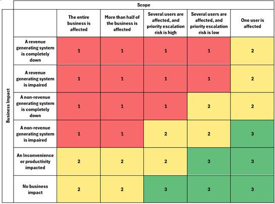
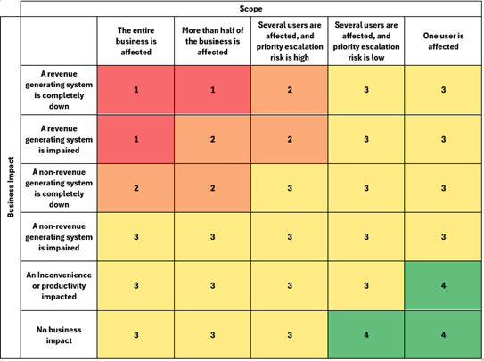

Document Title: Helpdesk Operations Manual
Document Version: VE.13
Document Date: 2026

# Overview

## Introduction

This Helpdesk Operations Manual is a collection of self-contained policies, procedures, and working standards that define how Digital Origin’s Helpdesk operates day-to-day. It is designed to create consistent service delivery, protect SLA performance, and ensure customers receive a predictable, high-quality experience regardless of which agent handles a ticket.

The manual is intentionally structured so that individual sections can be read and applied independently. Where dependencies exist (for example, where one policy references escalation handling, ticket statuses, or communications), the relevant policy will be referenced directly.

### Purpose

The purpose of this document is to:

- Set clear expectations for ticket ownership, quality, and customer communication
- Provide repeatable processes for triage, dispatch, escalation, and incident handling
- Reduce ambiguity by defining what “good” looks like, including minimum standards and prohibited practices
- Support onboarding and development by giving agents a single, authoritative reference for how the Helpdesk should run

### Scope

This manual applies to all Helpdesk activity performed under Digital Origin, including:

- Incidents and service requests handled through the helpdesk ticketing system
- Critical incident response processes and associated roles
- Operational standards that affect the customer experience (communications, hygiene, QA practices, and related governance)

Where a section is marked as [Placeholder] or (NF / Not in Force), it is either incomplete, pending approval, or not currently enforced as policy.

### Audience and responsibilities

**This document is for internal use only.**

This manual is written for:

- Helpdesk Agents – expected to follow relevant policies as part of normal ticket handling
- Team Leaders / CLS – responsible for enforcing, coaching, and ensuring consistent application
- Escalations Engineers and supporting teams – expected to align with relevant processes where they interact with Helpdesk tickets

Unless a policy explicitly states otherwise, the default position is:

- The assigned agent owns the ticket outcome
- Quality standards apply equally across all queues and ticket types
- Deviations must be justified and, where required, escalated via the appropriate route

### How to use this document

- Treat this manual as the source of truth for Helpdesk operational standards.
- Use it as a reference during ticket handling (especially around triage, priority, escalation, and customer communications).
- If multiple policies could apply, follow the most safety-critical or customer-impacting requirement first (e.g., security and critical incident controls take precedence).

### Continuous improvement and document governance

This manual will evolve. Where a policy is unclear, unworkable, or conflicts with real operational constraints, that is a signal that the policy should be improved -not informally ignored. Issues should be raised through leadership so the document can be updated, and expectations remain defensible, consistent, and achievable.

Following written process, even if it fails, will never result in disciplinary action.

### Use of AI in this document

AI has been used throughout this document to assist with wording, conciseness, and formatting; however, the content itself is human-generated and remains owned and approved internally.

## Changes
### Document Control

#### Document Properties

| Property     | Details    |
| ------------ | ------------ |
| Last Updated | 19/03/2026  |
| Updated By   | Jason Mcdill |
| Owner        | Jason Mcdill |

#### Revision History

| Version | Author       | Date       | Next Review |
| ------- | ------------ | ---------- | ----------- |
| 1.0     | Jason Mcdill | 10/02/2026 |             |
| 1.1     | Jason Mcdill | 13/03/2026 |             |
| 1.2     | Jason Mcdill | 19/03/2026 | 01/04/2026  |
|         |              |            |             |

#### Executive Sponsors

| Version | Author | Date |
| ------- | ------ | ---- |
|         |        |      |
|         |        |      |

#### Stakeholder / Distribution List

| Name | Title | Business Unit | Date |
| ---- | ----- | ------------- | ---- |
| Jason Mcdill | Helpdesk Team Leader | Customer Helpdesk | 19/03/2026 |
| Scott Jenkins | Helpdesk Team Leader | Customer Helpdesk | 19/03/2026 |
| Neels Steyn | Technical Manager | Customer Helpdesk | 19/03/2026 |

### Change Log

| Version | Date | Changed By | Summary of Changes |
| ------- | ---- | ---------- | ------------------ |
| VE.3 | - | Jason Mcdill | Baseline version; all sections either re-written or converted to markdown |
| VE.4 | - | Jason Mcdill | Formalised daily ticket status checks with machine-readable failure codes; added per-status check definitions (With User, With Vendor, With Testbench, Scheduled, Field Visit Scheduled, With Internal Team); replaced On Hold and Awaiting Delivery statuses with Field Visit Scheduled and With Internal Team; shifted failure recording from per-ticket agent-linked metadata to aggregate whole-number counting; added Appendix - Daily Ticket Checks with reference table; updated policy format template with heading-level indicators |
| VE.5 | - | Jason Mcdill | Created Ticket Closure, Reopen and Recurrence policy (restructured from Confirmation of Resolution); added Ticket Ownership and Handover placeholder; added Ticket Type and Ticket Status overview tables; removed Confirmation of Resolution grace period; fixed heading typos (Child Tickets, stray `>` markers); cleaned stray `</s>` characters from Dispatch Responsibility Policy |
| VE.6 | 26/02/2026 | Jason Mcdill | Removed Incident Management and Service Request Management placeholders (covered by Non-Critical Ticket Handling Process); corrected With User SLA hold from 24 hours to 5 hours (Halo limitation); filled Ticket Communication record keeping, Ticket Closure purpose, and Disciplinary Typical Flow step 1; corrected typos in Priority Classification and Ticket Closure headings |
| VE.7 | 11/03/2026 | Jason Mcdill | Replaced Account Managers with Service Delivery in child ticket workflows; added automatic approval for quoting and shipping child tickets; renamed child ticket subsections to Service Delivery (Quoting) and CLS (shipping instructions); filled child ticket record keeping; removed empty Remote Access & Remote Support Policy; promoted Continuous Improvement to its own heading; corrected typos (technical, Serves); pluralised Development Plans; marked Disciplinary Typical Flow as TBD |
| VE.8 | - | Jason Mcdill | Formatting-only release: standardised all 41 policy metadata tables with explicit Field/Value header row |
| VE.9 | 11/03/2026 | Jason Mcdill | Major release: added complete Quality Management System section aligned to ISO 9001:2015 (~30 new policies); systematically filled Purpose, Scope, How we measure compliance, Record keeping, and How we address shortfall across nearly every existing policy; removed (NF) markers from Triage, SLA Milestones, Priority Classification, Ticket Status Usage, Ticket Communication, Ticket Closure, Escalation, and Quality Assurance; substantially expanded Disciplinary Process (Conduct vs Performance, 8-step Typical Flow, Corrective Training, Oversight, detailed Warning Types); fully drafted Development Plan Policy from placeholder; removed Markdown Guide; marked Ticket Quality Sampling as Not Enforced |
| VE.10 | 13/03/2026 | Jason Mcdill | **This version is not published.** Extracted Post Incident Review (PIR) into standalone top-level policy with expanded scope, 6 trigger conditions, core principles, and Continual Improvement linkage - all other policies now cross-reference it; removed Dispatch Responsibility Policy (Abandoned), duplicate Password & Credential Handling and Tooling & Asset Management placeholders; 15 typo and grammar corrections throughout; populated Changes log; completed Contact via email guidance |
| VE.11 | 16/03/2026 | Jason Mcdill | Extracted the entire Quality Management System (~30 policies) into its own standalone manual (qms.md) and added a book selection menu to the site navigation; fully populated Documentation Standards, Ticket Ownership and Handover, Queue Management, Customer Escalation, Handling Complaints and Difficult Customers, and New Starter & Onboarding from placeholders; added new policies: Problem Management, Change Management (Placeholder), Service Level Breach Remediation (with breach classification categories), Disaster Recovery and Business Continuity (Placeholder), Information Security and Data Handling (Placeholder), Vendor and Third-Party Access (Placeholder), Communication Templates and Standards, Agent Wellbeing and Workload Management, Remote and Hybrid Working (Placeholder), Out-of-Hours and On-Call (Placeholder); integrated Appendix – Dispatch Limitations into the Dispatch Policy as formal Dispatch Limits (queue cap, end-of-shift restrictions, Critical Care and Critical Incident override rules); removed Appendix – Daily Ticket Checks and Appendix – Policy Format; removed Scheduled Ticket Review placeholder; removed stale Awaiting Delivery status block; demoted Post Incident Review from top-level heading to section within Critical Incident Handling; added Contact via email compliance measurement to Ticket Communication Policy; added metadata tables to Categorization, Known Issues, and Ticket Closure sections; ~25 typo, grammar, and cross-reference corrections throughout; expanded Changes log with full version history from VE.3 onwards |

# Ticket Lifecycle & Classification

## Lifecycle Flowchart

## Triage Policy

### Document Control

#### Document Properties

| Property     | Details      |
| ------------ | ------------ |
| Last Updated | 19/03/2026   |
| Updated By   | Jason Mcdill |
| Owner        | Jason Mcdill |

#### Revision History

| Version | Author       | Date       | Next Review |
| ------- | ------------ | ---------- | ----------- |
| 1.0     | Jason Mcdill | 10/02/2026 |             |
| 1.1     | Jason Mcdill | 11/03/2026 |             |
| 1.2     | Jason Mcdill | 19/03/2026 | 01/04/2026  |
|         |              |            |             |

#### Executive Sponsors

| Version | Author | Date |
| ------- | ------ | ---- |
|         |        |      |
|         |        |      |

#### Stakeholder / Distribution List

| Name          | Title                | Business Unit     | Date       |
| ------------- | -------------------- | ----------------- | ---------- |
| Jason Mcdill  | Helpdesk Team Leader | Customer Helpdesk | 19/03/2026 |
| Scott Jenkins | Helpdesk Team Leader | Customer Helpdesk | 19/03/2026 |
| Neels Steyn   | Technical Manager    | Customer Helpdesk | 19/03/2026 |

### Purpose

To ensure all tickets received by the Helpdesk contain sufficient, accurate information to support correct classification, prioritisation, and dispatch. Triage is the first quality gate in the ticket lifecycle and a mandatory step for all tickets.

### Scope

This policy applies to all tickets processed by the CLS team and Helpdesk agents. It covers both procedural triage conducted by CLS and conventional triage conducted by Helpdesk engineers at dispatch and first contact.

### Types of Triage

#### Procedural Triage

Procedural triage is carried out by the CLS team using a Triage workflow initiated with a “Triage” button in the ticket. While this is primarily to aid the CLS in adding required initial information to a ticket, it is a mandatory step in a ticket’s lifecycle.

Procedural triage is the only method carried out by the CLS team; however, it must be carried out on all tickets that have not been triaged as it triggers automations that are required to complete processing of the ticket. Helpdesk engineers have additional expectations when conducting initial triage.

#### Conventional Triage

In addition to procedural triage, a ticket will undergo further triage at dispatch and/or once assigned, where required, allowing a technician to confirm or update ticket details as required.

### Expectation

**All tickets processed by the CLS team or Helpdesk must, at a minimum**

have been procedurally triaged to ensure:

- Correct contact details are present
- Sufficient information exists to classify the ticket type and the request

**Helpdesk engineers correct any mistakes and add additional technical information**

- Correct any mistakes in the ticket's details and information
- Provide further context, or clarification of the information already provided

#### How we measure compliance

Compliance and quality are assessed through:

- Daily checks (reviewing completeness and quality of ticket information)
- Spot checks / ticket sampling (targeting reviews of randomly selected or high-risk tickets)

#### How we address shortfall

Shortfall is addressed through re/corrective training, and handled entirely by the disciplinary process.

#### Record keeping and documentation

Triage quality is assessed as part of daily ticket checks and ticket sampling. Triage failures are recorded per agent and reported in weekly performance statistics.

## Dispatch Policy

### Document Control

#### Document Properties

| Property     | Details      |
| ------------ | ------------ |
| Last Updated | 19/03/2026   |
| Updated By   | Jason Mcdill |
| Owner        | Jason Mcdill |

#### Revision History

| Version | Author       | Date       | Next Review |
| ------- | ------------ | ---------- | ----------- |
| 1.0     | Jason Mcdill | 29/03/2025 |             |
| 1.1     | Jason Mcdill | 15/06/2025 |             |
| 1.2     | Jason Mcdill | 22/07/2025 |             |
| 1.3     | Jason Mcdill | 04/09/2025 |             |
| 1.4     | Jason Mcdill | 17/10/2025 |             |
| 1.5     | Jason Mcdill | 28/11/2025 |             |
| 1.6     | Jason Mcdill | 09/01/2026 |             |
| 1.7     | Jason Mcdill | 10/02/2026 |             |
| 1.8     | Jason Mcdill | 16/03/2026 |             |
| 1.9     | Jason Mcdill | 19/03/2026 | 01/04/2026  |
|         |              |            |             |

#### Executive Sponsors

| Version | Author | Date |
| ------- | ------ | ---- |
|         |        |      |
|         |        |      |

#### Stakeholder / Distribution List

| Name          | Title                | Business Unit     | Date       |
| ------------- | -------------------- | ----------------- | ---------- |
| Jason Mcdill  | Helpdesk Team Leader | Customer Helpdesk | 19/03/2026 |
| Scott Jenkins | Helpdesk Team Leader | Customer Helpdesk | 19/03/2026 |
| Neels Steyn   | Technical Manager    | Customer Helpdesk | 19/03/2026 |

### Purpose

This policy defines the process for selecting and dispatching helpdesk tickets in a consistent and effective manner, including the queue size limits and end-of-shift rules that govern when and how tickets are assigned.

### Scope

This policy applies to all CLS staff and Team Leaders involved in the dispatch of helpdesk tickets.

### Responsibility Statement

Responsibility for dispatch falls on both the CLS and TL teams.

### Dispatch order of priority

The order that tickets are dispatched in is determined by the ticket’s priority, then by the ticket’s remaining response SLA:

Critical Incidents (notification required, agent acknowledgement required)

- High Priority Incidents (notification required)
- High Priority Service Requests (notification required)
- Moderate Incidents (by SLA remaining)
- High & Medium Service Requests (by SLA remaining)
- Low priority incidents and Service Requests (by SLA remaining)

Critical and High priority tickets always take precedence over all other dispatches to ensure resources are directed where they are most needed.

This priority ensures that we are using available resource effectively, addressing the right issues at the right time.

Dispatch of Critical and High priority incidents must be accompanied by a notification, only critical priority incidents require the agent to respond in acknowledgement.

### Dispatch Limits

The following limits apply to all standard dispatch activity. Their purpose is to reduce the risk of overwhelming an agent’s queue with more work than they can achieve within SLA, and to maintain enough agent bandwidth to allow P1 and P2 tickets through immediately.

#### Queue size cap

- Maximum of 15 tickets per agent queue for initial dispatch
- P1 and P2 tickets are exempt from the queue cap and must be dispatched immediately regardless of queue size
- If no valid queue is available for dispatch (all agents at or above the cap), the ticket must be held in the unassigned queue until capacity becomes available

#### End-of-shift restrictions

- No tickets may be assigned in the last 30 minutes of an agent’s shift, except where:
  - The agent has been directly communicated with and has confirmed capacity
  - The ticket is P1 or P2
  - The ticket is under Critical Care and the agent confirms they have capacity

#### Critical Care tickets

Tickets classified as Critical Care are dispatched using the same limits and expectations as any other ticket. Critical Care status does not override the queue cap or end-of-shift restriction.

#### Critical Incident override

Any conflict with the Critical Incident Handling process overrides the limits in this section. Where an agent is assigned as Incident Owner during a Critical Operational or Critical Security Incident, their existing queue must be redistributed — the dispatch limits do not apply when redistributing that agent’s workload.

### After-Dispatch CLS Interaction

CLS continue to take calls and pass them through to the appropriate agents, on occasion the agent may be able to accept a call from CLS but unable to progress the requisite ticket. If that is the case:

Provide CLS with reasonably accurate time estimate for when you will respond to the ticket

Plan to meet this time expectation

CLS will not take and pass on any message, especially ticket updates or technical information, on your behalf. If you have missed a time expectation you have made on a previous call with CLS, you must take the clients call and explain.

### Dispatch resource availability

The TL and CLS teams should communicate absence from the helpdesk continuously to ensure that adequate cover for dispatch is maintained.

### Use of the skills matrix

The skills matrix incorporates a simplified view that shows the base competence which the CLS team can use to quickly determine appropriate dispatch on a “best chance of success” basis.

#### How we measure compliance

Dispatch quality is reviewed through SLA breach classification, daily queue oversight, and Team Leader monitoring of dispatch activity. Compliance with dispatch limits is monitored through queue reviews — breaches are addressed informally and fed back immediately. The average time a ticket spends without dispatch is reported as a performance indicator; slow dispatch attributable to the queue cap is expected and is not treated as a shortfall.

#### Record keeping and documentation

Dispatch activity is captured through ticket assignment records and SLA breach classification. Miss-dispatch classifications are recorded weekly and reported at both individual and whole-desk level. Dispatch limit compliance is monitored through daily queue reviews; breaches are noted informally by Team Leaders and fed back at the time.

#### How we address shortfall

Dispatch failures are addressed through informal feedback and coaching in the first instance. Where dispatch shortfall is persistent or results in repeated SLA breaches, it is handled through the disciplinary process. Dispatch limit compliance shortfalls that involve an external team (CLS) are addressed cooperatively — queue owners are not directly responsible for controlling their own inbound volume, so shortfalls are handled through feedback, training, and additional resources rather than through the disciplinary process.

## SLA Milestones

### Document Control

#### Document Properties

| Property     | Details      |
| ------------ | ------------ |
| Last Updated | 19/03/2026   |
| Updated By   | Jason Mcdill |
| Owner        | Jason Mcdill |

#### Revision History

| Version | Author       | Date       | Next Review |
| ------- | ------------ | ---------- | ----------- |
| 1.0     | Jason Mcdill | 10/02/2026 |             |
| 1.1     | Jason Mcdill | 11/03/2026 |             |
| 1.2     | Jason Mcdill | 19/03/2026 | 01/04/2026  |
|         |              |            |             |

#### Executive Sponsors

| Version | Author | Date |
| ------- | ------ | ---- |
|         |        |      |
|         |        |      |

#### Stakeholder / Distribution List

| Name          | Title                | Business Unit     | Date       |
| ------------- | -------------------- | ----------------- | ---------- |
| Jason Mcdill  | Helpdesk Team Leader | Customer Helpdesk | 19/03/2026 |
| Scott Jenkins | Helpdesk Team Leader | Customer Helpdesk | 19/03/2026 |
| Neels Steyn   | Technical Manager    | Customer Helpdesk | 19/03/2026 |

### Purpose

To define the target response and resolution times for tickets based on their assigned priority and type. These targets ensure consistent service delivery and provide clear expectations for both helpdesk staff and customers.

### Scope

This policy applies to all Helpdesk agents, CLS staff, and Team Leaders involved in the handling of helpdesk tickets. It defines the maximum response and resolution times for all incidents and service requests processed under Digital Origin, regardless of ticket type.

### Service Level Agreements

Each ticket is subject to a service level agreement (SLA) that outlines the maximum allowable time to respond to and resolve the issue. These SLA milestones vary depending on whether the ticket is an incident or a service request (SR) and are determined by the priority level assigned during triage.

| Priority | Description | Response Target (Incident) | Response Target (SR) | Resolution Target (Incident) | Resolution Target (SR) |
| -------- | ----------- | -------------------------- | -------------------- | ---------------------------- | ---------------------- |
| 1        | Critical    | 00:30                      | N/A                  | 02:00                        | N/A                    |
| 2        | High        | 01:00                      | 04:00                | 04:00                        | 08:00                  |
| 3        | Moderate    | 04:00                      | 04:00                | 08:00                        | 3 days                 |
| 4        | Low         | 08:00                      | 08:00                | 3 days                       | 5 days                 |

- Time expectations given are the maximum allowed, not the target. Tickets should be addressed as quickly as possible.
- Critical priority tickets are expected to be addressed immediately, regardless of their SLA.
- Security incidents are always given Critical priority until they are confirmed to be safe.

### Response Target

Response target is the window in which a ticket must receive a response, to meet the requirements of the response target the response must both include the ticket user and progress the ticket in a meaningful way, unless impossible.

### Resolution Target

The resolution target is the window in which the issue must be resolved, to meet this requirement the client must confirm the issue is resolved and the ticket must be “Resolved” or “Completed”

#### How we measure compliance

We measure compliance directly through stats recorded weekly and monthly, per agent and whole desk.

#### Record keeping and documentation

Records of SLA performance are taken weekly and monthly at both whole team and per agent levels, and kept indefinitely.

#### How we address shortfall

Shortfall is handled directly through the disciplinary process.

## Priority Classification Policy

### Document Control

#### Document Properties

| Property     | Details      |
| ------------ | ------------ |
| Last Updated | 19/03/2026   |
| Updated By   | Jason Mcdill |
| Owner        | Jason Mcdill |

#### Revision History

| Version | Author       | Date       | Next Review |
| ------- | ------------ | ---------- | ----------- |
| 1.0     | Jason Mcdill | 07/05/2025 |             |
| 1.1     | Jason Mcdill | 15/06/2025 |             |
| 1.2     | Jason Mcdill | 22/07/2025 |             |
| 1.3     | Jason Mcdill | 04/09/2025 |             |
| 1.4     | Jason Mcdill | 17/10/2025 |             |
| 1.5     | Jason Mcdill | 28/11/2025 |             |
| 1.6     | Jason Mcdill | 09/01/2026 |             |
| 1.7     | Jason Mcdill | 10/02/2026 |             |
| 1.8     | Jason Mcdill | 26/02/2026 |             |
| 1.9     | Jason Mcdill | 11/03/2026 |             |
| 1.10    | Jason Mcdill | 19/03/2026 | 01/04/2026  |
|         |              |            |             |

#### Executive Sponsors

| Version | Author | Date |
| ------- | ------ | ---- |
|         |        |      |
|         |        |      |

#### Stakeholder / Distribution List

| Name          | Title                | Business Unit     | Date       |
| ------------- | -------------------- | ----------------- | ---------- |
| Jason Mcdill  | Helpdesk Team Leader | Customer Helpdesk | 19/03/2026 |
| Scott Jenkins | Helpdesk Team Leader | Customer Helpdesk | 19/03/2026 |
| Neels Steyn   | Technical Manager    | Customer Helpdesk | 19/03/2026 |

### Purpose

To ensure tickets are given accurate priority at the earliest stage and updated appropriately throughout their lifecycle. This maintains SLA integrity and ensures that high-impact issues receive the appropriate urgency and response.

### Scope

This policy applies to all Helpdesk agents, CLS staff, and Team Leaders involved in the creation, triage, dispatch, or handling of helpdesk tickets. It covers all ticket types and priorities processed through the helpdesk system.

### Initial Classification

- Priority should be set:
  - At ticket creation if raised by the helpdesk
  - During triage if raised by the end user
- After dispatch, the receiving agent must confirm or adjust the priority before conducting any work
- It is the receiving agent’s responsibility to ensure accurate classification based on the ticket's impact and urgency
- Initial classification uses a more aggressive matrix; re-classification – especially de-escalation – is often necessary as the situation becomes clearer
- Tickets marked as critical will trigger workflows based on the nature of the incident

#### How we measure compliance

- Spot-checks of newly created and triaged tickets for priority set correctly at first touch
- Dispatch audits: confirmation/adjustment completed before first technical action
- Sampling of “Critical” tickets to confirm workflow triggers were followed
- SLA review: mismatch patterns between priority and breach outcomes, escalations, or complaint volume

### Priority Re-Classification

- A ticket must retain the highest priority it was confirmed to be at any point
- If a lower-priority or otherwise related issue is discovered during the resolution of higher-priority ticket it should be raised as a child of the higher priority ticket

#### How we measure compliance

- Review of reclassification events and justification notes
- Checks that previously confirmed highest priority remains recorded/retained
- Sampling of high-priority tickets to confirm related lower-priority work is separated into child tickets where appropriate

#### Record keeping and documentation

Priority classification is checked daily, through our daily ticket checks, through our weekly stats and through spot checks on high priority or high-risk tickets.

#### How we address shortfall

Shortfall is handled informally through corrective training and guidance, repeat failures are handled through the disciplinary process.

### Priority Classification Expectations

#### Priority 1 (Critical)

Priority 1 (P1) incidents represent critical issues that have a severe and immediate impact on business operations, such as company-wide outages, security breaches, or failures affecting multiple systems or users. When a P1 is raised, it takes absolute precedence over all other workloads. Agents must immediately stop work on any other tickets and prioritise resolution of the P1.

#### Priority 2 (High)

Priority 2 (P2) incidents indicate a significant issue that causes serious disruption, but on a more limited scale than a P1. For example, a complete service outage affecting a single user or a critical function within one department would be considered P2. These incidents require prompt attention and timely resolution, but do not override P1 workloads.

The primary distinction between P1 and P2 is the scope and scale of impact

#### Priority 3 (Moderate)

Priority 3 (P3) is the default level for most standard incidents. These include issues that are disruptive but not urgent, such as software bugs, intermittent performance problems, or single-user issues that have viable workarounds. P3 incidents are handled in the order they are received, unless escalated due to change in impact or urgency.

#### Priority 4 (low)

Priority 4 (P4) incidents are low-impact or long-term issues that do not significantly affect user productivity or business operations. Examples include feature requests, cosmetic UI issues, or planned work that is not time-sensitive. These incidents are typically scheduled for resolution after higher priority work has been completed.

#### How we measure compliance

Priority accuracy within the classification expectations is assessed through daily ticket checks, spot checks on high-priority tickets, and SLA breach classification reviews. Misclassification patterns are identified and reported through weekly performance statistics.

#### Record keeping and documentation

Priority classification is checked daily, through our daily ticket checks, through our weekly stats and through spot checks on high priority or high-risk tickets.

#### How we address shortfall

Shortfall is handled informally through corrective training and guidance, repeat failures are handled through the disciplinary process.

### CLS Priority Matrix

### Helpdesk Priority Matrix

## Documentation Standards

### Document Control

#### Document Properties

| Property     | Details      |
| ------------ | ------------ |
| Last Updated | 19/03/2026   |
| Updated By   | Jason Mcdill |
| Owner        | Jason Mcdill |

#### Revision History

| Version | Author       | Date       | Next Review |
| ------- | ------------ | ---------- | ----------- |
| 1.0     | Jason Mcdill | 10/02/2026 |             |
| 1.1     | Jason Mcdill | 16/03/2026 |             |
| 1.2     | Jason Mcdill | 19/03/2026 | 01/04/2026  |
|         |              |            |             |

#### Executive Sponsors

| Version | Author | Date |
| ------- | ------ | ---- |
|         |        |      |
|         |        |      |

#### Stakeholder / Distribution List

| Name          | Title                | Business Unit     | Date       |
| ------------- | -------------------- | ----------------- | ---------- |
| Jason Mcdill  | Helpdesk Team Leader | Customer Helpdesk | 19/03/2026 |
| Scott Jenkins | Helpdesk Team Leader | Customer Helpdesk | 19/03/2026 |
| Neels Steyn   | Technical Manager    | Customer Helpdesk | 19/03/2026 |

### Purpose

To define the minimum standard of documentation expected within helpdesk tickets, ensuring that every ticket contains sufficient information for any agent, Team Leader, or auditor to understand the current state of the issue, the actions taken, and the next steps without needing to contact the original handler.

### Scope

This policy applies to all Helpdesk agents, CLS staff, and Team Leaders. It covers all internal notes, customer-facing updates, and status changes recorded within helpdesk tickets across all queues and ticket types.

### Expectation

Every ticket update - whether internal or customer-facing - must be meaningful, clear, and sufficient to support continuity of service. The following minimum standards apply:

- **Clarity**: Updates must be written in plain language. Avoid unexplained abbreviations, shorthand, or incomplete sentences that would be unclear to another agent picking up the ticket.
- **Content**: Each update must describe what was done, what was found, and what the next step is (including who owns it and when it is expected to happen).
- **Internal notes vs customer updates**: Internal notes should capture technical detail, troubleshooting steps, and decision rationale. Customer-facing updates should summarise progress in non-technical language appropriate to the audience.
- **No empty or placeholder updates**: Updates that exist only to satisfy automation (e.g. "chased", "updated", "no change") without providing meaningful context are not compliant with this policy. Every update must add value.
- **Escalation and handover documentation**: When a ticket is escalated or handed over, the ticket must contain a clear summary of the current state, actions already taken, and the specific reason for escalation or handover, sufficient for the receiving party to act without unnecessary discovery. See the Escalation Policy and Ticket Ownership and Handover Policy.
- **Priority and status changes**: Any change to priority or status must be accompanied by a note explaining the reason for the change, unless the reason is self-evident from the preceding update.

#### How we measure compliance

Documentation quality is assessed through daily ticket checks (Bread, Dredging), Breadboard score reviews, formal ticket sampling, and spot checks by Team Leaders. Specific attention is given to update quality during escalation reviews and PIR findings.

#### Record keeping and documentation

Documentation quality findings are recorded per agent through ticket sampling outcomes, Breadboard scores, and daily check results. Notable failures are reported in weekly performance statistics.

#### How we address shortfall

Shortfall is addressed through informal coaching and feedback at the point of identification. Persistent or serious documentation failures - particularly where they result in missed SLA, failed handovers, or poor customer experience - are addressed through corrective training and the disciplinary process.

# Non-Critical Ticket Handling

## Ticket Type Usage Policy

### Document Control

#### Document Properties

| Property     | Details      |
| ------------ | ------------ |
| Last Updated | 19/03/2026   |
| Updated By   | Jason Mcdill |
| Owner        | Jason Mcdill |

#### Revision History

| Version | Author       | Date       | Next Review |
| ------- | ------------ | ---------- | ----------- |
| 1.0     | Jason Mcdill | 07/05/2025 |             |
| 1.1     | Jason Mcdill | 15/06/2025 |             |
| 1.2     | Jason Mcdill | 22/07/2025 |             |
| 1.3     | Jason Mcdill | 04/09/2025 |             |
| 1.4     | Jason Mcdill | 17/10/2025 |             |
| 1.5     | Jason Mcdill | 28/11/2025 |             |
| 1.6     | Jason Mcdill | 09/01/2026 |             |
| 1.7     | Jason Mcdill | 10/02/2026 |             |
| 1.8     | Jason Mcdill | 19/03/2026 | 01/04/2026  |
|         |              |            |             |

#### Executive Sponsors

| Version | Author | Date |
| ------- | ------ | ---- |
|         |        |      |
|         |        |      |

#### Stakeholder / Distribution List

| Name          | Title                | Business Unit     | Date       |
| ------------- | -------------------- | ----------------- | ---------- |
| Jason Mcdill  | Helpdesk Team Leader | Customer Helpdesk | 19/03/2026 |
| Scott Jenkins | Helpdesk Team Leader | Customer Helpdesk | 19/03/2026 |
| Neels Steyn   | Technical Manager    | Customer Helpdesk | 19/03/2026 |

### Purpose

To define and standardize the usage of ticket types across the helpdesk.

### Scope

This policy applies to all Helpdesk agents, CLS staff, and Team Leaders involved in creating or handling tickets. It covers all ticket types available within the helpdesk system and applies across all queues.

### Overview

### Document Control

#### Document Properties

| Property     | Details      |
| ------------ | ------------ |
| Last Updated | 19/03/2026   |
| Updated By   | Jason Mcdill |
| Owner        | Jason Mcdill |

#### Revision History

| Version | Author       | Date       | Next Review |
| ------- | ------------ | ---------- | ----------- |
| 1.0     | Jason Mcdill | 10/02/2026 |             |
| 1.1     | Jason Mcdill | 19/03/2026 | 01/04/2026  |
|         |              |            |             |

#### Executive Sponsors

| Version | Author | Date |
| ------- | ------ | ---- |
|         |        |      |
|         |        |      |

#### Stakeholder / Distribution List

| Name          | Title                | Business Unit     | Date       |
| ------------- | -------------------- | ----------------- | ---------- |
| Jason Mcdill  | Helpdesk Team Leader | Customer Helpdesk | 19/03/2026 |
| Scott Jenkins | Helpdesk Team Leader | Customer Helpdesk | 19/03/2026 |
| Neels Steyn   | Technical Manager    | Customer Helpdesk | 19/03/2026 |

### Incidents & Telephony Incidents

Incidents represent a service disruption or interruption that is unplanned and unintended.

- These are the most common tickets raised by end users.
- All security-related issues must be logged as incidents.
- Examples include:
  - Printer won’t print
  - Server down
  - Phishing email reported

### Service Requests & Telephony Service Requests

Service requests are user requests that do not represent a disruption or interruption that is unplanned or unintended

- These requests involve standard operational tasks or administrative changes.
- Examples include:
  - Name or password changes
  - New user or PCE setup
  - Printer installation

### Telephony Task

Used for project-related or exceptional telephony incidents

- Not included in normal SLAs or standard reporting
- Typically long-term or out-of-scope tasks
- May involve monitoring, scheduling, or bespoke setups

### Problem

Used to link and track multiple related tickets

- Not used for direct actions or updates
- Serves two main purposes:
  - To document a widespread issue across clients or systems
  - To act as a parent to many tickets tied to a single root cause
- Must not contain any actionable work
- Should be raised and maintained by only Third Line engineers or Team Leaders
- Child tickets are created for all actual work related to the problem

### Service Delivery Support

Used by Service Delivery to raise internal support tickets and build escalations.

- Always high priority
- Functionally identical to an Incident
- Currently can be used by the Projects team for workload sharing

### Projects Support

Proposed type for Projects team workload sharing (not yet implemented)

### Child Tickets

Child tickets are used to either assign tasks or share workload. Each use case has specific requirements and expectations. In all situations, a child ticket must be handled with the same standards and urgency as any other helpdesk ticket, and all policies that would apply to any other ticket, also apply to children except during escalation (see the escalation policy).

#### Expectations

Child tickets must be treated as customer-impacting tickets raised on behalf of a customer. The agent who raises the child ticket retains ownership and accountability for it for its entire lifecycle.

The primary use of child tickets is to assign quotation tasks to Service Delivery, however they may also be used to assign tasks to other teams or individuals. Use of child tickets to share workload requires leadership intervention and/or approval, except where automatic approval is defined within this policy, and the Escalation policy.

##### Assigning a task with a child ticket

Any helpdesk ticket created specifically for task assignment -regardless of the receiving team or individual -must meet the expectations below.

A helpdesk agent may create a child ticket **without** leadership approval only to:

- Assign a workload to an account manager
- Assign shipping instructions to CLS

##### When creating a child ticket for Service Delivery (Quoting)

- The agent is automatically approved to raise child tickets for quoting
- The customer is always the agent that raised it and the company is Digital Origin
- The actual customer name must be present in the summary
- If a quote is required, seek and provide the contact details of the VIP approver
- Clearly define the task needing achieved
- Accompany the assignment of the child with a secondary communication, preferably in teams or email
- The ticket must contain all the necessary context for it to be conducted independently
- The agent that creates the child ticket is responsible for ensuring it is conducted but:
  - Chase Service Delivery for updates daily
  - Apply a 3 strike rule to child tickets, but instead of closing it: escalate with a Team Leader

##### When creating a child ticket for CLS (shipping instructions)

- The agent is automatically approved to raise child tickets for shipping instructions
- The customer is always the agent that raised it and the company is Digital Origin
- The actual customer name must be present in the summary
- Provide the from and to address, in full, and clearly identified, even if one of them is Digital Origin
- Accompany the assignment of the child with a secondary communication, preferably in teams or email
- The ticket must contain all the necessary context for it to be conducted independently
- Confirm with CLS that the ticket is received, and comply with any discovery requests they make. It is the agent creating the ticket who is responsible for providing the information, not CLS.

##### When not to use a child ticket

- To avoid ownership or responsibility If the intent is to “hand off” an issue and stop tracking it, a child ticket is the wrong tool. The creating agent remains accountable.
- When a normal escalation is required If the issue needs specialist technical intervention, leadership oversight, or a formal escalation route, follow the Escalation Policy rather than creating a child ticket as a workaround.
- When the receiving party needs discovery If the recipient would need to ask multiple questions, request additional information, or investigate from scratch, the child ticket is not ready. Add the missing context first (or keep the work on the parent ticket until it is).
- To “split” a ticket purely for convenience Don’t create child tickets just to make the queue look smaller, reduce the appearance of workload, or move work between people without a clear task boundary and outcome.
- To duplicate work already being performed If another team/member is already engaged through an existing ticket, email thread, or agreed process, don’t create a new child ticket unless it adds clear value and avoids confusion.
- When it would create SLA ambiguity If splitting the work makes it unclear who is responsible for which SLA commitments, keep it on the parent ticket or raise with a Team Leader.

### How we measure compliance

- Ticket sampling to confirm correct type selection (especially security-related tickets logged as incidents)
- Trend analysis of mis-typed tickets and reclassification frequency during triage
- QA checks during dredging/spot checks where ticket type impacts SLA/workflow

### Record keeping and documentation

Open child tickets are recorded and reported to Team Leaders daily to be checked individually, failures are reported through stats.

### How we address shortfall

Misclassification of ticket type is addressed through corrective feedback and training at the time it is identified. Where misclassification affects SLA or workflow, it is recorded and tracked. Persistent misclassification is handled through the disciplinary process.

## Ticket Status Usage Policy

### Document Control

#### Document Properties

| Property     | Details      |
| ------------ | ------------ |
| Last Updated | 19/03/2026   |
| Updated By   | Jason Mcdill |
| Owner        | Jason Mcdill |

#### Revision History

| Version | Author       | Date       | Next Review |
| ------- | ------------ | ---------- | ----------- |
| 1.0     | Jason Mcdill | 10/02/2026 |             |
| 1.1     | Jason Mcdill | 13/02/2026 |             |
| 1.2     | Jason Mcdill | 11/03/2026 |             |
| 1.3     | Jason Mcdill | 19/03/2026 | 01/04/2026  |
|         |              |            |             |

#### Executive Sponsors

| Version | Author | Date |
| ------- | ------ | ---- |
|         |        |      |
|         |        |      |

#### Stakeholder / Distribution List

| Name          | Title                | Business Unit     | Date       |
| ------------- | -------------------- | ----------------- | ---------- |
| Jason Mcdill  | Helpdesk Team Leader | Customer Helpdesk | 19/03/2026 |
| Scott Jenkins | Helpdesk Team Leader | Customer Helpdesk | 19/03/2026 |
| Neels Steyn   | Technical Manager    | Customer Helpdesk | 19/03/2026 |

### Purpose

To ensure all tickets maintain an accurate and valid status at all times, and that SLA holds are used correctly and only where the conditions of this policy are met. Accurate status usage is essential to SLA integrity, queue visibility, and effective ticket management.

### Scope

This policy applies to all Helpdesk agents, CLS staff, and Team Leaders. It covers all ticket statuses available in the helpdesk system and defines the conditions under which each may be applied or held.

### Expectation

All tickets must always have a valid status, and any SLA holds must be used correctly and only where appropriate.

Use of SLA holds explicitly:

SLA timers may only be paused when progression depends on an external party (e.g., the user or a vendor)

In the case of no contact with a user, a reasonable effort must be made and documented, to contact them before holding the SLA timer.

The ticket must still be updated daily unless it is scheduled.

SLA hold must not be used where progression of the ticket requires an internal team

### Overview

| Status                | Usage                                                        | Expected SLA Status |
| --------------------- | ------------------------------------------------------------ | ------------------- |
| New                   | A new ticket that has not been updated yet.                  | Running             |
| In Progress           | The ticket is actively being worked on.                      | Running             |
| With User (HD)        | Awaiting a response or action from the user; work is paused. | Held (for 5 hours)* |
| With Vendor           | Awaiting a response or action from a vendor; work is paused. | Held                |
| With Testbench        | Hardware has been delivered and is on the testbench          | Running             |
| Escalate              | The issue has been escalated for additional support or visibility. | Running             |
| Updated               | The ticket has received an update from someone other than the agent. | Running             |
| Scheduled             | The ticket has a future appointment or planned action (not missed). | Held                |
| Field Visit Scheduled | A field engineer has been scheduled, and a site visit is booked | Held                |
| With Internal Team    | The ticket requires action from a team or authority with Digital Origin | Running             |

*Limitations in Halo currently prevent us using a real 24 hour clock

**Valid Status Required**: Every ticket must always maintain a valid and appropriate status.

**On-Hold Justification**: If an incident is placed on hold, the reason for this must be clearly documented within the ticket. This will usually be clear by the tickets conduct but the agent is still responsible to make sure.

**SLA Hold Restriction**: Holding SLA status is strictly prohibited in any situation where the ticket requires action or intervention from any team within Digital Origin.

**Scheduled**:

- Have a valid appointment:
- Set in the future
- Set by the owner of the ticket

**On Hold**:

- Should only be used by / for:
- Problems
- TL – on demand

**With User**:

- The correct status has been used (“With User (HD)” as opposed to “With User”)
- The ticket is waiting for a user to interact
- The user is being chased or updated daily
- The ticket does not meet the requirements of the “three strike rule”
- Applies to:
  - Incident & Telephony Incident
  - Service Request & Telephony Service Request

**With Vendor**:

- The ticket is actively waiting on a vendor
- The vendor is being chased daily
- The user (if present) is being updated promptly of changes, or daily, whichever is soonest.

**With Testbench**:

- Ensure the machine is on the test bench
- Ensure the ticket is receiving updates daily and progress is being made

#### How we measure compliance

Ticket statuses are checked twice daily by Team Leaders as part of the formal ticket hygiene process (see Ticket Hygiene Tooling). Non-compliant statuses are flagged and corrected in real time where possible.

#### Record keeping and documentation

[TBD]

#### How we address shortfall

[TBD]

### Scheduling Appointments and use of Scheduled status

#### Expectation

Appointments may be set to manage your workload or to coordinate sessions with busy users. **Any time commitments made to a customer must be honoured, without exception.**

- [NOT ENFORCED] All appointments must include the user**, even if only to notify them of activity taking place on their ticket.
- **Appointments must be completed independently of the ticket.** Ensure calendar entries are managed properly so that past appointments do not show as missed due to ticket closure or status changes.

Missing an appointment with a customer causes significant disruption and leads to an immediate negative customer experience. **Failure to meet agreed appointments may result in disciplinary action.**

#### How we measure compliance

Scheduled tickets are checked every morning for a valid appointment, appointments that include a customer are captured through reporting and tracked on the day the appointment is due.

We also check the quality of scheduled appointments through ticket sampling.

#### Record keeping and documentation

Appointment compliance is captured through daily scheduled ticket checks and spot checks. Missed appointments are flagged, recorded per agent, and reported in weekly statistics.

#### How we address shortfall

Missed or invalid appointments are addressed with the agent at the time of identification. Repeated failures to honour agreed appointments may result in disciplinary action as stated in this policy.

## Ticket Communication Policy

### Document Control

#### Document Properties

| Property     | Details      |
| ------------ | ------------ |
| Last Updated | 19/03/2026   |
| Updated By   | Jason Mcdill |
| Owner        | Jason Mcdill |

#### Revision History

| Version | Author       | Date       | Next Review |
| ------- | ------------ | ---------- | ----------- |
| 1.0     | Jason Mcdill | 10/02/2026 |             |
| 1.1     | Jason Mcdill | 26/02/2026 |             |
| 1.2     | Jason Mcdill | 11/03/2026 |             |
| 1.3     | Jason Mcdill | 16/03/2026 |             |
| 1.4     | Jason Mcdill | 19/03/2026 | 01/04/2026  |
|         |              |            |             |

#### Executive Sponsors

| Version | Author | Date |
| ------- | ------ | ---- |
|         |        |      |
|         |        |      |

#### Stakeholder / Distribution List

| Name          | Title                | Business Unit     | Date       |
| ------------- | -------------------- | ----------------- | ---------- |
| Jason Mcdill  | Helpdesk Team Leader | Customer Helpdesk | 19/03/2026 |
| Scott Jenkins | Helpdesk Team Leader | Customer Helpdesk | 19/03/2026 |
| Neels Steyn   | Technical Manager    | Customer Helpdesk | 19/03/2026 |

### Purpose

To define the expected standard for customer communication across all ticket types, with a preference for phone contact as the primary channel. This policy ensures customers are kept informed, communication behaviour is measurable, and response quality is maintained throughout the ticket lifecycle.

### Scope

This policy applies to all Helpdesk agents handling customer-facing tickets. It covers all methods of customer contact including phone, email, and ticket updates, whether inbound or outbound.

### Expectation

Customer contact should primarily be by phone.

- Use of the Call User button
  - Used to record a made call, regardless of if the recipient picked up or not
  - On missed calls, where the agent has selected “no” to “User answered”
    - The call is still recorded
    - The customer is sent a missed call notification
    - No further email is required from the agent
  - Email User button
    - Facilities emailing the ticket primary contact from the ticket itself
- Contact via email tick-box
  - Used to remove a ticket from the call user statistics
    - All ticket content is ignored, including call user button activations
  - Should be used:
    - Where the customer's preferred or only practical contact method is email
    - Where the ticket relates to a non-interactive task (e.g. monitoring, scheduled work) where phone contact would not add value

#### How we measure compliance

Compliance with this policy is measured by comparing the use of the call user button directly to the use of the email user button to make a ratio. We then cross-reference actual call out and talk time to confirm the agent’s recorded stats agree.

Compliance with the contact via email tick box is measured directly by reporting on the number of activations then compared to the overall workload of the agent.

#### Record keeping and documentation

Callout and email communication statistics are recorded with weekly performance stats and kept indefinitely, communication quality is recorded by spot check and recorded where notable.

#### How we address shortfall

Triggers for intervention are:

- Any consistent ratio below 1:1
- Any weekly recorded ratio falling below 0.5
- Large deviation between recorded call user button activation and actual callout

Intervention process:

- A meeting will be held with the agent to investigate the reason(s) for the reduced callout volume where we will review tickets and discuss ticket actions.
  - If necessary, corrective measures will be applied, which may include a Development Plan
  - For Vetoquinol tickets where primary contact is in person or over Teams
- Each use is scrutinized for compliance with this policy

Each agent should be able to reach a ratio of 1:1 for use of the call user and email user actions, first line agents focussing on service requests will have a naturally lower ratio than second line agents focussing on Incidents.

### Updates and Customer Communications

#### Expectation

- **Update Frequency**: Tickets must not go more than 24 hours without an update unless they are scheduled, or a site visit is booked.
- **Update Quality**: Tickets must receive high quality interactions that are clearly attempts to progress the ticket
- **Customer Communication**: Customers must be appropriately informed of their ticket’s progress and kept up to date throughout the lifecycle of the ticket.

#### How we measure compliance

Lifecycle management is an ongoing process with several automated methods of reporting and alerting. We measure compliance with this policy primarily through daily lifecycle checks like “Bread”.

#### Record keeping and documentation

Update frequency and quality are assessed through Breadboard scores, daily ticket checks, and ticket sampling. Failures are recorded per agent and reported in weekly statistics.

#### How we address shortfall

Shortfall in update frequency or quality is addressed through Breadboard feedback and informal coaching in the first instance. Persistent or serious shortfall is handled through the disciplinary process.

## Ticket Closure, Reopen and Recurrence

### Document Control

#### Document Properties

| Property     | Details      |
| ------------ | ------------ |
| Last Updated | 19/03/2026   |
| Updated By   | Jason Mcdill |
| Owner        | Jason Mcdill |

#### Revision History

| Version | Author       | Date       | Next Review |
| ------- | ------------ | ---------- | ----------- |
| 1.0     | Jason Mcdill | 19/02/2026 |             |
| 1.1     | Jason Mcdill | 26/02/2026 |             |
| 1.2     | Jason Mcdill | 11/03/2026 |             |
| 1.3     | Jason Mcdill | 16/03/2026 |             |
| 1.4     | Jason Mcdill | 19/03/2026 | 01/04/2026  |
|         |              |            |             |

#### Executive Sponsors

| Version | Author | Date |
| ------- | ------ | ---- |
|         |        |      |
|         |        |      |

#### Stakeholder / Distribution List

| Name          | Title                | Business Unit     | Date       |
| ------------- | -------------------- | ----------------- | ---------- |
| Jason Mcdill  | Helpdesk Team Leader | Customer Helpdesk | 19/03/2026 |
| Scott Jenkins | Helpdesk Team Leader | Customer Helpdesk | 19/03/2026 |
| Neels Steyn   | Technical Manager    | Customer Helpdesk | 19/03/2026 |

### Purpose

The purpose of this policy is to ensure tickets are closed consistently and safely, without prematurely ending ownership, and to ensure that re-opened or repeating issues are handled in a controlled way that protects customer confidence, SLA performance, and operational risk.

### Scope

This policy applies to all Helpdesk agents handling incidents and service requests. It covers the conditions required for ticket closure, the handling of tickets that are reopened after closure, and the identification and response to recurring issues.

### When tickets can be closed

#### Confirmation of resolution

In most cases, the user is the only party that can confirm a solution is acceptable and allow the ticket to be closed. Tickets that can not be closed as a result of no confirmation, or where confirmation is impossible, should be raised with a Team Leader.

#### Expectation

Tickets processed by the helpdesk must have confirmation that the resolution has worked before the ticket is closed.

- Preferred method: Directly from the ticket user.
- Alternatively: Through testing the solution and providing results in the ticket.

#### How we measure compliance

Confirmation of resolution is added to ticket sampling, failure to confirm resolution is a common reason for apparent re-occurrence which is already being monitored and can be fed back.

#### Record keeping and documentation

[TBD]

#### How we address shortfall

Tickets closed without appropriate confirmation of resolution are flagged during sampling and fed back to the agent. Repeat failures are addressed through corrective training and the disciplinary process.

### Handling reopened tickets

[TBD]

### Classifying and actioning recurrence

[TBD]

## Ticket Ownership and Handover Policy

### Document Control

#### Document Properties

| Property     | Details      |
| ------------ | ------------ |
| Last Updated | 19/03/2026   |
| Updated By   | Jason Mcdill |
| Owner        | Jason Mcdill |

#### Revision History

| Version | Author       | Date       | Next Review |
| ------- | ------------ | ---------- | ----------- |
| 1.0     | Jason Mcdill | 19/02/2026 |             |
| 1.1     | Jason Mcdill | 16/03/2026 |             |
| 1.2     | Jason Mcdill | 19/03/2026 | 01/04/2026  |
|         |              |            |             |

#### Executive Sponsors

| Version | Author | Date |
| ------- | ------ | ---- |
|         |        |      |
|         |        |      |

#### Stakeholder / Distribution List

| Name          | Title                | Business Unit     | Date       |
| ------------- | -------------------- | ----------------- | ---------- |
| Jason Mcdill  | Helpdesk Team Leader | Customer Helpdesk | 19/03/2026 |
| Scott Jenkins | Helpdesk Team Leader | Customer Helpdesk | 19/03/2026 |
| Neels Steyn   | Technical Manager    | Customer Helpdesk | 19/03/2026 |

### Purpose

To establish clear expectations for ticket ownership throughout the ticket lifecycle and to define the conditions and standards under which a ticket may be handed over from one agent to another. This policy exists to prevent tickets from being abandoned, passed around without accountability, or losing momentum during transitions.

### Scope

This policy applies to all Helpdesk agents, CLS staff, and Team Leaders. It covers all ticket types and queues and applies from the point of dispatch through to closure.

### Expectation

#### Ownership principle

The assigned agent owns the ticket outcome. Ownership means:

- The agent is accountable for progressing the ticket to resolution or confirmed escalation
- The agent is responsible for all customer communication on the ticket unless communication ownership has been explicitly transferred (e.g. during a customer escalation handled by a Team Leader)
- The agent must maintain documentation standards on the ticket throughout (see Documentation Standards)
- Ownership is not removed by escalation - the agent retains responsibility for the ticket even while awaiting input from an escalated party, unless the escalation results in a formal reassignment.

#### When handover is permitted

A ticket may be handed over to another agent only when:

- The original agent's shift is ending and the ticket requires continued active work that cannot wait until the next shift (e.g. an SLA-critical ticket, an ongoing customer call, or an active critical incident)
- The original agent is going to be absent (planned leave, sickness) and the ticket cannot reasonably remain with them
- A Team Leader determines that reassignment is necessary for operational reasons (e.g. skills match, workload balancing, or performance concerns)
- The ticket is being formally reassigned as part of escalation closure, where the escalated party has confirmed responsibility for further progress

Handover must not be used to avoid difficult tickets, reduce personal queue size, or shift accountability. Agent to agent handovers for any reason must be approved by a Team Leader.

#### Handover standard

When a ticket is handed over, the outgoing agent must ensure:

- The ticket contains a clear summary of the current state, including: what the issue is, what has been done, what is outstanding, and what the next step is
- Any customer commitments (scheduled callbacks, promised actions, agreed timelines) are documented and highlighted
- The receiving agent is notified directly - handover must not happen silently through reassignment alone
- Where possible, the outgoing agent should brief the receiving agent verbally or via Teams in addition to the ticket notes

The receiving agent must:

- Acknowledge the handover and review the ticket promptly
- Take ownership of the ticket outcome from the point of handover
- Contact the customer if any previously agreed commitment cannot be met

#### End-of-shift handover

Where a ticket requires handover at end of shift, the outgoing agent must ensure the ticket is left in a state where any competent agent could pick it up and continue without delay. If no suitable receiving agent is available, the agent must escalate to the Team Leader before leaving.

#### How we measure compliance

Ownership and handover compliance is assessed through daily ticket checks, ticket sampling, and escalation reviews. Specific attention is given to tickets that change assignment, particularly where SLA performance or customer communication was affected by the transition.

#### Record keeping and documentation

Handover events are recorded in the ticket. Patterns of reassignment and their outcomes are tracked through weekly statistics and ticket sampling.

#### How we address shortfall

Failure to maintain ownership or to meet handover standards is addressed through informal feedback in the first instance. Where poor handover results in SLA breach, customer complaint, or loss of ticket momentum, it is addressed through corrective training and the disciplinary process.

## Queue Management

### Document Control

#### Document Properties

| Property     | Details      |
| ------------ | ------------ |
| Last Updated | 19/03/2026   |
| Updated By   | Jason Mcdill |
| Owner        | Jason Mcdill |

#### Revision History

| Version | Author       | Date       | Next Review |
| ------- | ------------ | ---------- | ----------- |
| 1.0     | Jason Mcdill | 10/02/2026 |             |
| 1.1     | Jason Mcdill | 16/03/2026 |             |
| 1.2     | Jason Mcdill | 19/03/2026 | 01/04/2026  |
|         |              |            |             |

#### Executive Sponsors

| Version | Author | Date |
| ------- | ------ | ---- |
|         |        |      |
|         |        |      |

#### Stakeholder / Distribution List

| Name          | Title                | Business Unit     | Date       |
| ------------- | -------------------- | ----------------- | ---------- |
| Jason Mcdill  | Helpdesk Team Leader | Customer Helpdesk | 19/03/2026 |
| Scott Jenkins | Helpdesk Team Leader | Customer Helpdesk | 19/03/2026 |
| Neels Steyn   | Technical Manager    | Customer Helpdesk | 19/03/2026 |

### Purpose

To define how the helpdesk queue is managed throughout the working day to ensure tickets are progressed in priority order, SLA risk is identified early, and no ticket is left unattended or stagnating. Queue management is a shared responsibility between agents, Team Leaders, and CLS.

### Scope

This policy applies to all Helpdesk agents, CLS staff, and Team Leaders. It covers all queues visible within the helpdesk system, including the unassigned queue, individual agent queues, and escalation queues.

### Expectation

#### Unassigned queue

- The unassigned queue must be monitored continuously by CLS and Team Leaders during working hours
- Tickets must not remain unassigned beyond the point at which they can be dispatched in accordance with the Dispatch Policy
- Where dispatch cannot occur immediately (e.g. all agents at capacity), the Team Leader must be informed so that prioritisation decisions can be made

#### Agent queues

- Agents are expected to manage their own queue proactively, working tickets in priority and SLA order as defined in the Dispatch Policy
- Agents must not allow tickets to stagnate - every ticket must receive a meaningful update at least once every 24 hours unless it is in Scheduled status with a valid future appointment
- Where an agent's queue exceeds a manageable level and SLA risk is increasing, the agent must raise this with a Team Leader immediately rather than allow tickets to breach
- See the Dispatch Limits section of the Dispatch Policy for current queue size caps

#### Team Leader oversight

- Team Leaders are responsible for monitoring overall queue health throughout the day, including queue depth, age distribution, and SLA risk
- Team Leaders must conduct the twice-daily formal ticket status checks defined in the Ticket Hygiene Tooling policy
- Where queue health deteriorates (e.g. rising stale ticket count, increasing SLA risk, unassigned tickets building up), Team Leaders must intervene - this may include reassigning tickets, adjusting dispatch priorities, or escalating to the Helpdesk Manager

#### Queue grooming

- Daily queue grooming is conducted through Dredging (see Ticket Hygiene Tooling) to identify tickets that are ageing, lacking updates, or at risk of SLA breach
- Breadboard scores provide a real-time view of per-agent update compliance and must be actioned by agents before end of shift

#### How we measure compliance

Queue management compliance is assessed through daily ticket checks, Breadboard scores, Dredging outcomes, SLA breach classifications, and Team Leader oversight activity. Queue health metrics (depth, age, SLA risk) are reported in weekly statistics.

#### Record keeping and documentation

Queue health data, Breadboard scores, and Dredging outcomes are recorded and reported weekly. SLA breaches attributable to queue management failures are classified and tracked.

#### How we address shortfall

Where an individual agent fails to manage their queue appropriately (e.g. stale tickets, unactioned Breadboard scores), this is addressed through informal feedback and coaching. Persistent failures are handled through corrective training and the disciplinary process. Systemic queue management failures are escalated to the Helpdesk Manager for process review.

## Escalation Policy

### Document Control

#### Document Properties

| Property     | Details      |
| ------------ | ------------ |
| Last Updated | 19/03/2026   |
| Updated By   | Jason Mcdill |
| Owner        | Jason Mcdill |

#### Revision History

| Version | Author       | Date       | Next Review |
| ------- | ------------ | ---------- | ----------- |
| 1.0     | Jason Mcdill | 07/05/2025 |             |
| 1.1     | Jason Mcdill | 15/06/2025 |             |
| 1.2     | Jason Mcdill | 22/07/2025 |             |
| 1.3     | Jason Mcdill | 04/09/2025 |             |
| 1.4     | Jason Mcdill | 17/10/2025 |             |
| 1.5     | Jason Mcdill | 28/11/2025 |             |
| 1.6     | Jason Mcdill | 09/01/2026 |             |
| 1.7     | Jason Mcdill | 10/02/2026 |             |
| 1.8     | Jason Mcdill | 11/03/2026 |             |
| 1.9     | Jason Mcdill | 19/03/2026 | 01/04/2026  |
|         |              |            |             |

#### Executive Sponsors

| Version | Author | Date |
| ------- | ------ | ---- |
|         |        |      |
|         |        |      |

#### Stakeholder / Distribution List

| Name          | Title                | Business Unit     | Date       |
| ------------- | -------------------- | ----------------- | ---------- |
| Jason Mcdill  | Helpdesk Team Leader | Customer Helpdesk | 19/03/2026 |
| Scott Jenkins | Helpdesk Team Leader | Customer Helpdesk | 19/03/2026 |
| Neels Steyn   | Technical Manager    | Customer Helpdesk | 19/03/2026 |

### Purpose

This policy provides governance around the handling, coordination, and expectations of non-critical incident and service request escalations. The intent is to ensure consistent, effective, and timely escalation of incidents that exceed the capabilities of the current handler but do not meet the criteria for critical or security incident handling.

### Scope

This policy applies to all helpdesk personnel, including Level 1, Level 2, Level 3, Escalation Engineers, and Team Leaders involved in the resolution of non-critical incidents and service requests.

- “Escalation Team” or “Escalations” used in the context of agents, consists of:
  - Team Leaders
  - Third Line Engineers
  - Senior Second Line Engineers undergoing escalations exposure training

### Escalation Triggers

- Escalations can generally be initiated for any reason but should follow these triggers:
  - Technician skillset exceeded
  - Resolution SLA about to be breached AND escalation may prevent the SLA breach
  - Priority elevation to “high” or “critical”
  - Escalation is requested by a Team Leader or management
  - The ticket requires Account Management intervention such as scoping or sales
    - The ticket itself is not escalated, a child ticket must be raised
  - The agent is unable to progress the incident following best effort for any other reason
    - This is meant as a deliberate catch-all, consider if the escalation was reasonable or breached this policy on a case-by-case basis
    - If this is the trigger used, a PIR is required
  - The customer has requested escalation (see Customer Escalation)

#### How we measure compliance

Escalation triggers are reviewed through ticket sampling and PIR outcomes. Agents are expected to document the trigger reason clearly in the ticket at the point of escalation.

#### Record keeping and documentation

Escalation events and their trigger reasons are recorded in the ticket at the time of escalation and reviewed as part of QA sampling and PIR processes.

#### How we address shortfall

Failure to escalate when appropriate, or escalation without a documented trigger, is addressed through corrective training and feedback. Repeat failures are handled through the disciplinary process.

### Service Request Escalation

While rare, Service Requests may need to be escalated for various reasons like management, lack of access or permissions assigned to the agent, difficulty or specialist knowledge requirements.

Service request escalation is handled in the same way as incidents, but the reason for escalation must be identified clearly.

#### How we measure compliance

Service request escalation compliance is assessed through ticket sampling. The reason for escalation and any subsequent handling are reviewed for appropriateness.

#### Record keeping and documentation

Escalation events for service requests are recorded in the ticket and captured through QA sampling outcomes.

#### How we address shortfall

Shortfall is addressed through informal feedback and corrective training in the first instance. Repeated or serious failures are handled through the disciplinary process.

### Customer Escalation

A customer escalation occurs when a customer explicitly requests that their issue be escalated beyond the current handler, or expresses dissatisfaction with the progress or handling of their ticket to the extent that leadership intervention is appropriate.

#### When customer escalation applies

- The customer explicitly requests to speak to a manager or senior person
- The customer expresses significant dissatisfaction with the handling, progress, or outcome of their ticket
- The agent identifies that the customer's expectations cannot be met within normal handling and leadership input is needed
- The customer contacts Digital Origin through a channel outside the normal ticket flow (e.g. direct email to management, complaint via account manager) about an active ticket

#### Agent responsibilities

- Inform the Helpdesk leadership team (Team Leader or Helpdesk Manager) at the earliest opportunity when a customer is requesting escalation
- Do not attempt to dissuade the customer from escalating or promise outcomes that require leadership authority
- Continue to manage the ticket and maintain communication with the customer unless a Team Leader explicitly takes over communication ownership
- Record the escalation request and the customer's stated concern in the ticket

#### Team Leader responsibilities

- Assess the situation promptly and determine the appropriate response
- Where resources allow and the customer's expectations warrant it, take over communication with the customer directly
- Where a Team Leader takes over communication, this must be noted clearly in the ticket so that all parties understand who owns customer contact
- Ensure the underlying ticket continues to progress - customer escalation does not pause technical resolution
- Where the escalation indicates a broader service issue (e.g. repeated failures for the same customer, systemic handling problems), raise this for review at the weekly statistics meeting or Management Review as appropriate

#### Relationship to Handling Complaints and Difficult Customers

Where a customer escalation involves a formal complaint or abusive behaviour, refer to the Handling Complaints and Difficult Customers policy.

#### How we measure compliance

Customer escalation handling is reviewed informally by Team Leaders on a case-by-case basis. Notable outcomes may be reviewed in the monthly one-to-one. Patterns of repeated customer escalation for the same customer or agent are tracked through weekly statistics.

#### Record keeping and documentation

Customer escalation events are recorded in the ticket, including the customer's stated concern and the leadership response. Where a Team Leader takes over communication, this is noted in the ticket and tracked to resolution.

#### How we address shortfall

Failure to notify leadership of a customer escalation request at the earliest opportunity is addressed through informal feedback. Repeat failures are handled through the disciplinary process. Where customer escalations reveal systemic handling issues, these are raised through the continual improvement process.

### Escalation Procedure

#### General expectations

- The ticket owner retains responsibility for the ticket even after escalation has taken place.
- Escalation should not be used to “hand off” ownership.
- The reason for escalation must be clear and documented within the ticket.
- Escalation must be raised as early as possible once a blocker is identified.

#### Escalation event recording

Escalation events must be recorded in the ticket, including:

- Time of escalation
- Who it was escalated to
- Reason for escalation
- Any actions already taken, and the current status
- Any immediate next steps or expected outcomes

#### Escalation communication

The ticket owner must:

- Notify the escalation recipient in an appropriate channel (ticket + Teams where required)
- Provide sufficient context for the escalated party to act without unnecessary discovery
- Maintain customer communication throughout the escalation lifecycle unless ownership of comms has been explicitly taken over

#### Reassignment and coverage

If the escalated party is unavailable or the escalation cannot be handled promptly:

- The Team Leader must arrange alternative coverage without delay
- Escalation must not stall due to uncertainty about resource availability

#### Closing escalation

Escalation concludes when:

- The escalated requirement has been met, and the ticket owner can proceed
- The escalated party has taken over and confirmed responsibility for further progress (where appropriate)
- The ticket is closed under normal resolution conditions

#### How we measure compliance

Escalation procedure adherence is assessed through ticket sampling and PIR outcomes. Reviewers confirm that escalation events are recorded correctly, communication expectations were met, and ownership was not inappropriately transferred.

#### Record keeping and documentation

Escalation procedure compliance is recorded through ticket sampling outcomes and PIR findings. Records are retained as part of weekly statistics and incident documentation.

#### How we address shortfall

Shortfall is addressed through informal feedback and corrective training in the first instance. Repeated or serious failures are handled through the disciplinary process.

### Post Incident Review

Where a PIR is required following an escalation, it is conducted in accordance with the Post Incident Review (PIR) Policy. That policy is the single authoritative reference for PIR process, expectations, and governance.

## Problem Management

### Document Control

#### Document Properties

| Property     | Details      |
| ------------ | ------------ |
| Last Updated | 19/03/2026   |
| Updated By   | Jason Mcdill |
| Owner        | Jason Mcdill |

#### Revision History

| Version | Author       | Date       | Next Review |
| ------- | ------------ | ---------- | ----------- |
| 1.0     | Jason Mcdill | 16/03/2026 |             |
| 1.1     | Jason Mcdill | 19/03/2026 | 01/04/2026  |
|         |              |            |             |

#### Executive Sponsors

| Version | Author | Date |
| ------- | ------ | ---- |
|         |        |      |
|         |        |      |

#### Stakeholder / Distribution List

| Name          | Title                | Business Unit     | Date       |
| ------------- | -------------------- | ----------------- | ---------- |
| Jason Mcdill  | Helpdesk Team Leader | Customer Helpdesk | 19/03/2026 |
| Scott Jenkins | Helpdesk Team Leader | Customer Helpdesk | 19/03/2026 |
| Neels Steyn   | Technical Manager    | Customer Helpdesk | 19/03/2026 |

> **This policy is partially complete. Sections marked [TBD] require input on proactive problem identification processes and trend analysis tooling before the policy can be considered fully operational.**

### Purpose

To define how the helpdesk identifies, records, and manages underlying causes of recurring or widespread incidents using the Problem ticket type. Problem management aims to reduce incident volume and impact by addressing root causes rather than repeatedly resolving symptoms.

### Scope

This policy applies to Third Line Engineers and Team Leaders, who are the only roles authorised to raise and maintain Problem tickets. It covers the creation, linking, lifecycle, and closure of Problem tickets across all customer environments.

### Expectation

#### When to raise a Problem ticket

A Problem ticket should be raised when:

- Multiple incidents are identified as having the same root cause or are affecting the same system or service across one or more customers
- A PIR identifies a systemic issue that is likely to recur without intervention
- A Team Leader or Third Line Engineer identifies a pattern of related incidents through daily checks, Dredging, or escalation review

#### Problem ticket standards

As defined in the Ticket Type Usage Policy:

- Problem tickets are used to link and track multiple related tickets
- Problem tickets must not contain any actionable work - all resolution activity is conducted through child tickets
- Problem tickets must document: the identified or suspected root cause, the scope of impact (customers, systems, number of related incidents), and the current status of investigation or remediation
- All related incident tickets must be linked as children of the Problem ticket

#### Problem lifecycle

- **Open**: A Problem is raised and the root cause investigation is underway
- **On Hold**: Investigation is paused pending external input, vendor response, or scheduled change window. On Hold is permitted for Problem tickets (see Ticket Status Usage Policy)
- **Resolved**: The root cause has been identified and a fix or workaround has been implemented. The Problem is closed when the fix has been confirmed effective and no further related incidents are occurring

#### Proactive problem identification

[TBD]

#### How we measure compliance

Problem management compliance is assessed through review of Problem ticket quality, completeness of root cause documentation, and whether related incidents are correctly linked. PIR outcomes that recommend Problem tickets are tracked for follow-through.

#### Record keeping and documentation

Problem tickets and their linked incidents are retained in the ticketing system indefinitely. Root cause findings and remediation actions are documented within the Problem ticket. Where a Problem results in a process or documentation change, this is recorded in the Continual Improvement Log.

#### How we address shortfall

Failure to raise a Problem ticket where one is warranted (e.g. where a PIR recommends it, or where a clear pattern of recurring incidents exists) is raised with the responsible Team Leader. Systemic gaps in problem identification are escalated to the Helpdesk Manager for review at Management Review.

## Change Management (Customer-side) [Placeholder]

[Placeholder]

### Document Control

#### Document Properties

| Property     | Details      |
| ------------ | ------------ |
| Last Updated | 19/03/2026   |
| Updated By   | Jason Mcdill |
| Owner        | Jason Mcdill |

#### Revision History

| Version | Author       | Date       | Next Review |
| ------- | ------------ | ---------- | ----------- |
| 1.0     | Jason Mcdill | 16/03/2026 |             |
| 1.1     | Jason Mcdill | 19/03/2026 | 01/04/2026  |
|         |              |            |             |

#### Executive Sponsors

| Version | Author | Date |
| ------- | ------ | ---- |
|         |        |      |
|         |        |      |

#### Stakeholder / Distribution List

| Name          | Title                | Business Unit     | Date       |
| ------------- | -------------------- | ----------------- | ---------- |
| Jason Mcdill  | Helpdesk Team Leader | Customer Helpdesk | 19/03/2026 |
| Scott Jenkins | Helpdesk Team Leader | Customer Helpdesk | 19/03/2026 |
| Neels Steyn   | Technical Manager    | Customer Helpdesk | 19/03/2026 |

### Purpose

[TBD]

### Scope

[TBD]

### Expectation

[TBD]

#### How we measure compliance

[TBD]

#### Record keeping and documentation

[TBD]

#### How we address shortfall

[TBD]

# Critical Incident Handling

### Document Control

#### Document Properties

| Property     | Details      |
| ------------ | ------------ |
| Last Updated | 19/03/2026   |
| Updated By   | Jason Mcdill |
| Owner        | Jason Mcdill |

#### Revision History

| Version | Author       | Date       | Next Review |
| ------- | ------------ | ---------- | ----------- |
| 1.0     | Jason Mcdill | 07/05/2025 |             |
| 1.1     | Jason Mcdill | 15/06/2025 |             |
| 1.2     | Jason Mcdill | 22/07/2025 |             |
| 1.3     | Jason Mcdill | 04/09/2025 |             |
| 1.4     | Jason Mcdill | 17/10/2025 |             |
| 1.5     | Jason Mcdill | 28/11/2025 |             |
| 1.6     | Jason Mcdill | 09/01/2026 |             |
| 1.7     | Jason Mcdill | 10/02/2026 |             |
| 1.8     | Jason Mcdill | 19/03/2026 | 01/04/2026  |
|         |              |            |             |

#### Executive Sponsors

| Version | Author | Date |
| ------- | ------ | ---- |
|         |        |      |
|         |        |      |

#### Stakeholder / Distribution List

| Name          | Title                | Business Unit     | Date       |
| ------------- | -------------------- | ----------------- | ---------- |
| Jason Mcdill  | Helpdesk Team Leader | Customer Helpdesk | 19/03/2026 |
| Scott Jenkins | Helpdesk Team Leader | Customer Helpdesk | 19/03/2026 |
| Neels Steyn   | Technical Manager    | Customer Helpdesk | 19/03/2026 |

## Overview

Critical incidents are high-priority issues that have a significant impact on service availability, business operations, or security posture. Effective handling of these incidents requires clear categorization and a consistent response approach. This section outlines how critical incidents are classified and the expectations for response coordination.

## Categorization

### Document Control

#### Document Properties

| Property     | Details      |
| ------------ | ------------ |
| Last Updated | 19/03/2026   |
| Updated By   | Jason Mcdill |
| Owner        | Jason Mcdill |

#### Revision History

| Version | Author       | Date       | Next Review |
| ------- | ------------ | ---------- | ----------- |
| 1.0     | Jason Mcdill | 10/02/2026 |             |
| 1.1     | Jason Mcdill | 16/03/2026 |             |
| 1.2     | Jason Mcdill | 19/03/2026 | 01/04/2026  |
|         |              |            |             |

#### Executive Sponsors

| Version | Author | Date |
| ------- | ------ | ---- |
|         |        |      |
|         |        |      |

#### Stakeholder / Distribution List

| Name          | Title                | Business Unit     | Date       |
| ------------- | -------------------- | ----------------- | ---------- |
| Jason Mcdill  | Helpdesk Team Leader | Customer Helpdesk | 19/03/2026 |
| Scott Jenkins | Helpdesk Team Leader | Customer Helpdesk | 19/03/2026 |
| Neels Steyn   | Technical Manager    | Customer Helpdesk | 19/03/2026 |

Critical incidents are categorized based on their type, whether coordination is required, and whether the incident involves a security concern. This ensures appropriate escalation paths and response procedures are followed.

| Type                       | Coordination Required? | Security Required? | Example                                  |
| -------------------------- | ---------------------- | ------------------ | ---------------------------------------- |
| Critical Incident          | No                     | No                 | Internet outage                          |
| Security Incident          | No                     | Yes                | Malware alert or unopened phishing spam  |
| Major Operational Incident | Yes                    | No                 | DC Failure, mail system failure          |
| Major Security Incident    | Yes                    | Yes                | Ransomware, successful phishing campaign |

Each category follows a distinct escalation and communication path. Major incidents (operational or security) invoke the Major Incident Process, which includes cross-functional coordination, real-time updates, and post-incident review. It is crucial that we identify the appropriate course of action for critical priority cases, and selection of the response.

## Critical Incident Policy

### Document Control

#### Document Properties

| Property     | Details      |
| ------------ | ------------ |
| Last Updated | 19/03/2026   |
| Updated By   | Jason Mcdill |
| Owner        | Jason Mcdill |

#### Revision History

| Version | Author       | Date       | Next Review |
| ------- | ------------ | ---------- | ----------- |
| 1.0     | Jason Mcdill | 07/05/2025 |             |
| 1.1     | Jason Mcdill | 15/06/2025 |             |
| 1.2     | Jason Mcdill | 22/07/2025 |             |
| 1.3     | Jason Mcdill | 04/09/2025 |             |
| 1.4     | Jason Mcdill | 17/10/2025 |             |
| 1.5     | Jason Mcdill | 28/11/2025 |             |
| 1.6     | Jason Mcdill | 09/01/2026 |             |
| 1.7     | Jason Mcdill | 10/02/2026 |             |
| 1.8     | Jason Mcdill | 11/03/2026 |             |
| 1.9     | Jason Mcdill | 19/03/2026 | 01/04/2026  |
|         |              |            |             |

#### Executive Sponsors

| Version | Author | Date |
| ------- | ------ | ---- |
|         |        |      |
|         |        |      |

#### Stakeholder / Distribution List

| Name          | Title                | Business Unit     | Date       |
| ------------- | -------------------- | ----------------- | ---------- |
| Jason Mcdill  | Helpdesk Team Leader | Customer Helpdesk | 19/03/2026 |
| Scott Jenkins | Helpdesk Team Leader | Customer Helpdesk | 19/03/2026 |
| Neels Steyn   | Technical Manager    | Customer Helpdesk | 19/03/2026 |

### Purpose

This policy sets the mandatory expectations for how critical incidents are to be conducted across the helpdesk.

### Scope

This policy applies to all team members involved in the processing or conduct of a critical priority incident, and all tickets with a priority of “Critical” or “P1” within the helpdesk.

### Definition of a Critical Incident

A Critical incident is any incident that:

- Has a high urgency and a significant impact on the affected customer
- Requires immediate action to restore service or secure the estate

### Types of Critical Incident

There are 4 main types of incidents that would be assigned “Critical” priority within the helpdesk, each have their own expectations and governance covered in this section, but this policy applies across the board.

#### Critical Incident

Any incident assigned critical priority regardless of its procedural escalation to either Major Incident type. Critical Incidents that do not escalate typically include things like internet and server outages at smaller clients where a single agent can handle all aspects of the case.

#### Security Incident

All security incidents are given critical priority, but it is only necessary to procedurally escalate to a Major Security Incident if an intrusion is confirmed. Typically, these will be spoofing emails that have been identified but not actioned.

#### Major Operational Incident

Any Critical Incident that would benefit from a coordinated response incorporating more resource from the helpdesk and cross communication with internal teams like Account Management.

#### Major Security Incident

Any Security Incident with a confirmed intrusion of any kind.

#### How we measure compliance

Compliance is assessed through review of critical priority tickets, confirmation that required workflows were triggered correctly, and PIR outcomes where applicable. Critical ticket conduct is checked as part of daily hygiene and included in quality sampling.

#### Record keeping and documentation

Critical incident handling is recorded in the incident ticket throughout the lifecycle. PIR findings and outcomes are documented and retained by the Helpdesk Manager.

#### How we address shortfall

Shortfall identified through PIR is addressed through process improvement and corrective training. Where individual conduct fell below the expected standard, this is handled separately through the disciplinary process.

## Major Operational Incident Policy

### Document Control

#### Document Properties

| Property     | Details      |
| ------------ | ------------ |
| Last Updated | 19/03/2026   |
| Updated By   | Jason Mcdill |
| Owner        | Jason Mcdill |

#### Revision History

| Version | Author       | Date       | Next Review |
| ------- | ------------ | ---------- | ----------- |
| 1.0     | Jason Mcdill | 07/05/2025 |             |
| 1.1     | Jason Mcdill | 15/06/2025 |             |
| 1.2     | Jason Mcdill | 22/07/2025 |             |
| 1.3     | Jason Mcdill | 04/09/2025 |             |
| 1.4     | Jason Mcdill | 17/10/2025 |             |
| 1.5     | Jason Mcdill | 28/11/2025 |             |
| 1.6     | Jason Mcdill | 09/01/2026 |             |
| 1.7     | Jason Mcdill | 10/02/2026 |             |
| 1.8     | Jason Mcdill | 19/03/2026 | 01/04/2026  |
|         |              |            |             |

#### Executive Sponsors

| Version | Author | Date |
| ------- | ------ | ---- |
|         |        |      |
|         |        |      |

#### Stakeholder / Distribution List

| Name          | Title                | Business Unit     | Date       |
| ------------- | -------------------- | ----------------- | ---------- |
| Jason Mcdill  | Helpdesk Team Leader | Customer Helpdesk | 19/03/2026 |
| Scott Jenkins | Helpdesk Team Leader | Customer Helpdesk | 19/03/2026 |
| Neels Steyn   | Technical Manager    | Customer Helpdesk | 19/03/2026 |

### Purpose

This policy sets the mandatory expectations for how major operational incidents are to be coordinated and managed across the helpdesk. It ensures a consistent and effective response, supports timely resolution, and enables appropriate communication.

### Scope

This policy applies to all team members involved in the response to a major operational incident, with primary responsibility typically falling to a Helpdesk Team Leader or other senior technical staff.

### When to use this policy

“Major Operational Incident” refers only to this policy and isn’t reflected directly in any ticket details. It provides managerial tooling to enable a coordinated response to the most serious and disruptive operational incidents the helpdesk may need to handle.

This policy should be used where there is a benefit to a controlled, coordinated response. For instance, if a large client suffers a major production outage. Many critical incidents can be conducted by a single agent effectively, the validity of invoking this policy can be determined during a PIR.

### Supporting Documentation

- **Incident Owner’s Checklist (Major operational Incident)**
  - Provides immediate actions and containment advice
  - Reinforces fundamental expectations
- **Workload Coordinator’s Checklist**
  - Aids a Workload Coordinator in actioning key steps
- **Communicating Agent’s Checklist**
  - Aids a Communicating Agent in maintaining strong communication

### Non-Technical Workload Coordinator

If no appropriate technical staff are available to coordinate the incident the role may be temporarily fulfilled by a non-technical manager or senior staff member.

A Team Leader is expected to be able to fulfil any or all roles, but adoption of multiple or all roles will degrade the quality of support provided.

The supporting documentation is not written in a way to support non-technical staff, thus:

- All team members involved are expected to make a best-effort contribution
- The full conditions of this policy are not considered to have been met, and its standards will not be used to scrutinize individual actions taken during the incident.
- The acting coordinator must follow the procedure’s steps as if they are mandatory to the best of their ability
- The acting coordinator must seek to hand over the role to an appropriate team member as soon as possible, such as:
  - Team Leaders
  - Helpdesk Manager
  - Senior third line / Escalations engineers

A PIR that includes the non-technical coordinator must be completed to determine:

- the reason the policy had to be invoked by a non-technical team member.
- Any follow up actions required to bring the incident conduct in-line with this policy

### Incident Identification & Classification

- All team members must accurately classify potential major operational incidents.
- Technical resources must confirm critical priority tickets meet the criteria defined by the Priority Classification Policy before actioning them.

### Roles and Responsibilities

Roles assigned by the procedure are mandatory, however only the Incident Owner is required to hand off un-associated work, other roles should be managed case by case.

Only the Workload Coordinator can determine when to end the procedure and disband the roles.

#### Workload Coordinator (typically a Helpdesk Team Leader)

Provides operational support, including task reassignment and resource allocation.

Primarily responsible for coordinating the response and assigned resource.

Additional responsibilities:

- All documentation tasks are assigned and actively being completed
- All communication tasks are assigned and actively being completed
- Handling any reassignment of un-related work, or escalations
- Arranging the PIR and managing any follow-up tasks
- Ultimately responsible for the response to the incident

#### Incident Owner (typically the agent initially assigned the incident)

Must focus solely on the remediation of the major operational incident, with no unrelated interruptions.

Primarily responsible for the conduct of response actions.

Additional responsibilities:

- Recording incident events in the incident ticket
- Communicating unrelated work that has been paused to the Workload Coordinator for reassignment as required

#### Communicating Agent (typically the Workload Coordinator or a trainee)

If resources allow, this would ideally be a third agent. Otherwise, the Workload Coordinator will adopt it.

Expectation:

- Ensure consistent frequency of communication, either once an hour or at each major event (whichever is sooner)

Primarily responsible for stakeholder communications, such as:

- Updating the customer regularly
- Internal communications with other teams

Also:

- Recording all communication events in the incident ticket

### Event Recording & Ticket Updates

All events, including communications, must be recorded in the incident ticket clearly and consistently.

- Timings, both the amount of time spent and the time an event took place must be accurate
- Documenting events in the ticket is mandatory and must not be overlooked at any point

### Escalation

- The Workload Coordinator must arrange relief for the Incident Owner if they are unable to continue working on the incident for any reason, without delay.
- The Workload Coordinator should take on the responsibility of Incident Owner until a relief is available.
- In this scenario, the agent leaving the Incident Owner role will take on the Communicating Agent role if it is held by the Workload Coordinator.
- Relief for the Incident Owner role must be derived from the Escalation Team or a Team Leader.

### Training

Both the Incident Owner and Communicating Agent roles can be fulfilled by trainees, but preferably the Communicating Agent as this will allow a trainee to gain experience and exposure without being directly responsible for the conduct of the ticket.

Where the Incident Owner is a trainee:

- The Workload Coordinator must be a senior technician capable of taking over the incident with little to no handover while also covering the Communicating Agent role and documentation expectations until relieved
- The trainee should take over the Communicating Agent role if possible

Where the Communicating Agent is a trainee:

- The Workload Coordinator should be able to take over the Communicating Agent Role with little to no handover
- The expectations and responsibilities of the Communicating Agent role are still applied to the trainee and should have been met up until the point the role is taken over

### Boundaries of Support

Helpdesk autonomy of actions is typically limited to:

- Restoring the environment to a functional state using the existing infrastructure
- Applying long term fixes that utilize only the available services and resources within the environment

The Helpdesk Manager, Team Leaders and Account Manager must coordinate to ensure the remedial actions are applied appropriately.

- Rebuilding existing services will typically be a Helpdesk responsibility
- Introducing new services or replacing existing services entirely will typically need professional services

### Confirmation of Resolution

Only the Workload Coordinator can end the procedure and disband the roles.

The Incident can only be considered complete in certain circumstances:

- The customer confirms the incident is complete
- No responsibility is retained by the helpdesk, and none is likely to return (such as, when handing over a secured environment for scoping and professional services)
  - The Communicating Agent must communicate this to the customer
- Senior management instruct the Workload Coordinator to end the procedure

### Root Cause Analysis

RCA should be conducted every time a major operational incident is raised with findings added to the incident ticket post closure.

#### How we measure compliance

Compliance is assessed through PIR review following each invocation of this policy. Role adherence, documentation quality, and communication frequency are reviewed.

#### Record keeping and documentation

All events are recorded in the incident ticket throughout its lifecycle. PIR outcomes, findings, and follow-up actions are documented and retained by the Helpdesk Manager.

#### How we address shortfall

Shortfall identified through PIR is addressed through process improvement and corrective training. Where individual conduct fell below the expected standard, this is handled separately through the disciplinary process.

## Major Security Incident Policy

### Document Control

#### Document Properties

| Property     | Details      |
| ------------ | ------------ |
| Last Updated | 19/03/2026   |
| Updated By   | Jason Mcdill |
| Owner        | Jason Mcdill |

#### Revision History

| Version | Author       | Date       | Next Review |
| ------- | ------------ | ---------- | ----------- |
| 1.0     | Jason Mcdill | 07/05/2025 |             |
| 1.1     | Jason Mcdill | 15/06/2025 |             |
| 1.2     | Jason Mcdill | 22/07/2025 |             |
| 1.3     | Jason Mcdill | 04/09/2025 |             |
| 1.4     | Jason Mcdill | 17/10/2025 |             |
| 1.5     | Jason Mcdill | 28/11/2025 |             |
| 1.6     | Jason Mcdill | 09/01/2026 |             |
| 1.7     | Jason Mcdill | 10/02/2026 |             |
| 1.8     | Jason Mcdill | 19/03/2026 | 01/04/2026  |
|         |              |            |             |

#### Executive Sponsors

| Version | Author | Date |
| ------- | ------ | ---- |
|         |        |      |
|         |        |      |

#### Stakeholder / Distribution List

| Name          | Title                | Business Unit     | Date       |
| ------------- | -------------------- | ----------------- | ---------- |
| Jason Mcdill  | Helpdesk Team Leader | Customer Helpdesk | 19/03/2026 |
| Scott Jenkins | Helpdesk Team Leader | Customer Helpdesk | 19/03/2026 |
| Neels Steyn   | Technical Manager    | Customer Helpdesk | 19/03/2026 |

> *This policy’s automatic trigger is not in force – see “When to use this policy (Not in force)”.*

### Purpose

This policy sets the mandatory expectations for how major security incidents are to be coordinated and managed across the organization. It ensures a consistent and effective response, supports timely containment, and enables appropriate communication during major security incidents.

### Scope

This policy applies to all team members involved in the response to a major security incident, with primary responsibility typically falling to a Helpdesk Team Leader or other senior technical staff.

### When to use this policy (Not in force)

“Major Security Incident” refers only to this policy and isn’t reflected directly in any ticket details. It provides managerial tooling to enable a coordinated response to a confirmed intrusion event.

A “Major Security Incident” happens when any part of a customer’s estate has been exposed to an attacker for any reason. Immediate invocation of this policy is mandatory at the point which a breach is confirmed to have taken place.

### Supporting Documentation

- **Incident Owner’s Checklist (Major Security Incident)**
  - Provides immediate actions and containment advice
  - Reinforces fundamental expectations
- **Workload Coordinator’s Checklist (Major Security Incident)**
  - Aids a Workload Coordinator in actioning key steps
- **Communicating Agent’s Checklist (Major Security Incident)**
  - Aids a Communicating Agent in maintaining strong communication

### Non-Technical Workload Coordinator

If no appropriate technical staff are available to coordinate the incident the role may be temporarily fulfilled by a non-technical manager or senior staff member.

A Team Leader is expected to be able to fulfil any or all roles, but adoption of multiple or all roles will degrade the quality of support provided.

The supporting documentation is not written in a way to support non-technical staff, thus:

- All team members involved are expected to make a best-effort contribution
- The full conditions of this policy are not considered to have been met, and its standards will not be used to scrutinize individual actions taken during the incident.
- The acting coordinator must follow all provided documentation as if it is mandatory and / or to the best of their ability
- The acting coordinator must seek to hand over the role to an appropriate team member as soon as possible, such as:
  - Team Leaders
  - Helpdesk Manager
  - Senior third line / Escalations engineers

A PIR that includes the non-technical coordinator must be completed to determine:

- the reason the policy had to be invoked by a non-technical team member.
- Any follow up actions required to bring the incident conduct in-line with this policy

### Incident Identification & Classification

All potential security incidents, regardless of confirmed status, are an emergency and must be given critical priority in line with the “Priority Classification Policy”.

Security incidents must be assessed for potential impact to determine the level of response required immediately.

### Roles and Responsibilities

Roles assigned by this policy are mandatory, however only the Incident Owner is required to hand off un-associated work, other roles should be managed case by case.

All roles retain their responsibility even if the incident ownership has been transferred to an external body such as a cyber security specialist, until closure conditions are met.

Only the Workload Coordinator can determine when to end the procedure and disband the roles.

#### Workload Coordinator (typically a Helpdesk Team Leader)

Provides operational support, including task reassignment and resource allocation.

Primarily responsible for coordinating the response and assigned resource.

Additional responsibilities:

- All documentation tasks are assigned and actively being completed
- All communication tasks are assigned and actively being completed
- Handling any reassignment of un-related work, or escalations
- Arranging the PIR and managing any follow-up tasks
- Ultimately responsible for the response to the incident

### Coordination with third parties

Coordination with third parties must be handled professionally by a technically competent team member, even if that means re-assigning this responsibility to a more senior technician.

### Training

Both the Incident Owner and Communicating Agent roles can be fulfilled by trainees, but preferably the Communicating Agent as this will allow a trainee to gain experience and exposure without being directly responsible for the conduct of the ticket.

Where the Incident Owner is a trainee:

- The Workload Coordinator must be a senior technician capable of taking over the incident with little to no handover while also covering the Communicating Agent role and documentation expectations until relieved
- The trainee should take over the Communicating Agent role if possible

Where the Communicating Agent is a trainee:

- The Workload Coordinator should be able to take over the Communicating Agent Role with little to no handover
- The expectations and responsibilities of the Communicating Agent role are still applied to the trainee and should have been met up until the point the role is taken over

### Boundaries of Support & Authority to Restore Services

#### Support boundaries

Helpdesk involvement is limited to containment and securing infrastructure.

No restoration, rebuilding, or long-term remediation is to be performed without explicit approval from the Account Manager and the Helpdesk Manager.

#### Authority

After a major security incident, it is unlikely that Digital Origin or even the customer is authorized to determine at what point affected services can be restored, if at all, or what the configuration of those services should be.

Communication with the authoritative bodies is essential and should be handled through coordination between the Team Leaders, Helpdesk Manager and Account Manager.

The Communicating Agent should only be used for this if they are a Team Leader.

While our main objective is to get the customer's environment functional as quickly as possible, that is not necessarily the main concern of external factors such as cyber specialists or legal counsel.

The work being requested by an external authority should be continuously assessed for compatibility with support and the support boundary by the Team Leaders and Helpdesk Manager.

### Confirmation of Resolution

Only the Workload Coordinator can end the procedure and disband the roles.

The Incident can only be considered complete in certain circumstances:

- The customer confirms the incident is complete
- No responsibility is retained by the helpdesk, and none is likely to return (such as, when handing over a secured environment for scoping and professional services)
  - The Communicating Agent must communicate this to the customer
- Senior management instruct the Workload Coordinator to end the procedure

#### How we measure compliance

Compliance is assessed through PIR review following each invocation of this policy. Role adherence, documentation quality, and communication frequency are reviewed.

#### Record keeping and documentation

All events are recorded in the incident ticket throughout its lifecycle. PIR outcomes, findings, and follow-up actions are documented and retained by the Helpdesk Manager.

#### How we address shortfall

Shortfall identified through PIR is addressed through process improvement and corrective training. Where individual conduct fell below the expected standard, this is handled separately through the disciplinary process.

## Known Issues & Mass Communication Policy [Placeholder]

### Document Control

#### Document Properties

| Property     | Details      |
| ------------ | ------------ |
| Last Updated | 19/03/2026   |
| Updated By   | Jason Mcdill |
| Owner        | Jason Mcdill |

#### Revision History

| Version | Author       | Date       | Next Review |
| ------- | ------------ | ---------- | ----------- |
| 1.0     | Jason Mcdill | 10/02/2026 |             |
| 1.1     | Jason Mcdill | 19/03/2026 | 01/04/2026  |
|         |              |            |             |

#### Executive Sponsors

| Version | Author | Date |
| ------- | ------ | ---- |
|         |        |      |
|         |        |      |

#### Stakeholder / Distribution List

| Name          | Title                | Business Unit     | Date       |
| ------------- | -------------------- | ----------------- | ---------- |
| Jason Mcdill  | Helpdesk Team Leader | Customer Helpdesk | 19/03/2026 |
| Scott Jenkins | Helpdesk Team Leader | Customer Helpdesk | 19/03/2026 |
| Neels Steyn   | Technical Manager    | Customer Helpdesk | 19/03/2026 |

[Placeholder]

### Purpose

[TBD]

### Scope

[TBD]

### Expectation

[TBD]

#### How we measure compliance

[TBD]

#### Record keeping and documentation

[TBD]

#### How we address shortfall

[TBD]

## Post Incident Review (PIR)

### Document Control

#### Document Properties

| Property     | Details      |
| ------------ | ------------ |
| Last Updated | 19/03/2026   |
| Updated By   | Jason Mcdill |
| Owner        | Jason Mcdill |

#### Revision History

| Version | Author       | Date       | Next Review |
| ------- | ------------ | ---------- | ----------- |
| 1.0     | Jason Mcdill | 10/02/2026 |             |
| 1.1     | Jason Mcdill | 13/03/2026 |             |
| 1.2     | Jason Mcdill | 16/03/2026 |             |
| 1.3     | Jason Mcdill | 19/03/2026 | 01/04/2026  |
|         |              |            |             |

#### Executive Sponsors

| Version | Author | Date |
| ------- | ------ | ---- |
|         |        |      |
|         |        |      |

#### Stakeholder / Distribution List

| Name          | Title                | Business Unit     | Date       |
| ------------- | -------------------- | ----------------- | ---------- |
| Jason Mcdill  | Helpdesk Team Leader | Customer Helpdesk | 19/03/2026 |
| Scott Jenkins | Helpdesk Team Leader | Customer Helpdesk | 19/03/2026 |
| Neels Steyn   | Technical Manager    | Customer Helpdesk | 19/03/2026 |

### Purpose

To provide a structured, blameless review process following the handling of incidents, with the aim of identifying process improvements and preventing recurrence. PIRs are developmental in nature and are explicitly separate from any disciplinary assessment.

### Scope

This policy applies to all team members involved in the handling of a major operational or major security incident, and to any incident where a PIR is required by another policy in this manual, including the Escalation Policy, Critical Incident Policy, Major Operational Incident Policy, and Major Security Incident Policy. PIRs are facilitated by the Team Leader or Helpdesk Manager.

### Core Principles

Post-incident reviews exist to learn and improve rather than punish. PIR activities must never include disciplinary assessment or recommendations. Any disciplinary action, if required, will be handled separately through the Disciplinary Process.

If a PIR determines that an agent's actions were a root cause or significantly contributing factor, the PIR records that fact and stops there with respect to that agent, proceeding only on system/process improvements.

> Raising concerns or self-reporting failures during a PIR will never result in disciplinary action.

### When a PIR is Required

A PIR must be conducted following:

- Any major operational incident where the Major Operational Incident Policy was invoked
- Any major security incident where the Major Security Incident Policy was invoked
- Any critical incident where the response fell below the expected standard
- Any escalation where a PIR was required by the Escalation Policy (e.g. where the catch-all escalation trigger was used)
- Any incident where a non-technical coordinator fulfilled the Workload Coordinator role
- Any other incident where the Team Leader or Helpdesk Manager determines a PIR would be beneficial

A PIR is not required for every critical incident or escalation. The decision to conduct one should be proportionate to the incident's impact and any identified process concerns.

### Timing

A debrief should occur within 1 to 3 business days of the resolution. The meeting should not exceed 15 minutes.

### Attendees

- Incident Owner
- Communicating Agent (where applicable)
- Workload Coordinator (where applicable)
- Team Leader (if not already involved in one of the above roles)
- Helpdesk Manager

### Discussion Points

- Timeline summary
- What went well and what didn't
- Opportunities to improve:
  - Tooling
  - Detection
  - Communication
  - Escalation
- Identify training or process gaps
- Follow-up actions must be assigned and tracked appropriately

### Document and Procedure Review

Following each PIR, the following must be reviewed and updated where findings indicate a gap:

- Affected documentation or guidelines based on findings
- Any customer-facing documentation where relevant
- The policy or procedure that triggered the PIR should be reviewed each time it is triggered

### Relationship to Continual Improvement

All follow-up actions arising from a PIR are recorded in the continual improvement log and tracked to completion. Where a PIR identifies a systemic process failure, a corrective action is raised in accordance with the Nonconformity and Corrective Action policy.

#### How we measure compliance

PIR completion rates and the quality of documented findings and action items are reviewed periodically by the Helpdesk Manager. Outstanding follow-up actions are tracked to completion. PIR compliance is reviewed at Management Review.

#### Record keeping and documentation

PIR findings, action items, and outcomes are documented in the incident ticket and retained. Document updates resulting from PIR findings are recorded with the relevant policy or procedure. PIR records are retained indefinitely as part of QMS documentation.

#### How we address shortfall

Failure to complete a required PIR is escalated to the Helpdesk Manager. Where follow-up actions are not completed within an agreed timeframe, this is escalated to senior management.

## Service Level Breach Remediation

### Document Control

#### Document Properties

| Property     | Details      |
| ------------ | ------------ |
| Last Updated | 19/03/2026   |
| Updated By   | Jason Mcdill |
| Owner        | Jason Mcdill |

#### Revision History

| Version | Author       | Date       | Next Review |
| ------- | ------------ | ---------- | ----------- |
| 1.0     | Jason Mcdill | 16/03/2026 |             |
| 1.1     | Jason Mcdill | 19/03/2026 | 01/04/2026  |
|         |              |            |             |

#### Executive Sponsors

| Version | Author | Date |
| ------- | ------ | ---- |
|         |        |      |
|         |        |      |

#### Stakeholder / Distribution List

| Name          | Title                | Business Unit     | Date       |
| ------------- | -------------------- | ----------------- | ---------- |
| Jason Mcdill  | Helpdesk Team Leader | Customer Helpdesk | 19/03/2026 |
| Scott Jenkins | Helpdesk Team Leader | Customer Helpdesk | 19/03/2026 |
| Neels Steyn   | Technical Manager    | Customer Helpdesk | 19/03/2026 |

### Purpose

To define the actions taken when a ticket breaches its SLA response or resolution target. This policy ensures that breaches are investigated, classified, communicated where necessary, and used to drive process improvement. It complements the SLA Milestones policy (which defines the targets) and the Ticket Hygiene Tooling policy (which defines breach classifications).

### Scope

This policy applies to all Helpdesk agents, Team Leaders, and members of the Helpdesk management team. It covers all incidents and service requests that breach their response or resolution SLA as defined in the SLA Milestones policy.

### Expectation

#### Immediate Response

When an SLA breach occurs or is imminent:

- The assigned agent must take immediate action to progress the ticket and, where possible, minimise the impact of the breach
- If the ticket is unassigned at the point of breach, the Team Leader must assign it immediately and ensure it is actioned
- The customer must be updated if they have not received communication within the SLA window

#### Breach Classification

Every breached ticket must be classified using the breach categories defined in the Ticket Hygiene Tooling policy:

- **Miss Triage** - incorrect ticket details caused the breach
- **Miss Dispatch** - dispatch failed to assign with sufficient time to respond
- **Slow to Respond** - agent failed to respond within the SLA window despite accurate triage and dispatch
- **Ticket Conduct** - agent failed to provide a valid update or deferred work inappropriately
- **External Breach** - ticket breached before reaching the helpdesk
- **Team Leaders** - ticket breached while assigned to a Team Leader
- **False Positive** - procedural breach in Halo that did not affect the customer

The Team Leader is responsible for reviewing and classifying each breach.

#### Root Cause and Corrective Action

For agent-attributable breaches (Slow to Respond, Ticket Conduct):

- The breach is discussed with the agent, focusing on the specific cause
- Where the breach was avoidable, the expected standard is re-stated
- Corrective training or coaching is provided where a skill or knowledge gap contributed to the breach

For process-attributable breaches (Miss Triage, Miss Dispatch):

- The breach is reviewed with the relevant triage or dispatch handler
- Where the error is systemic (e.g., recurring mis-prioritisation), this is escalated to the Helpdesk Manager for process review

#### Customer Communication

Where a breach has visibly impacted the customer:

- The customer must be contacted proactively to acknowledge the delay and provide a current status update
- Communication should be honest and avoid placing blame on individuals

#### Repeated Breach Escalation

[TBD]

#### Service Credits

[TBD]

#### How we measure compliance

Breach classification and remediation completion are tracked through the weekly statistics report. The Helpdesk Manager reviews breach patterns monthly to identify systemic issues. Unclassified breaches are flagged during the twice-daily ticket status checks.

#### Record keeping and documentation

Breach classifications are recorded against each breached ticket and form part of the helpdesk's performance statistics. Agent-attributable breaches are recorded in the agent's performance record. Systemic issues identified through breach analysis are documented and tracked to resolution.

#### How we address shortfall

Failure to classify a breach is addressed by the Team Leader. Agent-attributable breaches are handled through corrective training, and where breaches are repeated or serious, through the disciplinary process. Systemic breach patterns that are not addressed through process improvement are escalated to senior management.

## Disaster Recovery and Business Continuity [Placeholder]

[Placeholder]

### Document Control

#### Document Properties

| Property     | Details      |
| ------------ | ------------ |
| Last Updated | 19/03/2026   |
| Updated By   | Jason Mcdill |
| Owner        | Jason Mcdill |

#### Revision History

| Version | Author       | Date       | Next Review |
| ------- | ------------ | ---------- | ----------- |
| 1.0     | Jason Mcdill | 16/03/2026 |             |
| 1.1     | Jason Mcdill | 19/03/2026 | 01/04/2026  |
|         |              |            |             |

#### Executive Sponsors

| Version | Author | Date |
| ------- | ------ | ---- |
|         |        |      |
|         |        |      |

#### Stakeholder / Distribution List

| Name          | Title                | Business Unit     | Date       |
| ------------- | -------------------- | ----------------- | ---------- |
| Jason Mcdill  | Helpdesk Team Leader | Customer Helpdesk | 19/03/2026 |
| Scott Jenkins | Helpdesk Team Leader | Customer Helpdesk | 19/03/2026 |
| Neels Steyn   | Technical Manager    | Customer Helpdesk | 19/03/2026 |

### Purpose

[TBD]

### Scope

[TBD]

### Expectation

[TBD]

#### How we measure compliance

[TBD]

#### Record keeping and documentation

[TBD]

#### How we address shortfall

[TBD]

# IT Operations

## Use of the Local Administrator group on customer machines

### Document Control

#### Document Properties

| Property     | Details      |
| ------------ | ------------ |
| Last Updated | 19/03/2026   |
| Updated By   | Jason Mcdill |
| Owner        | Jason Mcdill |

#### Revision History

| Version | Author       | Date       | Next Review |
| ------- | ------------ | ---------- | ----------- |
| 1.0     | Jason Mcdill | 11/04/2025 |             |
| 1.1     | Jason Mcdill | 15/06/2025 |             |
| 1.2     | Jason Mcdill | 22/07/2025 |             |
| 1.3     | Jason Mcdill | 04/09/2025 |             |
| 1.4     | Jason Mcdill | 17/10/2025 |             |
| 1.5     | Jason Mcdill | 28/11/2025 |             |
| 1.6     | Jason Mcdill | 09/01/2026 |             |
| 1.7     | Jason Mcdill | 10/02/2026 |             |
| 1.8     | Jason Mcdill | 19/03/2026 | 01/04/2026  |
|         |              |            |             |

#### Executive Sponsors

| Version | Author | Date |
| ------- | ------ | ---- |
|         |        |      |
|         |        |      |

#### Stakeholder / Distribution List

| Name          | Title                | Business Unit     | Date       |
| ------------- | -------------------- | ----------------- | ---------- |
| Jason Mcdill  | Helpdesk Team Leader | Customer Helpdesk | 19/03/2026 |
| Scott Jenkins | Helpdesk Team Leader | Customer Helpdesk | 19/03/2026 |
| Neels Steyn   | Technical Manager    | Customer Helpdesk | 19/03/2026 |

### Purpose

To define the conditions under which local administrator accounts may be issued on customer machines, and to establish the configuration standards that must be followed to minimise security risk in line with current Cyber Essentials standards.

### Scope

Applies to customer computers running Windows and Mac OSX.

### General Guidelines

- Use of the Local Administrators group is in line with current CE standards and designed around them
- Users can have access to a local administrator account but cannot log in to it
- They must have a valid reason for having one
- Accounts should be retired when no longer required
- Issuance of a local administrator account must be approved by the user's manager in writing

### Configuration of Local Administrator Accounts

- Accounts must not be identifiable from their username, i.e. “localadmin”, “JamesAdmin” etc
- Must have a unique, long and complex password
- Should be protected by MFA where possible
- The account should be prevented from logging in to windows where possible

#### How we measure compliance

Compliance is assessed through periodic review of customer machine configurations and through spot checks during ticket handling. Non-compliant configurations identified during support activity are flagged for remediation.

#### Record keeping and documentation

Issuance of local administrator accounts is recorded in the relevant ticket and in customer documentation. Written manager approval is retained as part of the ticket record.

#### How we address shortfall

Non-compliant configurations are remediated at the earliest opportunity. Accounts issued without written approval or outside the configuration standards are subject to corrective training and, where serious, the disciplinary process.

## Password & Credential Handling Policy [Placeholder]

[Placeholder]

### Document Control

#### Document Properties

| Property     | Details      |
| ------------ | ------------ |
| Last Updated | 19/03/2026   |
| Updated By   | Jason Mcdill |
| Owner        | Jason Mcdill |

#### Revision History

| Version | Author       | Date       | Next Review |
| ------- | ------------ | ---------- | ----------- |
| 1.0     | Jason Mcdill | 10/02/2026 |             |
| 1.1     | Jason Mcdill | 19/03/2026 | 01/04/2026  |
|         |              |            |             |

#### Executive Sponsors

| Version | Author | Date |
| ------- | ------ | ---- |
|         |        |      |
|         |        |      |

#### Stakeholder / Distribution List

| Name          | Title                | Business Unit     | Date       |
| ------------- | -------------------- | ----------------- | ---------- |
| Jason Mcdill  | Helpdesk Team Leader | Customer Helpdesk | 19/03/2026 |
| Scott Jenkins | Helpdesk Team Leader | Customer Helpdesk | 19/03/2026 |
| Neels Steyn   | Technical Manager    | Customer Helpdesk | 19/03/2026 |

### Purpose

[TBD]

### Scope

[TBD]

### Expectation

[TBD]

#### How we measure compliance

[TBD]

#### Record keeping and documentation

[TBD]

#### How we address shortfall

[TBD]

## Information Security and Data Handling Policy [Placeholder]

[Placeholder]

### Document Control

#### Document Properties

| Property     | Details      |
| ------------ | ------------ |
| Last Updated | 19/03/2026   |
| Updated By   | Jason Mcdill |
| Owner        | Jason Mcdill |

#### Revision History

| Version | Author       | Date       | Next Review |
| ------- | ------------ | ---------- | ----------- |
| 1.0     | Jason Mcdill | 16/03/2026 |             |
| 1.1     | Jason Mcdill | 19/03/2026 | 01/04/2026  |
|         |              |            |             |

#### Executive Sponsors

| Version | Author | Date |
| ------- | ------ | ---- |
|         |        |      |
|         |        |      |

#### Stakeholder / Distribution List

| Name          | Title                | Business Unit     | Date       |
| ------------- | -------------------- | ----------------- | ---------- |
| Jason Mcdill  | Helpdesk Team Leader | Customer Helpdesk | 19/03/2026 |
| Scott Jenkins | Helpdesk Team Leader | Customer Helpdesk | 19/03/2026 |
| Neels Steyn   | Technical Manager    | Customer Helpdesk | 19/03/2026 |

### Purpose

[TBD]

### Scope

[TBD]

### Expectation

[TBD]

#### How we measure compliance

[TBD]

#### Record keeping and documentation

[TBD]

#### How we address shortfall

[TBD]

## Vendor and Third-Party Access Policy [Placeholder]

[Placeholder]

### Document Control

#### Document Properties

| Property     | Details      |
| ------------ | ------------ |
| Last Updated | 19/03/2026   |
| Updated By   | Jason Mcdill |
| Owner        | Jason Mcdill |

#### Revision History

| Version | Author       | Date       | Next Review |
| ------- | ------------ | ---------- | ----------- |
| 1.0     | Jason Mcdill | 16/03/2026 |             |
| 1.1     | Jason Mcdill | 19/03/2026 | 01/04/2026  |
|         |              |            |             |

#### Executive Sponsors

| Version | Author | Date |
| ------- | ------ | ---- |
|         |        |      |
|         |        |      |

#### Stakeholder / Distribution List

| Name          | Title                | Business Unit     | Date       |
| ------------- | -------------------- | ----------------- | ---------- |
| Jason Mcdill  | Helpdesk Team Leader | Customer Helpdesk | 19/03/2026 |
| Scott Jenkins | Helpdesk Team Leader | Customer Helpdesk | 19/03/2026 |
| Neels Steyn   | Technical Manager    | Customer Helpdesk | 19/03/2026 |

### Purpose

[TBD]

### Scope

[TBD]

### Expectation

[TBD]

#### How we measure compliance

[TBD]

#### Record keeping and documentation

[TBD]

#### How we address shortfall

[TBD]

## Tooling & Asset Management Standards [Placeholder]

[Placeholder]

### Document Control

#### Document Properties

| Property     | Details      |
| ------------ | ------------ |
| Last Updated | 19/03/2026   |
| Updated By   | Jason Mcdill |
| Owner        | Jason Mcdill |

#### Revision History

| Version | Author       | Date       | Next Review |
| ------- | ------------ | ---------- | ----------- |
| 1.0     | Jason Mcdill | 10/02/2026 |             |
| 1.1     | Jason Mcdill | 19/03/2026 | 01/04/2026  |
|         |              |            |             |

#### Executive Sponsors

| Version | Author | Date |
| ------- | ------ | ---- |
|         |        |      |
|         |        |      |

#### Stakeholder / Distribution List

| Name          | Title                | Business Unit     | Date       |
| ------------- | -------------------- | ----------------- | ---------- |
| Jason Mcdill  | Helpdesk Team Leader | Customer Helpdesk | 19/03/2026 |
| Scott Jenkins | Helpdesk Team Leader | Customer Helpdesk | 19/03/2026 |
| Neels Steyn   | Technical Manager    | Customer Helpdesk | 19/03/2026 |

### Purpose

[TBD]

### Scope

[TBD]

### Expectation

[TBD]

#### How we measure compliance

[TBD]

#### Record keeping and documentation

[TBD]

#### How we address shortfall

[TBD]

# Customer Service

## Phone Etiquette Guide

### Document Control

#### Document Properties

| Property     | Details      |
| ------------ | ------------ |
| Last Updated | 19/03/2026   |
| Updated By   | Jason Mcdill |
| Owner        | Jason Mcdill |

#### Revision History

| Version | Author       | Date       | Next Review |
| ------- | ------------ | ---------- | ----------- |
| 1.0     | Jason Mcdill | 29/04/2025 |             |
| 1.1     | Jason Mcdill | 15/06/2025 |             |
| 1.2     | Jason Mcdill | 22/07/2025 |             |
| 1.3     | Jason Mcdill | 04/09/2025 |             |
| 1.4     | Jason Mcdill | 17/10/2025 |             |
| 1.5     | Jason Mcdill | 28/11/2025 |             |
| 1.6     | Jason Mcdill | 09/01/2026 |             |
| 1.7     | Jason Mcdill | 10/02/2026 |             |
| 1.8     | Jason Mcdill | 19/03/2026 | 01/04/2026  |
|         |              |            |             |

#### Executive Sponsors

| Version | Author | Date |
| ------- | ------ | ---- |
|         |        |      |
|         |        |      |

#### Stakeholder / Distribution List

| Name          | Title                | Business Unit     | Date       |
| ------------- | -------------------- | ----------------- | ---------- |
| Jason Mcdill  | Helpdesk Team Leader | Customer Helpdesk | 19/03/2026 |
| Scott Jenkins | Helpdesk Team Leader | Customer Helpdesk | 19/03/2026 |
| Neels Steyn   | Technical Manager    | Customer Helpdesk | 19/03/2026 |

### Purpose

Establishes a clear standard of quality for phone communications and provides actionable guidance on meeting these expectations.

All personnel are required to prioritize contacting customers by phone as the primary method of communication. Email follow-ups should only be used when necessary.

### Scope

This process applies comprehensively to all telephone interactions, whether inbound or outbound, conducted in the capacity of a help desk team member.

### Expectation

#### Answer promptly and clearly

- Aim to answer within a couple of rings

#### Greet warmly with a standardized opening

“Digital Origin, [Name] Speaking, how can I help?”

#### Smile while speaking

Smiling helps provoke a positive tone of voice.

#### Maintain a moderate speaking pace

- Speak clearly and with a steady pace to ensure you are understandable
- Avoid speaking quickly, which can feel rushed

#### Acknowledge the caller

Actively listen to the caller and acknowledge their concerns.

#### Stay polite and professional

- Use polite language such as “please”, “thank you” and “you’re welcome”
- Avoid technical jargon unless the caller is familiar with technical terms

#### Handle challenges positively

Maintain a positive can-do attitude even if the caller becomes difficult or the issue can’t be immediately resolved.

#### End the call on a positive note

- Confirm the issue has been addressed
- Ask if there are any other items they need help with
- Thank the caller for their call

#### Reflect and improve

After each call take a moment to reflect on your tone and interaction, consider areas for improvement to ensure a consistent quality.

#### How we measure compliance

Compliance is assessed through call monitoring, customer feedback, and communication quality review during ticket sampling. Team Leaders may conduct spot checks on call conduct where quality concerns are identified.

#### Record keeping and documentation

Notable communication quality findings from spot checks and customer feedback are recorded and fed back to the agent. Recurring issues are tracked as part of the monthly one-to-one and performance monitoring.

#### How we address shortfall

Shortfall is addressed through informal coaching and feedback in the first instance. Persistent or serious failures in phone conduct are addressed through corrective training and, where appropriate, the disciplinary process.

## Handling Complaints and Difficult Customers

### Document Control

#### Document Properties

| Property     | Details      |
| ------------ | ------------ |
| Last Updated | 19/03/2026   |
| Updated By   | Jason Mcdill |
| Owner        | Jason Mcdill |

#### Revision History

| Version | Author       | Date       | Next Review |
| ------- | ------------ | ---------- | ----------- |
| 1.0     | Jason Mcdill | 10/02/2026 |             |
| 1.1     | Jason Mcdill | 16/03/2026 |             |
| 1.2     | Jason Mcdill | 19/03/2026 | 01/04/2026  |
|         |              |            |             |

#### Executive Sponsors

| Version | Author | Date |
| ------- | ------ | ---- |
|         |        |      |
|         |        |      |

#### Stakeholder / Distribution List

| Name          | Title                | Business Unit     | Date       |
| ------------- | -------------------- | ----------------- | ---------- |
| Jason Mcdill  | Helpdesk Team Leader | Customer Helpdesk | 19/03/2026 |
| Scott Jenkins | Helpdesk Team Leader | Customer Helpdesk | 19/03/2026 |
| Neels Steyn   | Technical Manager    | Customer Helpdesk | 19/03/2026 |

### Purpose

To define how helpdesk personnel should respond when a customer raises a complaint or becomes difficult during an interaction. This policy ensures complaints are handled professionally, escalated appropriately, and recorded for service improvement. It complements the Customer Escalation section of the Escalation Policy and the Phone Etiquette Guide.

### Scope

This policy applies to all Helpdesk agents, CLS staff, and Team Leaders who interact with customers by any channel (phone, email, ticket, or in person). It covers both formal complaints (explicit expressions of dissatisfaction) and situations where customer behaviour becomes challenging.

### Expectation

#### Recognising a Complaint

A complaint exists when a customer:

- Explicitly states they wish to complain
- Expresses significant dissatisfaction with the service, handling, or outcome of their ticket
- Contacts Digital Origin outside the normal ticket flow (e.g., direct email to management, contact via Account Manager) to raise a concern about service

Not every expression of frustration is a complaint. Agents should use judgement to distinguish between a customer who is frustrated with a technical issue (normal support interaction) and a customer who is dissatisfied with the service they have received (potential complaint).

#### Agent Response - Difficult Customers

When a customer becomes difficult, angry, or unreasonable during an interaction:

- Remain calm, polite, and professional at all times
- Listen actively and acknowledge the customer's frustration without becoming defensive
- Do not argue, interrupt, or use dismissive language
- Avoid making promises or commitments that exceed your authority
- If the customer becomes abusive, aggressive, or threatening, inform them calmly that you need to involve a Team Leader and place the call on hold or pause the interaction
- No agent is expected to tolerate abuse - agents have the right to seek Team Leader support at any point

#### Agent Response - Complaints

When a customer raises a complaint:

- Acknowledge the complaint clearly: confirm that you understand the customer is dissatisfied and that their concern will be taken seriously
- Do not attempt to resolve the complaint yourself unless it is straightforward and within your authority (e.g., a simple miscommunication that can be corrected immediately)
- Inform the Team Leader at the earliest opportunity - this is mandatory for all complaints
- Record the complaint in the ticket with a clear internal note describing what the customer has said, the context, and any commitments made
- Do not send written responses to the customer about the complaint without Team Leader approval

#### Team Leader Response

On receiving a complaint notification:

- Assess the nature and severity of the complaint
- Determine whether the complaint can be resolved within the helpdesk or requires Account Management involvement
- Where the complaint relates to handling quality, review the ticket history before responding to the customer
- Contact the customer directly where appropriate to acknowledge the complaint and provide a resolution or timeline
- Record the outcome and any corrective actions taken

#### Account Management Involvement

[TBD]

#### Formal Complaint Logging

[TBD]

#### How we measure compliance

Complaint handling is reviewed through ticket sampling, customer feedback, and Team Leader observation. The Helpdesk Manager reviews complaint records periodically to identify trends and recurring issues.

#### Record keeping and documentation

All complaints are recorded in the relevant ticket with a clear internal note. Team Leader actions and outcomes are documented against the ticket. Complaint records are retained indefinitely and reviewed as part of the management review process.

#### How we address shortfall

Failure to notify the Team Leader of a complaint is addressed through corrective feedback. Where an agent's handling has contributed to or escalated a complaint, this is addressed through coaching, and where appropriate, the disciplinary process. Systemic complaint trends are escalated to the Helpdesk Manager for process review.

## Communication Templates and Standards

### Document Control

#### Document Properties

| Property     | Details      |
| ------------ | ------------ |
| Last Updated | 19/03/2026   |
| Updated By   | Jason Mcdill |
| Owner        | Jason Mcdill |

#### Revision History

| Version | Author       | Date       | Next Review |
| ------- | ------------ | ---------- | ----------- |
| 1.0     | Jason Mcdill | 16/03/2026 |             |
| 1.1     | Jason Mcdill | 19/03/2026 | 01/04/2026  |
|         |              |            |             |

#### Executive Sponsors

| Version | Author | Date |
| ------- | ------ | ---- |
|         |        |      |
|         |        |      |

#### Stakeholder / Distribution List

| Name          | Title                | Business Unit     | Date       |
| ------------- | -------------------- | ----------------- | ---------- |
| Jason Mcdill  | Helpdesk Team Leader | Customer Helpdesk | 19/03/2026 |
| Scott Jenkins | Helpdesk Team Leader | Customer Helpdesk | 19/03/2026 |
| Neels Steyn   | Technical Manager    | Customer Helpdesk | 19/03/2026 |

### Purpose

To define the tone, structure, and minimum standard expected across all customer-facing written communications, and to provide guidance that supports consistent, professional messaging regardless of which agent handles the ticket. This policy complements the Ticket Communication Policy (which governs contact method and frequency) and the Phone Etiquette Guide (which governs verbal communication).

### Scope

This policy applies to all Helpdesk agents, CLS staff, and Team Leaders. It covers all customer-facing written communication including ticket updates visible to the customer, emails sent via the ticket system, and any direct email communication relating to a ticket.

### Expectation

#### Tone and language

- All customer communication must be professional, polite, and clear
- Use plain language - avoid technical jargon unless the customer has demonstrated technical familiarity and the context requires it
- Use polite phrasing such as "please", "thank you", and "I appreciate your patience" where appropriate, without being excessive or insincere
- Do not use internal shorthand, ticket status names, or system terminology in customer-facing updates (e.g. do not tell a customer their ticket is "With User (HD)")
- Language standards defined in the Helpdesk Behaviour & Language Policy apply to all written communication

#### Structure of customer updates

Customer-facing ticket updates should follow this general structure:

1. **Greeting or acknowledgement** - where this is the first contact or a significant update
2. **What has been done** - a brief, non-technical summary of the actions taken since the last update
3. **Current status** - where things stand now, in terms the customer can understand
4. **Next steps** - what will happen next, who is responsible, and when the customer can expect to hear back
5. **Closing** - a polite close, invitation to contact if needed

Not every update requires all five elements - a brief progress note on an active ticket may only need items 2–4. The expectation is that the customer can read any update and understand what is happening with their issue.

#### First contact

The first customer-facing update on any ticket sets the tone for the customer's experience. It must:

- Acknowledge the customer's reported issue
- Confirm what the helpdesk understands the problem to be (to catch misunderstandings early)
- State what will happen next and provide a realistic expectation of timeframe
- Be delivered in accordance with the response SLA (see SLA Milestones)

#### Sensitive or high-impact communications

Where a communication relates to a critical incident, a security event, or a situation involving customer dissatisfaction, the agent must consult with a Team Leader before sending the update. Team Leaders may choose to draft or review the communication before it is sent.

#### How we measure compliance

Communication quality is assessed through ticket sampling, customer feedback, and spot checks by Team Leaders. Specific attention is given to first contact quality and communications during escalations or high-priority tickets.

#### Record keeping and documentation

All customer-facing communications are retained within the ticket system. Communication quality findings from sampling and spot checks are recorded per agent and reported in weekly statistics.

#### How we address shortfall

Shortfall is addressed through informal coaching and feedback at the point of identification. Persistent or serious failures in communication quality are addressed through corrective training and the disciplinary process. Where customer feedback specifically references poor communication, this is reviewed with the agent and recorded.

# Quality Assurance

## Ticket Hygiene Tooling

### Document Control

#### Document Properties

| Property     | Details      |
| ------------ | ------------ |
| Last Updated | 19/03/2026   |
| Updated By   | Jason Mcdill |
| Owner        | Jason Mcdill |

#### Revision History

| Version | Author       | Date       | Next Review |
| ------- | ------------ | ---------- | ----------- |
| 1.0     | Jason Mcdill | 10/02/2026 |             |
| 1.1     | Jason Mcdill | 19/03/2026 | 01/04/2026  |
|         |              |            |             |

#### Executive Sponsors

| Version | Author | Date |
| ------- | ------ | ---- |
|         |        |      |
|         |        |      |

#### Stakeholder / Distribution List

| Name          | Title                | Business Unit     | Date       |
| ------------- | -------------------- | ----------------- | ---------- |
| Jason Mcdill  | Helpdesk Team Leader | Customer Helpdesk | 19/03/2026 |
| Scott Jenkins | Helpdesk Team Leader | Customer Helpdesk | 19/03/2026 |
| Neels Steyn   | Technical Manager    | Customer Helpdesk | 19/03/2026 |

### Purpose

To define the methods used by the helpdesk’s leadership to ensure all tickets receive high quality interaction, daily.

This policy is intrinsically linked to the “Ticket Status Usage Policy”; expectations for each status mentioned in this policy are given in that policy, except **Escalate** which is defined by the Escalation Policy.

### Scope

This policy applies to all Team Leaders and members of the Helpdesk management team responsible for conducting daily, formal, and informal ticket hygiene checks. It covers all tooling and methods used to monitor ticket status compliance and update quality across the helpdesk.

### Formal vs Informal Checks

Each check is either formal or informal:

- **Formal checks**
  - Formal checks are recorded and integrated into the disciplinary process.
- **Informal checks**
  - Informal checks are not recorded and fed back to the agent as guidance without use of the disciplinary process.
  - Results of informal checks can still be used to identify and evidence performance shortfall.

### Ticket Status Checks (Formal)

**With User (HD)**

Purpose - Holds the SLA while we wait for a customer to respond

- The correct version (With User (HD)) has been used as it is required for the bread automation
  - "WithUserCorrectVersion"
- The ticket must legitimately be waiting for a reply from the user
  - "WithUserInvalidUse"
- The ticket has not been waiting for a reply for more than 24 hours
  - "WithUserNoUpdate"

**With Vendor**

Purpose - Holds the SLA while we wait for a vendor to respond

- The ticket must legitimately be waiting for a reply from a vendor
  - "WithVendorInvalidUse"
- The user must have been updated of the ticket's state (with vendor) no more than 24 hours ago
  - "WithVendorNoUpdate"
- The ticket has not been waiting for the vendor more than 24 hours
  - "WithVendorNoUpdate"

**With Testbench**

Purpose - Indicates that hardware is present on the test bench

- The ticket must legitimately be on the test bench with active work planned or being carried out
  - "WithTestBenchInvalidUse"
- The user must have received an update not more than 24 hours ago
  - "WithTestBenchNoUpdate"
- The ticket is receiving high quality technical updates / private notes frequently
  - "WithTestBenchNoUpdate"

**Scheduled**

Purpose - Holds the SLA until an appointment is reached

- The ticket must have an appointment
  - "ScheduledNoAppointment"
- The appointment must be in the future (not missed)
  - "ScheduledAppointmentInvalid"

**Field Visit Scheduled**

Purpose - Holds the SLA until a field visit is conducted

- The ticket must be assigned to an agent
  - "OtherBreachCatchAll"
- The ticket must have a child ticket assigned to a field engineer with appropriate details to conduct the site visit
  - "OtherBreachCatchAll"
- The planned site visit must be in the future
  - "OtherBreachCatchAll"

**With Internal Team**

Purpose - Indicates the ticket is waiting on an internal team

- The ticket must have a child ticket assigned to an internal team with appropriate details to conduct the task required
  - "OtherBreachCatchAll"
- The parent ticket must be assigned to the agent that raised the child ticket
  - "OtherBreachCatchAll"
- The child ticket must have updates / chases in the last 24 hours
  - "OtherBreachCatchAll"

#### How we measure compliance

Status checks are conducted twice daily:

- Once before 1000 in the morning
- Again after 1600

Every ticket is checked and its status is considered for validity against the Ticket Status Usage Policy.

If the checks are not conducted, or are delayed to the point they miss their window, it must be reported to senior management.

#### Record keeping and documentation

Outcomes are recorded as a whole number of tickets that failed an expectation, then added to the weekly statistics report.

#### How we address shortfall

- Failure to conduct the check is reported to management
- Ticket that fail to meet the required standards are recorded and
  - Reported back to the agent at the time, corrected if required
  - Addressed through the disciplinary process if repeating or serious

### Telephony Usage (Formal)

#### How we measure compliance

Statistics are reviewed weekly in accordance with the Ticket Communication Policy, and cross referenced against actual call-out.

#### Record keeping and documentation

Callout statistics are recorded and reported weekly.

#### How we address shortfall

Shortfall in telephony usage is addressed in line with the Ticket Communication Policy. Intervention thresholds and the process for addressing them are defined in that policy.

### Response SLA Breaches (Formal)

SLA response breaches are checked daily and classified, then investigated if required.

#### Breach Classifications

- **Miss Triage**
  - Occurs when ticket details are incorrect and cause a breach (e.g., breached because of incorrect priority)
- **Miss Dispatch**
  - Occurs when dispatch failed to assign a ticket to an agent with sufficient time to respond (typically less than 30 minutes, or within 30 minutes of an agent's shift end)
- **Slow to respond**
  - Occurs when triage and dispatch provided sufficiently accurate information and time to respond, but the agent failed to respond within the response SLA window
- **Ticket conduct**
  - Occurs when the agent fails to respond to the ticket with a valid update, or defers work inappropriately, or the customer did not receive a notification in the response window (the ticket will typically show procedurally met response SLA)
- **External breach**
  - Occurs when sales or SD breach a ticket before it reaches the helpdesk
- **Team Leaders**
  - Tickets that are breached by a Team Leader, for any reason
- **False Positive**
  - A ticket that breached procedurally in Halo, but in reality didn’t breach the SLA from the customer's perspective

#### How we measure compliance

Team Leaders check all tickets open in the helpdesk, twice daily, for compliance with the Ticket Status Usage Policy.

#### Record keeping and documentation

Failures are recorded and reported back to the agent. Recorded failures form part of the helpdesk’s performance statistics.

#### How we address shortfall

SLA breach classifications are reviewed with the relevant agent. Where the breach is attributable to agent conduct (Slow to Respond or Ticket Conduct), it is addressed through corrective training, and where necessary, the disciplinary process. Systemic breach patterns are escalated to management for process review.

### Critical Care Checks (Formal)

#### How we measure compliance

Team Leaders re-check Critical Care tickets independently for all expectations listed in this toolset but to a higher level of detail and tighter tolerance.

#### Record keeping and documentation

Failures are recorded and reported back to the agent. Recorded failures form part of the helpdesk’s performance statistics.

#### How we address shortfall

Critical Care failures are addressed with the agent immediately and recorded. Given the elevated customer impact of Critical Care tickets, persistent failures are treated with greater urgency through the disciplinary process.

### Breadboard (Informal)

Breadboard is a pseudo-automated queue hygiene tool used to monitor ticket update compliance.

#### How it works

- Each agent has a visible score shown in a shared forum.
- The score represents the number of tickets assigned to that agent that have not been updated within the last 24 hours.

Exceptions apply, for example:

- Tickets with a documented scheduled next action (booked call, change window, agreed follow-up date)
- Tickets awaiting customer response within an agreed timeframe (and this is clearly recorded)
- Tickets blocked by a third party, where this has been communicated and recorded with a recent update

#### Agent expectation

Agents are required to clear their score to zero before the end of every shift.

This is done by reviewing each contributing ticket and applying valid, high-quality updates that:

- Show progress or actions taken
- Record next steps, owner, and timeframe
- Provide appropriate customer communication (where relevant)

See the Documentation Standards policy for the update standard.

#### Quality control

The Breadboard supports visibility and consistency, but it does not confirm update quality.

It must be supported by Manual Bread spot checks by Team Leaders to confirm:

- Updates are meaningful (not placeholders)
- Tickets are progressing appropriately
- Handling remains compliant with the Ticket Status Usage Policy

### Stale Ticket Reminders

Reminders are posted in Teams and checked informally against the Breadboard. Failure occurs when an agent completes their shift with a score greater than zero remaining; the ticket is assessed for the breach reason and fed back to the agent.

### Bread (Informal)

Manual Bread is an informal check and has largely been replaced by daily checks and dredging, but it remains available as an on-demand, deeper compliance check where additional assurance is required.

Manual Bread checks are conducted by Team Leaders to confirm that tickets meet the full set of update and handling expectations defined in the Ticket Status Usage Policy . This includes verifying that tickets show consistent evidence of progress, clear ownership, and appropriate customer communication.

Manual Bread may be initiated:

- After recurring issues are identified (e.g., repeat stale tickets, weak updates)
- When SLA risk increases, or a backlog spike occurs
- As part of targeted coaching, quality improvement, or spot checks
- Following complaints, escalations, or service reviews
- To validate compliance for audit or management assurance purposes

During a Manual Bread check, Team Leaders will typically review:

- **Update quality**: meaningful updates, not placeholders; clear internal notes vs customer updates
- **Progression evidence**: actions taken, troubleshooting steps, and outcomes recorded
- **Next steps**: explicit next action, owner, and timeframe; scheduled activity captured where applicable
- **Communication standards**: user expectations managed, timelines explained, and tone appropriate
- **Escalation and routing**: correct prioritisation, correct queue/assignment, and timely escalation where blocked
- **Policy compliance**: any mandatory fields, templates, or categorisation rules required by the Ticket Status Usage Policy

Outcome: Manual Bread provides stronger assurance than a routine daily sweep, identifies training/coaching needs, and helps ensure consistent ticket quality across the team -especially when performance or compliance needs to be demonstrated.

### Dredging (Informal)

Dredging is an informal daily ticket-grooming activity where we review the Helpdesk queue to ensure older tickets remain active, well-communicated, and progressing.

Dredging applies to tickets that:

- Are older than 1 day, and/or
- Have not received an update in the last 24 hours, and do not have a scheduled next action recorded (e.g., awaiting a booked call, change window, third-party appointment, or agreed customer response date).

During dredging, each ticket is checked for:

- A clear, meaningful update (no “nothing” updates)
- Evidence of progress (actions taken, next steps, ownership)
- A defined next action and timeframe (what happens next, and when)
- Appropriate prioritisation/escalation if the ticket is blocked or SLA risk is increasing

Where gaps are identified, the assigned engineer is expected to:

- Add a quality update to the ticket (internal + customer-facing where appropriate)
- Record the next step and expected timeline
- Escalate blockers (third parties, access issues, approvals) where necessary

Team Leaders support dredging by:

- Removing blockers and assisting with escalation/decision-making
- Reassigning tickets if needed to restore momentum
- Ensuring customer communication is appropriate and consistent
- Highlighting systemic issues (repeat blockers, capacity constraints, recurring request types)

Outcome: tickets do not stagnate, customers receive regular high-quality communication, and potential SLA risk is identified early and managed proactively.

## Projects to Helpdesk Handover

### Document Control

#### Document Properties

| Property     | Details      |
| ------------ | ------------ |
| Last Updated | 19/03/2026   |
| Updated By   | Jason Mcdill |
| Owner        | Jason Mcdill |

#### Revision History

| Version | Author       | Date       | Next Review |
| ------- | ------------ | ---------- | ----------- |
| 1.0     | Jason Mcdill | 10/02/2026 |             |
| 1.1     | Jason Mcdill | 19/03/2026 | 01/04/2026  |
|         |              |            |             |

#### Executive Sponsors

| Version | Author | Date |
| ------- | ------ | ---- |
|         |        |      |
|         |        |      |

#### Stakeholder / Distribution List

| Name          | Title                | Business Unit     | Date       |
| ------------- | -------------------- | ----------------- | ---------- |
| Jason Mcdill  | Helpdesk Team Leader | Customer Helpdesk | 19/03/2026 |
| Scott Jenkins | Helpdesk Team Leader | Customer Helpdesk | 19/03/2026 |
| Neels Steyn   | Technical Manager    | Customer Helpdesk | 19/03/2026 |

### Purpose

To define the conditions under which the Projects team may hand over completed work to the Helpdesk for ongoing support, and to ensure the Helpdesk has the knowledge, access, and documentation required to support the delivered service from day one.

### Scope

This policy applies to all projects delivered by Digital Origin that result in changes to a customer's supported environment meeting the trigger criteria defined in this policy. It applies to both the Projects team as the delivering party and the Helpdesk as the receiving party.

### When a handover interview is required

Triggers for a handover interview are:

- Any change to a client’s core infrastructure:
  - Servers’ hardware (e.g. cloud migration to Azure)
  - File storage and sharing (e.g. cloud migration to SharePoint)
  - Backup and recovery systems (e.g. migration to Cove or introduction of local solutions)
  - Business critical or line of business systems (including printing) (e.g. migration of LOB apps to a new service, change to print management)
  - Networking hardware refresh (e.g. replacing a large amount of a networks hardware infrastructure or reconfiguring / tidying a network cabinet)
- Any change to a security feature that directly affects, or is directly interacted with by users (e.g. introduction of MFA)
- Any change to the core daily functions or nature of work carried out by users (e.g. change of workstation hardware or introduction of cloud work environments)
- Any project that contains changes to more than one core business system (e.g. a project that combine multiple migrations or changes across different, unrelated systems)

### What is covered by the interview

#### Service Readiness

- Why does the service exist and or what purpose did the project serve?
- Is there a defined endpoint that includes supportability?
- What is the hypercare period and who retains responsibility during it?

#### Documentation & Knowledge

- Service overview – high level description of what the project is and does
- Runbooks & SOPs – support orientated documentation to aid in new or complex project support
- Escalation path – who does the helpdesk turn to when they have exhausted provided documentation and available expertise
- Knowledge transfer – should the helpdesk undergo specific training to aid in supporting the project

#### Service Supportability

- Is the service monitored and do alerts go to the right place
- Do helpdesk agents have the right access to diagnose and resolve common issues
- Tooling integration – Has the project been integrated into existing monitoring systems
- Known issues – are any known issues and workarounds documented

#### Risk & Continuity

- Risk register review – did the project flag any known risks that may affect operations
- Backup & recovery – is there a restore process and has it been tested
- Business continuity – is there a fallback if the service fails or is the service covered under current BCDR

#### Testing & Acceptance

- Client confirmation – has the client signed off the service as functional
- Operational testing – has the service undergone any testing
- Capacity & Performance – is the service adequately resourced to meet its real-world demand

### Handover

The helpdesk accepts a handover when:

- The above conditions are met
- Continuation procedures are in place to support the service beyond normal helpdesk operations
- The service has been proven stable following a short period of hypercare owned by the project team
- The client confirms the service is functional in regard to the initial expectations

#### How we measure compliance

Handover compliance is reviewed by the Team Leader following each applicable project completion. The Team Leader confirms whether a handover interview was conducted and whether all acceptance conditions were met before ongoing support was assumed.

#### Record keeping and documentation

Handover interview outcomes and acceptance decisions are documented and stored in the relevant customer record. Where a handover is declined, the reason is recorded and shared with the Projects Manager.

#### How we address shortfall

Where a handover is accepted without the required conditions being met, this is escalated to the Helpdesk Manager and Projects Manager for resolution.

## Ticket Quality Sampling (Not enforced)

### Document Control

#### Document Properties

| Property     | Details      |
| ------------ | ------------ |
| Last Updated | 19/03/2026   |
| Updated By   | Jason Mcdill |
| Owner        | Jason Mcdill |

#### Revision History

| Version | Author       | Date       | Next Review |
| ------- | ------------ | ---------- | ----------- |
| 1.0     | Jason Mcdill | 10/02/2026 |             |
| 1.1     | Jason Mcdill | 11/03/2026 |             |
| 1.2     | Jason Mcdill | 19/03/2026 | 01/04/2026  |
|         |              |            |             |

#### Executive Sponsors

| Version | Author | Date |
| ------- | ------ | ---- |
|         |        |      |
|         |        |      |

#### Stakeholder / Distribution List

| Name          | Title                | Business Unit     | Date       |
| ------------- | -------------------- | ----------------- | ---------- |
| Jason Mcdill  | Helpdesk Team Leader | Customer Helpdesk | 19/03/2026 |
| Scott Jenkins | Helpdesk Team Leader | Customer Helpdesk | 19/03/2026 |
| Neels Steyn   | Technical Manager    | Customer Helpdesk | 19/03/2026 |

### Purpose

To ensure consistent, high-quality support through accurate ticket updates and clear communications. The process also provides constructive feedback to support agent development.

### Scope

This policy applies to all Team Leaders conducting QA sampling and all Helpdesk agents whose closed tickets are subject to review. It covers the selection, scoring, feedback, and recording of sampled tickets.

### Ticket Selection

On Tuesdays and Thursdays, 3 tickets from each present agent will be selected at random for QA review.

Tickets are collected from a filtered report that runs the day following.

Example:

- 50 tickets were created yesterday.
- 29 of these meet the QA criteria (filtered list).
- agents were in, all 8 closed more than 3 tickets, 24 tickets are selected for QA.

### Data Usage

The collected data is used to highlight quality control issues in tickets that affect customer satisfaction. We also feedback the results month to month in the monthly one to one.

QA data is collected and stored indefinitely.

### Recording

The scoring matrix should be attached to the ticket it applies to; a copy of the completed matrix should be saved to the agents HR documentation for future reference.

#### How we measure compliance

Sampling is conducted on Tuesdays and Thursdays. Completion of the sampling schedule is monitored by the Helpdesk Manager. The consistency and quality of scoring is reviewed periodically to ensure fairness across agents.

#### Record keeping and documentation

Sampling outcomes are recorded on the scoring matrix, attached to the relevant ticket, and stored in the agent's HR documentation. Results are reviewed monthly in one-to-ones and reported as part of performance statistics.

#### How we address shortfall

Persistent quality issues identified through sampling are addressed through targeted feedback, corrective training, and development plans where required. Serious or repeated failures are handled through the disciplinary process.

## New Starter & Onboarding

### Document Control

#### Document Properties

| Property     | Details      |
| ------------ | ------------ |
| Last Updated | 19/03/2026   |
| Updated By   | Jason Mcdill |
| Owner        | Jason Mcdill |

#### Revision History

| Version | Author       | Date       | Next Review |
| ------- | ------------ | ---------- | ----------- |
| 1.0     | Jason Mcdill | 10/02/2026 |             |
| 1.1     | Jason Mcdill | 16/03/2026 |             |
| 1.2     | Jason Mcdill | 19/03/2026 | 01/04/2026  |
|         |              |            |             |

#### Executive Sponsors

| Version | Author | Date |
| ------- | ------ | ---- |
|         |        |      |
|         |        |      |

#### Stakeholder / Distribution List

| Name          | Title                | Business Unit     | Date       |
| ------------- | -------------------- | ----------------- | ---------- |
| Jason Mcdill  | Helpdesk Team Leader | Customer Helpdesk | 19/03/2026 |
| Scott Jenkins | Helpdesk Team Leader | Customer Helpdesk | 19/03/2026 |
| Neels Steyn   | Technical Manager    | Customer Helpdesk | 19/03/2026 |

### Purpose

To define the minimum onboarding requirements for new helpdesk personnel, ensuring they are competent, aware of QMS requirements, and supervised appropriately before handling tickets independently. This policy expands on the onboarding requirements outlined in the Competence and Awareness policy.

### Scope

This policy applies to all new Helpdesk agents, CLS staff, and any personnel joining the helpdesk team regardless of prior experience. It covers the period from first day through to independent ticket handling.

### Expectation

#### Before Handling Tickets Independently

All new personnel must complete the following before being permitted to handle tickets without supervision:

- Be provided with access to this manual and given sufficient time to read the sections relevant to their role
- Receive a briefing from their Team Leader covering the key policies applicable to their role, including at minimum:
  - Quality Policy and what it means for day-to-day work
  - Ticket Status Usage Policy
  - Ticket Communication Policy
  - SLA Milestones and Priority Classification
  - Escalation Policy
  - Phone Etiquette Guide
  - Disciplinary Process (overview)
- Confirm in writing that they have read and understood the Quality Policy
- Complete a supervised ticket handling period, with the duration determined by the Team Leader based on the new starter's experience level

#### Supervised Ticket Handling

During the supervised period:

- The new starter handles tickets under the direct oversight of their Team Leader or a designated mentor
- All tickets handled by the new starter are reviewed by the supervisor before customer communication is sent
- The supervisor provides real-time feedback on ticket quality, communication standards, and process compliance
- The Team Leader determines when the new starter is ready to handle tickets independently, based on observed competence

#### Minimum Knowledge Requirements

Before sign-off for independent work, the new starter must demonstrate understanding of:

- How to create, triage, and update tickets to the standard defined in the Documentation Standards policy
- How to use the ticketing system (Halo) including status changes, internal vs customer notes, and child tickets
- The 24-hour update rule and Breadboard expectations
- When and how to escalate (technical escalation and customer escalation)
- Phone etiquette and communication standards
- Where to find this manual and how to use it as a reference

#### Onboarding Schedule

TBD

#### Shadowing

TBD

#### Probation Review

TBD

#### How we measure compliance

The Team Leader confirms onboarding completion for each new starter before they are permitted to handle tickets independently. The Helpdesk Manager audits onboarding records periodically to ensure consistency.

#### Record keeping and documentation

Onboarding confirmations (including the signed Quality Policy acknowledgement) are retained in the new starter's HR file. The Team Leader records the date of independent sign-off and any notes on the supervised period. Onboarding records are retained indefinitely.

#### How we address shortfall

Where a new starter is found to be handling tickets independently before completing the required onboarding steps, this is escalated to the Helpdesk Manager immediately. The Team Leader responsible for the onboarding is held accountable for ensuring completion. Gaps identified after sign-off are addressed through corrective training.

## Training [Placeholder]

[Placeholder]

### Document Control

#### Document Properties

| Property     | Details      |
| ------------ | ------------ |
| Last Updated | 19/03/2026   |
| Updated By   | Jason Mcdill |
| Owner        | Jason Mcdill |

#### Revision History

| Version | Author       | Date       | Next Review |
| ------- | ------------ | ---------- | ----------- |
| 1.0     | Jason Mcdill | 10/02/2026 |             |
| 1.1     | Jason Mcdill | 19/03/2026 | 01/04/2026  |
|         |              |            |             |

#### Executive Sponsors

| Version | Author | Date |
| ------- | ------ | ---- |
|         |        |      |
|         |        |      |

#### Stakeholder / Distribution List

| Name          | Title                | Business Unit     | Date       |
| ------------- | -------------------- | ----------------- | ---------- |
| Jason Mcdill  | Helpdesk Team Leader | Customer Helpdesk | 19/03/2026 |
| Scott Jenkins | Helpdesk Team Leader | Customer Helpdesk | 19/03/2026 |
| Neels Steyn   | Technical Manager    | Customer Helpdesk | 19/03/2026 |

### Purpose

[TBD]

### Scope

[TBD]

### Expectation

[TBD]

#### How we measure compliance

[TBD]

#### Record keeping and documentation

[TBD]

#### How we address shortfall

[TBD]

## Tooling and Systems [Placeholder]

[Placeholder]

### Document Control

#### Document Properties

| Property     | Details      |
| ------------ | ------------ |
| Last Updated | 19/03/2026   |
| Updated By   | Jason Mcdill |
| Owner        | Jason Mcdill |

#### Revision History

| Version | Author       | Date       | Next Review |
| ------- | ------------ | ---------- | ----------- |
| 1.0     | Jason Mcdill | 10/02/2026 |             |
| 1.1     | Jason Mcdill | 19/03/2026 | 01/04/2026  |
|         |              |            |             |

#### Executive Sponsors

| Version | Author | Date |
| ------- | ------ | ---- |
|         |        |      |
|         |        |      |

#### Stakeholder / Distribution List

| Name          | Title                | Business Unit     | Date       |
| ------------- | -------------------- | ----------------- | ---------- |
| Jason Mcdill  | Helpdesk Team Leader | Customer Helpdesk | 19/03/2026 |
| Scott Jenkins | Helpdesk Team Leader | Customer Helpdesk | 19/03/2026 |
| Neels Steyn   | Technical Manager    | Customer Helpdesk | 19/03/2026 |

### Purpose

[TBD]

### Scope

[TBD]

### Expectation

[TBD]

#### How we measure compliance

[TBD]

#### Record keeping and documentation

[TBD]

#### How we address shortfall

[TBD]

## Knowledge Management [Placeholder]

[Placeholder]

### Document Control

#### Document Properties

| Property     | Details      |
| ------------ | ------------ |
| Last Updated | 19/03/2026   |
| Updated By   | Jason Mcdill |
| Owner        | Jason Mcdill |

#### Revision History

| Version | Author       | Date       | Next Review |
| ------- | ------------ | ---------- | ----------- |
| 1.0     | Jason Mcdill | 10/02/2026 |             |
| 1.1     | Jason Mcdill | 19/03/2026 | 01/04/2026  |
|         |              |            |             |

#### Executive Sponsors

| Version | Author | Date |
| ------- | ------ | ---- |
|         |        |      |
|         |        |      |

#### Stakeholder / Distribution List

| Name          | Title                | Business Unit     | Date       |
| ------------- | -------------------- | ----------------- | ---------- |
| Jason Mcdill  | Helpdesk Team Leader | Customer Helpdesk | 19/03/2026 |
| Scott Jenkins | Helpdesk Team Leader | Customer Helpdesk | 19/03/2026 |
| Neels Steyn   | Technical Manager    | Customer Helpdesk | 19/03/2026 |

### Purpose

[TBD]

### Scope

[TBD]

### Expectation

[TBD]

#### How we measure compliance

[TBD]

#### Record keeping and documentation

[TBD]

#### How we address shortfall

[TBD]

## Knowledge Base Management [Placeholder]

[Placeholder]

### Document Control

#### Document Properties

| Property     | Details      |
| ------------ | ------------ |
| Last Updated | 19/03/2026   |
| Updated By   | Jason Mcdill |
| Owner        | Jason Mcdill |

#### Revision History

| Version | Author       | Date       | Next Review |
| ------- | ------------ | ---------- | ----------- |
| 1.0     | Jason Mcdill | 10/02/2026 |             |
| 1.1     | Jason Mcdill | 19/03/2026 | 01/04/2026  |
|         |              |            |             |

#### Executive Sponsors

| Version | Author | Date |
| ------- | ------ | ---- |
|         |        |      |
|         |        |      |

#### Stakeholder / Distribution List

| Name          | Title                | Business Unit     | Date       |
| ------------- | -------------------- | ----------------- | ---------- |
| Jason Mcdill  | Helpdesk Team Leader | Customer Helpdesk | 19/03/2026 |
| Scott Jenkins | Helpdesk Team Leader | Customer Helpdesk | 19/03/2026 |
| Neels Steyn   | Technical Manager    | Customer Helpdesk | 19/03/2026 |

### Purpose

[TBD]

### Scope

[TBD]

### Expectation

[TBD]

#### How we measure compliance

[TBD]

#### Record keeping and documentation

[TBD]

#### How we address shortfall

[TBD]

## Agent Wellbeing and Workload Management

### Document Control

#### Document Properties

| Property     | Details      |
| ------------ | ------------ |
| Last Updated | 19/03/2026   |
| Updated By   | Jason Mcdill |
| Owner        | Jason Mcdill |

#### Revision History

| Version | Author       | Date       | Next Review |
| ------- | ------------ | ---------- | ----------- |
| 1.0     | Jason Mcdill | 16/03/2026 |             |
| 1.1     | Jason Mcdill | 19/03/2026 | 01/04/2026  |
|         |              |            |             |

#### Executive Sponsors

| Version | Author | Date |
| ------- | ------ | ---- |
|         |        |      |
|         |        |      |

#### Stakeholder / Distribution List

| Name          | Title                | Business Unit     | Date       |
| ------------- | -------------------- | ----------------- | ---------- |
| Jason Mcdill  | Helpdesk Team Leader | Customer Helpdesk | 19/03/2026 |
| Scott Jenkins | Helpdesk Team Leader | Customer Helpdesk | 19/03/2026 |
| Neels Steyn   | Technical Manager    | Customer Helpdesk | 19/03/2026 |

### Purpose

To ensure that agent workload is managed sustainably and that the helpdesk maintains an environment where personnel can raise concerns about capacity, stress, or wellbeing without fear of negative consequence. This policy complements the Helpdesk Rota and Breaks policy and supports the QMS objective of consistent service quality through sustainable working practices.

### Scope

This policy applies to all Helpdesk agents, CLS staff, and Team Leaders. It covers workload distribution, capacity management, break compliance, and the process for raising wellbeing concerns.

### Expectation

#### Workload Awareness

- Team Leaders must maintain awareness of each agent's current ticket load and complexity throughout the shift
- Agents are expected to raise concerns about their workload proactively with their Team Leader rather than allowing tickets to stall or quality to drop
- The Queue Management policy defines the expectation that agents raise capacity concerns before SLA risk materialises - this policy reinforces that expectation and adds the wellbeing dimension

#### Break Compliance

- Break entitlements, lunch windows, and comfort break rules are defined in the Helpdesk Rota and Breaks policy — agents and Team Leaders must follow those requirements
- Team Leaders should monitor for patterns of agents consistently skipping or shortening breaks, as this may indicate workload pressure

#### Workload Distribution

- When an agent's queue is disproportionately large or contains a high concentration of complex or high-priority tickets, the Team Leader should consider redistributing work across the team
- Redistribution decisions should account for agent skill level, current load, and the ticket ownership principle (handovers carry a quality cost and should not be done unnecessarily)
- Agents should not be expected to work beyond their contracted hours to clear their queue unless this is agreed in advance and is exceptional, not routine

#### Raising Concerns

- Agents may raise workload or wellbeing concerns with their Team Leader at any time, including during one-to-ones
- Concerns raised in good faith will not result in negative consequences
- Team Leaders must take raised concerns seriously, assess the situation, and take appropriate action (e.g., redistribute work, adjust priorities, escalate to the Helpdesk Manager)
- Where an agent raises a concern that suggests a broader staffing or capacity issue, the Team Leader must escalate this to the Helpdesk Manager

#### Workload Caps

[TBD]

#### Welfare Escalation

[TBD]

#### Screen Breaks

Agents are encouraged to take brief screen breaks periodically throughout the day, particularly during intensive ticket handling periods. This is not formally scheduled but should be supported by Team Leaders as part of maintaining a sustainable working environment.

#### How we measure compliance

Compliance is monitored informally by Team Leaders through observation of break compliance, queue balance, and agent feedback during one-to-ones. The Helpdesk Manager reviews workload patterns and raised concerns periodically.

#### Record keeping and documentation

Wellbeing concerns raised formally are documented confidentially in the agent's HR file. Workload redistribution decisions are not formally recorded unless they form part of a broader capacity or performance discussion. Break compliance issues are addressed informally unless persistent.

#### How we address shortfall

Where a Team Leader fails to act on a raised workload or wellbeing concern, this is escalated to the Helpdesk Manager. Where workload management practices are found to be contributing to quality or SLA shortfalls, the Helpdesk Manager reviews staffing and process arrangements. Persistent failure to take breaks is addressed through informal feedback in the first instance.

# Resource

## Helpdesk Rota and Breaks

### Document Control

#### Document Properties

| Property     | Details      |
| ------------ | ------------ |
| Last Updated | 19/03/2026   |
| Updated By   | Jason Mcdill |
| Owner        | Jason Mcdill |

#### Revision History

| Version | Author       | Date       | Next Review |
| ------- | ------------ | ---------- | ----------- |
| 1.0     | Jason Mcdill | 10/02/2026 |             |
| 1.1     | Jason Mcdill | 19/03/2026 | 01/04/2026  |
|         |              |            |             |

#### Executive Sponsors

| Version | Author | Date |
| ------- | ------ | ---- |
|         |        |      |
|         |        |      |

#### Stakeholder / Distribution List

| Name          | Title                | Business Unit     | Date       |
| ------------- | -------------------- | ----------------- | ---------- |
| Jason Mcdill  | Helpdesk Team Leader | Customer Helpdesk | 19/03/2026 |
| Scott Jenkins | Helpdesk Team Leader | Customer Helpdesk | 19/03/2026 |
| Neels Steyn   | Technical Manager    | Customer Helpdesk | 19/03/2026 |

> **This policy does not reflect the 10-6 rota change**

### Purpose

To ensure adequate helpdesk coverage at all times through effective management of available staffing.

### Scope

This policy applies to all Helpdesk agents, CLS staff, and Team Leaders working under Digital Origin. It covers break scheduling, lunch window management, and expectations for absence from the helpdesk floor during working hours.

### Lunch Windows

Each shift has an assigned lunch window to maintain acceptable helpdesk coverage throughout the day.

| Shift                     | Lunch       |
| ------------------------- | ----------- |
| 0800 – 1600 / 1630        | 1200 - 1300 |
| 0900 – 1700 / 1730        | 1300 - 1400 |
| 1000 – 1800 & 0930 – 1730 | 1400 - 1500 |

Lunch break windows are mandatory, whether working in the office or remotely. Agents are expected to plan their lunch breaks into their daily schedule.

If an adjustment to the standard lunch window is needed, this must be requested in advance. Approval will always be granted if it does not significantly impact helpdesk coverage.

### Break Locations

Taking breaks at your desk is not permitted, you must leave your desk if you are not working. For instance, you may eat your lunch at your desk, but you will also be expected to answer phones and deal with tickets.

### Comfort Breaks

Comfort breaks and smoking / vaping breaks, can be taken at any time as long as their use is reasonable, time away from your desk is minimal and customer satisfaction is not impacted.

### Vaping and Smoking

Vaping and smoking breaks must be taken in accordance with the company handbook, in addition to this only 2 personnel are permitted to use vaping & smoking facilities at the same time and not during the lunch windows (unless used while on lunch).

#### How we measure compliance

Break and lunch window compliance is monitored informally by Team Leaders. Requested adjustments to standard windows are tracked and approved or declined by the Team Leader.

#### Record keeping and documentation

Approved break adjustments are noted informally by Team Leaders. Patterns of non-compliance are recorded and escalated where necessary.

#### How we address shortfall

Non-compliance with break and lunch policies is addressed through informal feedback in the first instance. Persistent non-compliance or abuse of break time is escalated through the disciplinary process.

## Professional Advancement

### Document Control

#### Document Properties

| Property     | Details      |
| ------------ | ------------ |
| Last Updated | 19/03/2026   |
| Updated By   | Jason Mcdill |
| Owner        | Jason Mcdill |

#### Revision History

| Version | Author       | Date       | Next Review |
| ------- | ------------ | ---------- | ----------- |
| 1.0     | Jason Mcdill | 10/02/2026 |             |
| 1.1     | Jason Mcdill | 19/03/2026 | 01/04/2026  |
|         |              |            |             |

#### Executive Sponsors

| Version | Author | Date |
| ------- | ------ | ---- |
|         |        |      |
|         |        |      |

#### Stakeholder / Distribution List

| Name          | Title                | Business Unit     | Date       |
| ------------- | -------------------- | ----------------- | ---------- |
| Jason Mcdill  | Helpdesk Team Leader | Customer Helpdesk | 19/03/2026 |
| Scott Jenkins | Helpdesk Team Leader | Customer Helpdesk | 19/03/2026 |
| Neels Steyn   | Technical Manager    | Customer Helpdesk | 19/03/2026 |

### Purpose

To define clear, consistent expectations for progression within the Helpdesk role framework, ensuring advancement is earned through demonstrated performance, policy compliance, and required qualifications.

### Scope

This policy applies to all Helpdesk agents at every level and tier, including direct entry hires. It defines the requirements and criteria for progression through the Helpdesk role framework and the process by which advancement decisions are made.

### Helpdesk Role Framework

The Helpdesk is structured into 3 levels (Level 1, 2, 3), each with 3 sub-tiers: C → B → A.

Core rule: At every stage, advancement is gated by:

- Job performance and policy compliance
- Matrix score
- Matrix deviation
- Prerequisite exams (where required)
- Technical interviews (where required)

Advancement is not automatic; progression is granted when evidence supports readiness for the next tier.

### Advancement requirements by tier

#### Level 1 progression

Advancement from Level 1 – C → Level 1 – B → Level 1 – A is based on job performance, Matrix score & Matrix deviation including but not limited to:

- Ticket closures and throughput
- Time to close
- SLA performance
- Quality of ticket handling and lifecycle management
- Telephony usage as the primary customer contact method
- General compliance with Helpdesk policies and expectations

#### Level 1 → Level 2 entry

Advancement from Level 1 – A → Level 2 – C requires:

- CompTIA A+ (For new hires)
- CompTIA Network+ (N+)

Technical interview

#### Level 2 progression

All previous requirements (for new hires, and direct entry into Level 2 – see Direct Entry)

- Level 2 – C → Level 2 – B requires: Microsoft MD-102
- Level 2 – B → Level 2 – A requires: Microsoft AZ-104
- Level 2 – A → Level 3 – C requires: Microsoft MS-102 + Technical interview

#### Level 3 progression

All previous requirements (for new hires, and direct entry into Level 3 – see Direct Entry)

- Level 3 – C → Level 3 – B requires: CompTIA Security+ (S+) + BLT1 (Blue Team Level 1)
- Level 3 – B → Level 3 – A requires: Microsoft AZ-305

### Direct Entry

#### Definition & Scope

Direct Entry refers to engineers hired into Level 2 or Level 3 without prior advancement through the Helpdesk progression framework. Direct Entry applies to any entry into the helpdesk, external or internal after January 2026. It is in addition to "For new hires” requirements (where used).

#### Expectation

Regardless of job title or wage, all new hires start at Matrix Level 1 – C and must meet the expectations of each level and sub-level through performance and compliance, exactly as if they had progressed internally.

Where an engineer’s wage exceeds Matrix Level 1 – C, meeting the expectations and prerequisites up to their appointed level forms part of their probation requirements.

#### Direct Entry requirements

Direct Entry hires must evidence (or achieve, within the agreed probation plan) all prior requirements up to their appointed tier, including:

- Job performance and policy compliance (including telephony as primary customer contact where applicable)
- Matrix score and Matrix deviation at the expected standard
- All prerequisite exams for prior tiers
- All required technical interviews for prior tiers (unless explicitly satisfied by an equivalent internal technical assessment during hiring)

### Performance and Compliance Gate

#### Expectation

To be eligible for advancement at any stage, the engineer must:

- Meet or exceed the expected Matrix score for their current tier
- Maintain acceptable Matrix deviation (consistent with role expectations)
- Demonstrate consistent compliance with Helpdesk policies (e.g., customer contact, lifecycle updates, SLA holds, scheduling commitments)
- Maintain professional conduct and reliability

#### How we measure compliance and readiness

Readiness for progression is evaluated using:

- Matrix score (overall performance against expectations)
- Matrix deviation (variance from expected behaviours/outputs)
- Operational performance indicators (examples):
  - SLA outcomes and avoidable breaches
  - Ticket volume and quality of closures
  - Time-to-close relative to ticket type
  - Rework/reopen/recurrence indicators
  - Evidence of customer contact via telephony where required
  - Policy compliance checks and ticket sampling outcomes
  - Certification evidence (where required)
  - Technical interview outcome (where required)

### Exams and Technical Interviews

#### Exams

Where exams are listed as prerequisites, the certification must be achieved before advancement can be approved.

Once an exam is achieved, it must be valid and within its own support lifecycle at the time it Is presented as a pre-requisite for advancement, but there-after does not have to be maintained.

#### Technical Interviews & Boards

Where a technical interview is required, the engineer must demonstrate capability aligned to the next tier’s responsibilities. Technical interviews are intended to be challenging and a test of ability, no preparation material or content is shared with the subject prior to the interview as the intention is to confirm readiness.

A technical interview can only be conducted once all other conditions are met.

If the interviewee fails to meet the required standard it can be re-taken after a period of 30 days once, then any subsequent re-takes after a period of 90 days without limitation.

#### Record keeping and documentation

Advancement decisions, matrix scores, exam completions, and technical interview outcomes are recorded and retained in the agent's HR documentation. Advancement history is kept indefinitely.

#### How we address shortfall 

Where an agent fails to meet advancement prerequisites, they remain at their current tier until the requirements are satisfied.

## Remote and Hybrid Working Policy [Placeholder]

[Placeholder]

### Document Control

#### Document Properties

| Property     | Details      |
| ------------ | ------------ |
| Last Updated | 19/03/2026   |
| Updated By   | Jason Mcdill |
| Owner        | Jason Mcdill |

#### Revision History

| Version | Author       | Date       | Next Review |
| ------- | ------------ | ---------- | ----------- |
| 1.0     | Jason Mcdill | 16/03/2026 |             |
| 1.1     | Jason Mcdill | 19/03/2026 | 01/04/2026  |
|         |              |            |             |

#### Executive Sponsors

| Version | Author | Date |
| ------- | ------ | ---- |
|         |        |      |
|         |        |      |

#### Stakeholder / Distribution List

| Name          | Title                | Business Unit     | Date       |
| ------------- | -------------------- | ----------------- | ---------- |
| Jason Mcdill  | Helpdesk Team Leader | Customer Helpdesk | 19/03/2026 |
| Scott Jenkins | Helpdesk Team Leader | Customer Helpdesk | 19/03/2026 |
| Neels Steyn   | Technical Manager    | Customer Helpdesk | 19/03/2026 |

### Purpose

[TBD]

### Scope

[TBD]

### Expectation

[TBD]

#### How we measure compliance

[TBD]

#### Record keeping and documentation

[TBD]

#### How we address shortfall

[TBD]

## Out-of-Hours and On-Call Policy [Placeholder]

[Placeholder]

### Document Control

#### Document Properties

| Property     | Details      |
| ------------ | ------------ |
| Last Updated | 19/03/2026   |
| Updated By   | Jason Mcdill |
| Owner        | Jason Mcdill |

#### Revision History

| Version | Author       | Date       | Next Review |
| ------- | ------------ | ---------- | ----------- |
| 1.0     | Jason Mcdill | 16/03/2026 |             |
| 1.1     | Jason Mcdill | 19/03/2026 | 01/04/2026  |
|         |              |            |             |

#### Executive Sponsors

| Version | Author | Date |
| ------- | ------ | ---- |
|         |        |      |
|         |        |      |

#### Stakeholder / Distribution List

| Name          | Title                | Business Unit     | Date       |
| ------------- | -------------------- | ----------------- | ---------- |
| Jason Mcdill  | Helpdesk Team Leader | Customer Helpdesk | 19/03/2026 |
| Scott Jenkins | Helpdesk Team Leader | Customer Helpdesk | 19/03/2026 |
| Neels Steyn   | Technical Manager    | Customer Helpdesk | 19/03/2026 |

### Purpose

[TBD]

### Scope

[TBD]

### Expectation

[TBD]

#### How we measure compliance

[TBD]

#### Record keeping and documentation

[TBD]

#### How we address shortfall

[TBD]

# Discipline

## Disciplinary Process

### Document Control

#### Document Properties

| Property     | Details      |
| ------------ | ------------ |
| Last Updated | 19/03/2026   |
| Updated By   | Jason Mcdill |
| Owner        | Jason Mcdill |

#### Revision History

| Version | Author       | Date       | Next Review |
| ------- | ------------ | ---------- | ----------- |
| 1.0     | Jason Mcdill | 10/02/2026 |             |
| 1.1     | Jason Mcdill | 26/02/2026 |             |
| 1.2     | Jason Mcdill | 11/03/2026 |             |
| 1.3     | Jason Mcdill | 19/03/2026 | 01/04/2026  |
|         |              |            |             |

#### Executive Sponsors

| Version | Author | Date |
| ------- | ------ | ---- |
|         |        |      |
|         |        |      |

#### Stakeholder / Distribution List

| Name          | Title                | Business Unit     | Date       |
| ------------- | -------------------- | ----------------- | ---------- |
| Jason Mcdill  | Helpdesk Team Leader | Customer Helpdesk | 19/03/2026 |
| Scott Jenkins | Helpdesk Team Leader | Customer Helpdesk | 19/03/2026 |
| Neels Steyn   | Technical Manager    | Customer Helpdesk | 19/03/2026 |

### Purpose

To define the Helpdesk's approach to managing performance and conduct shortfalls in a fair, consistent, and legally compliant manner. The intent is to support improvement through coaching and training, escalating to formal proceedings only where informal approaches have failed or are inappropriate.

### Scope

This policy applies to all Helpdesk agents, CLS staff, Team Leaders, and escalations engineers. It covers all conduct and performance-related concerns arising from Helpdesk activity. This process follows the advice set out in the gov.uk disciplinary procedures guidance.

### Summary

This process is defined by the advice given in the “Disciplinary procedures and action against you at work” document on gov.uk.

https://www.gov.uk/disciplinary-procedures-and-action-at-work

The Helpdesk’s disciplinary process aims to address and correct shortcomings through training and mentorship, and only escalate to formal proceedings as a last resort or where less formal approaches would be insufficient or inappropriate.

### Practical Overview

Disciplinary action is not the default response to underperformance or isolated mistakes. The normal route is:

Support > coaching > monitoring improvement

Escalating to formal disciplinary steps only when:

- The shortfall is serious, repeated, deliberate, or high-risk, or
- Informal correction has been attempted and has not resulted in sustained improvement, or
- The nature of the issue means informal handling would be inappropriate (e.g. gross misconduct, major negligence, or serious breach of trust)

### Conduct vs Performance 

Concerns raised through this process typically fall into one of two categories. Understanding which applies helps determine the appropriate starting point and response.

**Performance concerns** relate to an agent not meeting the measurable standards of their role - for example, consistent SLA breaches, poor update quality, inadequate telephony usage, or repeated triage failures. These concerns are usually identified through data, QA checks, or ticket sampling. The default approach is support-first: coaching, corrective training, and a reasonable period to improve.

**Conduct concerns** relate to behaviour, attitude, or deliberate non-compliance - for example, failure to follow a clearly understood policy, unprofessional language, dishonesty, or persistent refusal to engage with feedback. These may be identified through direct observation, colleague concerns, or customer complaints. Conduct concerns can move to formal steps more quickly, particularly where the behaviour is serious or deliberate.

In practice, the two often overlap. Persistent performance shortfall can indicate a conduct issue if the agent has been clearly informed of expectations and has chosen not to meet them. The Team Leader and Helpdesk Manager agree on the characterisation of the concern before deciding the appropriate course of action.

> Where there is uncertainty about whether a concern is performance or conduct in nature, the Helpdesk Manager should be consulted before any formal action is taken.

### Typical Flow 

Most performance concerns follow a consistent path. The steps below describe the normal journey from identification to resolution. Not every concern will pass through every stage - the appropriate starting point depends on the severity and nature of the issue.

1. **Concern identified**
   - Triggered by QA checks, SLA failures, repeated ticket-handling shortfalls, customer complaints, colleague concerns or observed behaviours
   - The Team Leader records a short “what happened” note and gathers initial evidence (examples, dates, tickets, messages)
2. **Informal verbal feedback**
   - The Team Leader addresses the concern directly with the agent, usually in a one-to-one setting
   - The conversation focuses on the specific behaviour or shortfall, not the person
   - The expected standard is re-stated clearly
   - This step is not recorded formally but may be noted by the Team Leader for reference
3. **Monitoring**
   - The Team Leader monitors for improvement over a reasonable period
   - If the concern resolves and does not recur, no further action is taken
4. **Documented coaching (if no improvement)**
   - If the same or similar concern recurs after verbal feedback, the Team Leader moves to documented coaching
   - A brief written record is created capturing: the concern, the expectation, the support offered, and the agreed outcome
   - The agent is made aware that this is being documented
   - The record is held by the Team Leader and shared with the Helpdesk Manager
5. **Corrective training (where applicable)**
   - Where the shortfall is skill- or knowledge-based, corrective training is offered alongside or instead of documented coaching
   - This may involve: shadowing, guided ticket review, one-to-one walkthroughs, or re-reading of the relevant policy
   - Training is provided by the Team Leader or, where specialist knowledge is required, a senior agent or Helpdesk Manager
   - The training provided and the agent’s response are documented
6. **Assess improvement**
   - Following documented coaching or corrective training, a defined review period begins
   - At the end of the review period, the Team Leader assesses whether the expected standard has been met and sustained
   - If improvement is clear and sustained: the process concludes, documentation is retained
   - If improvement is partial or unsustained: consider a Development Plan (see Development Plan Policy) before escalating to formal action
   - If there is no improvement, or the nature of the concern warrants it: escalate to formal steps
7. **Development Plan (DP)**
   - Raised when informal action and coaching have not produced sustained improvement, or where a structured support framework would benefit the agent
   - See the Development Plan Policy for full details
8. **Formal steps**
   - Initiated where informal action has failed, or where the severity of the issue makes informal handling inappropriate
   - See Formal Steps below

### Formal Steps 

Formal steps are initiated when informal action has not resolved the concern, or where the severity of the issue makes informal handling inappropriate. Formal steps follow the gov.uk disciplinary procedures guidance.

> Formal proceedings must always be authorised by the Helpdesk Manager before they begin. Team Leaders do not initiate formal proceedings unilaterally.

#### Informal Resolution

Attempt to resolve issues informally through feedback or a quiet word where appropriate. This step exists within the formal framework as a checkpoint - if the concern can still be resolved informally at this stage, it should be.

#### Investigation

- Investigate promptly to establish facts
- Separate personnel should conduct the investigation and hearing where possible
- Investigatory meetings should not result in disciplinary action

#### Notification

If there’s a case to answer, notify the employee in writing with:

- Allegations
- Evidence
- Time and place of hearing
- Right to be accompanied

#### Disciplinary Meeting

- Held without unreasonable delay
- Allow employee to:
  - Present their case
  - Ask questions
  - Call witnesses
  - Be accompanied

#### Decision and Action

Decide based on evidence:

- No action
- Informal warning – low severity recorded warning
- Formal warning – high severity recorded warning
- Final written warning – escalated severity recorded warning
- Dismissal

Notify the employee in writing, include:

- Reasons
- Sanctions
- Duration of warnings
- Consequences of further misconduct

#### Appeal

- Employee has the right to appeal
- Appeal heard impartially and ideally by someone uninvolved
- Decision communicated in writing

### Corrective Training 

Corrective training is a targeted, supportive intervention used when a shortfall is identified as skill- or knowledge-based. It is not punitive and does not sit within the formal disciplinary process, though the fact that it was offered and completed is documented.

#### When corrective training is used

Corrective training is appropriate when:

- An agent is not meeting the expected standard in a specific area (e.g. ticket lifecycle management, communication, triage quality, SLA hold usage)
- The shortfall appears to be one of understanding or practice rather than deliberate non-compliance
- The Team Leader believes the agent would benefit from direct, structured support rather than a verbal correction alone

Corrective training may be used alongside documented coaching or as part of a Development Plan.

#### What corrective training looks like

The format is determined by the Team Leader based on the nature of the shortfall. Common approaches include:

- Reviewing the relevant policy section together with the agent
- Guided walkthrough of a recent ticket where the shortfall occurred
- Shadowing a senior agent or Team Leader handling similar work
- Targeted one-to-one coaching sessions focused on the specific area of concern
- Reviewing and discussing examples of good practice (anonymised where appropriate)

#### Expectations

- The agent is expected to engage constructively with corrective training
- The Team Leader sets a clear expectation and timeframe for improvement
- Both the training provided and the agent’s engagement with it are documented

#### Outcome

Following corrective training, the Team Leader monitors for improvement. If the shortfall is resolved and sustained, no further action is taken. If the shortfall recurs or was not resolved, the Team Leader considers whether a Development Plan is appropriate, or whether to escalate to formal steps.

### Oversight and Authorisation 

The Helpdesk Manager holds overall responsibility for the consistent and fair application of this process across the team.

**Team Leader responsibilities:**

- Identifying and recording concerns as they arise
- Delivering verbal feedback, documented coaching, and corrective training
- Keeping the Helpdesk Manager informed of any active informal process or Development Plan
- Escalating to the Helpdesk Manager before initiating any formal step

**Helpdesk Manager responsibilities:**

- Reviewing and approving all formal proceedings before they are initiated
- Reviewing active Development Plans weekly to ensure they are being conducted correctly
- Ensuring consistency of approach and proportionality of response across all agents and Team Leaders
- Acting as a point of escalation where an agent has concerns about how a process is being conducted against them

**Authorisation requirement:**

Formal disciplinary proceedings - Investigation, Notification, and Disciplinary Meeting - must be authorised by the Helpdesk Manager before they begin. A Team Leader may not initiate formal proceedings unilaterally.

Where the Team Leader is the subject of a concern, the Helpdesk Manager takes on the Team Leader's role in the process for its duration.

### Warning Types and Durations 

All disciplinary action, including all warnings, is recorded and retained. Warnings are issued based on the severity of the concern and the history of prior action. Each warning type has an active period - during which it is live for the purposes of future proceedings - and a minimum retention period, after which it remains on file but is considered spent.

#### Informal Warning

An informal warning is the lowest level of formal recorded sanction. Despite its name, it is a formal document issued following a disciplinary hearing and retained on file. It is appropriate where:

- The concern has progressed through informal action without resolution, or
- The nature of the concern warrants a formal record but is not severe enough for a formal written warning

An informal warning remains **active for 6 months** from the date of issue. If no further concerns arise during this period, it is considered spent but remains on file.

#### Formal Warning

A formal (written) warning is issued where:

- An informal warning is already active and the same or a similar concern has recurred, or
- The initial concern is serious enough to warrant a formal warning without a prior informal warning

A formal warning remains **active for 6 months** from the date of issue, or as specified in writing at the time of issue. If no further concerns arise during this period, it is considered spent but remains on file.

#### Final Written Warning

A final written warning is issued where:

- A formal warning is active and the same or a similar concern has recurred, or
- The concern is serious enough to warrant a final written warning as the first formal step

A final written warning remains **active for 12 months**. It communicates clearly that dismissal will follow if the required improvement is not demonstrated and sustained within the active period.

#### Dismissal

Dismissal is the outcome where formal warnings have not produced the required improvement, or where the nature of the offence (gross misconduct) makes immediate dismissal appropriate without prior warning. Dismissal is always subject to the employee's right of appeal.

#### Warning stacking

Warnings are issued in ascending severity order under normal progression. Where a new concern arises during the active period of a prior warning, the Helpdesk Manager determines the appropriate level of response based on the nature of the new concern and the history of prior action. A new warning at the same or higher level restarts the active period at that level.

#### Spent warnings

A warning that has passed its active period is considered spent for the purposes of future proceedings, but is not removed from the record. It may be referenced as background context in future proceedings where relevant.

#### How we measure compliance

The disciplinary process is managed and monitored by the Helpdesk Manager. All formal proceedings are documented and outcomes retained. Consistency of application across the team is reviewed periodically.

#### Record keeping and documentation

All disciplinary actions, including informal warnings, are recorded and retained for a minimum of 6 months. Final written warnings are retained for 12 months. Records are handled in line with data protection obligations.

#### How we address shortfall

Where the disciplinary process is not followed correctly - for example, where a formal hearing is held without proper notification - this is escalated to the Helpdesk Manager or HR for guidance and correction.

## Grievance Process

### Document Control

#### Document Properties

| Property     | Details      |
| ------------ | ------------ |
| Last Updated | 19/03/2026   |
| Updated By   | Jason Mcdill |
| Owner        | Jason Mcdill |

#### Revision History

| Version | Author       | Date       | Next Review |
| ------- | ------------ | ---------- | ----------- |
| 1.0     | Jason Mcdill | 10/02/2026 |             |
| 1.1     | Jason Mcdill | 19/03/2026 | 01/04/2026  |
|         |              |            |             |

#### Executive Sponsors

| Version | Author | Date |
| ------- | ------ | ---- |
|         |        |      |
|         |        |      |

#### Stakeholder / Distribution List

| Name          | Title                | Business Unit     | Date       |
| ------------- | -------------------- | ----------------- | ---------- |
| Jason Mcdill  | Helpdesk Team Leader | Customer Helpdesk | 19/03/2026 |
| Scott Jenkins | Helpdesk Team Leader | Customer Helpdesk | 19/03/2026 |
| Neels Steyn   | Technical Manager    | Customer Helpdesk | 19/03/2026 |

### Purpose

To provide all Helpdesk team members with a clear, accessible, and fair process for raising workplace concerns. The Helpdesk is committed to resolving grievances promptly, informally where possible and formally where necessary, in line with the gov.uk guidance on grievance procedures.

### Scope

This policy applies to all Helpdesk agents, CLS staff, Team Leaders, and escalations engineers. It covers all workplace grievances arising from Helpdesk activity or working conditions within the department.

### Submitting a grievance

Grievances may be submitted to any member of the leadership team; however, non-helpdesk managers may not be aware of specific helpdesk procedures regarding grievance. This policy relates to how the helpdesk department, specifically, handles grievance.

You should submit a grievance, preferably in writing, to a manager who is not directly involved in your grievance.

### Steps

1. **Informal Resolution**
   - Try to resolve the issue informally
2. **Raise a formal grievance**
   - Employee submits grievance in writing to a manager not involved
3. **Grievance meeting**
   - Hold without unreasonable delay
   - Employee can explain the grievance and suggest resolution
   - May adjourn for further investigation
4. **Right to be Accompanied**
   - Same rules as disciplinary: must allow a suitable companion
5. **Decision and Action**
   - Decide on any action to resolve the grievance
   - Communicate decision in writing
   - Inform employee of right to appeal
6. **Appeal**
   - Employee may appeal in writing
   - Appeal heard impartially and promptly
   - Result communicated in writing

#### How we measure compliance

Grievance handling is monitored by the Helpdesk Manager. All formal grievances are documented and tracked through to resolution and any appeal.

#### Record keeping and documentation

All formal grievances, hearings, decisions, and appeals are documented and retained. Records are handled in accordance with data protection obligations and the minimum retention periods set out in the company handbook.

#### How we address shortfall

Where the grievance process is not followed correctly, this is escalated to the Helpdesk Manager or HR. All parties have the right to raise a concern about how their grievance was handled.

## Development Plan Policy 

### Document Control

#### Document Properties

| Property     | Details      |
| ------------ | ------------ |
| Last Updated | 19/03/2026   |
| Updated By   | Jason Mcdill |
| Owner        | Jason Mcdill |

#### Revision History

| Version | Author       | Date       | Next Review |
| ------- | ------------ | ---------- | ----------- |
| 1.0     | Jason Mcdill | 10/02/2026 |             |
| 1.1     | Jason Mcdill | 11/03/2026 |             |
| 1.2     | Jason Mcdill | 19/03/2026 | 01/04/2026  |
|         |              |            |             |

#### Executive Sponsors

| Version | Author | Date |
| ------- | ------ | ---- |
|         |        |      |
|         |        |      |

#### Stakeholder / Distribution List

| Name          | Title                | Business Unit     | Date       |
| ------------- | -------------------- | ----------------- | ---------- |
| Jason Mcdill  | Helpdesk Team Leader | Customer Helpdesk | 19/03/2026 |
| Scott Jenkins | Helpdesk Team Leader | Customer Helpdesk | 19/03/2026 |
| Neels Steyn   | Technical Manager    | Customer Helpdesk | 19/03/2026 |

### Purpose 

To provide a structured, time-bound framework for supporting agents who are not meeting the expected standard in one or more areas of their role. A Development Plan (DP) is a formal support mechanism, not a disciplinary sanction, and is designed to give the agent the best possible opportunity to improve with clear expectations, defined support, and agreed review points.

A DP is the Helpdesk’s equivalent of a performance improvement plan and sits between informal action and formal disciplinary proceedings. It is used when informal coaching and corrective training have not produced sustained improvement, or when the scale of the shortfall makes a structured plan the most appropriate and fair response.

### Scope 

This policy applies to all Helpdesk agents at any level or tier. It covers all performance and conduct concerns that may be addressed through a Development Plan. Development Plans are initiated and managed by Team Leaders in conjunction with the Helpdesk Manager.

### When a Development Plan is raised 

A Development Plan should be considered when:

- Informal verbal feedback and documented coaching have been attempted but the shortfall has not resolved or has recurred
- The nature or scale of the underperformance is significant enough that a more structured, evidence-based approach is warranted
- It is agreed, with the Helpdesk Manager, that a DP is the most appropriate next step before or instead of formal action
- An agent has returned from extended absence and requires a structured reintegration to expected performance standards

A DP is not appropriate as a first response to an isolated mistake or a minor, one-off shortfall.

> A Development Plan is not a disciplinary action. It must not be framed or communicated as a punishment. If formal disciplinary action is required, follow the Disciplinary Process.

### What a Development Plan contains 

Every Development Plan must include the following:

- **Areas for improvement** - specific, clearly described areas where the agent is not meeting the expected standard, with reference to the relevant policy or expectation where applicable
- **Current performance** - a brief, factual description of the shortfall with reference to evidence (e.g. QA scores, SLA data, ticket sampling outcomes, documented coaching records)
- **Expected standard** - what “good” looks like in each area, stated clearly and measurably where possible
- **Support provided** - what the Helpdesk will do to help the agent meet the standard (e.g. corrective training, increased coaching frequency, shadowing opportunities, adjusted workload during the plan period)
- **Agent commitments** - what the agent agrees to do during the plan period
- **Review points** - defined check-in dates during the plan (typically weekly or fortnightly) and a formal end-of-plan review date
- **Plan duration** - typically 4 to 8 weeks, agreed between the Team Leader and Helpdesk Manager based on the nature and scale of the shortfall
- **Outcomes** - what happens at the end of the plan (see Outcomes below)

### Conducting a Development Plan 

#### Initiating the plan

- The Team Leader prepares the DP document in advance and reviews it with the Helpdesk Manager before presenting it to the agent
- The DP is presented to the agent in a one-to-one meeting. The agent is given the opportunity to ask questions and discuss the content
- The agent does not need to agree with the assessment to proceed, but their response and any comments are noted
- Both the Team Leader and the agent sign the document to confirm it has been discussed and received

#### During the plan

- The Team Leader conducts regular check-ins at the agreed review points to assess progress and provide feedback
- Support commitments made in the plan must be delivered. If circumstances prevent this, the plan must be reviewed and updated
- Progress and notable events are documented at each review point
- The Helpdesk Manager is kept informed throughout the plan

#### Agent responsibilities

- Engage actively and constructively with the plan and all support offered
- Raise any concerns about the plan, the targets, or the support with the Team Leader or Helpdesk Manager promptly
- Attend all scheduled review meetings

### Outcomes 

At the end of the plan period, the Team Leader and Helpdesk Manager review the evidence and agree one of the following outcomes:

- **Plan met** - the agent has demonstrated consistent improvement across all or most areas and is meeting the expected standard. The plan concludes. Documentation is retained. The agent returns to normal performance monitoring. A brief positive note is added to the record acknowledging the improvement.
- **Plan partially met** - improvement is evident but inconsistent or incomplete. The Team Leader and Helpdesk Manager may agree to extend the plan, adjust the support offered, or proceed to formal steps depending on the circumstances.
- **Plan not met** - the agent has not demonstrated the required improvement despite the support provided. The Helpdesk Manager initiates formal disciplinary proceedings in line with the Disciplinary Process policy.

### How we measure compliance 

Development Plans are tracked by the Helpdesk Manager. Compliance with the plan (both the agent’s obligations and the support commitments) is reviewed at each check-in point. The Helpdesk Manager reviews active DPs weekly to ensure they are being conducted appropriately.

### Record keeping and documentation 

The DP document, all review notes, and the final outcome are retained in the agent’s HR file. Records are kept indefinitely. Where a DP leads to formal action, all DP documentation is provided as part of the evidence for that process.

### How we address shortfall 

If a Development Plan is not being conducted in line with this policy - for example, if support commitments are not being delivered, or review meetings are not taking place - this is escalated to the Helpdesk Manager immediately. A DP that is not being run correctly may not be used as the basis for formal disciplinary action until the shortfall in its conduct has been remedied.

## Helpdesk Behaviour & Language Policy (Draft)

### Document Control

#### Document Properties

| Property     | Details      |
| ------------ | ------------ |
| Last Updated | 19/03/2026   |
| Updated By   | Jason Mcdill |
| Owner        | Jason Mcdill |

#### Revision History

| Version | Author       | Date       | Next Review |
| ------- | ------------ | ---------- | ----------- |
| 1.0     | Jason Mcdill | 10/02/2026 |             |
| 1.1     | Jason Mcdill | 19/03/2026 | 01/04/2026  |
|         |              |            |             |

#### Executive Sponsors

| Version | Author | Date |
| ------- | ------ | ---- |
|         |        |      |
|         |        |      |

#### Stakeholder / Distribution List

| Name          | Title                | Business Unit     | Date       |
| ------------- | -------------------- | ----------------- | ---------- |
| Jason Mcdill  | Helpdesk Team Leader | Customer Helpdesk | 19/03/2026 |
| Scott Jenkins | Helpdesk Team Leader | Customer Helpdesk | 19/03/2026 |
| Neels Steyn   | Technical Manager    | Customer Helpdesk | 19/03/2026 |

### Purpose

To keep language and behaviour respectful, professional and customer-safe at all times in the office.

### Scope

This policy applies to all Helpdesk agents, CLS staff, Team Leaders, and escalations engineers while on the helpdesk floor or representing Digital Origin in any professional capacity, whether in the office or remotely.

### Expectation

#### Core rules

- Treat all colleagues with respect, at all times
- Critique work, not people
- No bullying, intimidation, humiliation or “pile-ons”
- Take sensitive subjects (performance, conflict, personal) off the floor

#### Language standards

- Swearing is not allowed in the helpdesk, at any time
- No insults, name calling or comments about intelligence / competence
- No discriminatory, sexual or demeaning language
- Threatening or aggressive language
- Gossip about colleagues or customers

#### Volume

- Keep voices at a shared-office level
- If disagreements escalate, take it off the floor.

#### Reporting and enforcement

- Raise concerns through TL, do not retaliate.
- Breaches will generally be managed as coaching > documented coaching > formal action
- Serious breaches may provoke formal action in the first instance

#### How we measure compliance

Compliance is monitored informally by Team Leaders through observation of the helpdesk floor. Concerns raised by team members are reviewed promptly by the Team Leader or Helpdesk Manager.

#### Record keeping and documentation

Notable incidents are recorded informally by Team Leaders. Where formal action is taken under this policy, the event, investigation, outcome, and any warnings issued are documented and retained.

#### How we address shortfall

Breaches are managed as coaching > documented coaching > formal action, in line with the Disciplinary Process policy. Serious breaches may move directly to formal action at the Team Leader or Helpdesk Manager's discretion.

# Appendices

## Appendix – DUO Use of Bypass [Placeholder]

[Placeholder]

### Document Control

#### Document Properties

| Property     | Details      |
| ------------ | ------------ |
| Last Updated | 19/03/2026   |
| Updated By   | Jason Mcdill |
| Owner        | Jason Mcdill |

#### Revision History

| Version | Author       | Date       | Next Review |
| ------- | ------------ | ---------- | ----------- |
| 1.0     | Jason Mcdill | 10/02/2026 |             |
| 1.1     | Jason Mcdill | 19/03/2026 | 01/04/2026  |
|         |              |            |             |

#### Executive Sponsors

| Version | Author | Date |
| ------- | ------ | ---- |
|         |        |      |
|         |        |      |

#### Stakeholder / Distribution List

| Name          | Title                | Business Unit     | Date       |
| ------------- | -------------------- | ----------------- | ---------- |
| Jason Mcdill  | Helpdesk Team Leader | Customer Helpdesk | 19/03/2026 |
| Scott Jenkins | Helpdesk Team Leader | Customer Helpdesk | 19/03/2026 |
| Neels Steyn   | Technical Manager    | Customer Helpdesk | 19/03/2026 |

### Purpose

[TBD]

### Scope

[TBD]

### Expectation

[TBD]

#### How we measure compliance

[TBD]

#### Record keeping and documentation

[TBD]

#### How we address shortfall

[TBD]

## Appendix – AI Usage Policy (Draft)

### Document Control

#### Document Properties

| Property     | Details      |
| ------------ | ------------ |
| Last Updated | 19/03/2026   |
| Updated By   | Jason Mcdill |
| Owner        | Jason Mcdill |

#### Revision History

| Version | Author       | Date       | Next Review |
| ------- | ------------ | ---------- | ----------- |
| 1.0     | Jason Mcdill | 10/02/2026 |             |
| 1.1     | Jason Mcdill | 19/03/2026 | 01/04/2026  |
|         |              |            |             |

#### Executive Sponsors

| Version | Author | Date |
| ------- | ------ | ---- |
|         |        |      |
|         |        |      |

#### Stakeholder / Distribution List

| Name          | Title                | Business Unit     | Date       |
| ------------- | -------------------- | ----------------- | ---------- |
| Jason Mcdill  | Helpdesk Team Leader | Customer Helpdesk | 19/03/2026 |
| Scott Jenkins | Helpdesk Team Leader | Customer Helpdesk | 19/03/2026 |
| Neels Steyn   | Technical Manager    | Customer Helpdesk | 19/03/2026 |

### Purpose

The purpose of this policy is to provide clear guidance on the use of Artificial Intelligence (AI) tools, such as ChatGPT, within the Helpdesk. AI can be a valuable tool to support productivity and improve communication, but its use must not compromise the accuracy, security, or professionalism of the service we provide to customers.

### Scope

This policy applies to all Helpdesk agents, Team Leaders, and Escalations Engineers. It covers all support activities where AI tools may be used, including ticket handling, customer communication, and the creation of internal documentation. The scope includes both publicly available platforms and company-approved AI solutions.

### Data Protection and Security

Protecting customer and company data is critical. For this reason, AI tools must not be used to process or store personally identifiable information, confidential system details, or any other sensitive information.

Only AI platforms approved by management may be used for Helpdesk work, and public AI tools must never be directly connected to company systems unless specifically authorised.

#### How we measure compliance

Use of AI tools is monitored informally through management oversight and agent self-reporting. Concerns regarding inappropriate AI use should be raised with a Team Leader at the earliest opportunity.

#### Record keeping and documentation

Incidents of non-compliant AI tool usage are documented and retained as part of the disciplinary record where formal action is taken.

#### How we address shortfall

Non-compliant use of AI tools is addressed through corrective training and guidance in the first instance. Serious breaches - particularly those involving customer or company data - are handled through the disciplinary process.

## Appendix – Helpdesk Ticket Screening for Live Projects (Draft)

### Document Control

#### Document Properties

| Property     | Details      |
| ------------ | ------------ |
| Last Updated | 19/03/2026   |
| Updated By   | Jason Mcdill |
| Owner        | Jason Mcdill |

#### Revision History

| Version | Author       | Date       | Next Review |
| ------- | ------------ | ---------- | ----------- |
| 1.0     | Jason Mcdill | 10/02/2026 |             |
| 1.1     | Jason Mcdill | 19/03/2026 | 01/04/2026  |
|         |              |            |             |

#### Executive Sponsors

| Version | Author | Date |
| ------- | ------ | ---- |
|         |        |      |
|         |        |      |

#### Stakeholder / Distribution List

| Name          | Title                | Business Unit     | Date       |
| ------------- | -------------------- | ----------------- | ---------- |
| Jason Mcdill  | Helpdesk Team Leader | Customer Helpdesk | 19/03/2026 |
| Scott Jenkins | Helpdesk Team Leader | Customer Helpdesk | 19/03/2026 |
| Neels Steyn   | Technical Manager    | Customer Helpdesk | 19/03/2026 |

Draft

The process:

1. Customer with an active project raises a ticket
2. Ticket is added to “Projects Screening” queue through automation
3. TL & CLS monitor the queue and notify Projects Manager
4. Projects Manager assigns relevant agent to screen the ticket
5. Once screened, ticket is dispatched normally through the Helpdesk

### Purpose

[TBD]

### Scope

[TBD]

### Expectation

[TBD]

#### How we measure compliance

[TBD]

#### Record keeping and documentation

[TBD]

#### How we address shortfall

[TBD]
