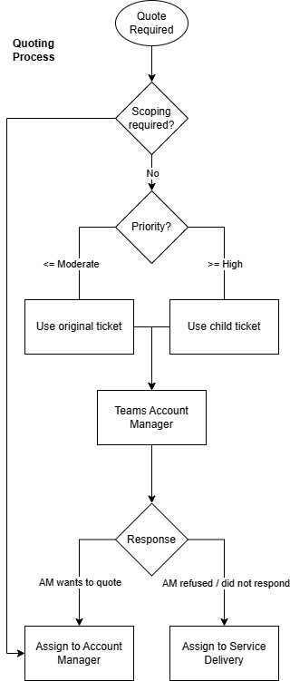

Document Title: HD Ops Manual Vol.2 Procedures
Document Version: VE.1
Document Date: 2026

# Overview

## Introduction

The Helpdesk Operations Manual Volume 2: Procedures sets out the step-by-step processes required to carry out common tasks on the Helpdesk. Where Volume 1 establishes the governance framework - the policies, standards, and expectations that define how the Helpdesk operates - Volume 2 serves as the practical companion: the procedural reference engineers are expected to consult during day-to-day operations.

Each procedure is designed to be self-contained and actionable, providing clear, repeatable steps that produce consistent outcomes regardless of the individual carrying them out.

### Purpose

The purpose of this document is to:

- Set out clear, step-by-step procedural guidance for the execution of common Helpdesk tasks
- Ensure consistent operational conduct across the team
- Reduce reliance on undocumented knowledge by making standard processes explicit, accessible, and auditable
- Support engineer onboarding by providing a practical procedural reference to be used alongside the governance standards established in Volume 1

### Scope

This manual covers procedures for tasks performed in the course of normal Helpdesk operations. Procedures apply directly to Helpdesk Engineers and may be referenced by any party working with or alongside the Helpdesk function.

Where a procedure is dependent upon a policy defined in Volume 1 - such as priority classifications, escalation paths, or ticket status definitions - the relevant policy will be referenced rather than restated here.

### Audience and responsibilities

**This document is for internal use only.**

This manual is written primarily for **Helpdesk Engineers**, who are expected to follow the relevant procedure when carrying out the task it governs.

**Team Leaders** are responsible for ensuring that procedures are understood, applied consistently, and formally raised for review where they prove unclear or unworkable in practice.

### How to use this document

- This manual should be consulted as the authoritative procedural reference when carrying out a task for which a procedure exists, or where consistent execution is required.
- Procedures are intended to be followed in sequence unless a step explicitly permits the exercise of discretion.
- Where a procedure conflicts with a policy set out in Volume 1, the Volume 1 policy takes precedence. Any such conflict should be raised with a Team Leader for formal resolution.
- Where no procedure exists for a task being performed on a regular basis, this should be escalated through leadership so that appropriate documentation can be produced.

This manual uses industry standard document classifications:

- Policy - a governance document that defines the rules, standards, and expectations that govern how something must be done and why
- Process -  an authoritative sequence of activities that describes what happens, in what order, and by whom, to achieve a defined outcome
- Procedure - an authoritative sequence of steps that instructs how a specific task or activity is to be carried out

Helpdesk Operations Manual Volume 2 (Procedures) contains procedures and processes.

### Continuous improvement and document governance

This manual will evolve over time. Where a procedure is found to be unclear, unworkable, or in conflict with real operational constraints, this should be treated as a signal that the procedure requires improvement - not a justification for informal deviation. Issues must be raised through leadership so that the document can be updated and expectations remain defensible, consistent, and achievable.

Document control is managed at the section level rather than on a per-procedure basis.

Adherence to written process, even where that process does not produce the desired outcome, will not result in disciplinary action.

## Changes

### Document Control

#### Document Properties

| Property     | Details      |
| ------------ | ------------ |
| Last Updated | 19/03/2026   |
| Updated By   | Jason Mcdill |
| Owner        | Jason Mcdill |

#### Revision History

| Version | Author       | Date       | Next Review |
| ------- | ------------ | ---------- | ----------- |
| 1.0     | Jason Mcdill | 25/03/2026 |             |

#### Executive Sponsors

| Version | Author             | Date       |
| ------- | ------------------ | ---------- |
| 1.0     | Stephen Richardson | 19/03/2026 |
| 1.0     | Rupert Evans       | 19/03/2026 |

#### Stakeholder / Distribution List

| Name          | Title                | Business Unit     | Date       |
| ------------- | -------------------- | ----------------- | ---------- |
| Jason Mcdill  | Helpdesk Team Leader | Customer Helpdesk | 19/03/2026 |
| Scott Jenkins | Helpdesk Team Leader | Customer Helpdesk | 19/03/2026 |
| Neels Steyn   | Technical Manager    | Customer Helpdesk | 19/03/2026 |

### Change Log

| Version | Date       | Changed By   | Summary of Changes                                           |
| ------- | ---------- | ------------ | ------------------------------------------------------------ |
| 1.0 | - | Jason Mcdill | Initial publication |

# Halo PSA Operations

## Document Control

### Document Properties

| Property     | Details      |
| ------------ | ------------ |
| Last Updated | 19/03/2026   |
| Updated By   | Jason Mcdill |
| Owner        | Jason Mcdill |

### Revision History

| Version | Author       | Date       | Next Review |
| ------- | ------------ | ---------- | ----------- |
| 1.0     | Jason Mcdill | 25/03/2026 |             |

### Executive Sponsors

| Version | Author             | Date       |
| ------- | ------------------ | ---------- |
| 1.0     | Stephen Richardson | 19/03/2026 |
| 1.0     | Rupert Evans       | 19/03/2026 |

### Stakeholder / Distribution List

| Name          | Title                | Business Unit     | Date       |
| ------------- | -------------------- | ----------------- | ---------- |
| Jason Mcdill  | Helpdesk Team Leader | Customer Helpdesk | 19/03/2026 |
| Scott Jenkins | Helpdesk Team Leader | Customer Helpdesk | 19/03/2026 |
| Neels Steyn   | Technical Manager    | Customer Helpdesk | 19/03/2026 |

## Signing in to HaloPSA

### Last Update

| Name         | Date       |
| ------------ | ---------- |
| Jason Mcdill | 26/03/2026 |

### Linked Policy

[TBC]

### Procedure

HaloPSA is a Professional Service Automation used by the helpdesk

You should already have a 365 account before attempting to sign in.

- Navigate to https://halo.digital-origin.co.uk/
- At the bottom of the login window, choose "Sign in with Microsoft"
- At the login prompt, sign in with your provided Digital Origin email address and password (365)

## Raising a ticket

### Last Update

| Name         | Date       |
| ------------ | ---------- |
| Jason Mcdill | 26/03/2026 |

### Linked Policy

- <a href="tome://operationsmanual-governance#non-critical-ticket-handling-ticket-status-usage-policy">Non-Critical Ticket Handling > Ticket Status Usage Policy</a>
- <a href="tome://operationsmanual-governance#ticket-lifecycle-classification-triage-policy">Ticket Lifecycle & Classification > Triage Policy</a>

### Procedure

- Navigate to HaloPSA https://halo.digital-origin.co.uk/ and sign in
- On any HaloPSA page, click the "+ New Ticket" button at the top of the screen
- In the new ticket window complete:
  - Ticket Status
  - Summary
  - Details
  - Customer (company name)
  - User (User's name)
  - Urgency
  - Impact
  - Ticket level (generally 1 for an incident, 2 for a service request)
- Do not assign the ticket at this stage
- Once the ticket is created:
  - Click "Assign" at the top
  - Complete "Team" & "Agent" fields
  - Click "Save"

## Procedural triage

### Last Update

| Name         | Date       |
| ------------ | ---------- |
| Jason Mcdill | 26/03/2026 |

### Linked Policy

- <a href="tome://operationsmanual-governance#ticket-lifecycle-classification-triage-policy">Ticket Lifecycle & Classification > Triage Policy</a>
- <a href="tome://operationsmanual-governance#non-critical-ticket-handling-ticket-status-usage-policy">Ticket Lifecycle & Classification > Ticket Status Usage Policy</a>

### Procedure

- From the ticket details, click the "Triage" button (see information note above)
- Confirm the entries are correct in the following fields:
  - Team
  - Agent
  - Ticket Status
  - Urgency
  - Impact
  - Ticket level
- Once done, click "Save"

## Conventional Triage

**Last update**

| Name         | Date       |
| ------------ | ---------- |
| Jason Mcdill | 26/03/2026 |

> [!INFO] Conventional Triage isn't an automation, it is manual checks of the ticket details and information and must be checked whenever the ticket changes type or owner

> [!WARNING] This procedure is heavily controlled by linked policy, because triage is an important quality control measure and called upon on several occasions, particularly when a ticket gains or transfers ownership

### Linked Policy

- <a href="tome://operationsmanual-governance#ticket-lifecycle-classification-triage-policy">Ticket Lifecycle & Classification > Triage Policy</a>
- <a href="tome://operationsmanual-governance#non-critical-ticket-handling-ticket-status-usage-policy">Ticket Lifecycle & Classification > Ticket Status Usage Policy</a>

### Procedure

- Perform the following checks:
  - The last update, or a visible and recent update, provides sufficient information for a third party to pick up the ticket and continue work
  - The ticket customer and user fields are correct
  - The ticket has a recorded update that is visible to the customer in the last 24 hours
  - The ticket type reflects the request type
  - The ticket priority conforms with the Priority Classification Policy
  - The ticket status is valid and reflects the current state of the ticket
  - If the ticket is being **re-assigned** or **closed**:
    - Scheduled appointments have been closed
    - The correct Team and Agent are selected
    - There is a summary update explaining what has been done and what is outstanding
  - If the ticket is being escalated
    - Scheduled appointments have been closed or cancelled and handed over
    - The escalation workflow has been triggered
      - The "Escalate Ticket" checkbox is ticked
      - There is an "Escalate" entry in the audit log
      - There is an Escalations notification in the "Escalations & Incident Respond" channel

## Updating via email

### Last Update

| Name         | Date       |
| ------------ | ---------- |
| Jason Mcdill | 26/03/2026 |

### Linked Policy

- <a href="tome://operationsmanual-governance#ticket-lifecycle-classification-triage-policy">Ticket Lifecycle & Classification > Triage Policy</a>
- <a href="tome://operationsmanual-governance#non-critical-ticket-handling-ticket-type-usage-policy">Ticket Lifecycle & Classification > Ticket Status Usage Policy</a>

### Procedure

- From the ticket details, click the "Email User" button
- If the ticket hasn't progressed from response SLA you will be presented with a message asking "Would you like to send a response email?", click "Yes"
- Ensure "To" field is populated (automatically populates from the customer details)
- Adjust the "To" field as required
- Add the message in the "Type your update/note here" panel

- Confirm "Status" is "With User(HD use only)"
- Add "Time Taken"
- Click "Send"
- On the confirmation page, double check your message, then when happy, click "Send"

## Updating via private note

### Last Update

| Name         | Date       |
| ------------ | ---------- |
| Jason Mcdill | 26/03/2026 |

### Linked Policy

- <a href="tome://operationsmanual-governance#non-critical-ticket-handling-ticket-communication-policy">Non-Critical Ticket Handling > Ticket Communication Policy</a>

### Procedure

- From the ticket details, click the "Private Note" button
- In the "Private Note" window, add the update
- Set the "Status" drop down appropriately (or leave it)
- Add "Time Taken"
- Click "Save"

## Updating via call

### Last Update

| Name         | Date       |
| ------------ | ---------- |
| Jason Mcdill | 26/03/2026 |

### Linked Policy

- <a href="tome://operationsmanual-governance#non-critical-ticket-handling-ticket-communication-policy">Non-Critical Ticket Handling > Ticket Communication Policy</a>

### Procedure

- From the ticket details, click the "Call User" button
- In the "Call User" window, add the update
- Set the "Status" drop down appropriately (or leave it)
- Add "Time Taken"
- Click "Save"

## Reassignment

### Last Update

| Name         | Date       |
| ------------ | ---------- |
| Jason Mcdill | 26/03/2026 |

### Linked Policy

- <a href="tome://operationsmanual-governance#non-critical-ticket-handling-ticket-ownership-and-handover-policy">Non-Critical Ticket Handling > Ticket Ownership and Handover Policy</a>
- <a href="tome://operationsmanual-governance#non-critical-ticket-handling-ticket-type-usage-policy">Non-Critical Ticket Handling > Ticket Status Usage Policy > Overview</a>
- <a href="tome://operationsmanual-governance#ticket-lifecycle-classification-priority-classification-policy">Ticket Lifecycle & Classification > Priority Classification</a>

### Procedure

- From the ticket details, click the "Re-Assign" button
- In the "Re-Assign" window add an update as required
- Update the entries for:
  - Team
  - Agent
  - Ticket Status
- Add "Time Taken"
- Click "Save"

## Escalation

### Last Update

| Name         | Date       |
| ------------ | ---------- |
| Jason Mcdill | 26/03/2026 |

### Linked Policy

- <a href="tome://operationsmanual-governance#non-critical-ticket-handling-escalation-policy">Non-Critical Ticket Handling > Escalation Policy</a>

### Procedure

- From the ticket details, click the "Escalate" button
- In the "Escalate" window provide the escalation summary
- Update "Agent" to "Unassigned"
- Add an entry to "Escalation Reason"
- Add "Time Taken"
- Click "Save"

## Scheduling appointments

### Last Update

| Name         | Date       |
| ------------ | ---------- |
| Jason Mcdill | 26/03/2026 |

> [!INFO] Once an appointment is made, the ticket will be set to "Scheduled" status, if another automation runs, like the customer responds, this will need manually set back to "Scheduled"

> [!WARNING] When and how a ticket's status can be set to "Scheduled" is tightly controlled due to the possibility of incorrect SLA hold use that causes a hidden SLA breach

### Linked Policy

- <a href="tome://operationsmanual-governance#non-critical-ticket-handling-ticket-status-usage-policy">Non-Critical Ticket Handling > Ticket Status Usage Policy</a>

### Procedure

- From the ticket details, click the "Create Appointment" button
- From top to bottom in the Create Appointment side panel:
  - Check Event Type radio is set to "Appointment"
  - Update "Subject" as required (customer visible)
  - Add attendees as required
  - Set a start date and time
  - Set an end date and time
  - Check "is recurring?" is unticked
  - Check "Agent" is set to you
  - Check "Appointment Type" is Reminder
  - Set "Alert" and "Agent Status" as desired
  - Add notes or context as required (customer visible)


## Create a child

### Last Update

| Name         | Date       |
| ------------ | ---------- |
| Jason Mcdill | 26/03/2026 |

> [!INFO] If the "Create Child Ticket" button is not immediately visible you may need to click the "•••" button to view more

### Linked Policy

- <a href="tome://operationsmanual-governance#non-critical-ticket-handling-ticket-status-usage-policy">Non-Critical Ticket Handling > Ticket Status Usage Policy > Child Tickets</a>
- <a href="tome://operationsmanual-governance#non-critical-ticket-handling-ticket-status-usage-policy">Non-Critical Ticket Handling > Ticket Status Usage Policy > Ticket Status Usage Policy</a>
- <a href="tome://operationsmanual-governance#non-critical-ticket-handling-ticket-status-usage-policy">Non-Critical Ticket Handling > Ticket Status Usage Policy > Overview</a>
- <a href="tome://operationsmanual-governance#non-critical-ticket-handling-ticket-status-usage-policy">Non-Critical Ticket Handling > Ticket Status Usage Policy > Priority Classification</a>

### Procedure

- From the ticket details, click the "Create Child Ticket" button
- Do not change the "End-User details", these remain as you
- Add a "Ticket Status" (typically the same as the parent)
- Add a "Summary"
- Add details or context, as required, to "Details"
- Set the "Team" and "Agent" dropdown to assign the child
- Under "Ticket Categorisation" add or check:
  - Urgency
  - Impact
  - Ticket Level
- Click the "Submit" button to create the ticket

## Closure 

### Last Update

| Name         | Date       |
| ------------ | ---------- |
| Jason Mcdill | 26/03/2026 |

> [!INFO] If the "Close" button is not immediately visible you may need to click the "•••" button to view more

### Linked Policy

- <a href="tome://operationsmanual-governance#non-critical-ticket-handling-ticket-closure-reopen-and-recurrence">Non-Critical Ticket Handling > Ticket Closure, Reopen and Recurrence</a>
- <a href="tome://operationsmanual-governance#non-critical-ticket-handling-ticket-status-usage-policy">Non-Critical Ticket Handling > Ticket Status Usage Policy > Ticket Status Usage Policy</a>
- <a href="tome://operationsmanual-governance#non-critical-ticket-handling-ticket-status-usage-policy">Non-Critical Ticket Handling > Ticket Status Usage Policy > Overview</a>
- <a href="tome://operationsmanual-governance#ticket-lifecycle-classification-priority-classification-policy">Ticket Lifecycle & Classification > Priority Classification</a>

### Procedure

- From the ticket details, click the "Close" button
- Check the "To" field is populated with the ticket contact
- Add a closure note (customer visible)
- Add "Time Taken"
- Under "Ticket Categorisation" add or check:
  - Ticket Status
  - Urgency
  - Impact
  - Ticket Level
  - Category (required to close)
- In the "Private Note" window you can add closure notes that are hidden from the customer

## AM quote process

### Last Update

| Name         | Date       |
| ------------ | ---------- |
| Jason Mcdill | 26/03/2026 |

### Linked Policy

- <a href="tome://operationsmanual-governance#non-critical-ticket-handling-ticket-type-usage-policy">Non-Critical Ticket Handling > Ticket Status Usage Policy > Overview</a>
- <a href="tome://operationsmanual-governance#appendices-appendix-quoting">Non-Critical Ticket Handling > Ticket Status Usage Policy > Quoting (Appendix)</a>

### Process



## Shipping instruction

### Last Update

| Name         | Date       |
| ------------ | ---------- |
| Jason Mcdill | 26/03/2026 |

### Linked Policy

- <a href="tome://operationsmanual-governance#non-critical-ticket-handling-ticket-type-usage-policy">Non-Critical Ticket Handling > Ticket Status Usage Policy</a>
- <a href="tome://operationsmanual-governance#non-critical-ticket-handling-ticket-type-usage-policy">Non-Critical Ticket Handling > Ticket Status Usage Policy > CLS (shipping instructions)</a>

### Procedure

- From the ticket details, click the "Create Child Ticket" button
- Do not change the "End-User details", these remain as you
- Add a "Ticket Status" (typically the same as the parent)
- Add a "Summary" that indicates a field visit is required
- In the "Details" section, add:
  - Current location of the item
  - Ship location (full address with recipient name)
  - Contact information of the recipient (phone and email)
- Set the "Team" to "Helpdesk" and "Agent" to Unassigned
- Under "Ticket Categorisation" add or check:
  - Urgency
  - Impact
  - Ticket Level
- Click the "Submit" button to create the ticket
- Alert the CLS team, either via teams or in person, that you have raised the ticket and provide any further information they need.

## Field engineer instruction

### Last Update

| Name         | Date       |
| ------------ | ---------- |
| Jason Mcdill | 26/03/2026 |

### Linked Policy

- <a href="tome://operationsmanual-governance#non-critical-ticket-handling-ticket-type-usage-policy">Non-Critical Ticket Handling > Ticket Status Usage Policy > Child Tickets</a>

### Procedure

- From the ticket details, click the "Create Child Ticket" button
- Do not change the "End-User details", these remain as you
- Add a "Ticket Status" (typically the same as the parent)
- Add a "Summary" that indicates a field visit is required
- In the "Details" section, add:
  - Visit location (full address with a name of someone that will receive the agent)
  - Contact information of the receiving person (phone and email)
- Set the "Team" to "Helpdesk" and "Agent" to Unassigned
- Under "Ticket Categorisation" add or check:
  - Urgency
  - Impact
  - Ticket Level
- Click the "Submit" button to create the ticket
- Alert the CLS team, either via teams or in person, that you have raised the ticket and provide any further information they need

# PUMA PSA Operations

## Document Control

### Document Properties

| Property     | Details |
| ------------ | ------- |
| Last Updated |         |
| Updated      |         |
| Owner        |         |

### Revision History

| Version | Author       | Date       | Next Review |
| ------- | ------------ | ---------- | ----------- |
| 1.0     | Jason Mcdill | 25/03/2026 |             |

### Executive Sponsors

| Version | Author             | Date       |
| ------- | ------------------ | ---------- |
| 1.0     | Stephen Richardson | 19/03/2026 |
| 1.0     | Rupert Evans       | 19/03/2026 |

### Stakeholder / Distribution List

| Name          | Title                | Business Unit     | Date       |
| ------------- | -------------------- | ----------------- | ---------- |
| Jason Mcdill  | Helpdesk Team Leader | Customer Helpdesk | 19/03/2026 |
| Scott Jenkins | Helpdesk Team Leader | Customer Helpdesk | 19/03/2026 |
| Neels Steyn   | Technical Manager    | Customer Helpdesk | 19/03/2026 |

## Signing in

## Raising a ticket

## Updating via email

## Updating via private note

## Reassignment

## Escalation

## Scheduling appointments

## Closure

# N-Able N-Central Operations

## Document Control

### Document Properties

| Property     | Details      |
| ------------ | ------------ |
| Last Updated | 19/03/2026   |
| Updated By   | Jason Mcdill |
| Owner        | Jason Mcdill |

### Revision History

| Version | Author       | Date       | Next Review |
| ------- | ------------ | ---------- | ----------- |
| 1.0     | Jason Mcdill | 25/03/2026 |             |

### Executive Sponsors

| Version | Author             | Date       |
| ------- | ------------------ | ---------- |
| 1.0     | Stephen Richardson | 19/03/2026 |
| 1.0     | Rupert Evans       | 19/03/2026 |

### Stakeholder / Distribution List

| Name          | Title                | Business Unit     | Date       |
| ------------- | -------------------- | ----------------- | ---------- |
| Jason Mcdill  | Helpdesk Team Leader | Customer Helpdesk | 19/03/2026 |
| Scott Jenkins | Helpdesk Team Leader | Customer Helpdesk | 19/03/2026 |
| Neels Steyn   | Technical Manager    | Customer Helpdesk | 19/03/2026 |

## Signing in to N-Able N-Central

### Last Update

| Name         | Date       |
| ------------ | ---------- |
| Jason Mcdill | 26/03/2026 |

### Linked Policy

[TBC]

### Procedure

- Navigate to https://ncod647.n-able.com/
- Use your Digital Origin 365 Credentials at the login prompt

## Automations

### Last Update

| Name         | Date       |
| ------------ | ---------- |
| Jason Mcdill | 26/03/2026 |

### Linked Policy

[TBC]

### Procedure

## Launch a chat session

### Last Update

| Name         | Date       |
| ------------ | ---------- |
| Jason Mcdill | 26/03/2026 |

### Linked Policy

[TBC]

### Procedure

# N-Able TakeControl Operations (part of N-Central)

## Document Control

### Document Properties

| Property     | Details      |
| ------------ | ------------ |
| Last Updated | 19/03/2026   |
| Updated By   | Jason Mcdill |
| Owner        | Jason Mcdill |

### Revision History

| Version | Author       | Date       | Next Review |
| ------- | ------------ | ---------- | ----------- |
| 1.0     | Jason Mcdill | 25/03/2026 |             |

### Executive Sponsors

| Version | Author             | Date       |
| ------- | ------------------ | ---------- |
| 1.0     | Stephen Richardson | 19/03/2026 |
| 1.0     | Rupert Evans       | 19/03/2026 |

### Stakeholder / Distribution List

| Name          | Title                | Business Unit     | Date       |
| ------------- | -------------------- | ----------------- | ---------- |
| Jason Mcdill  | Helpdesk Team Leader | Customer Helpdesk | 19/03/2026 |
| Scott Jenkins | Helpdesk Team Leader | Customer Helpdesk | 19/03/2026 |
| Neels Steyn   | Technical Manager    | Customer Helpdesk | 19/03/2026 |

## Locate and remotely control an enrolled machine 

### Last Update

| Name         | Date       |
| ------------ | ---------- |
| Jason Mcdill | 26/03/2026 |

> [!INFO] File Transfers are recorded in the session report

### Linked Policy

[TBC]

### Procedure

- From the "All Devices" panel, on the top right corner, select the customer from the drop down menu
- The managed devices are displayed with the "All devices" default filter:
  - Under the "Remote Control" column check the button is green
  - Click the button to launch a TakeControl remote control session
  - Use the dropdown on the right side of the button to select other remote control options
- The Take Control remote session will launch

## Enable and configure PassPortal credential injection

### Last Update

| Name         | Date       |
| ------------ | ---------- |
| Jason Mcdill | 26/03/2026 |

> [!INFO] PassPortal authentication is at the TakeControl Viewer level - you only need to log in once and it will persist across all sessions until you explicitly log out

> [!INFO] PassPortal auditing records log-in and injection interactions

### Linked Policy

- <a href="tome://operationsmanual-governance#it-operations-password-credential-handling-policy">IT Operations > Password & Credential Handling Policy</a>

### Procedure

**Enable Credential Injection** *(one-time setup per console)*

- Click the **Passportal** key icon on the menu bar of the connected remote session
- Provide your credentials:
  - **Email** - your DO 365 email address
  - **Password** - your Passportal password
  - **Organisation Key** - available on request
  - **Location** - United Kingdom
- When prompted, approve the **DUO Push Notification**

**Injecting a Credential**

- Click into the field you want to populate on the remote device
- Click the **Passportal** key icon in the menu bar
- Select the relevant **customer** from the popup
- Select the relevant **credential**
- [!INFO] When used at a UAC or Windows Logon prompt, the logon will advance automatically if the credential contains both a username and password

## Launch a remote console session

### Last Update

| Name         | Date       |
| ------------ | ---------- |
| Jason Mcdill | 26/03/2026 |

### Linked Policy

[TBC]

### Procedure

> [!INFO] TakeControl only supports Windows CLI shells, it doesn't support BASH, ZSH, SH

> [!INFO] Remote console session interactions are recorded in the session log

- Launch a remote session on an enrolled Windows device
- Select "System Shell" from the menu bar
- The system shell operates in one of two modes:
  - **Interactive mode** (default mode on connection - launches CMD)
    - Allows live access to the console
    - Allows in-line shell commands (i.e ```powershell get-netipconfiguration```)
    - Allows in-line shell switching (i.e. switching between CMD and PS using commands)
    - Supports clipboard sharing both input and output
  - **Compatibility mode**
    - Provides staged (discrete command-in /output-back) console access
    - Improved stability on older systems & shell versions
    - Lightweight with reduced overhead
    - Shell type is fixed
- To switch modes click the "Advanced Options" menu lower set of 3 stacked dots "⋮" on the top right side of the window and select either:
  - Standard Command Prompt (Compatibility Mode) - locked to CMD
  - Standard Powershell (Compatibility Mode) - locked to Powershell

## Change remote console session context

### Last Update

| Name         | Date       |
| ------------ | ---------- |
| Jason Mcdill | 26/03/2026 |

### Linked Policy

- <a href="tome://operationsmanual-governance#it-operations-password-credential-handling-policy">IT Operations > Password & Credential Handling Policy</a>

### Procedure

> [!INFO] The System Shell always opens in the **SYSTEM** account context by default. Switching contexts uses standard Windows commands, not TakeControl features.

> [!INFO] Shell interactions are recorded in the session report

Context - the user account that is used to run 

- **SYSTEM** *(default)*
  - Highest privilege level on the local machine
  - Not a user account - has no profile, home directory, or mapped drives
  - Suitable for most system-level admin tasks
  - Verify current context at any time with `whoami`
- **Switching to the current logged in user** *(TakeControl feature)*
  - Click the "Advanced Options" menu lower set of 3 stacked dots "⋮"
  - Click "Change session"
  - All available sessions are listed
- **Switching to a local or domain user** using `runas`
  - `runas /user:DOMAIN\username cmd` - opens a new CMD as that user
  - `runas /user:.\localusername cmd` - opens as a local account
  - Will prompt for the user's password

## Create a service port forward

### Last Update

| Name         | Date       |
| ------------ | ---------- |
| Jason Mcdill | 26/03/2026 |

### Linked Policy

- <a href="tome://operationsmanual-governance#it-operations-information-security-and-data-handling-policy">IT Operations > Information Security and Data Handling Policy</a>

### Procedure

> [!INFO] TakeControl port forwarding allows the remote agent to act as a gateway to services on the remote LAN that are not otherwise accessible from outside the network - providing similar functionality to a VPN without requiring one.

> [!INFO] Service modifications are recorded in the session report

> [!WARNING] Port forwards can be **temporary** (session only) or **permanent** (saved per console). Permanent forwards are saved to the **technician's console**, not the agent - they must be recreated if connecting from a different machine

**To configure a port forward during a session:**

- Click the **Session Options** menu (downward pointing chevron) 
- Select **Port Forward > New**
- Complete the three required fields:
  - **Local Port** - the port on the technician's machine that TakeControl listens on (can be left blank or `0`)
    - Use `0` to auto-assign a free port
    - Supports ranges using `startport-endport` syntax (e.g. `5000-5100`)
  - **Remote Host** - the DNS name or IP of the remote service
    - Use `localhost` or `127.0.0.1` if the service is on the remote machine itself
    - Use the IP address of the server you wish to connect to (i.e. the internal gateway for a router)
  - **Remote Port** - the port the remote service is listening on
    - Default ports are listed, but you can choose a custom one
- Save the forward if it needs to persist across sessions

**RDP Tunnelling** *(agent config only - Windows)*

- A dedicated option exists to enable automatic RDP port forwarding
- Enables the **Use RDP** button in the console to launch a Windows RDP session directly to the remote machine

## Access remote system file transfer

### Last Update

| Name         | Date       |
| ------------ | ---------- |
| Jason Mcdill | 26/03/2026 |

> [!WARNING] There is no restriction of file type or size, File Transfer will attempt anything you ask it to do and overloading it may cause local and remote instability

> [!INFO] File Transfer runs only in the SYSTEM account context which has access to data on disk, but not user-specific configurations like mapped drives

> [!INFO] File Transfers are recorded in the session report

### Linked Policy

- <a href="tome://operationsmanual-governance#it-operations-information-security-and-data-handling-policy">IT Operations > Information Security and Data Handling Policy</a>

### Procedure

- The File Transfer window is split into two panes:
  - **Local** - the technician's machine
  - **Remote** - the remote device
- Files and folders can be transferred in either direction via drag and drop, or by right-clicking and selecting upload/download
- Supports transferring entire folders, not just individual files

**Transfer Queue**

- Transfers are queued and processed **one at a time**
- A progress bar is shown per file
- Queue priority can be adjusted by repositioning items in the queue
- Right-click a queued item to **pause** or **cancel** the transfer

**Actions Menu** *(top right of either pane)*

- Refresh the file list
- Create a new folder
- Edit or delete files

## Access System Info

### Last Update

| Name         | Date       |
| ------------ | ---------- |
| Jason Mcdill | 26/03/2026 |

> [!INFO] Displays are either **informational** (read-only metrics) or **interactive** (allows actions such as killing processes or restarting services).

> [!WARNING] Changes made to the interactive displays are live, and immediately implemented.

### Linked Policy

[TBC]

### Procedure

- In a live remote control session select "System Info"
- On the navigation pane to the left side, select the relevant feature
- To interact with a service in the Services display, right click it
- While only Services is interactive, all displays can be exported:
  - From any display click the document icon "Export to CSV..."
  - In the pop-up context window choose a save to location and click "Save"

### System Info Contents & Descriptions

- **Dashboard** - performance and configuration metrics overview
- **Processes** - running process list; allows ending processes *(similar to Task Manager > Processes)*
- **Network** - network adapter metrics and configuration
- **Applications** - installed applications list *(similar to Control Panel > Programs)*
- **Services** *(interactive)* - service list; allows starting, stopping and restarting services *(similar to services.msc)*
- **Drivers** - installed drivers list
- **Startup** - start-up applications list *(similar to Task Manager > Start-up Apps)*
- **Interactive User** - metrics for the currently logged-in user's session context
- **Events**
  - **Application** - recent Application event log entries
  - **Security** - recent Security event log entries
  - **System** - recent System event log entries
- **System Health** - hardware health metrics
- **Windows Updates**
  - **Installed** - currently installed updates
  - **Pending (Important)** - pending critical and security updates
  - **Pending (Optional)** - pending feature and software updates

## Access Remote Registry

### Last Update

| Name         | Date       |
| ------------ | ---------- |
| Jason Mcdill | 26/03/2026 |

> [!WARNING] Changes made to the remote registry are live, and immediately implemented.

### Linked Policy

[TBC]

### Procedure

- In a live remote control session select "Remote Registry"
- On the navigation pane to the left side, you can navigate keys
- Keys and values are seperated in to two panes:
  - To interact with a key right click it on the left pane
  - To interact with a value, navigate to the relevant key using the left pane and right click it on the right pane

## Disconnect from a remote control session

### Last Update

| Name         | Date       |
| ------------ | ---------- |
| Jason Mcdill | 26/03/2026 |

> [!WARNING] Hitting the X can leave the remote computer in the lock state it was in when the window closes, you must maintain positive control over the security of devices you interact with

### Linked Policy

[TBC]

### Procedure

- Either:
  - Use TakeControl's lock feature:
    - Click the "Remote Desktop" drop down menu
    - Click "Lock Remote Operating system"
    - Close the window with the X
  - Manually lock the remote operating system 
    - Using Windows, lock the user session
    - Close the window with the X
  - If enabled, use the shortcut
    - Click SHIFT-CTRL-L with the window in focus
    - Close it with the X

# N-Able PassPortal Operations

## Document Control

### Document Properties

| Property     | Details      |
| ------------ | ------------ |
| Last Updated | 19/03/2026   |
| Updated By   | Jason Mcdill |
| Owner        | Jason Mcdill |

### Revision History

| Version | Author       | Date       | Next Review |
| ------- | ------------ | ---------- | ----------- |
| 1.0     | Jason Mcdill | 25/03/2026 |             |

### Executive Sponsors

| Version | Author             | Date       |
| ------- | ------------------ | ---------- |
| 1.0     | Stephen Richardson | 19/03/2026 |
| 1.0     | Rupert Evans       | 19/03/2026 |

### Stakeholder / Distribution List

| Name          | Title                | Business Unit     | Date       |
| ------------- | -------------------- | ----------------- | ---------- |
| Jason Mcdill  | Helpdesk Team Leader | Customer Helpdesk | 19/03/2026 |
| Scott Jenkins | Helpdesk Team Leader | Customer Helpdesk | 19/03/2026 |
| Neels Steyn   | Technical Manager    | Customer Helpdesk | 19/03/2026 |

## Signing in to PassPortal

### Last Update

| Name         | Date       |
| ------------ | ---------- |
| Jason Mcdill | 26/03/2026 |

> [!INFO] Procedures relating to the features of TakeControl are in the dedicated TakeControl section of this manual

### Linked Policy

- <a href="tome://operationsmanual-governance#it-operations-password-credential-handling-policy">IT Operations > Password & Credential Handling Policy</a>

### Procedure

- Navigate to https://digitalorigin-c.mypasswordapp.co.uk/
- Click "Log in with PassPortal"
- Fill in the details
  - Your DO 365 email address
  - Your PassPortal password
  - If prompted for the organization key, you will need to request it
- Click "Next"
- Accept the DUO prompt

## Request credential access

### Last Update

| Name         | Date       |
| ------------ | ---------- |
| Jason Mcdill | 26/03/2026 |

> [!INFO] Procedures relating to the features of TakeControl are in the dedicated TakeControl section of this manual

### Linked Policy

- <a href="tome://operationsmanual-governance#it-operations-password-credential-handling-policy">IT Operations > Password & Credential Handling Policy</a>

### Procedure

## Accessing client data

### Last Update

| Name         | Date       |
| ------------ | ---------- |
| Jason Mcdill | 26/03/2026 |

> [!INFO] Procedures relating to the features of TakeControl are in the dedicated TakeControl section of this manual

### Linked Policy

- <a href="tome://operationsmanual-governance#it-operations-information-security-and-data-handling-policy">IT Operations > Information Security and Data Handling Policy</a>

### Procedure

## Accessing KB data

### Last Update

| Name         | Date       |
| ------------ | ---------- |
| Jason Mcdill | 26/03/2026 |

> [!INFO] Procedures relating to the features of TakeControl are in the dedicated TakeControl section of this manual

### Linked Policy

- <a href="tome://operationsmanual-governance#it-operations-information-security-and-data-handling-policy">IT Operations > Information Security and Data Handling Policy</a>

### Procedure

## Updating and creating new data

### Last Update

| Name         | Date       |
| ------------ | ---------- |
| Jason Mcdill | 26/03/2026 |

> [!INFO] Procedures relating to the features of TakeControl are in the dedicated TakeControl section of this manual

### Linked Policy

- <a href="tome://operationsmanual-governance#it-operations-information-security-and-data-handling-policy">IT Operations > Information Security and Data Handling Policy</a>

### Procedure

# N-Able StartControl (standalone)

## Document Control

### Document Properties

| Property     | Details      |
| ------------ | ------------ |
| Last Updated | 19/03/2026   |
| Updated By   | Jason Mcdill |
| Owner        | Jason Mcdill |

### Revision History

| Version | Author       | Date       | Next Review |
| ------- | ------------ | ---------- | ----------- |
| 1.0     | Jason Mcdill | 25/03/2026 |             |

### Executive Sponsors

| Version | Author             | Date       |
| ------- | ------------------ | ---------- |
| 1.0     | Stephen Richardson | 19/03/2026 |
| 1.0     | Rupert Evans       | 19/03/2026 |

### Stakeholder / Distribution List

| Name          | Title                | Business Unit     | Date       |
| ------------- | -------------------- | ----------------- | ---------- |
| Jason Mcdill  | Helpdesk Team Leader | Customer Helpdesk | 19/03/2026 |
| Scott Jenkins | Helpdesk Team Leader | Customer Helpdesk | 19/03/2026 |
| Neels Steyn   | Technical Manager    | Customer Helpdesk | 19/03/2026 |

## Remote Access

# TeamViewer Operations

## Document Control

### Document Properties

| Property     | Details      |
| ------------ | ------------ |
| Last Updated | 19/03/2026   |
| Updated By   | Jason Mcdill |
| Owner        | Jason Mcdill |

### Revision History

| Version | Author       | Date       | Next Review |
| ------- | ------------ | ---------- | ----------- |
| 1.0     | Jason Mcdill | 25/03/2026 |             |

### Executive Sponsors

| Version | Author             | Date       |
| ------- | ------------------ | ---------- |
| 1.0     | Stephen Richardson | 19/03/2026 |
| 1.0     | Rupert Evans       | 19/03/2026 |

### Stakeholder / Distribution List

| Name          | Title                | Business Unit     | Date       |
| ------------- | -------------------- | ----------------- | ---------- |
| Jason Mcdill  | Helpdesk Team Leader | Customer Helpdesk | 19/03/2026 |
| Scott Jenkins | Helpdesk Team Leader | Customer Helpdesk | 19/03/2026 |
| Neels Steyn   | Technical Manager    | Customer Helpdesk | 19/03/2026 |

## Signing in to TeamViewer

## Remote access

# Telephony Operations

## Document Control

### Document Properties

| Property     | Details      |
| ------------ | ------------ |
| Last Updated | 19/03/2026   |
| Updated By   | Jason Mcdill |
| Owner        | Jason Mcdill |

### Revision History

| Version | Author       | Date       | Next Review |
| ------- | ------------ | ---------- | ----------- |
| 1.0     | Jason Mcdill | 25/03/2026 |             |

### Executive Sponsors

| Version | Author             | Date       |
| ------- | ------------------ | ---------- |
| 1.0     | Stephen Richardson | 19/03/2026 |
| 1.0     | Rupert Evans       | 19/03/2026 |

### Stakeholder / Distribution List

| Name          | Title                | Business Unit     | Date       |
| ------------- | -------------------- | ----------------- | ---------- |
| Jason Mcdill  | Helpdesk Team Leader | Customer Helpdesk | 19/03/2026 |
| Scott Jenkins | Helpdesk Team Leader | Customer Helpdesk | 19/03/2026 |
| Neels Steyn   | Technical Manager    | Customer Helpdesk | 19/03/2026 |

## Webex - Receiving calls

## Webex - Making calls

## Webex - Conference calls

## Webex - Call transfers

# Secondary & Fallback Remote Access Operations

## Document Control

### Document Properties

| Property     | Details      |
| ------------ | ------------ |
| Last Updated | 19/03/2026   |
| Updated By   | Jason Mcdill |
| Owner        | Jason Mcdill |

### Revision History

| Version | Author       | Date       | Next Review |
| ------- | ------------ | ---------- | ----------- |
| 1.0     | Jason Mcdill | 25/03/2026 |             |

### Executive Sponsors

| Version | Author             | Date       |
| ------- | ------------------ | ---------- |
| 1.0     | Stephen Richardson | 19/03/2026 |
| 1.0     | Rupert Evans       | 19/03/2026 |

### Stakeholder / Distribution List

| Name          | Title                | Business Unit     | Date       |
| ------------- | -------------------- | ----------------- | ---------- |
| Jason Mcdill  | Helpdesk Team Leader | Customer Helpdesk | 19/03/2026 |
| Scott Jenkins | Helpdesk Team Leader | Customer Helpdesk | 19/03/2026 |
| Neels Steyn   | Technical Manager    | Customer Helpdesk | 19/03/2026 |

## Placeholder

# Company Portal Operations

## Document Control

### Document Properties

| Property     | Details      |
| ------------ | ------------ |
| Last Updated | 19/03/2026   |
| Updated By   | Jason Mcdill |
| Owner        | Jason Mcdill |

### Revision History

| Version | Author       | Date       | Next Review |
| ------- | ------------ | ---------- | ----------- |
| 1.0     | Jason Mcdill | 25/03/2026 |             |

### Executive Sponsors

| Version | Author             | Date       |
| ------- | ------------------ | ---------- |
| 1.0     | Stephen Richardson | 19/03/2026 |
| 1.0     | Rupert Evans       | 19/03/2026 |

### Stakeholder / Distribution List

| Name          | Title                | Business Unit     | Date       |
| ------------- | -------------------- | ----------------- | ---------- |
| Jason Mcdill  | Helpdesk Team Leader | Customer Helpdesk | 19/03/2026 |
| Scott Jenkins | Helpdesk Team Leader | Customer Helpdesk | 19/03/2026 |
| Neels Steyn   | Technical Manager    | Customer Helpdesk | 19/03/2026 |

